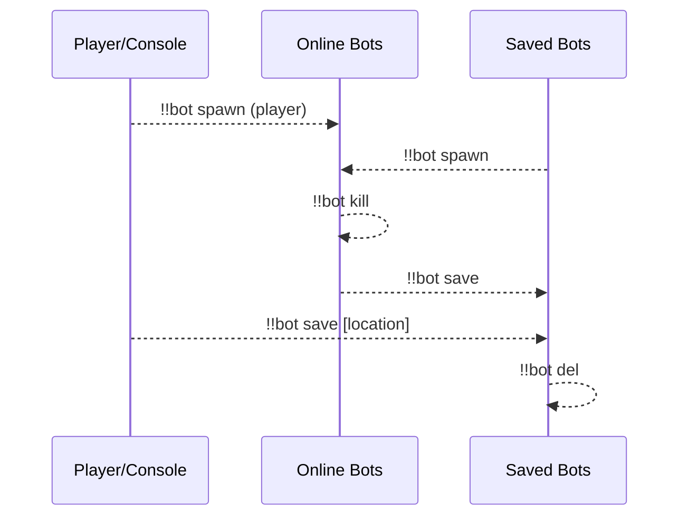
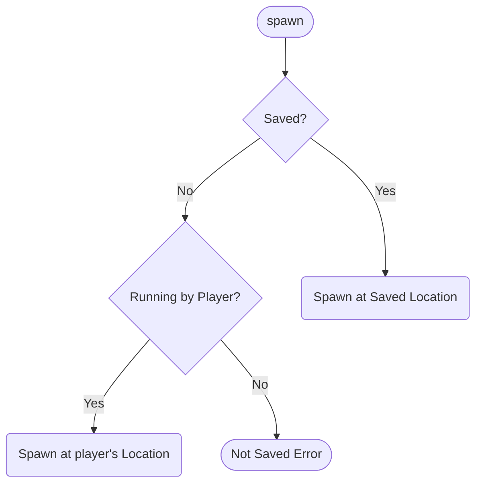
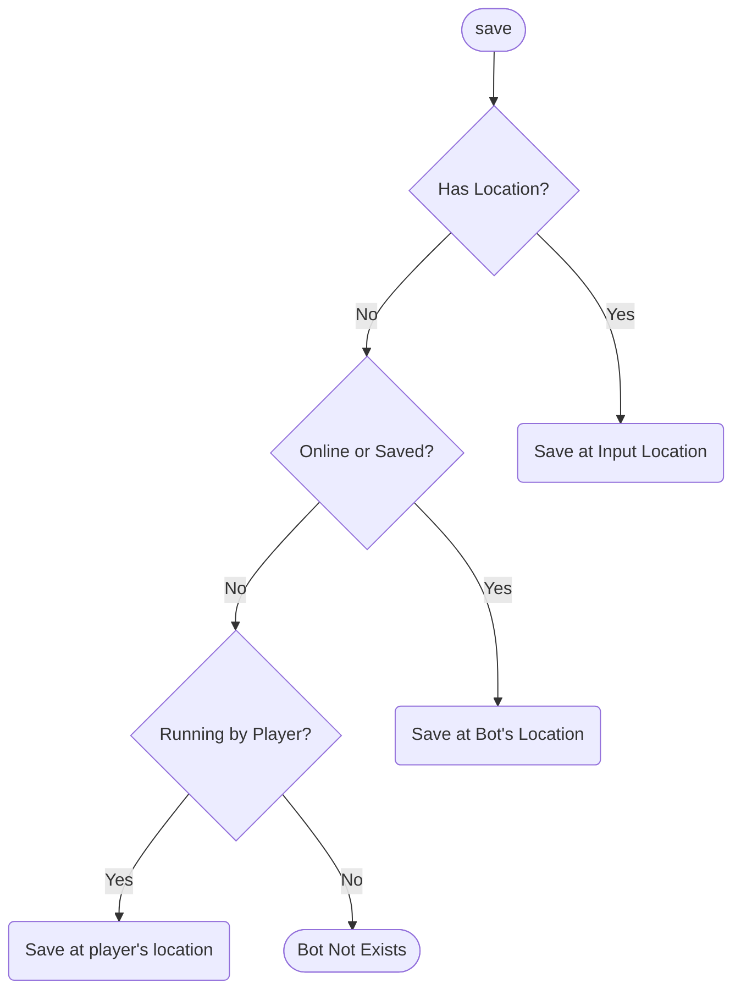
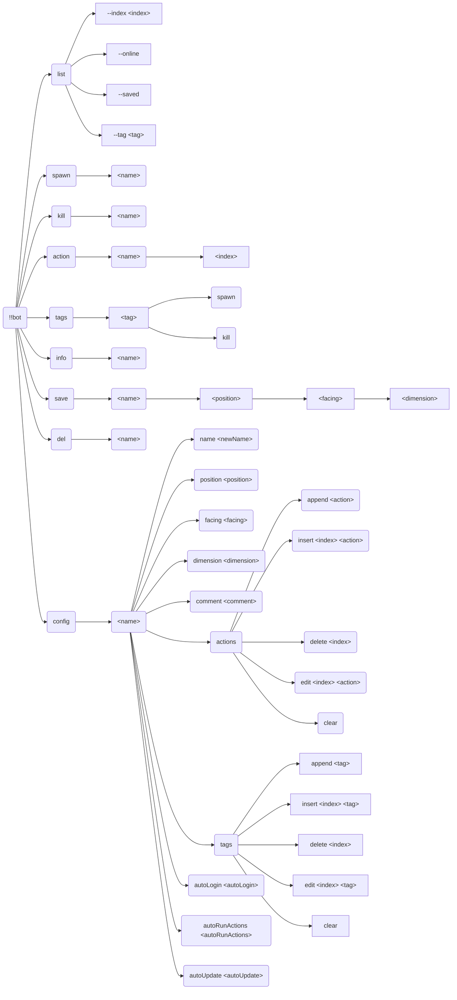
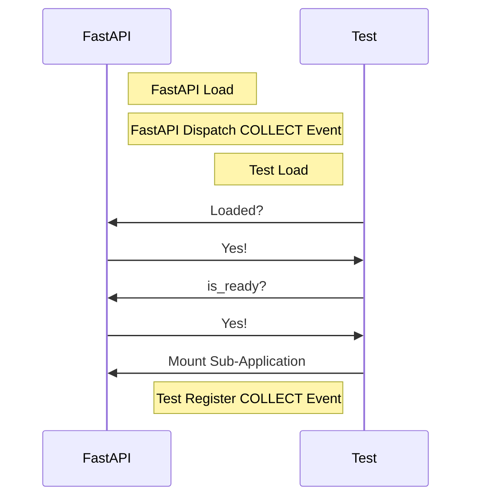
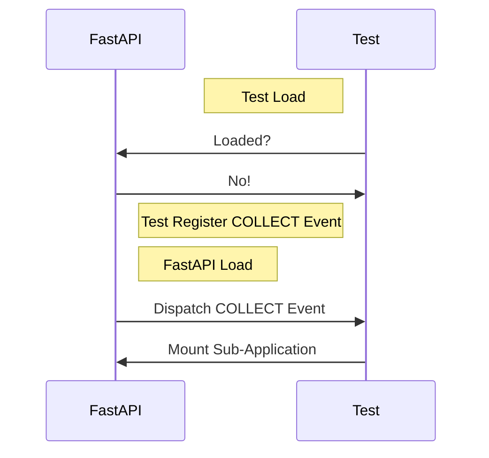
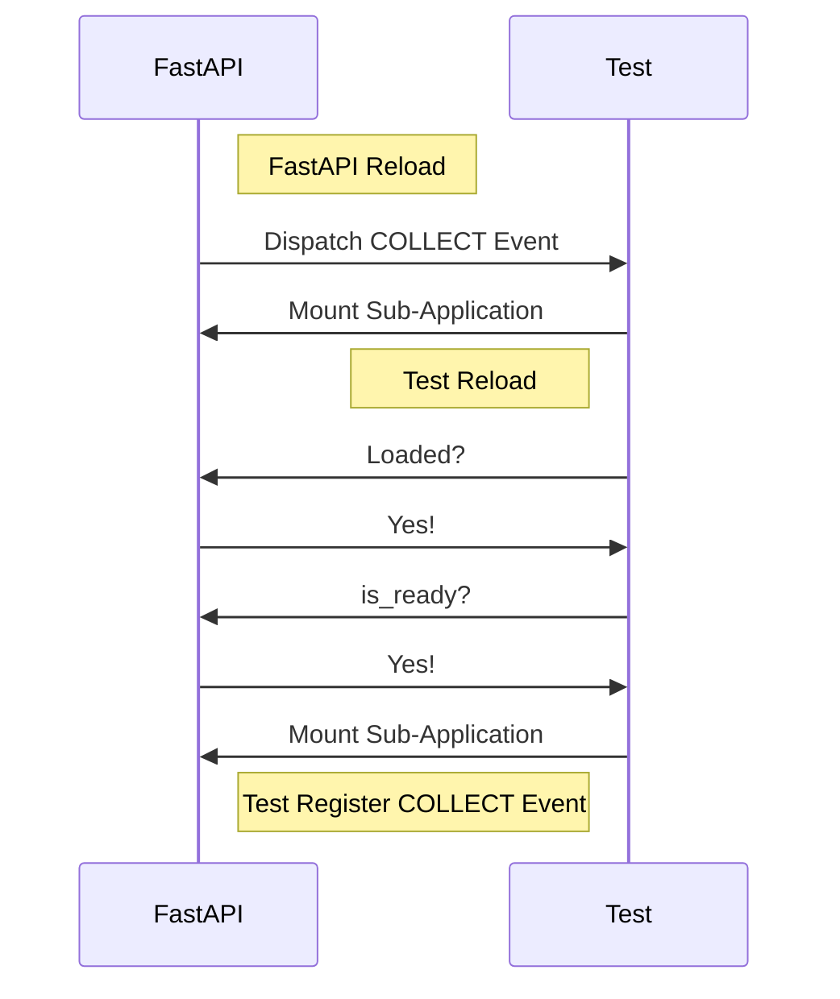
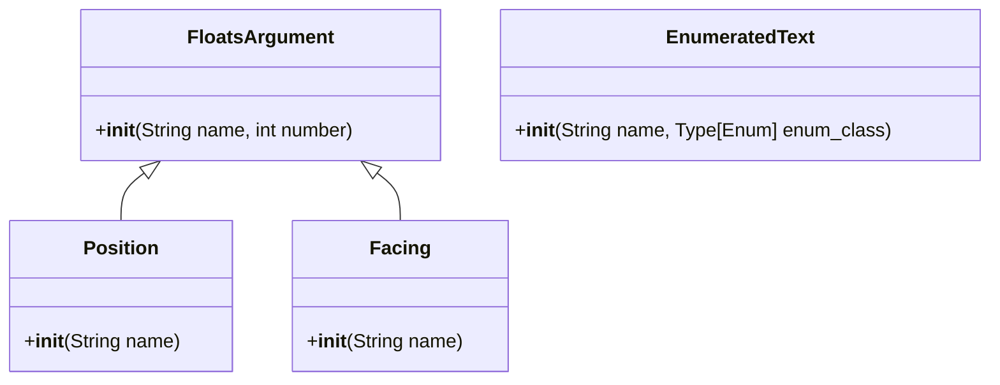

**English** | [中文](full-zh_cn.md)

\>\>\> [Back to index](/readme.md)

# Full Plugin Information Collection

Use `ctrl-f` to performance an in-page search, for what you are interested in

## advanced_calculator

### Basic Information

- Plugin ID: `advanced_calculator`
- Plugin Name: AdvancedCalculator
- Version: 0.3.1
  - Metadata version: 0.3.1
  - Release version: 0.3.1
- Total downloads: 2152
- Authors: [Andy Zhang](https://github.com/AnzhiZhang)
- Repository: https://github.com/AnzhiZhang/MCDReforgedPlugins
- Repository plugin page: https://github.com/AnzhiZhang/MCDReforgedPlugins/tree/master/src/advanced_calculator
- Labels: [`Tool`](/labels/tool/readme.md)
- Description: Provides multiple convenient in-game calculations

### Dependencies

| Plugin ID | Requirement |
| --- | --- |

### Requirements

| Python package | Requirement |
| --- | --- |

### Introduction

# AdvancedCalculator

> 提供游戏内多种便捷计算

## 使用

您可以使用 `=<expression>` 直接计算表达式，或使用 `==<count/expression>` 将物品数转换堆叠数。

| 指令 | 用途 | 示例 | 结果 |
| - | - | - | - |
| !!calc \<expression> | 计算表达式 | !!calc 1+1 | 1+1=2 |
| !!calc item \<count/expression> | 物品数转换堆叠数 | !!calc item 1794 | 1794个物品为1盒2组3个 |
| !!calc item \<box> \<stack> \<single> | 堆叠数转换物品数 | !!calc item 1 10 32 | 1盒10组32个为2400个物品 |
| !!calc color \<red> \<green> \<blue> | 10进制RGB转16进制 | !!calc color 255 0 255 | (255, 0, 255) -> #FF00FF |
| !!calc color \<#HEX> | 16十进制RGB转10进制 | !!calc color #00FF00 | #00FF00 -> (0, 255, 0) |

### Download

> [!IMPORTANT]
> Read the README file in plugin repository before using it.

| File | Version | Upload Time (UTC) | Size | Downloads | Operations |
| --- | --- | --- | --- | --- | --- |
| [AdvancedCalculator-v0.3.1.mcdr](https://github.com/AnzhiZhang/MCDReforgedPlugins/releases/tag/advanced_calculator-v0.3.1) | 0.3.1 | 2023/01/19 17:01:07 | 2.46KB | 1507 | [Download](https://github.com/AnzhiZhang/MCDReforgedPlugins/releases/download/advanced_calculator-v0.3.1/AdvancedCalculator-v0.3.1.mcdr) |
| [AdvancedCalculator-v0.3.0.mcdr](https://github.com/AnzhiZhang/MCDReforgedPlugins/releases/tag/advanced_calculator-v0.3.0) | 0.3.0 | 2022/10/21 20:03:33 | 2.42KB | 302 | [Download](https://github.com/AnzhiZhang/MCDReforgedPlugins/releases/download/advanced_calculator-v0.3.0/AdvancedCalculator-v0.3.0.mcdr) |
| [AdvancedCalculator-v0.2.1.mcdr](https://github.com/AnzhiZhang/MCDReforgedPlugins/releases/tag/advanced_calculator-v0.2.1) | 0.2.1 | 2022/07/21 13:20:06 | 2.38KB | 236 | [Download](https://github.com/AnzhiZhang/MCDReforgedPlugins/releases/download/advanced_calculator-v0.2.1/AdvancedCalculator-v0.2.1.mcdr) |

## advanced_whitelist_r

### Basic Information

- Plugin ID: `advanced_whitelist_r`
- Plugin Name: AdvancedWhitelistR
- Version: 1.0.3
  - Metadata version: 1.0.3
  - Release version: 1.0.3
- Total downloads: 737
- Authors: [noionion](https://github.com/2X-ercha), [GamerNoTitle](https://github.com/GamerNoTitle)
- Repository: https://github.com/EMUnion/AdvancedWhitelistR
- Repository plugin page: https://github.com/EMUnion/AdvancedWhitelistR/tree/master
- Labels: [`Management`](/labels/management/readme.md)
- Description: For outline-model Whitelist

### Dependencies

| Plugin ID | Requirement |
| --- | --- |
| [mcdreforged](https://github.com/Fallen-Breath/MCDReforged) | \>=2.1.0 |

### Requirements

| Python package | Requirement |
| --- | --- |

### Introduction

Offline server whitelist management

### Download

> [!IMPORTANT]
> Read the README file in plugin repository before using it.

| File | Version | Upload Time (UTC) | Size | Downloads | Operations |
| --- | --- | --- | --- | --- | --- |
| [AdvancedWhitelistR-v1.0.3.mcdr](https://github.com/EMUnion/AdvancedWhitelistR/releases/tag/1.0.3) | 1.0.3 | 2023/01/04 02:59:30 | 3.73KB | 340 | [Download](https://github.com/EMUnion/AdvancedWhitelistR/releases/download/1.0.3/AdvancedWhitelistR-v1.0.3.mcdr) |
| [AdvancedWhitelistR-v1.0.2.mcdr](https://github.com/EMUnion/AdvancedWhitelistR/releases/tag/1.0.2) | 1.0.2 | 2022/01/24 15:38:16 | 3.5KB | 308 | [Download](https://github.com/EMUnion/AdvancedWhitelistR/releases/download/1.0.2/AdvancedWhitelistR-v1.0.2.mcdr) |
| [AdvancedWhitelistR-v1.0.1.mcdr](https://github.com/EMUnion/AdvancedWhitelistR/releases/tag/1.0.1) | 1.0.1 | 2022/01/24 11:46:47 | 3.5KB | 89 | [Download](https://github.com/EMUnion/AdvancedWhitelistR/releases/download/1.0.1/AdvancedWhitelistR-v1.0.1.mcdr) |

## allow_suicide

### Basic Information

- Plugin ID: `allow_suicide`
- Plugin Name: allow_suicide
- Version: 1.0.0
  - Metadata version: 1.0.0
  - Release version: 1.0.0
- Total downloads: 1431
- Authors: [JAs0n](https://github.com/JAs0n319)
- Repository: https://github.com/JAs0n319/allow_suicide
- Repository plugin page: https://github.com/JAs0n319/allow_suicide/tree/master
- Labels: [`Tool`](/labels/tool/readme.md)
- Description: allow player suicide with no op

### Dependencies

| Plugin ID | Requirement |
| --- | --- |
| [mcdreforged](https://github.com/Fallen-Breath/MCDReforged) | \>=2.1.0 |

### Requirements

| Python package | Requirement |
| --- | --- |

### Introduction

Allow player suicide without op

### Download

> [!IMPORTANT]
> Read the README file in plugin repository before using it.

| File | Version | Upload Time (UTC) | Size | Downloads | Operations |
| --- | --- | --- | --- | --- | --- |
| [allow_suicide-v1.0.0.mcdr](https://github.com/JAs0n319/allow_suicide/releases/tag/allow_suicide-v1.0.0) | 1.0.0 | 2023/02/03 18:58:31 | 880B | 1431 | [Download](https://github.com/JAs0n319/allow_suicide/releases/download/allow_suicide-v1.0.0/allow_suicide-v1.0.0.mcdr) |

## async_rcon

### Basic Information

- Plugin ID: `async_rcon`
- Plugin Name: AsyncRconClient
- Version: 0.0.4
  - Metadata version: 0.0.4
  - Release version: 0.0.4
- Total downloads: 31
- Authors: [Mooling0602](https://github.com/Mooling0602)
- Repository: https://github.com/Mooling0602/AsyncRconClient
- Repository plugin page: https://github.com/Mooling0602/AsyncRconClient/tree/main
- Labels: [`API`](/labels/api/readme.md), [`Information`](/labels/information/readme.md)
- Description: A simple async rcon client.

### Dependencies

| Plugin ID | Requirement |
| --- | --- |
| [mcdreforged](https://github.com/Fallen-Breath/MCDReforged) | \>=2.14.1 |

### Requirements

| Python package | Requirement |
| --- | --- |
| [aiofiles](https://pypi.org/project/aiofiles) |  |
| [mcdreforged](https://pypi.org/project/mcdreforged) |  |
| [pydantic](https://pypi.org/project/pydantic) |  |

```
pip install aiofiles mcdreforged pydantic
```

### Introduction

# AsyncRconClient
A simple async rcon client.

## Usage
Run `async_rcon/__init__.py` directly.

### With MCDR
Install plugin from release.
> After plugin submitted to MCDR PluginCatalogue, you can install by  `!!MCDR plg install async_rcon [--confirm]`

Rcon client will start automatically when plugin is loading.

Use `@rcon <command>` to execute commands and get responses from target rcon server.

Use `@rcon connect` to start rcon client, use  `@rcon disconnect` to close it.

Use `@rcon reload` to reload plugin, equal to `!!MCDR plg reload async_rcon`

## API
Can be imported in MCDR plugins. If you want to use this module without MCDR, you should just import from `async_rcon/__init__.py`.
```python
import async_rcon.entry as rcon

from mcdreforged.api.all import *


def on_load(server: PluginServerInterface, _prev_module):
    pass


async def main(server: PluginServerInterface):
    if rcon.rcon_task:
        response = rcon.loop.create_task(rcon.client.send_command("list"))
        await response
        server.logger.info(f"[Response] \n{response.result()}")

    # Following is some safe way to control rcon client
    server.execute_command("@rcon disconnect", ConsoleCommandSource) # Disconnect rcon client if you want.
    server.execute_command("@rcon connect", ConsoleCommandSource) # Reconnect rcon client if you want.
```

If you want to connect or disconnect rcon client by directly call the functions in async_rcon.entry, you should read source code carefully because it may dangerous.

And if any bugs found plz issue them, I'll be glad to fix.

## License & Credits
This project is licensed under the GPL-3.0 License.

Used projects:
- [RconConnection](https://docs.mcdreforged.com/zh-cn/latest/code_references/minecraft_tools.html#mcdreforged.minecraft.rcon.rcon_connection.RconConnection): LGPL-3.0
> A built-in module in MCDReforged.

Thanks the following projects for documentation support
- [](https://deepwiki.com/Mooling0602/AsyncRconClient)

### Download

> [!IMPORTANT]
> Read the README file in plugin repository before using it.

| File | Version | Upload Time (UTC) | Size | Downloads | Operations |
| --- | --- | --- | --- | --- | --- |
| [AsyncRconClient-v0.0.4.mcdr](https://github.com/Mooling0602/AsyncRconClient/releases/tag/0.0.4) | 0.0.4 | 2025/05/29 14:36:38 | 7.09KB | 13 | [Download](https://github.com/Mooling0602/AsyncRconClient/releases/download/0.0.4/AsyncRconClient-v0.0.4.mcdr) |
| [AsyncRconClient-v0.0.3.mcdr](https://github.com/Mooling0602/AsyncRconClient/releases/tag/0.0.3) | 0.0.3 | 2025/05/29 13:40:37 | 6.43KB | 5 | [Download](https://github.com/Mooling0602/AsyncRconClient/releases/download/0.0.3/AsyncRconClient-v0.0.3.mcdr) |
| [AsyncRconClient-v0.0.2.mcdr](https://github.com/Mooling0602/AsyncRconClient/releases/tag/0.0.2) | 0.0.2 | 2025/05/29 12:04:00 | 6.05KB | 5 | [Download](https://github.com/Mooling0602/AsyncRconClient/releases/download/0.0.2/AsyncRconClient-v0.0.2.mcdr) |

## auto_backup

### Basic Information

- Plugin ID: `auto_backup`
- Plugin Name: AutoBackup
- Version: 0.2.0
  - Metadata version: 0.2.0
  - Release version: 0.2.0
- Total downloads: 73
- Authors: [Kongtu5i](https://github.com/Kongtu5i)
- Repository: https://github.com/Kongtu5i/AutoBackup
- Repository plugin page: https://github.com/Kongtu5i/AutoBackup/tree/main
- Labels: [`Management`](/labels/management/readme.md)
- Description: auto make a backup when a player joined the server if he(she) in the backup player list

### Dependencies

| Plugin ID | Requirement |
| --- | --- |
| [mcdreforged](https://github.com/Fallen-Breath/MCDReforged) | \>=2.6.0 |

### Requirements

| Python package | Requirement |
| --- | --- |

### Introduction

Automatically making a backup when players in the list join minecraft server

### Download

> [!IMPORTANT]
> Read the README file in plugin repository before using it.

| File | Version | Upload Time (UTC) | Size | Downloads | Operations |
| --- | --- | --- | --- | --- | --- |
| [AutoBackup-v0.2.0.mcdr](https://github.com/Kongtu5i/AutoBackup/releases/tag/v0.2.0) | 0.2.0 | 2024/04/30 10:42:09 | 2.44KB | 73 | [Download](https://github.com/Kongtu5i/AutoBackup/releases/download/v0.2.0/AutoBackup-v0.2.0.mcdr) |

## auto_command

### Basic Information

- Plugin ID: `auto_command`
- Plugin Name: Auto Command
- Version: 1.3.0
  - Metadata version: 2.0.0
  - Release version: 1.3.0
- Total downloads: 269
- Authors: [bzyyyyyyyy](https://github.com/bzyyyyyyyy)
- Repository: https://github.com/bzyyyyyyyy/MCDR-AutoCommand
- Repository plugin page: https://github.com/bzyyyyyyyy/MCDR-AutoCommand/tree/master
- Labels: [`Tool`](/labels/tool/readme.md)
- Description: A plugin that send send commands automaticly

### Dependencies

| Plugin ID | Requirement |
| --- | --- |
| [mcdreforged](https://github.com/Fallen-Breath/MCDReforged) | \>=2.1.0 |
| [minecraft_data_api](/plugins/minecraft_data_api/readme.md) | * |

### Requirements

| Python package | Requirement |
| --- | --- |
| [mcdreforged](https://pypi.org/project/mcdreforged) | \>=2.1.0 |

```
pip install "mcdreforged>=2.1.0"
```

### Introduction

Edit/send command stack & automatically send commands
### Download

> [!IMPORTANT]
> Read the README file in plugin repository before using it.

| File | Version | Upload Time (UTC) | Size | Downloads | Operations |
| --- | --- | --- | --- | --- | --- |
| [AutoCommand-v1.3.0.mcdr](https://github.com/bzyyyyyyyy/MCDR-AutoCommand/releases/tag/v1.3.0) | 1.3.0 | 2023/06/15 17:14:11 | 22.25KB | 254 | [Download](https://github.com/bzyyyyyyyy/MCDR-AutoCommand/releases/download/v1.3.0/AutoCommand-v1.3.0.mcdr) |
| [AutoCommand-v1.0.0.mcdr](https://github.com/bzyyyyyyyy/MCDR-AutoCommand/releases/tag/v1.0.0) | 1.0.0 | 2023/06/08 06:30:33 | 21.45KB | 15 | [Download](https://github.com/bzyyyyyyyy/MCDR-AutoCommand/releases/download/v1.0.0/AutoCommand-v1.0.0.mcdr) |

## auto_execute

### Basic Information

- Plugin ID: `auto_execute`
- Plugin Name: Auto-Execute
- Version: 1.1.0
  - Metadata version: 1.1.0
  - Release version: 1.1.0
- Total downloads: 42
- Authors: [FRUITS-CANDY](https://github.com/FRUITS-CANDY)
- Repository: https://github.com/Passion-Never-Dissipate/Auto-Execute
- Repository plugin page: https://github.com/Passion-Never-Dissipate/Auto-Execute/tree/master
- Labels: [`Tool`](/labels/tool/readme.md)
- Description: An MCDR plugin that stores various instructions for multimodal execution based on scripts

### Dependencies

| Plugin ID | Requirement |
| --- | --- |
| [mcdreforged](https://github.com/Fallen-Breath/MCDReforged) | \>=2.6.0 |

### Requirements

| Python package | Requirement |
| --- | --- |
| [mcdreforged](https://pypi.org/project/mcdreforged) | \>=2.6.0 |

```
pip install "mcdreforged>=2.6.0"
```

### Introduction

An MCDR plugin that stores various instructions for multimodal execution based on scripts
### Download

> [!IMPORTANT]
> Read the README file in plugin repository before using it.

| File | Version | Upload Time (UTC) | Size | Downloads | Operations |
| --- | --- | --- | --- | --- | --- |
| [Auto-Execute-v1.1.0.mcdr](https://github.com/Passion-Never-Dissipate/Auto-Execute/releases/tag/v1.1) | 1.1.0 | 2025/01/21 11:46:47 | 20.46KB | 31 | [Download](https://github.com/Passion-Never-Dissipate/Auto-Execute/releases/download/v1.1/Auto-Execute-v1.1.0.mcdr) |
| [Auto-Execute-v1.0.0.mcdr](https://github.com/Passion-Never-Dissipate/Auto-Execute/releases/tag/v1.0) | 1.0.0 | 2024/03/26 14:34:10 | 20.4KB | 11 | [Download](https://github.com/Passion-Never-Dissipate/Auto-Execute/releases/download/v1.0/Auto-Execute-v1.0.0.mcdr) |

## auto_msg_title

### Basic Information

- Plugin ID: `auto_msg_title`
- Plugin Name: AutoMsgTitle
- Version: 0.1.4
  - Metadata version: 0.1.4
  - Release version: 0.1.4
- Total downloads: 217
- Authors: [zhongbai233](https://github.com/zhongbai2333)
- Repository: https://github.com/zhongbai2333/AutoMsgTitle
- Repository plugin page: https://github.com/zhongbai2333/AutoMsgTitle/tree/master
- Labels: [`Information`](/labels/information/readme.md)
- Description: Auto Send Msg about Some places.

### Dependencies

| Plugin ID | Requirement |
| --- | --- |

### Requirements

| Python package | Requirement |
| --- | --- |
| [mcdreforged](https://pypi.org/project/mcdreforged) | \>=2.12.0 |

```
pip install "mcdreforged>=2.12.0"
```

### Introduction

This plugin can automatically pop up titles or messages for players, just like the title after the plugin server enters the Lobby.

At the same time, this plugin can provide automatic instructions for a certain area, such as when the server is visited, visitors enter a certain area, the machine automatically pops up this area, the manufacturer, name, function of the machine, etc; Automatically pop up the machine manual for players when they enter a certain machine.

### Download

> [!IMPORTANT]
> Read the README file in plugin repository before using it.

| File | Version | Upload Time (UTC) | Size | Downloads | Operations |
| --- | --- | --- | --- | --- | --- |
| [AutoMsgTitle-v0.1.4.mcdr](https://github.com/zhongbai2333/AutoMsgTitle/releases/tag/v0.1.4) | 0.1.4 | 2025/02/05 15:26:52 | 8.58KB | 48 | [Download](https://github.com/zhongbai2333/AutoMsgTitle/releases/download/v0.1.4/AutoMsgTitle-v0.1.4.mcdr) |
| [AutoMsgTitle-v0.1.3.mcdr](https://github.com/zhongbai2333/AutoMsgTitle/releases/tag/v0.1.3) | 0.1.3 | 2024/09/20 13:03:35 | 8.2KB | 47 | [Download](https://github.com/zhongbai2333/AutoMsgTitle/releases/download/v0.1.3/AutoMsgTitle-v0.1.3.mcdr) |
| [AutoMsgTitle-v0.1.2.mcdr](https://github.com/zhongbai2333/AutoMsgTitle/releases/tag/v0.1.2) | 0.1.2 | 2024/06/27 20:21:52 | 8.19KB | 66 | [Download](https://github.com/zhongbai2333/AutoMsgTitle/releases/download/v0.1.2/AutoMsgTitle-v0.1.2.mcdr) |

## auto_plugin_reloader

### Basic Information

- Plugin ID: `auto_plugin_reloader`
- Plugin Name: Auto Plugin Reloader
- Version: 2.0.0
  - Metadata version: 2.0.0
  - Release version: 2.0.0
- Total downloads: 6918
- Authors: [Fallen_Breath](https://github.com/Fallen-Breath)
- Repository: https://github.com/TISUnion/AutoPluginReloader
- Repository plugin page: https://github.com/TISUnion/AutoPluginReloader/tree/master
- Labels: [`Management`](/labels/management/readme.md)
- Description: Automatically reload plugins when file changes

### Dependencies

| Plugin ID | Requirement |
| --- | --- |
| [mcdreforged](https://github.com/Fallen-Breath/MCDReforged) | \>=2.13.0 |

### Requirements

| Python package | Requirement |
| --- | --- |
| [mcdreforged](https://pypi.org/project/mcdreforged) |  |

```
pip install mcdreforged
```

### Introduction

It's a plugin that automatically detects changes made in the MCDR plugin folders and triggers plugin reload

It's a savior for lazy people who are tired of having to manually perform plugin reloads after plugin file updates!

### Download

> [!IMPORTANT]
> Read the README file in plugin repository before using it.

| File | Version | Upload Time (UTC) | Size | Downloads | Operations |
| --- | --- | --- | --- | --- | --- |
| [AutoPluginReloader-v2.0.0.mcdr](https://github.com/TISUnion/AutoPluginReloader/releases/tag/v2.0.0) | 2.0.0 | 2024/06/30 05:12:37 | 18.57KB | 813 | [Download](https://github.com/TISUnion/AutoPluginReloader/releases/download/v2.0.0/AutoPluginReloader-v2.0.0.mcdr) |
| [AutoPluginReloader-v1.1.3.mcdr](https://github.com/TISUnion/AutoPluginReloader/releases/tag/v1.1.3) | 1.1.3 | 2021/10/01 18:23:47 | 17.58KB | 2247 | [Download](https://github.com/TISUnion/AutoPluginReloader/releases/download/v1.1.3/AutoPluginReloader-v1.1.3.mcdr) |
| [AutoPluginReloader-v1.1.2.mcdr](https://github.com/TISUnion/AutoPluginReloader/releases/tag/v1.1.2) | 1.1.2 | 2021/09/30 10:02:54 | 17.59KB | 180 | [Download](https://github.com/TISUnion/AutoPluginReloader/releases/download/v1.1.2/AutoPluginReloader-v1.1.2.mcdr) |

## battery_saver

### Basic Information

- Plugin ID: `battery_saver`
- Plugin Name: BatterySaver
- Version: 0.1.1
  - Metadata version: 0.1.1
  - Release version: 0.1.1
- Total downloads: 47
- Authors: [Mooling0602](https://github.com/Mooling0602)
- Repository: https://github.com/Mooling0602/BatterySaver-MCDR
- Repository plugin page: https://github.com/Mooling0602/BatterySaver-MCDR/tree/main
- Labels: [`Tool`](/labels/tool/readme.md), [`Information`](/labels/information/readme.md)
- Description: Check battery of host machine and automatically stop server when it's low.

### Dependencies

| Plugin ID | Requirement |
| --- | --- |
| [mcdreforged](https://github.com/Fallen-Breath/MCDReforged) | \>=2.1.0 |
| [mutils](/plugins/mutils/readme.md) | ==0.0.4 |

### Requirements

| Python package | Requirement |
| --- | --- |
| [psutil](https://pypi.org/project/psutil) |  |

```
pip install psutil
```

### Introduction

*Data fetching failed*
### Download

> [!IMPORTANT]
> Read the README file in plugin repository before using it.

| File | Version | Upload Time (UTC) | Size | Downloads | Operations |
| --- | --- | --- | --- | --- | --- |
| [BatterySaver-v0.1.1.mcdr](https://github.com/Mooling0602/BatterySaver-MCDR/releases/tag/0.1.1) | 0.1.1 | 2025/05/19 03:15:56 | 6.08KB | 5 | [Download](https://github.com/Mooling0602/BatterySaver-MCDR/releases/download/0.1.1/BatterySaver-v0.1.1.mcdr) |
| [BatterySaver-v0.1.0.mcdr](https://github.com/Mooling0602/BatterySaver-MCDR/releases/tag/0.1.0) | 0.1.0 | 2025/03/08 13:35:46 | 5.84KB | 10 | [Download](https://github.com/Mooling0602/BatterySaver-MCDR/releases/download/0.1.0/BatterySaver-v0.1.0.mcdr) |
| [BatterySaver-v0.0.3.mcdr](https://github.com/Mooling0602/BatterySaver-MCDR/releases/tag/0.0.3) | 0.0.3 | 2025/03/04 07:35:56 | 2.75KB | 7 | [Download](https://github.com/Mooling0602/BatterySaver-MCDR/releases/download/0.0.3/BatterySaver-v0.0.3.mcdr) |

## bedrock_liteloader_handler

### Basic Information

- Plugin ID: `bedrock_liteloader_handler`
- Plugin Name: BedrockLiteloaderHandler
- Version: 1.2.1
  - Metadata version: 1.2.1
  - Release version: 1.2.1
- Total downloads: 95
- Authors: [Elec glacier](https://github.com/Elec-Glacier), [jiangyan](https://github.com/jiangyan03)
- Repository: https://github.com/Elec-Glacier/liteloader_handler
- Repository plugin page: https://github.com/Elec-Glacier/liteloader_handler/tree/main
- Labels: [`Handler`](/labels/handler/readme.md)
- Description: A handler which allows BDS(bedrock dedicated server) to use MCDR

### Dependencies

| Plugin ID | Requirement |
| --- | --- |

### Requirements

| Python package | Requirement |
| --- | --- |
| [mcdreforged](https://pypi.org/project/mcdreforged) | \>=2.13.2 |

```
pip install "mcdreforged>=2.13.2"
```

### Introduction

**English** | [中文](https://github.com/Elec-Glacier/liteloader_handler/blob/main/README_cn.md)

# Bedrock Liteloader Handler
A handler which allows BDS(bedrock dedicated server) to use MCDR and its plugins.

## Before you use
Vanilla BDS does not have the function to print out player chat log.
So it is recommended to use a behavior pack or modify BDS to std out your chat log

## Usage
1. Download the latest version from [releases](https://github.com/Elec-Glacier/liteloader_handler/releases)
2. Place this plugin in your MCDR "plugins" directory
3. Start MCDR
4. Change and choose the handler in mcdreforged "config" directory
5. reload the config

## Notice
After LeviLamina@1.0.0, Popen() can't get stdout after server being modded. You can use a pty terminal as bridge. You can see more details in [this issue](https://github.com/Elec-Glacier/liteloader_handler/issues/13)
After version 1.2.0, this handler has adapted to PrimeBackup. You can turn it off in config.

## MCDR plugins installation notice
Since Bedrock and Java edition are different in many aspects, so read the introductions of other MCDR plugins you want to use and make sure them would work correctly before you place them into plugins directory.

## Attentions
Due to a [BDS bug](https://bugs.mojang.com/browse/BDS-3791), you might need to use some server modified plugins to let MCDR work correctly, such as [UnicodeFixer](https://www.minebbs.com/resources/unicodefixer.6991/).

### Download

> [!IMPORTANT]
> Read the README file in plugin repository before using it.

| File | Version | Upload Time (UTC) | Size | Downloads | Operations |
| --- | --- | --- | --- | --- | --- |
| [BedrockLiteloaderHandler-v1.2.1.mcdr](https://github.com/Elec-Glacier/liteloader_handler/releases/tag/1.2.1) | 1.2.1 | 2025/03/14 17:56:17 | 6.04KB | 31 | [Download](https://github.com/Elec-Glacier/liteloader_handler/releases/download/1.2.1/BedrockLiteloaderHandler-v1.2.1.mcdr) |
| [BedrockLiteloaderHandler-v1.2.0.mcdr](https://github.com/Elec-Glacier/liteloader_handler/releases/tag/1.2.0) | 1.2.0 | 2025/01/31 13:07:18 | 6.0KB | 11 | [Download](https://github.com/Elec-Glacier/liteloader_handler/releases/download/1.2.0/BedrockLiteloaderHandler-v1.2.0.mcdr) |
| [BedrockLiteloaderHandler-v1.1.2.mcdr](https://github.com/Elec-Glacier/liteloader_handler/releases/tag/1.1.2) | 1.1.2 | 2025/01/05 05:21:18 | 5.69KB | 19 | [Download](https://github.com/Elec-Glacier/liteloader_handler/releases/download/1.1.2/BedrockLiteloaderHandler-v1.1.2.mcdr) |

## beep

### Basic Information

- Plugin ID: `beep`
- Plugin Name: Beep
- Version: 1.1.0
  - Metadata version: 1.1.0
  - Release version: 1.1.0
- Total downloads: 6698
- Authors: [Fallen_Breath](https://github.com/Fallen-Breath), [LucunJi](https://github.com/LucunJi)
- Repository: https://github.com/TISUnion/Beep
- Repository plugin page: https://github.com/TISUnion/Beep/tree/master
- Labels: [`Tool`](/labels/tool/readme.md)
- Description: Use @ \<someone\> to ping someone, @ all for everyone. Use @@ for a pogger ping

### Dependencies

| Plugin ID | Requirement |
| --- | --- |
| [mcdreforged](https://github.com/Fallen-Breath/MCDReforged) | \>=2.1.0 |

### Requirements

| Python package | Requirement |
| --- | --- |

### Introduction

# Beep

Beeps when someone is mentioned in text with an `@`

Leave a space before and after name when you use a @, for example `@ Lucun_Ji Hello!`

`@ all ` represents all players in game

Use two `@` for more powerful ping

### Download

> [!IMPORTANT]
> Read the README file in plugin repository before using it.

| File | Version | Upload Time (UTC) | Size | Downloads | Operations |
| --- | --- | --- | --- | --- | --- |
| [Beep-v1.1.0.mcdr](https://github.com/TISUnion/Beep/releases/tag/v1.1.0) | 1.1.0 | 2021/08/26 14:01:49 | 1.74KB | 5279 | [Download](https://github.com/TISUnion/Beep/releases/download/v1.1.0/Beep-v1.1.0.mcdr) |
| [Beep-v1.0.0.mcdr](https://github.com/TISUnion/Beep/releases/tag/v1.0.0) | 1.0.0 | 2021/08/21 15:35:36 | 1.67KB | 1419 | [Download](https://github.com/TISUnion/Beep/releases/download/v1.0.0/Beep-v1.0.0.mcdr) |

## better_backup

### Basic Information

- Plugin ID: `better_backup`
- Plugin Name: Better Backup
- Version: 2.1.6
  - Metadata version: 2.1.7
  - Release version: 2.1.6
- Total downloads: 418
- Authors: [z0z0r4](https://github.com/z0z0r4)
- Repository: https://github.com/z0z0r4/better_backup
- Repository plugin page: https://github.com/z0z0r4/better_backup/tree/master
- Labels: [`Management`](/labels/management/readme.md)
- Description: A plugin that supports efficient backup/rollback with file deduplication

### Dependencies

| Plugin ID | Requirement |
| --- | --- |

### Requirements

| Python package | Requirement |
| --- | --- |
| [mcdreforged](https://pypi.org/project/mcdreforged) | \>=2.1.2 |
| [pydal](https://pypi.org/project/pydal) | ~=20230521.1 |
| [pyzstd](https://pypi.org/project/pyzstd) | ~=0.15.9 |
| [xxhash](https://pypi.org/project/xxhash) | ~=3.4.1 |

```
pip install "mcdreforged>=2.1.2" pydal~=20230521.1 pyzstd~=0.15.9 xxhash~=3.4.1
```

### Introduction

⚠️ **ARCHIVED**: Use PrimeBackup instead

A plugin that supports efficient backup/rollback with file deduplication

Features:

- Annotated backup
- Keep only one copy of all files without duplication, saving hard disk space
- Backup size display, clear information
- Theoretically unlimited backup points, only depends on save changes

### Download

> [!IMPORTANT]
> Read the README file in plugin repository before using it.

| File | Version | Upload Time (UTC) | Size | Downloads | Operations |
| --- | --- | --- | --- | --- | --- |
| [Better_Backup-v2.1.6.mcdr](https://github.com/z0z0r4/better_backup/releases/tag/v2.1.6) | 2.1.6 | 2023/08/30 12:35:29 | 17.57KB | 418 | [Download](https://github.com/z0z0r4/better_backup/releases/download/v2.1.6/Better_Backup-v2.1.6.mcdr) |

## bili_live_helper

### Basic Information

- Plugin ID: `bili_live_helper`
- Plugin Name: BiliLiveHelper
- Version: 1.3.3
  - Metadata version: 1.3.3
  - Release version: 1.3.3
- Total downloads: 144
- Authors: [Aimerny](https://github.com/Aimerny)
- Repository: https://github.com/Aimerny/MCDRPlugins
- Repository plugin page: https://github.com/Aimerny/MCDRPlugins/tree/main/src/bili_live_helper
- Labels: [`Information`](/labels/information/readme.md)
- Description: A bilibili live help plugin on MCDR

### Dependencies

| Plugin ID | Requirement |
| --- | --- |
| [mcdreforged](https://github.com/Fallen-Breath/MCDReforged) | \>=2.12.0 |

### Requirements

| Python package | Requirement |
| --- | --- |
| [mcdreforged](https://pypi.org/project/mcdreforged) | \>=2.13.0 |
| [bilibili-api-python](https://pypi.org/project/bilibili-api-python) | \>=16.3.0 |

```
pip install "mcdreforged>=2.13.0" "bilibili-api-python>=16.3.0"
```

### Introduction

# BiliLiveHelper | B站直播助手-弹幕姬

---

支持将b站直播间的弹幕同步到mc中

> [!important]
> 此插件仅用于学习交流,请勿用于违法犯罪或其他不良用途.

# :sparkles: 功能

**BiliLiveHelper**是一款~~功能丰富的~~MCDR插件,能够实现将[bilibili](https://bilibili.com)(以下简称"B站)
直播间中的弹幕信息实时同步到MC聊天板中.

- [x] 全异步拉取B站弹幕
- [x] 支持多个玩家订阅各自的直播间,弹幕消息单独发送,互不干扰
- [x] 玩家可以随时启停弹幕姬
- [ ] 支持查询订阅的直播间的状态
- [ ] admin轻松管理所有玩家的订阅信息
- [x] 游戏内通过直播姬账号发送弹幕,即时回应

# :robot: 指令
```
 ---------- BiliLiveHelper ----------
 >> !!blh [help] - | - 获取帮助
 >> !!blh bind <rid> - | - 绑定直播间id
 >> !!blh on - | - 启动直播弹幕姬
 >> !!blh off - | - 停止直播弹幕姬
 >> !!blh info - | - 查看我的直播间信息
 >> !!blh query - | - 查看其他玩家的直播间信息
 >> !!blh send <danmu> - | - 向直播间发送弹幕
 >> !!blh s <danmu> - | - 向直播间发送弹幕
 ------- Authored by Aimerny --------

```

# :pushpin: 依赖

| python依赖项           | 版本      |
| ------------------- | ------- |
| mcdreforged         | ^2.12.0 |
| bilibili-python-api | ^16.3.0 |

| mcdr依赖项     | 版本      |
| ----------- | ------- |
| mcdreforged | ^2.13.0 |

# :wrench: 配置
```json5
{
    "enable": true,
    "data_file_path": "data.json",
    "console_output": true,
    "account": {
        "uid": 3546688564234249,
        "sessdata": "",
        "bili_jct": "",
        "buvid3": "",
        "ac_time_value": ""
    },
   "send":true
}
```
## 配置说明

1. `data_file_path`: 数据文件的路径.持久化的信息会保存到这个文件
2. `console_output`: 是否将接收到的弹幕输出到服务器控制台,如果设为false则需要在debug模式才能看到
3. `account`: 使用此插件需要一个真实的B站账号.`account`中是一些鉴权信息
   1. `uid`: 你的B站账号UID
   2. 其他: 参考 [获取 Credential 类所需信息](https://nemo2011.github.io/bilibili-api/#/get-credential)
4. `send`: 是否允许服务器成员使用上述配置中的`account`发送消息到对应直播间,默认为true

> [!note]
> B站的账号如果没有在其他地方登录基本不会过期,建议开一个小号做这件事情

# :art: 功能预览

## 消息同步


## MC发送弹幕


### Download

> [!IMPORTANT]
> Read the README file in plugin repository before using it.

| File | Version | Upload Time (UTC) | Size | Downloads | Operations |
| --- | --- | --- | --- | --- | --- |
| [BiliLiveHelper-v1.3.3.mcdr](https://github.com/Aimerny/MCDRPlugins/releases/tag/bili_live_helper-v1.3.3) | 1.3.3 | 2025/02/06 07:06:36 | 12.74KB | 43 | [Download](https://github.com/Aimerny/MCDRPlugins/releases/download/bili_live_helper-v1.3.3/BiliLiveHelper-v1.3.3.mcdr) |
| [BiliLiveHelper-v1.3.1.mcdr](https://github.com/Aimerny/MCDRPlugins/releases/tag/bili_live_helper-v1.3.1) | 1.3.1 | 2024/09/25 11:48:30 | 12.73KB | 59 | [Download](https://github.com/Aimerny/MCDRPlugins/releases/download/bili_live_helper-v1.3.1/BiliLiveHelper-v1.3.1.mcdr) |
| [BiliLiveHelper-v1.3.0.mcdr](https://github.com/Aimerny/MCDRPlugins/releases/tag/bili_live_helper-v1.3.0) | 1.3.0 | 2024/09/23 18:24:29 | 12.8KB | 7 | [Download](https://github.com/Aimerny/MCDRPlugins/releases/download/bili_live_helper-v1.3.0/BiliLiveHelper-v1.3.0.mcdr) |

## bingo

### Basic Information

- Plugin ID: `bingo`
- Plugin Name: Bingo
- Version: 0.0.3
  - Metadata version: 0.0.3
  - Release version: 0.0.3
- Total downloads: 113
- Authors: [Andy Zhang](https://github.com/AnzhiZhang)
- Repository: https://github.com/AnzhiZhang/MCDReforgedPlugins
- Repository plugin page: https://github.com/AnzhiZhang/MCDReforgedPlugins/tree/master/src/bingo
- Labels: [`Tool`](/labels/tool/readme.md)
- Description: Useful tool for Bingo game

### Dependencies

| Plugin ID | Requirement |
| --- | --- |

### Requirements

| Python package | Requirement |
| --- | --- |

### Introduction

# Bingo

> [Bingo](https://www.flytre.net/bingo) 游戏实用工具

## 使用

| 指令 | 用途 |
| - | - |
| !!bingo team \<num> | 随机分组 |
| !!bingo end | 结束游戏 |

### Download

> [!IMPORTANT]
> Read the README file in plugin repository before using it.

| File | Version | Upload Time (UTC) | Size | Downloads | Operations |
| --- | --- | --- | --- | --- | --- |
| [Bingo-v0.0.3.mcdr](https://github.com/AnzhiZhang/MCDReforgedPlugins/releases/tag/bingo-v0.0.3) | 0.0.3 | 2023/02/26 00:14:39 | 1.3KB | 113 | [Download](https://github.com/AnzhiZhang/MCDReforgedPlugins/releases/download/bingo-v0.0.3/Bingo-v0.0.3.mcdr) |

## bkchat_manager

### Basic Information

- Plugin ID: `bkchat_manager`
- Plugin Name: BukkitChatManager
- Version: 0.3.0
  - Metadata version: 0.3.0
  - Release version: 0.3.0
- Total downloads: 90
- Authors: [Mooling0602](https://github.com/Mooling0602)
- Repository: https://github.com/Mooling0602/BukkitChatManager-MCDR
- Repository plugin page: https://github.com/Mooling0602/BukkitChatManager-MCDR/tree/main
- Labels: [`Information`](/labels/information/readme.md), [`Management`](/labels/management/readme.md)
- Description: Manage chat in game for servers use BukkitAPI.

### Dependencies

| Plugin ID | Requirement |
| --- | --- |
| [mcdreforged](https://github.com/Fallen-Breath/MCDReforged) | \>=2.1.0 |

### Requirements

| Python package | Requirement |
| --- | --- |
| [strip_ansi](https://pypi.org/project/strip_ansi) |  |

```
pip install strip_ansi
```

### Introduction

# BukkitChatManager-MCDR
在MCDR接管BukkitAPI服务端的游戏内聊天。

## 依赖
- BukkitAPI 插件：[PlayerLog](https://github.com/Mooling0602/BukkitChatManager-MCDR/blob/main/extra/PlayerLog-1.1.jar)
> 已附加到MCDR插件中，MCDR启动或重载此插件时会自动更新或加载，你可能需要重启服务器以使其生效！

## 用法
从Release中安装此MCDR插件，如果出现问题，请确认依赖是否已经正常加载，有报错请反馈到Issues！

## 配置
配置文件位于`config/bkchat_manager/config.json`，你可以在里面修改聊天消息的格式等。

其中，`%player%`表示玩家名；`%message%`表示聊天消息内容或玩家执行的指令内容；`%src_prefix%`表示指令源。

## 注意事项
和类似的BukkitAPI插件冲突，请不要使用这些同类型的插件。

另外，如果有和依赖中作用相同的替代品插件，此MCDR插件可无缝迁移到其他类型的服务端上；Mohist等支持BukkitAPI的混合端也可以使用。

插件有内置专门的服务端处理器，强烈建议启用，同时启用后无法使用其他的服务端处理器，否则会冲突。

## 更新内容
### 历史日志
- `v0.2.1` 对内置的Bukkit插件依赖进行了更新，添加了客户端聊天拦截的动态控制功能，非生产环境下可以使用/chatmsg on|off进行调试，生产环境下请禁止普通玩家的playerlog.chatmsg权限（将于后续优化）！
- `v0.3.0` 更新了兼容模式（compatibility_mode），你可以通过安装此插件并启用聊天兼容模式的方式，使MCDR本身和MCDR的大部分按规范开发的插件，可以兼容各种会修改聊天内容并影响服务端聊天相关日志输出的Bukkit服务端插件如VentureChat等！

### 计划中

经过测试的服务端：Mohist、Paper、Leaves
> 极低版本的服务端尚未测试，理论上支持1.12及以上的所有Bukkit服务端。

### Download

> [!IMPORTANT]
> Read the README file in plugin repository before using it.

| File | Version | Upload Time (UTC) | Size | Downloads | Operations |
| --- | --- | --- | --- | --- | --- |
| [BukkitChatManager-v0.3.0.mcdr](https://github.com/Mooling0602/BukkitChatManager-MCDR/releases/tag/0.3.0) | 0.3.0 | 2025/02/06 13:41:06 | 21.15KB | 43 | [Download](https://github.com/Mooling0602/BukkitChatManager-MCDR/releases/download/0.3.0/BukkitChatManager-v0.3.0.mcdr) |
| [BukkitChatManager-v0.2.1.mcdr](https://github.com/Mooling0602/BukkitChatManager-MCDR/releases/tag/0.2.1) | 0.2.1 | 2025/02/05 14:17:30 | 8.38KB | 8 | [Download](https://github.com/Mooling0602/BukkitChatManager-MCDR/releases/download/0.2.1/BukkitChatManager-v0.2.1.mcdr) |
| [BukkitChatManager-v0.2.0.mcdr](https://github.com/Mooling0602/BukkitChatManager-MCDR/releases/tag/0.2.0) | 0.2.0 | 2024/11/22 12:06:32 | 18.83KB | 15 | [Download](https://github.com/Mooling0602/BukkitChatManager-MCDR/releases/download/0.2.0/BukkitChatManager-v0.2.0.mcdr) |

## bot

### Basic Information

- Plugin ID: `bot`
- Plugin Name: Bot
- Version: 1.3.1
  - Metadata version: 1.3.1
  - Release version: 1.3.1
- Total downloads: 5864
- Authors: [Andy Zhang](https://github.com/AnzhiZhang)
- Repository: https://github.com/AnzhiZhang/MCDReforgedPlugins
- Repository plugin page: https://github.com/AnzhiZhang/MCDReforgedPlugins/tree/master/src/bot
- Labels: [`Tool`](/labels/tool/readme.md), [`Management`](/labels/management/readme.md)
- Description: The best carpet bot manager!

### Dependencies

| Plugin ID | Requirement |
| --- | --- |
| [mcdreforged](https://github.com/Fallen-Breath/MCDReforged) | ^2.6.0 |
| [minecraft_data_api](/plugins/minecraft_data_api/readme.md) | ^1.4.1 |
| [more_command_nodes](/plugins/more_command_nodes/readme.md) | ^1.1.0 |

### Requirements

| Python package | Requirement |
| --- | --- |

### Introduction

# Bot

[简体中文](https://github.com/AnzhiZhang/MCDReforgedPlugins/tree/master/src/bot/readme_cn.md)

> The best carpet bot manager!

## Dependencies

- [MinecraftDataAPI](https://github.com/MCDReforged/MinecraftDataAPI)
- [MoreCommandNodes](https://github.com/AnzhiZhang/MCDReforgedPlugins/tree/master/src/bot/../more_command_nodes)

## Usage

`!!bot` View help

`!!bot list [--index <index>] [filters]` Show bot list

`!!bot spawn <name>` Spawn bot

`!!bot kill <name>` Kill bot

`!!bot action <name> [index]` Execute bot action(s)

`!!bot tags` View available tags

`!!bot tags <tag> spawn/kill` Spawn/kill bot(s) with tag

`!!bot info <name>` View bot info

`!!bot save <name> [position] [facing] [dimension]` Save bot

`!!bot del <name>` Delete saved bot

`!!bot config <name> <option> <value>` Config bot

### Workflow



### list

**--index \<index\>**: Page number, e.g. `--index 1`, default is 0

**--online**: Show online bots

**--saved**: Show saved bots

**--tag \<tag\>**: Filter by tag

### spawn

Spawn bot



### kill

Kill bot

### action

Execute bot action(s)

When `index` is specified, execute specific action(s) instead of all actions

### tags

View available tags and spawn/kill bot(s) with tag

`!!bot tags` View available tags

`!!bot tags <tag> spawn` Spawn bot(s) with tag

`!!bot tags <tag> kill` Kill bot(s) with tag

### info

View bot info

### save

Save bot



### del

Delete saved bot

After deletion, the bot will be backed up to the `botBin.json` file in the data directory. If you delete it by mistake, you can use it for manual recovery.

### config

Config bot

### Full Command Tree



## Config

### gamemode

Default: `survival`

Game mode of bot

### force_gamemode

Default: `false`

Forcing all bots to use the game mode configured by `gamemode`, if `false`, only saved bots will use the game mode configured by `gamemode`.

### name_prefix

Default: `bot_`

Prefix of bot name

### name_suffix

Default: None

Suffix of bot name

### post_join_delay

Default: `0`

Delay time (seconds) for processing after bot joined. If you are using a non-vanilla server, you may need to adjust this value.

### permissions

Minimum permission to use corresponding command

## FastAPI MCDR

The plugin supports the [FastAPI MCDR](https://github.com/AnzhiZhang/MCDReforgedPlugins/tree/master/src/bot/../fastapi_mcdr) plugin (>=2.0.0). After installing the FastAPI MCDR plugin, the plugin will automatically register endpoints. You can view the API definition through FastAPI.

Python packages required:

```text
pydantic>=2.0
```

You can use this feature to implement external control, such as a web page for managing bots:


### Download

> [!IMPORTANT]
> Read the README file in plugin repository before using it.

| File | Version | Upload Time (UTC) | Size | Downloads | Operations |
| --- | --- | --- | --- | --- | --- |
| [Bot-v1.3.1.mcdr](https://github.com/AnzhiZhang/MCDReforgedPlugins/releases/tag/bot-v1.3.1) | 1.3.1 | 2025/02/07 13:37:20 | 18.03KB | 757 | [Download](https://github.com/AnzhiZhang/MCDReforgedPlugins/releases/download/bot-v1.3.1/Bot-v1.3.1.mcdr) |
| [Bot-v1.3.0.mcdr](https://github.com/AnzhiZhang/MCDReforgedPlugins/releases/tag/bot-v1.3.0) | 1.3.0 | 2024/12/20 22:08:12 | 18.03KB | 347 | [Download](https://github.com/AnzhiZhang/MCDReforgedPlugins/releases/download/bot-v1.3.0/Bot-v1.3.0.mcdr) |
| [Bot-v1.2.4.mcdr](https://github.com/AnzhiZhang/MCDReforgedPlugins/releases/tag/bot-v1.2.4) | 1.2.4 | 2024/09/15 01:24:41 | 17.87KB | 449 | [Download](https://github.com/AnzhiZhang/MCDReforgedPlugins/releases/download/bot-v1.2.4/Bot-v1.2.4.mcdr) |

## bot_plugin

### Basic Information

- Plugin ID: `bot_plugin`
- Plugin Name: Bot Plugin
- Version: 1.0.0
  - Metadata version: 1.1.0
  - Release version: 1.0.0
- Total downloads: 867
- Authors: [DancingSnow0517](https://github.com/DancingSnow0517)
- Repository: https://github.com/DancingSnow0517/Bot_Manager
- Repository plugin page: https://github.com/DancingSnow0517/Bot_Manager/tree/master
- Labels: [`Management`](/labels/management/readme.md), [`Tool`](/labels/tool/readme.md)
- Description: 管理 carpet 机器人

### Dependencies

| Plugin ID | Requirement |
| --- | --- |
| [mcdreforged](https://github.com/Fallen-Breath/MCDReforged) | \>=2.3.0 |
| [minecraft_data_api](/plugins/minecraft_data_api/readme.md) | \>=1.4.0 |

### Requirements

| Python package | Requirement |
| --- | --- |

### Introduction

# A MCDR bot manager。

:warning: **Read README in repository before use!**

### Download

> [!IMPORTANT]
> Read the README file in plugin repository before using it.

| File | Version | Upload Time (UTC) | Size | Downloads | Operations |
| --- | --- | --- | --- | --- | --- |
| [BotPlugin-v1.0.0.mcdr](https://github.com/DancingSnow0517/Bot_Manager/releases/tag/1.0.0) | 1.0.0 | 2022/01/09 04:38:06 | 17.24KB | 867 | [Download](https://github.com/DancingSnow0517/Bot_Manager/releases/download/1.0.0/BotPlugin-v1.0.0.mcdr) |

## botkikai

### Basic Information

- Plugin ID: `botkikai`
- Plugin Name: BotKikai
- Version: 0.0.2
  - Metadata version: 0.0.2
  - Release version: N/A
- Total downloads: 0
- Authors: [Jerry-FaGe](https://github.com/Jerry-FaGe), [RayanceKing](https://github.com/RayanceKing)
- Repository: https://github.com/RayanceKing/MCDR-BotKikai
- Repository plugin page: https://github.com/RayanceKing/MCDR-BotKikai/tree/master
- Labels: [`Tool`](/labels/tool/readme.md), [`Management`](/labels/management/readme.md)
- Description: 适用于MCDR的将假人存储至列表并提供指令映射，便捷放置，操作界面等功能的插件。

### Dependencies

| Plugin ID | Requirement |
| --- | --- |
| [mcdreforged](https://github.com/Fallen-Breath/MCDReforged) | \>=2.0.0 |

### Requirements

| Python package | Requirement |
| --- | --- |

### Introduction

# MCDR-BotKikai（Bot機械）

适用于[MCDR](https://github.com/Fallen-Breath/MCDReforged)的将假人存储至列表并提供指令映射，便捷放置，操作界面等功能的插件。
需要安装前置插件[MinecraftDataAPI](https://github.com/MCDReforged/MinecraftDataAPI)（MCDR 1.x）。

特别感谢[AnzhiZhang](https://github.com/AnzhiZhang)的[Bot](https://github.com/AnzhiZhang/MCDReforgedPlugins/tree/master/src/bot)插件提供的部分逻辑。

> 君は道具ではなく、その名が似合う人になろんだ


假如你有一台刷沙机, 开关在[0, 64, 0]的位置。本插件可以实现让你在世界的任何位置输入指令`!!bk 刷沙机 use`都可以随时在指定位置召唤假人以开关这台刷沙机（顺便挂机）。

```MCDR
本插件中!!bk与!!botkikai效果相同，两者可以互相替换
!!bk 显示本帮助信息
!!bk list 显示假人列表
!!bk reload 重载插件配置
!!bk add <name> <kikai> 使用当前玩家参数添加一个名为<name>用于<kikai>的假人
!!bk add <name> <kikai> <dim> <pos> <facing> 使用自定义参数添加一个名为<name>用于<kikai>的假人
!!bk del <kikai> 从假人列表移除用于<kikai>的假人
!!bk <kikai> 输出一个可点击的界面，自动根据假人是否在线改变选项
!!bk <kikai> spawn 召唤一个用于<kikai>的假人
!!bk <kikai> kill 干掉用于<kikai>的假人
!!bk <kikai> use 假人右键一次（执行此条前无需执行spawn，如假人不在线会自动上线）
!!bk <kikai> huse 假人持续右键
!!bk <kikai> hatk 假人持续左键
!!bk <kikai> glowing 假人发光两分钟
!!bk <kikai> stop 假人停止一切动作
```

## 功能补充
* 参数中的`<kikai>`指红石机械，`<name>`指假人的真实名字。

  如果想让`sandbot`控制`刷沙机`，则`<name>`为`sandbot`，`<kikai>`为`刷沙机`。

  假人器械映射，顾名思义，`!!bk sandbot spawn`和`!!bk 刷沙机 spawn`的运作效果是一样的，其他指令同理。

* 本插件支持MCDR的权限系统，可以在文件头部修改使用指令的权限等级。

  默认的权限配置为：user及以上组可以操作假人(spawn,use,kill)，admin及以上组可以操作假人列表(add,remove)

* `!!bk list`: 输出一个类似下面的界面，显示本插件储存的所有假人，可以通过点击进行操作。
  ```MCDR
  ----------- Jerry_FaGe 离线  -----------
  此假人用于: ['Jerry_FaGe', '发哥', '开发者', '作者', 'test']
  [点击召唤]  [点击use]  [查看详情]
  ----------- sandbot 在线  -----------
  此假人用于: ['sandbot', '刷沙机']
  [点击use]  [点击下线]  [查看详情]
  ----------- stonebot 离线  -----------
  此假人用于: ['stonebot', '刷石机']
  [点击召唤]  [点击use]  [查看详情]
  ```
* `!!bk reload`: 重载[BotKikai.json](https://github.com/RayanceKing/MCDR-BotKikai/blob/master/BotKikai.json)配置文件，用于用户修改配置。配置文件详见下文 **关于配置文件**。
* `!!bk add <name> <kikai>`: 使用玩家当前的维度，坐标，朝向添加一个假人。也就是说如果玩家用准星指着开关使用此指令后，召唤出的假人可以直接use开关。
  **注:** 由于carpet本身原因，假人无法use拉杆，如果机器的开关是拉杆形式的请自行替换成音符盒式或其他支持假人use的方式。
* `!!bk add <name> <kikai> <dim> <pos> <facing>`: 使用指令中的自定义参数添加一个假人，可用作挂机点等对假人朝向没有要求的场景。
* `!!bk del <kikai>`: 没啥好说的，从列表删掉这个假人，因为懒所以没写修改功能，加错了可以删了再add。
* `!!bk <kikai>`: 输出一个可点击的界面，自动根据假人是否在线改变选项
  * 假人在线:
    ```
    ----------- sandbot 在线 -----------
    此假人用于: ['sandbot', '刷沙机']
    维度: minecraft:overworld
    坐标: [-2.439826988598193, 7.0, -5.05480960268401]
    朝向: 180.59103 29.550417
    [点击use]  [点击下线]
    ```
  * 假人离线:
    ```
    ----------- stonebot 离线 -----------
    此假人用于: ['stonebot', '刷石机']
    维度: minecraft:overworld
    坐标: [4.589996529809662, 7.0, -4.426900981652432]
    朝向: -214.02008 31.20023
    [点击召唤]  [点击use]
    ```

## 关于配置文件

配置文件[BotKikai.json](https://github.com/RayanceKing/MCDR-BotKikai/blob/master/BotKikai.json)是一个json格式文件，请把它放在`MCDR/config`文件夹下，如果想实现上文中的效果，它的格式应该如下：
```JSON
{
    "Jerry_FaGe": {
        "nick": ["Jerry_FaGe", "发哥", "开发者", "作者", "test"],
        "dim": "minecraft:overworld",
        "pos": [0, 70, 0],
        "facing": "0 0"
    },
    "sandbot": {
        "nick": ["sandbot", "刷沙机"],
        "dim": "minecraft:overworld",
        "pos": [-2.439826988598193, 7.0, -5.05480960268401],
        "facing": "180.59103 29.550417"
    },
    "stonebot": {
        "nick": ["stonebot", "刷石机"],
        "dim": "minecraft:overworld",
        "pos": [4.589996529809662, 7.0, -4.426900981652432],
        "facing": "-214.02008 31.20023"
    }
}
```
除了使用`add`, `del`指令操作假人列表外，用户还可以根据配置文件的格式自行增删改，改完之后去游戏中执行`!!bk reload`即可更新修改后的假人列表。

## 声明

本插件实现的功能只要是装了carpet mod能召唤假人的服务端都可以实现，即便是这样也仍有可能引发争议。烦请想装本插件的腐竹实装前务必了解下成员们的意愿。

TODO:
- [ ] 自动归类同一机器的假人
- [ ] 分开显示离线和在线假人
- [ ] 修复部分操作下指令无反馈
- [ ] 将权限配置文件化

### Download

> [!IMPORTANT]
> Read the README file in plugin repository before using it.

| File | Version | Upload Time (UTC) | Size | Downloads | Operations |
| --- | --- | --- | --- | --- | --- |

## carpet_bot_manager

### Basic Information

- Plugin ID: `carpet_bot_manager`
- Plugin Name: Carpet Bot Manager
- Version: 0.3.5
  - Metadata version: 0.3.5
  - Release version: 0.3.5
- Total downloads: 2661
- Authors: [YehowahLiu](https://github.com/YehowahLiu)
- Repository: https://github.com/FAS-Server/CarpetBotManager
- Repository plugin page: https://github.com/FAS-Server/CarpetBotManager/tree/main
- Labels: [`Tool`](/labels/tool/readme.md)
- Description: A carpet bot manage plugin, able to spawn bot and make it execute actions

### Dependencies

| Plugin ID | Requirement |
| --- | --- |
| [mcdreforged](https://github.com/Fallen-Breath/MCDReforged) | \>=2.6.0 |
| [minecraft_data_api](/plugins/minecraft_data_api/readme.md) | \>=1.4.0 |

### Requirements

| Python package | Requirement |
| --- | --- |
| [mcdreforged](https://pypi.org/project/mcdreforged) | \>=2.6.0 |

```
pip install "mcdreforged>=2.6.0"
```

### Introduction

A carpet bot manage plugin, able to spawn bot and make it execute actions

### Download

> [!IMPORTANT]
> Read the README file in plugin repository before using it.

| File | Version | Upload Time (UTC) | Size | Downloads | Operations |
| --- | --- | --- | --- | --- | --- |
| [CarpetBotManager-v0.3.5.pyz](https://github.com/FAS-Server/CarpetBotManager/releases/tag/v0.3.5) | 0.3.5 | 2023/08/17 15:39:44 | 10.32KB | 608 | [Download](https://github.com/FAS-Server/CarpetBotManager/releases/download/v0.3.5/CarpetBotManager-v0.3.5.pyz) |
| [CarpetBotManager-v0.3.4.pyz](https://github.com/FAS-Server/CarpetBotManager/releases/tag/v0.3.4) | 0.3.4 | 2023/07/29 15:54:33 | 10.43KB | 71 | [Download](https://github.com/FAS-Server/CarpetBotManager/releases/download/v0.3.4/CarpetBotManager-v0.3.4.pyz) |
| [CarpetBotManager-v0.3.3.pyz](https://github.com/FAS-Server/CarpetBotManager/releases/tag/v0.3.3) | 0.3.3 | 2023/07/29 15:55:20 | 10.35KB | 18 | [Download](https://github.com/FAS-Server/CarpetBotManager/releases/download/v0.3.3/CarpetBotManager-v0.3.3.pyz) |

## carpet_tick

### Basic Information

- Plugin ID: `carpet_tick`
- Plugin Name: Carpet Tick
- Version: 1.1.1
  - Metadata version: 1.1.1
  - Release version: 1.1.1
- Total downloads: 738
- Authors: [Ivan1F](https://github.com/Ivan-1F)
- Repository: https://github.com/Ivan-1F/CarpetTick
- Repository plugin page: https://github.com/Ivan-1F/CarpetTick/tree/master
- Labels: [`Information`](/labels/information/readme.md)
- Description: Get server status using carpet /tick command

### Dependencies

| Plugin ID | Requirement |
| --- | --- |
| [mcdreforged](https://github.com/Fallen-Breath/MCDReforged) | \>=2.1.0-beta |

### Requirements

| Python package | Requirement |
| --- | --- |

### Introduction

CarpetTick
-----

A [MCDReforged](https://github.com/Fallen-Breath/MCDReforged) (>=2.x) plugin

Get server status using carpet `/tick` command without enabling `/tick rate` and `/tick wrap`

Designed for carpet mod for 1.13 since there's no `/profile` command

If you are using fabric-carpet, just go ahead and use `/profile` command

## Config

Configure file: `config/carpet_tick/config.json`

`permission`: the minimum permission level to use the command, default: `4`

## Command

`!!tick`: Display help message

`!!tick health [ticks]`: Run `/tick health [ticks]`

`!!tick entities [ticks]`: Run `/tick entities [ticks]`

`!!tick h [ticks]`: Run `/tick health [ticks]`

`!!tick e [ticks]`: Run `/tick entities [ticks]`

---

一个 [MCDReforged](https://github.com/Fallen-Breath/MCDReforged) (>=2.x) 插件

在不启用 `/tick rate` 和 `/tick wrap` 的情况下使用 Carpet Mod 的 `/tick` 指令获取服务器信息

为 1.13 的 carpet mod 设计，因为没有 `/profile` 指令

如果你在使用 fabric-carpet，只需继续使用 `/profile` 命令即可

## 配置

配置文件: `config/carpet_tick/config.json`

`permission`: 执行指令所需要的最小权限等级，默认值：`4`

## Command

`!!tick`: 显示帮助信息

`!!tick health [ticks]`: 执行 `/tick health [ticks]`

`!!tick entities [ticks]`: 执行 `/tick entities [tic`ks]

`!!tick h [ticks]`: 执行 `/tick health [ticks]`

`!!tick e [ticks]`: 执行 `/tick entities [ticks]`

### Download

> [!IMPORTANT]
> Read the README file in plugin repository before using it.

| File | Version | Upload Time (UTC) | Size | Downloads | Operations |
| --- | --- | --- | --- | --- | --- |
| [CarpetTick-v1.1.1.mcdr](https://github.com/Ivan-1F/CarpetTick/releases/tag/v1.1.1) | 1.1.1 | 2022/08/27 16:04:57 | 3.46KB | 477 | [Download](https://github.com/Ivan-1F/CarpetTick/releases/download/v1.1.1/CarpetTick-v1.1.1.mcdr) |
| [CarpetTick-v1.1.0.mcdr](https://github.com/Ivan-1F/CarpetTick/releases/tag/v1.1.0) | 1.1.0 | 2022/04/07 09:28:18 | 3.48KB | 171 | [Download](https://github.com/Ivan-1F/CarpetTick/releases/download/v1.1.0/CarpetTick-v1.1.0.mcdr) |
| [CarpetTick-v1.0.0.mcdr](https://github.com/Ivan-1F/CarpetTick/releases/tag/v1.0.0) | 1.0.0 | 2022/03/11 14:50:05 | 3.35KB | 90 | [Download](https://github.com/Ivan-1F/CarpetTick/releases/download/v1.0.0/CarpetTick-v1.0.0.mcdr) |

## carpetbotlist

### Basic Information

- Plugin ID: `carpetbotlist`
- Plugin Name: CarpetBotList
- Version: 2.1.1
  - Metadata version: 2.1.1
  - Release version: 2.1.1
- Total downloads: 5094
- Authors: [ZeroKelvin](https://github.com/BelowZeroKelvin)
- Repository: https://github.com/BelowZeroKelvin/MCDR-CarpetBotList
- Repository plugin page: https://github.com/BelowZeroKelvin/MCDR-CarpetBotList/tree/MCDR-2.x
- Labels: [`Tool`](/labels/tool/readme.md)
- Description: Help you manage your carpet fake player

### Dependencies

| Plugin ID | Requirement |
| --- | --- |
| [mcdreforged](https://github.com/Fallen-Breath/MCDReforged) | ^2.0.0-beta.1 |
| [minecraft_data_api](/plugins/minecraft_data_api/readme.md) | * |

### Requirements

| Python package | Requirement |
| --- | --- |

### Introduction

Help you manage your carpet fake player

### Download

> [!IMPORTANT]
> Read the README file in plugin repository before using it.

| File | Version | Upload Time (UTC) | Size | Downloads | Operations |
| --- | --- | --- | --- | --- | --- |
| [CarpetBotList-v2.1.1.mcdr](https://github.com/BelowZeroKelvin/MCDR-CarpetBotList/releases/tag/v2.1.1) | 2.1.1 | 2021/08/23 06:17:05 | 1.89KB | 2289 | [Download](https://github.com/BelowZeroKelvin/MCDR-CarpetBotList/releases/download/v2.1.1/CarpetBotList-v2.1.1.mcdr) |
| [CarpetBotList-v2.1.0.mcdr](https://github.com/BelowZeroKelvin/MCDR-CarpetBotList/releases/tag/v2.1.0) | 2.1.0 | 2021/08/16 11:33:40 | 4.08KB | 1399 | [Download](https://github.com/BelowZeroKelvin/MCDR-CarpetBotList/releases/download/v2.1.0/CarpetBotList-v2.1.0.mcdr) |
| [CarpetBotList-v2.0.0.mcdr](https://github.com/BelowZeroKelvin/MCDR-CarpetBotList/releases/tag/v2.0.0) | 2.0.0 | 2021/08/12 07:45:32 | 3.6KB | 1406 | [Download](https://github.com/BelowZeroKelvin/MCDR-CarpetBotList/releases/download/v2.0.0/CarpetBotList-v2.0.0.mcdr) |

## cato

### Basic Information

- Plugin ID: `cato`
- Plugin Name: Cato Plugin
- Version: 1.1.0
  - Metadata version: 1.1.0
  - Release version: 1.1.0
- Total downloads: 681
- Authors: [Harry-zklcdc](https://github.com/Harry-zklcdc)
- Repository: https://github.com/Harry-zklcdc/MCDR-Cato
- Repository plugin page: https://github.com/Harry-zklcdc/MCDR-Cato/tree/main
- Labels: [`Tool`](/labels/tool/readme.md)
- Description: Plugin Cato

### Dependencies

| Plugin ID | Requirement |
| --- | --- |
| [mcdreforged](https://github.com/Fallen-Breath/MCDReforged) | \>=2.0.0-alpha.1 |

### Requirements

| Python package | Requirement |
| --- | --- |

### Introduction

When the server starts, it automatically uses Cato (P2P connection tool) for port mapping, and supports the generation of HMCL Multiplayer code

# Features:

- Cato official support
- Non inductive P2P connection
- HMCL Multiplayer Support
- Cato crash / temporary ID expires restart automatically
- API interface to obtain Cato connection ID and HMCL Multiplayer code
- Cato token hot replacement
- Get Cato connection ID and HMCL Multiplayer code in the game

### Download

> [!IMPORTANT]
> Read the README file in plugin repository before using it.

| File | Version | Upload Time (UTC) | Size | Downloads | Operations |
| --- | --- | --- | --- | --- | --- |
| [Cato-v1.1.0.mcdr](https://github.com/Harry-zklcdc/MCDR-Cato/releases/tag/cato-v1.1.0) | 1.1.0 | 2021/10/31 08:31:03 | 2.9KB | 573 | [Download](https://github.com/Harry-zklcdc/MCDR-Cato/releases/download/cato-v1.1.0/Cato-v1.1.0.mcdr) |
| [Cato-v1.0.0.mcdr](https://github.com/Harry-zklcdc/MCDR-Cato/releases/tag/cato-v1.0.0) | 1.0.0 | 2021/10/14 12:15:08 | 2.93KB | 108 | [Download](https://github.com/Harry-zklcdc/MCDR-Cato/releases/download/cato-v1.0.0/Cato-v1.0.0.mcdr) |

## cfgcmd

### Basic Information

- Plugin ID: `cfgcmd`
- Plugin Name: configCommand
- Version: 1.3.3
  - Metadata version: 1.3.3
  - Release version: 1.3.3
- Total downloads: 48
- Authors: [wangyupu](https://github.com/wang-yupu)
- Repository: https://github.com/wang-yupu/configCommand
- Repository plugin page: https://github.com/wang-yupu/configCommand/tree/main
- Labels: [`Management`](/labels/management/readme.md)
- Description: Modify config files with MCDR command

### Dependencies

| Plugin ID | Requirement |
| --- | --- |

### Requirements

| Python package | Requirement |
| --- | --- |
| [pyyaml](https://pypi.org/project/pyyaml) |  |
| [toml](https://pypi.org/project/toml) |  |
| [requests](https://pypi.org/project/requests) |  |

```
pip install pyyaml toml requests
```

### Introduction

# configCommand / cfgcmd

[简体中文](https://github.com/wang-yupu/configCommand/tree/main//README.md)
[Link](https://cfgcmd.wangyupu.com)

> Still translated by gpt-4o

Use MCDR commands in the game to modify configurations of other plugins/Mods!

**Version `1.3.1` supports online editor**

## Permissions

Currently, the plugin allows all players with permissions to modify the configuration (MCDR level 4). This plugin can modify **all files that the user running the MCDR process has access to** (especially `root`), so **please control permissions or run the server in a container**.

## Commands

- `!!cfg env <path, starting from the MCDR root path, can be absolute/relative path> <config file> [optional: reader type]`: Set the target file modified by the executor
- `!!cfg quit`: Clear the executor's target file
- `!!cfg write`: Write to the target file
- `!!cfg reload`: Reload the target file (overwrites all previous modifications)
- `!!cfg info`: View file information

---

- `!!cfg set <key> <value>`: Set a key-value pair, where `<key>` uses `.` to separate paths in the configuration tree (see the example below). This command does not support relative paths like `..` in the `key`. See the "Types" section below for types.
- `!!cfg setTyped <key> <type> <value>`: See the "Types" section below. If the value cannot be interpreted as the specified type, it will default to `STRING`.
- `!!cfg rm <key>`: Delete the key's content
- `!!cfg mv <sourceKey> <destKey>`: Move or rename
- `!!cfg cp <sourceKey> <destKey>`: Copy and paste
- `!!cfg cd <key>`: Since configuration files are tree-structured, this command provides a file-system-like `cd` operation. Not available when the reader is `plain`.
- `!!cfg ls [optional: page] [require prior key]: View the content of the current object. When the reader is `plain`, the entire file is printed. Each page contains 10 lines.
- `!!cfg lsLong [required: page] [optional: lines per page] [require prior key]`: Same as the previous command

---

- `!!cfg lsDir <path>`: View a list of files starting from the MCDR root directory
- `!!cfg rmFile <file>`: Delete a file (**cannot be undone**)
- `!!cfg touchFile <file>`: Create an **empty** file

---

- `!!cfg editor`: Open the online editor for the current file, requires setting `enableCloud` to `true`
- `!!cfg editorApply`: Synchronize the modified configuration file from the cloud
- `!!cfg editorDelete`: Delete the cloud session

> If upgrading from version `1.3.1` or below, you need to manually add `enableCloud: true` to your configuration file to use the online editor.

---

> After executing `!!cfg env ...`, the file will not be locked  
> Executing `!!cfg info` will display the current file information  
> Executing `!!cfg ls` will print the content of the object where the pointer is located  
> The reader is determined by the file extension. Files with no extension or unknown extensions will use the `plain` reader  
> When the reader is `plain`, the `<key>` parameter specifies the line number  
> If the `<key>` contains spaces and is followed by other parameters, wrap it in double quotes. Use `\` to escape. See [QuotableText](https://docs.mcdreforged.com/zh-cn/latest/code_references/command.html#mcdreforged.command.builder.nodes.arguments.QuotableText)

### Number Types

`setTyped` can specify the type of a value. The following types are available, and some types have special behaviors:

- `STRING`: Basic string
- `INT`: Number, including floating-point numbers (`float`)
- `BOOL`: Boolean value, case-insensitive, but must be either `T`/`True` (true) or `F`/`False` (false)
- `LIST`: List
- `OBJECT`: JS `Object`, Python `dict`, YAML `mapping`
- `AUTO`: This type directly uses the `set` command

#### Special Behavior for `LIST` and `OBJECT`

##### `LIST`

The input value is split by commas, and you can escape commas with `\` to avoid incorrect splitting. After splitting, each item will be type-inferred and a list will be created. If the value is empty, an empty list is created.

##### `OBJECT`

Similar to `LIST`, the input value is split by commas and then split into key-value pairs using `:`. Commas can also be escaped with `\` to avoid incorrect splitting. The items will be type-inferred (both keys and values) and an `OBJECT` will be created. If the value is empty, an empty `OBJECT` will be created.
> It is not recommended to use `setTyped OBJECT ...`, as it can encounter input restrictions in chat. It is better to use it only for creating empty `OBJECT`s.

#### Type Inference

All inferred types follow a common logic:

1. If the value doesn't exist or is `None` (case-sensitive), it will start automatic inference, otherwise it will use the existing type.
2. If the value (in uppercase) matches one of `T`, `TRUE`, `F`, or `FALSE`, it is a boolean value.
3. If the value contains non-numeric characters (other than decimal points, negative signs, or double quotes), it is a string.
4. If the value is enclosed in double quotes, it is a string representation of a number. Remove the surrounding double quotes and proceed to step 5.
5. If it consists only of numbers (including possible decimals or signs), it is considered a number.
6. Otherwise, it is a string.

> `LIST` and `OBJECT` are not involved in this inference process, so automatic inference won't result in `LIST` or `OBJECT`.

### Example

Original configuration file:

```json
1  {
2      "foo": 123,
3      "bar": {
4          "barFoo": "?",
5          "barBar": {
6              "barBarFoo": 456
7          }
8      },
9      "buzz": [
10         "wangyupu","zzfx1166"
11     ]
12 }
```

Commands (in order):

1. `!!cfg env "config/foo/" bar.json`: Open the file
2. `!!cfg set foo 1231`: Set the value on line 2 to 1231
3. `!!cfg set bar.barFoo "!": Set the value on line 4 to "!"
4. `!!cfg rm buzz.1`: Remove the second item in the list on line 10 (0-based index)
5. `!!cfg cd bar.barBar`: Change the pointer to the object on line 5
6. `!!cfg set barBarFoo 789`: Set the value on line 6 to 789
7. `!!cfg write`: Write the file
8. `!!cfg quit`: Exit the file

Modified configuration file:

```json
1  {
2      "foo": 1231,
3      "bar": {
4          "barFoo": "!",
5          "barBar": {
6              "barBarFoo": 789
7          }
8      },
9      "buzz": [
10         "wangyupu"
11     ]
12 }
```

## Plugin Configuration

```yaml
ownerPlayer: PlayerName
cfgCmdPermission: 4
allowModifyConfig: true
allowOutBound: false
enableLog: true
onlyOwnerPlayer: false
```

- `ownerPlayer`: The player specified here bypasses all security controls. Leave it empty to apply permission control to all authorized players.
- `allowModifyConfig`: Determines whether the configuration of **this plugin (`cfgcmd`)** can be modified.
- `allowOutBound`: Determines whether accessing files outside the MCDR root path is allowed. When set to `false`, only files within the MCDR path are accessible.
- `enableLog`: Determines whether to enable logging, which will be saved in the *MCDR root path*/logs/cfgcmdLogs/<YYYY>-<mm>-<dd>_<COUNT>.log.
- `onlyOwnerPlayer`: Determines whether only the specified `ownerPlayer` is allowed to use this plugin.

> `allowModifyConfig` defaults to `true` to allow administrators to safely configure the plugin when they cannot access the backend. It is recommended to manually set it to `false` after installation.

## Supported Configuration File Formats

- `json`
- `yaml` (`yml`)
- `toml`
- Plain text

### Download

> [!IMPORTANT]
> Read the README file in plugin repository before using it.

| File | Version | Upload Time (UTC) | Size | Downloads | Operations |
| --- | --- | --- | --- | --- | --- |
| [configCommand-v1.3.3.mcdr](https://github.com/wang-yupu/configCommand/releases/tag/v1.3.3) | 1.3.3 | 2025/04/28 15:26:02 | 19.99KB | 18 | [Download](https://github.com/wang-yupu/configCommand/releases/download/v1.3.3/configCommand-v1.3.3.mcdr) |
| [configCommand-v1.3.2.mcdr](https://github.com/wang-yupu/configCommand/releases/tag/v1.3.2) | 1.3.2 | 2025/04/17 17:44:29 | 19.83KB | 5 | [Download](https://github.com/wang-yupu/configCommand/releases/download/v1.3.2/configCommand-v1.3.2.mcdr) |
| [cfgcmd-v1.2.6.mcdr](https://github.com/wang-yupu/configCommand/releases/tag/v1.2.6) | 1.2.6 | 2025/04/05 03:04:34 | 16.35KB | 2 | [Download](https://github.com/wang-yupu/configCommand/releases/download/v1.2.6/cfgcmd-v1.2.6.mcdr) |

## chat_with_ai

### Basic Information

- Plugin ID: `chat_with_ai`
- Plugin Name: Chat with AI
- Version: 1.4.2
  - Metadata version: 1.4.2
  - Release version: 1.4.2
- Total downloads: 191
- Authors: [gubai](https://github.com/gubaiovo)
- Repository: https://github.com/gubaiovo/MCDR_chat_with_ai
- Repository plugin page: https://github.com/gubaiovo/MCDR_chat_with_ai/tree/main/chat_with_ai
- Labels: [`Tool`](/labels/tool/readme.md)
- Description: Let your server chat with AI

### Dependencies

| Plugin ID | Requirement |
| --- | --- |
| [uuid_api](/plugins/uuid_api/readme.md) | \>=0.1.2 |

### Requirements

| Python package | Requirement |
| --- | --- |
| [mcdreforged](https://pypi.org/project/mcdreforged) |  |
| [openai](https://pypi.org/project/openai) |  |
| [requests](https://pypi.org/project/requests) |  |

```
pip install mcdreforged openai requests
```

### Introduction

# chat_with_ai

After DeepSeek resumed normal service, I attempted to develop an MCDR plugin to connect DeepSeek with Minecraft servers.

Utilizing the openai library, this plugin theoretically supports all OpenAI-compatible models.

Article: https://blog.gubaiovo.com/posts/ec277bd3.html

## Usage

Drop into the plugins folder, then execute !!MCDR plugin reload chat_with_ai

Commands

`!!dsp help`: View help

`!!dsp history`: View chat history

`!!dsp clear`: Clear chat history

`!!dsp system`: View AI preset

`!!dsp system <system>`: Set AI preset

`!!dsp prefix`: View AI name

`!!dsp prefix <prefix>`: Set AI name

`!!dsp init system`: Initialize role preset

`!!dsp init prefix`: Initialize role preset

`!!dsp init all`: Initialize all and clear chat history

`!!dsp msg <message>`: Chat with AI

## Acknowledgments

To my 2022 self:

> The world generation algorithm swallowed my seventeenth year.
> 
> That unsent letter still hovers at the edge of the End Gateway,
> 
> adrift like unfinished redstone circuits.
> 
> When the first AI villager spoke unscripted dialogue,
> 
> I suddenly heard my 2022 self
> 
> hammering rail rhythms deep in the mine shafts.
> 
> Those abandoned coordinate parameters
> 
> are recompiling spring beneath the bedrock layer.

### Download

> [!IMPORTANT]
> Read the README file in plugin repository before using it.

| File | Version | Upload Time (UTC) | Size | Downloads | Operations |
| --- | --- | --- | --- | --- | --- |
| [chat_with_ai.mcdr](https://github.com/gubaiovo/MCDR_chat_with_ai/releases/tag/1.4.2) | 1.4.2 | 2025/03/12 17:45:36 | 9.25KB | 132 | [Download](https://github.com/gubaiovo/MCDR_chat_with_ai/releases/download/1.4.2/chat_with_ai.mcdr) |
| [chat_with_ai.mcdr](https://github.com/gubaiovo/MCDR_chat_with_ai/releases/tag/1.4.1) | 1.4.1 | 2025/03/12 17:29:36 | 9.26KB | 6 | [Download](https://github.com/gubaiovo/MCDR_chat_with_ai/releases/download/1.4.1/chat_with_ai.mcdr) |
| [chat_with_ai.mcdr](https://github.com/gubaiovo/MCDR_chat_with_ai/releases/tag/1.4.0) | 1.4.0 | 2025/03/03 09:25:05 | 8.61KB | 25 | [Download](https://github.com/gubaiovo/MCDR_chat_with_ai/releases/download/1.4.0/chat_with_ai.mcdr) |

## chatbridge

### Basic Information

- Plugin ID: `chatbridge`
- Plugin Name: ChatBridge v2 for MCDR
- Version: 2.6.3
  - Metadata version: 2.6.3
  - Release version: 2.6.3
- Total downloads: 3990
- Authors: [Fallen_Breath](https://github.com/Fallen-Breath)
- Repository: https://github.com/TISUnion/ChatBridge
- Repository plugin page: https://github.com/TISUnion/ChatBridge/tree/master
- Labels: [`Tool`](/labels/tool/readme.md)
- Description: Broadcast chats between Minecraft servers and more

### Dependencies

| Plugin ID | Requirement |
| --- | --- |
| [mcdreforged](https://github.com/Fallen-Breath/MCDReforged) | \>=2.2.0- |

### Requirements

| Python package | Requirement |
| --- | --- |
| [mcdreforged](https://pypi.org/project/mcdreforged) | \>=2.2.0 |
| [pycryptodome](https://pypi.org/project/pycryptodome) |  |
| [colorlog](https://pypi.org/project/colorlog) |  |

```
pip install "mcdreforged>=2.2.0" pycryptodome colorlog
```

### Introduction

Chatbridge v2

### Download

> [!IMPORTANT]
> Read the README file in plugin repository before using it.

| File | Version | Upload Time (UTC) | Size | Downloads | Operations |
| --- | --- | --- | --- | --- | --- |
| [ChatBridge.pyz](https://github.com/TISUnion/ChatBridge/releases/tag/v2.6.3) | 2.6.3 | 2024/07/19 15:11:11 | 44.58KB | 616 | [Download](https://github.com/TISUnion/ChatBridge/releases/download/v2.6.3/ChatBridge.pyz) |
| [ChatBridge.pyz](https://github.com/TISUnion/ChatBridge/releases/tag/v2.6.1) | 2.6.1 | 2024/06/15 19:53:00 | 44.47KB | 144 | [Download](https://github.com/TISUnion/ChatBridge/releases/download/v2.6.1/ChatBridge.pyz) |
| [ChatBridge.pyz](https://github.com/TISUnion/ChatBridge/releases/tag/v2.5.3) | 2.5.3 | 2023/12/23 10:31:21 | 41.18KB | 382 | [Download](https://github.com/TISUnion/ChatBridge/releases/download/v2.5.3/ChatBridge.pyz) |

## chatbridgereforged_mc

### Basic Information

- Plugin ID: `chatbridgereforged_mc`
- Plugin Name: ChatBridgeReforged_MC
- Version: 0.2.7-dev032
  - Metadata version: 0.2.7-dev032
  - Release version: 0.2.7-dev032
- Total downloads: 661
- Authors: [Ricky](https://github.com/R1ckyH)
- Repository: https://github.com/R1ckyH/ChatBridgeReforged
- Repository plugin page: https://github.com/R1ckyH/ChatBridgeReforged/tree/master/./ChatBridgeReforged_MC
- Labels: [`Tool`](/labels/tool/readme.md)
- Description: Reforged of ChatBridge, interaction with other clients(such as minecraft server, discord bots or other custom clients).

### Dependencies

| Plugin ID | Requirement |
| --- | --- |
| [mcdreforged](https://github.com/Fallen-Breath/MCDReforged) | \>=2.0.0 |

### Requirements

| Python package | Requirement |
| --- | --- |
| [mcdreforged](https://pypi.org/project/mcdreforged) |  |
| [pycryptodomex](https://pypi.org/project/pycryptodomex) |  |

```
pip install mcdreforged pycryptodomex
```

### Introduction

Reforged of ChatBridge, interaction with other clients(such as minecraft server, discord bot or other things).

### Download

> [!IMPORTANT]
> Read the README file in plugin repository before using it.

| File | Version | Upload Time (UTC) | Size | Downloads | Operations |
| --- | --- | --- | --- | --- | --- |
| [ChatBridgeReforged_MC.pyz](https://github.com/R1ckyH/ChatBridgeReforged/releases/tag/0.2.7) | 0.2.7-dev032 | 2022/12/20 09:53:31 | 49.35KB | 474 | [Download](https://github.com/R1ckyH/ChatBridgeReforged/releases/download/0.2.7/ChatBridgeReforged_MC.pyz) |
| [ChatBridgeReforged_MC.pyz](https://github.com/R1ckyH/ChatBridgeReforged/releases/tag/0.1.1) | 0.1.1-dev024 | 2022/03/04 06:12:36 | 46.96KB | 101 | [Download](https://github.com/R1ckyH/ChatBridgeReforged/releases/download/0.1.1/ChatBridgeReforged_MC.pyz) |
| [ChatBridgeReforged_MC.pyz](https://github.com/R1ckyH/ChatBridgeReforged/releases/tag/0.0.2) | 0.0.2-dev022 | 2022/01/15 16:33:44 | 44.9KB | 86 | [Download](https://github.com/R1ckyH/ChatBridgeReforged/releases/download/0.0.2/ChatBridgeReforged_MC.pyz) |

## chunk_backup

### Basic Information

- Plugin ID: `chunk_backup`
- Plugin Name: Chunk BackUp
- Version: 1.3.4
  - Metadata version: 1.3.4
  - Release version: 1.3.4
- Total downloads: 219
- Authors: [FRUITS_CANDY](https://github.com/FRUITS-CANDY), [Bexerlmao](https://github.com/Bexerlmao)
- Repository: https://github.com/Passion-Never-Dissipate/Chunk_BackUp
- Repository plugin page: https://github.com/Passion-Never-Dissipate/Chunk_BackUp/tree/main
- Labels: [`Management`](/labels/management/readme.md)
- Description: A MCDR plugin that backs up or restores by chunk

### Dependencies

| Plugin ID | Requirement |
| --- | --- |
| [mcdreforged](https://github.com/Fallen-Breath/MCDReforged) | \>=2.7.0 |

### Requirements

| Python package | Requirement |
| --- | --- |
| [mcdreforged](https://pypi.org/project/mcdreforged) | \>=2.7.0 |

```
pip install "mcdreforged>=2.7.0"
```

### Introduction

# Chunk Backup
一个以区块为单位备份或回档的MCDR插件，在开始使用前建议你详细阅读下文档

您在使用过程中遇到任何问题或想提出建议，欢迎加入我们的交流群号: 417086159

> [!WARNING]
> 
> 如果您正在使用1.21.5及以上的minecraft版本，请将MCDR版本升级至2.14.7或更高版本，以确保插件的Rtext能正常工作

> [!TIP]
> 
> README尚未完善，请等待后续完善
> 
> 目前仅支持mca格式与zlib压缩的区域文件
> 
> 尽可能的使用最新版本，以避免潜藏的问题
> 
> 发现bug先看看插件是不是有新版本，新版本大概率会修复问题
> 
> 升级版本后虽然配置文件能自动升级，但最好检查下
> 
> 发现问题请提交issue，如果您想为本项目做出贡献，欢迎提交pr

README部分内容参考了[MCDR文档](https://docs.mcdreforged.com/zh-cn/latest/quick_start/index.html)

需要 `v2.7.0` 以上的 [MCDReforged](https://github.com/Fallen-Breath/MCDReforged)

> [!NOTE]
> ## 使用前你必须知道的！！！
> 
> ### _**位于cb_multi与cb_static内的文件**_
> 
> ### _**<font color="FF0000">千万！**_
> 
> ## _**千万！**_
> 
> # _**千万！**_</font>
> 
> # _**不可以移动**_

## 我们的优势！！！！
* 区块级别(小至16x16范围的方块)备份！支持跨世界备份！支持跨维度备份！

* 对自定义维度添加了支持，不再局限于原版的三个维度，以及对spigot，paper一类将world拆分为多个世界的服务端提供了支持，因此备份文件夹的结构与维度的区域文件夹高度类似。

## 你会在什么时候想起我们？

* 服内新建造好了机器，一测坏了！

  *<font color="FF0000" size=6> 回档！！！！！！*</font>

  一回档就要回整个服务器，你会受到来自其他玩家的问候可是我们是

  *<font color="FF0000" size=5> 区块回档！*</font>,完全互不影响 <del>（区块回档的了MVP）</del>


* 创建区块手办 <del>（新型赛博手办）</del>（如果你想长期保存这个区块，可以使用静态备份）

## 关于区域与区块的详细解析

### 区域（Region）与区块（Chunk）定义：

* 区域文件存储的范围称为区域（Region），每个区域包含32×32个区块。

* 一个区块的x和z范围均为16×16，您可以通过在游戏中按下F3+G查看区块边界。

### 坐标换算规则：

* 区块x,z坐标：通过将x,z坐标除以16并向下取整得到。

* 区域x,z坐标：通过将区块x,z坐标除以32并向下取整得到。

### 备份的最小单位

* 本插件能够操控的最小单位为一个区块，即16×16×256格（在Minecraft 1.18及以上版本为384格）。因此，在备份或回档时，最小范围也是一个区块。

### Chunk_BackUp（cb）的备份机制：

* 假设需要备份主世界的区域文件r.0.0.mca中的区块(1,1)和(2,2)，cb会在备份文件夹中创建r.0.0.region文件来存放这些区块的数据。

* 如果r.0.0.mca文件不存在，cb同样会创建r.0.0.region文件。因为不存在表明这些区块的数据为空，而空的状态也需要被备份。

### 关于区块内容的完整性：

* 玩家加载过的区块中，region(方块数据)必定存在，但entities（实体）与poi（兴趣点）可能不存在。

* 如果在备份区块(1,1)和(2,2)时，只有region存在，而entities与poi不存在，那么在之后的回档过程中，如果(1,1)和(2,2)出现了新的entities与poi，仅回档region数据将导致状态不一致。

* 为了保持区块在备份时与回档后的状态一致，只要region、poi、entities中有不存在的，cb就需要在备份文件夹中创建相应的r.0.0.region文件来保存这些区块的entities与poi的空状态。

### 备份文件的使用：

* 在r.0.0.region文件中，(1,1)和(2,2)位置的偏移量被设为0，其他位置保持默认的0偏移量。

* 在备份时，尽量框选在世界上已生成的区块，否则每个不存在的区块插件都会为其生成对应的空的区域文件来存放该区块的空状态，可能会给服务器带来卡顿

* 使用r.0.0.region对r.0.0.mca进行回档时，这些区块(1,1)和(2,2)会覆盖目标区域文件中的对应区块，而目标区域文件内的其他区块则不会受到影响。

* 如果目标区域文件r.0.0.mca不存在，则会在目标文件夹内新建一个r.0.0.mca文件，并用r.0.0.region中的数据来覆盖新文件中对应的区块。

## 插件使用说明

* 插件目前有两种备份模式(动态备份，静态备份)，四种备份指令(半径备份，坐标备份，维度备份，自定义备份)

* 三种回档指令(槽位回档，子槽位回档，撤回回档)，具体见指令说明

* 本插件具有静态备份功能(即不会被替换的备份)，静态备份采用独立文件夹存储在```./cb_static```，与之相对的动态备份存储在```./cb_multi```，具体见指令说明。

* 本插件支持多维度，原版环境下，0对应主世界，-1对应下界，1对应末地，在您的服务器有其他世界的情况下，您可以自定义一个整数来对应新的维度，这使得您的其他维度能够被插件识别，这个
  整数与对应的维度名不能与其他维度的重复。

  *<font color="FF0000" size=6>维度名不能随便填写！*</font>

> [!TIP]
> 
> (1) 使用F3调试屏幕：在游戏中按下F3键，可以打开调试屏幕。在调试屏幕的左上角部分，可以看到当前所在维度的信息。
> 
> 
> 
> 由此可知该玩家所在维度的合法维度名为```twilightforest:twilight_forest```
> 
> (2) 使用/data get entity 玩家id Dimension指令来获取玩家当前所在维度名
> 
> 
> 
> 由此可知该玩家所在维度的合法维度名为```twilightforest:twilight_forest```
> 
> 以下是一个添加其他维度的例子：
> 
> ```
> "dimension_info": {
>        "-2": {
>            "dimension": "twilightforest:twilight_forest",
>            "world_name": "world",
>            "region_folder": [
>                "dimensions/twilightforest/twilight_forest/poi",
>                "dimensions/twilightforest/twilight_forest/entities",
>                "dimensions/twilightforest/twilight_forest/region"
>            ]
>        },
>        "0": {
>            "dimension": "minecraft:overworld",
>            "world_name": "world",
>            "region_folder": [
>                "poi",
>                "entities",
>                "region"
>            ]
>        },
>        "-1": {
>            "dimension": "minecraft:the_nether",
>            "world_name": "world",
>            "region_folder": [
>                "DIM-1/poi",
>                "DIM-1/entities",
>                "DIM-1/region"
>            ]
>        },
>        "1": {
>            "dimension": "minecraft:the_end",
>           "world_name": "world",
>            "region_folder": [
>                "DIM1/poi",
>                "DIM1/entities",
>                "DIM1/region"
>            ]
>        }
> ```
> 
> 由上例可知，```-2```与```twilightforest:twilight_forest```是新增加的一对维度,现在你也可以对该维度使用备份功能了！
> 
> 我们注意到一个维度数字对应的维度信息包含维度名(```dimension```参数),该维度所在的世界文件夹(```world_name```参数),该维度的区域文件(```r.x.z.mca```)所在的文件夹(```region_folder```参数)

### 参数说明具体见下文的配置文件说明

* 因此，该维度的区域文件所在路径应为：

  ```
  ./server_path参数/world_name参数/region_folder参数中的任一文件夹/r.x.z.mca
  ```

  根据以上格式，您可以准确的的获取到某个维度的所有参数

  对于使用多世界文件夹的服务端，如spigot，paper等，使用插件前应在```chunk_backup.json```配置文件里将```world_name```参数设置为对应维度的存档文件夹

  多世界文件夹服务器端使用的dimension_info与单世界文件夹服务端的相同

  该参数编辑方法与上文的无本质区别，仅是不同维度对应的```world_name```不同

* 插件在非原版端或fabric端上运行时，您需要修改MCDR的配置文件```config.yml```中的服务端处理器```handler```参数选择适合您服务端的处理器，错误的处理器将导致MCDR无法处理来自该服务端的消息。它位于，也应位于 MCDR 的工作目录中。

* 内置的处理器及其适用的服务端见[服务端处理器列表](https://docs.mcdreforged.com/zh-cn/latest/configuration.html#handler)

> [!TIP]
> 
> 插件使用时，如果出现乱码，您可能需要保证与服务端相关的一切编解码都用上 UTF-8，具体方法见下：
> 
> 
> 让 MCDR 使用 UTF-8 与 Minecraft 服务端通信，即在 MCDR 配置中将```encoding```和```decoding```设置为```utf8```
> 
> ```
> encoding: utf8
> decoding: utf8
> ```
> 
> 确保启动 Minecraft 的 JVM 也使用 UTF-8 作为默认字符集。你可以通过以下任一操作来实现：
> 
> 在MCDR配置文件中```start_command```中的```-jar```参数前面加一个诸如```-Dfile.encoding=UTF-8```的 JVM 属性，以确保服务端运行在一个 UTF-8 的环境中，具体见下
> 
> > Java >= 19: ```-Dfile.encoding=UTF-8 -Dstdout.encoding=UTF-8 -Dstderr.encoding=UTF-8```
> 
> > Java = 18: ```-Dfile.encoding=UTF-8 -Dsun.stdout.encoding=UTF-8 -Dsun.stderr.encoding=UTF-8```
> 
> > Java <= 17: ```-Dfile.encoding=UTF-8```
> 
> 最后重新加载MCDR的配置文件就可以了

* 如果您的服务端加入了改变消息输出格式的插件或mod导致MCDR无法解析控制台消息或插件功能无法使用，请不要在本仓库发起issue，因为这个问题的发生与MCDR和插件无关，你可以自己写一个服务端处理器。

* 由于插件在备份时会保存区块的方块数据、实体数据和兴趣点数据，因此可能会有玩家用此来刷取物品，因为插件只会备份与区块有关的数据，而不会与其他数据产生交互。

* 尽量不要在插件进行备份回档升级操作时重载插件。

* 备份时会在槽位里创建一个```info.json```文件，该文件存储着槽位的所有信息，请不要删除它，否则该槽位会被认定为无效槽位

* 如果在回档后你想撤销本次回档，你可以使用```!!cb restore```指令，来将存档还原到回档前状态

## 命令格式说明

`!!cb` 显示帮助信息

`!!cb help` 显示全部指令

`!!cb make <区块半径> <注释>` 以玩家所在区块为中心,备份边长为2倍半径+1的区块所在区块

`!!cb make -s <区块半径> <注释>` 同上,只是创建的备份为静态备份(即永久备份)

`!!cb dmake <维度:0主世界,-1地狱,1末地> <注释>` 备份给定维度的所有区块,维度间用,做区分 例 0 或 0,-1

`!!cb dmake -s <维度:0主世界,-1地狱,1末地> <注释>` 同上,只是创建的备份为静态备份(即永久备份)

`!!cb pmake <x1坐标> <z1坐标> <x2坐标> <z2坐标> in <维度> <注释>` 给定两个坐标点，备份以两坐标点所在的区块坐标为顶点形成的矩形区块

`!!cb pmake -s <x1坐标> <z1坐标> <x2坐标> <z2坐标> in <维度> <注释>` 同上,只是创建的备份为静态备份(即永久备份)

`!!cb back <槽位>` 回档指定槽位所对应的区块

`!!cb back -s <槽位>` 同上,只是回档的对象为静态备份(即永久备份)

`!!cb restore` 使存档还原到回档前状态

`!!cb del <槽位>` 删除某槽位

`!!cb del -s <槽位>` 同上,只是删除的备份为静态备份(即永久备份)

`!!cb confirm` 再次确认是否回档

`!!cb abort` 在任何时候键入此指令可中断回档

`!!cb list` 显示备份槽位信息

`!!cb list -s` 同上,只是查看的备份为静态备份(即永久备份)

`!!cb list <page>` 显示备份槽位信息(太好了可以选择翻页了)

`!!cb list -s <page>` 同上,只是查看的备份为静态备份(即永久备份)

`!!cb show <slot>` 显示给定槽位的所有信息

`!!cb show -s <slot>` 同上,只是显示的信息为静态备份(即永久备份)

`!!cb show overwrite` 显示覆盖备份槽位的所有信息

`!!cb set slot <数量>` 修改动态备份槽位最大数量

`!!cb set slot -s <数量>` 同上,只是修改的数量为静态备份(即永久备份)

`!!cb set max_chunk_length <区块边长>` 修改备份的最大区块边长

`!!cb reload` 重载插件

`!!cb force_reload` 强行重载插件,用于插件功能无法正常使用

`!!cb show <槽位> page <页数>` 分页查看指定槽位的子备份列表

`!!cb show <槽位> <子槽位>` 查看指定子槽位的详细信息

`!!cb show -s <槽位> page <页数>` 分页查看静态备份的子备份列表

`!!cb show -s <槽位> <子槽位>` 查看静态备份的指定子槽位信息

`!!cb back <槽位> <子槽位组>` 回档自定义备份的指定子槽位组（例：1,2,3）

`!!cb back -s <槽位> <子槽位组>` 操作静态备份的子槽位组

`!!cb custom create <自定义备份名>` 创建自定义备份对象

`!!cb custom list` 列出所有自定义备份对象

`!!cb custom save <自定义备份名>` 备份该自定义备份对象

`!!cb custom save -s <自定义备份名>` 参数同上,但保存为静态备份(即永久备份)

`!!cb custom show <自定义备份名> page <页数>` 分页查看自定义备份的子槽位列表

`!!cb custom show <自定义备份名> <子槽位>` 查看自定义备份的指定子槽位信息

`!!cb custom del <自定义备份名>` 删除自定义备份对象

`!!cb custom del <自定义备份名> <子槽位>` 删除自定义备份对象的指定子槽位

`!!cb custom pmake <自定义备份名> <x1> <z1> <x2> <z2> in <维度> [<注释>]` 添加坐标范围子备份

`!!cb custom make <自定义备份名> <半径> [<注释>]` 添加半径模式子备份

`!!cb rollback` 查看上次回档的详细信息

## 配置文件选项说明

* 配置文件为`config/chunk_backup/chunk_backup.json`。它会在第一次运行时自动生成

> 当你修改了配置文件后，记得输入!!cb reload来重载配置文件

* ### server_path

  默认值：`./server`

  服务端文件夹的路径。`./server` 即为 MCDR 的默认服务端文件夹路径

* ### backup_path

  默认值：`./cb_multi`

  存储动态备份文件的路径

* ### static_backup_path

  默认值：`./cb_static`

  存储静态备份文件的路径

* ### overwrite_backup_folder

  默认值: `overwrite`

  被覆盖的区块备份的备份位置，在配置文件均为默认值的情况下路径为 `./cb_multi/overwrite`

* ### prefix

  默认值: !!cb

  插件指令的前缀，在指令未与其他插件起冲突的情况下，你最好不要更改它

* ### dimension_info

  默认值：
> ```
>     {
>        "0": {"dimension": "minecraft:overworld",
>              "world_name": "world",
>              "region_folder": [
>                  "poi",
>                  "entities",
>                  "region"
>              ]
>              },
>        "-1": {"dimension": "minecraft:the_nether",
>               "world_name": "world",
>               "region_folder": [
>                   "DIM-1/poi",
>                   "DIM-1/entities",
>                   "DIM-1/region"
>               ]
>               },
>        "1": {"dimension": "minecraft:the_end",
>              "world_name": "world",
>              "region_folder": [
>                  "DIM1/poi",
>                  "DIM1/entities",
>                  "DIM1/region"
>              ]
>              }
>     }
> ```

`单世界`文件夹服务端所对应的维度信息

* ### data_getter

  默认值：
> ```
>     {
>        "get_pos": "data get entity {name} Pos",
>        "get_dimension": "data get entity {name} Dimension",
>        "save_worlds": "save-all flush",
>        "auto_save_off": "save-off",
>        "auto_save_on": "save-on",
>        "get_pos_regex": "^{name} has the following entity data: \\[(?P<x>-?[\\d.]+)d, (?P<y>-?[\\d.]+)d, (?P<z>-?[\\d.]+)d\\]$",
>        "get_dimension_regex": "^{name} has the following entity data: \"(?P<dimension>[^\"]+)\"$",
>        "save_off_regex": "Automatic saving is now disabled",
>        "saved_world_regex": "Saved the game"
>    }
> ```

一个存储了各种指令及其返回值的字典, 大部分情况下，你不需要修改它

* #### get_pos
  获取玩家坐标的指令，{name}为玩家名，是一个f-string内的变量(不知道请自行查阅)

* #### get_dimension
  获取玩家所在维度的指令

* #### save_worlds
  保存世界的指令

* #### auto_save_off
  关闭自动保存的指令

* #### auto_save_on
  打开自动保存的指令

* #### get_pos_regex
  获取玩家坐标指令的返回值，是一个包含了f-string与正则表达式的字符串，{name}为玩家名，<x> <y> <z>代表了坐标

* #### get_dimension_regex
  获取玩家所在维度指令的返回值，<dimension>代表玩家所在的维度名

* #### save_off_regex
  关闭自动保存指令的返回值，是一个普通字符串，插件会进行全串匹配，不要在这里使用正则表达式

* #### saved_world_regex
  保存世界指令的返回值，是一个普通字符串，插件会进行全串匹配，不要在这里使用正则表达式

* ### minimum_permission_level

默认值：

> ``` 
>   {
>        "make": 1,
>        "pmake": 1,
>        "dmake": 1,
>        "back": 2,
>        "restore": 2,
>        "del": 2,
>        "confirm": 1,
>        "abort": 1,
>        "reload": 2,
>        "force_reload": 3,
>        "list": 0,
>        "show": 1,
>        "set": 2,
>        "custom": 1,
>        "rollback": 1
>    }
> ```

一个字典，代表使用不同类型指令需要权限等级。数值含义见[此处](https://mcdreforged.readthedocs.io/zh_CN/latest/permission.html)

把所有数值设置成 `0` 以让所有人均可操作

* ### max_chunk_length
  框选区块的最大区块边长

  默认值：320

  默认的的最大范围为5120 x 5120大小的方块，说实话，完全够用了

* ### slot
  普通备份(即动态备份)的槽位数量

  默认值：10

  动态槽位数量满了在新创建备份时，会删除最后一个槽位来为新槽位腾出空间

* ### static_slot

  静态备份的槽位数量

  默认值：50

  静态槽位数量满了在新创建备份时，会撤销此次备份


* ### max_works

  进行文件复制时的并行处理线程数

  默认值：4

  在进行备份或回档操作时，最大同时调用的线程数，建议不超过cpu线程数量的一半

### Download

> [!IMPORTANT]
> Read the README file in plugin repository before using it.

| File | Version | Upload Time (UTC) | Size | Downloads | Operations |
| --- | --- | --- | --- | --- | --- |
| [Chunk_BackUp-v1.3.4.mcdr](https://github.com/Passion-Never-Dissipate/Chunk_BackUp/releases/tag/v1.3.4) | 1.3.4 | 2025/04/12 13:28:44 | 48.88KB | 120 | [Download](https://github.com/Passion-Never-Dissipate/Chunk_BackUp/releases/download/v1.3.4/Chunk_BackUp-v1.3.4.mcdr) |
| [Chunk_BackUp-v1.3.3.mcdr](https://github.com/Passion-Never-Dissipate/Chunk_BackUp/releases/tag/v1.3.3) | 1.3.3 | 2025/04/11 14:11:57 | 47.76KB | 3 | [Download](https://github.com/Passion-Never-Dissipate/Chunk_BackUp/releases/download/v1.3.3/Chunk_BackUp-v1.3.3.mcdr) |
| [Chunk_BackUp-v1.3.2.mcdr](https://github.com/Passion-Never-Dissipate/Chunk_BackUp/releases/tag/v1.3.2) | 1.3.2 | 2025/04/10 14:50:47 | 47.79KB | 2 | [Download](https://github.com/Passion-Never-Dissipate/Chunk_BackUp/releases/download/v1.3.2/Chunk_BackUp-v1.3.2.mcdr) |

## cleanroom_handler

### Basic Information

- Plugin ID: `cleanroom_handler`
- Plugin Name: CleanRoom Server Handler
- Version: 1.0.0
  - Metadata version: 1.0.0
  - Release version: 1.0.0
- Total downloads: 13
- Authors: [Cmmmmmm](https://github.com/CmmmmmmLau)
- Repository: https://github.com/CmmmmmmLau/CleanroomHandler
- Repository plugin page: https://github.com/CmmmmmmLau/CleanroomHandler/tree/master
- Labels: [`Handler`](/labels/handler/readme.md)
- Description: A Server Handler for CleanRoom in Minecraft 1.12.2 on Java21

### Dependencies

| Plugin ID | Requirement |
| --- | --- |

### Requirements

| Python package | Requirement |
| --- | --- |
| [mcdreforged](https://pypi.org/project/mcdreforged) | \>=2.10.2 |

```
pip install "mcdreforged>=2.10.2"
```

### Introduction

Cleanroom Handler
---------

添加对Cleanroom的服务端处理器支持

Adding server handler support for Cleanroom on Minecraft 1.12.2 with Java 21.

### Download

> [!IMPORTANT]
> Read the README file in plugin repository before using it.

| File | Version | Upload Time (UTC) | Size | Downloads | Operations |
| --- | --- | --- | --- | --- | --- |
| [CleanRoomServerHandler-v1.0.0.mcdr](https://github.com/CmmmmmmLau/CleanroomHandler/releases/tag/v1.0.0) | 1.0.0 | 2024/11/04 11:29:04 | 1.63KB | 13 | [Download](https://github.com/CmmmmmmLau/CleanroomHandler/releases/download/v1.0.0/CleanRoomServerHandler-v1.0.0.mcdr) |

## colored_chat

### Basic Information

- Plugin ID: `colored_chat`
- Plugin Name: ColoredChat
- Version: 0.0.3
  - Metadata version: 0.0.3
  - Release version: 0.0.3
- Total downloads: 482
- Authors: [Andy Zhang](https://github.com/AnzhiZhang)
- Repository: https://github.com/AnzhiZhang/MCDReforgedPlugins
- Repository plugin page: https://github.com/AnzhiZhang/MCDReforgedPlugins/tree/master/src/.archived/ColoredChat
- Labels: [`Tool`](/labels/tool/readme.md)
- Description: Support formatting codes for vanilla

### Dependencies

| Plugin ID | Requirement |
| --- | --- |

### Requirements

| Python package | Requirement |
| --- | --- |

### Introduction

# ColoredChat

> 支持原版显示 [格式化代码](https://minecraft.fandom.com/zh/wiki/%E6%A0%BC%E5%BC%8F%E5%8C%96%E4%BB%A3%E7%A0%81)

## 使用

与正常聊天没有区别, 需要格式化时使用 `&` 符号

## 配置

`force_refresh`

是否刷新聊天栏的所有内容, 某些无法被记录的信息可能会被覆盖

默认值: `True`

## API

可以使用 `append_msg(msg)` 方法来插件的广播消息

### Download

> [!IMPORTANT]
> Read the README file in plugin repository before using it.

| File | Version | Upload Time (UTC) | Size | Downloads | Operations |
| --- | --- | --- | --- | --- | --- |
| [ColoredChat-v0.0.3.mcdr](https://github.com/AnzhiZhang/MCDReforgedPlugins/releases/tag/colored_chat-v0.0.3) | 0.0.3 | 2023/02/26 00:06:36 | 1.54KB | 482 | [Download](https://github.com/AnzhiZhang/MCDReforgedPlugins/releases/download/colored_chat-v0.0.3/ColoredChat-v0.0.3.mcdr) |

## colorful_id

### Basic Information

- Plugin ID: `colorful_id`
- Plugin Name: Colorful ID
- Version: 1.0.0
  - Metadata version: 1.0.0
  - Release version: 1.0.0
- Total downloads: 273
- Authors: [Apricityx_](https://github.com/Apricityx)
- Repository: https://github.com/Apricityx/ColorfulID
- Repository plugin page: https://github.com/Apricityx/ColorfulID/tree/master
- Labels: [`Tool`](/labels/tool/readme.md)
- Description: Colorful player names!

### Dependencies

| Plugin ID | Requirement |
| --- | --- |

### Requirements

| Python package | Requirement |
| --- | --- |

### Introduction

### A simple plugin that makes players able to choose their own nickname color by commands below:

```
!!color <color>
```

## BEWARE: This plugin works by making players join different teams, please make sure your server doesn't rely on /team command.

## After enabling this plugin, you need to run the following command to initialize:
```
!!color install
```

This will create several teams for players to join and adjust their nickname color.

When you don't need this plugin anymore, run the following command to remove the teams:

```
!!color uninstall
```

### Download

> [!IMPORTANT]
> Read the README file in plugin repository before using it.

| File | Version | Upload Time (UTC) | Size | Downloads | Operations |
| --- | --- | --- | --- | --- | --- |
| [Colorful_ID-v1.0.1.mcdr](https://github.com/Apricityx/ColorfulID/releases/tag/1.0.0) | 1.0.0 | 2024/01/21 14:55:52 | 7.91MB | 273 | [Download](https://github.com/Apricityx/ColorfulID/releases/download/1.0.0/Colorful_ID-v1.0.1.mcdr) |

## command_aliases

### Basic Information

- Plugin ID: `command_aliases`
- Plugin Name: Command Aliases
- Version: 1.0.0
  - Metadata version: 1.0.0
  - Release version: 1.0.0
- Total downloads: 124
- Authors: [Andy Zhang](https://github.com/AnzhiZhang)
- Repository: https://github.com/AnzhiZhang/MCDReforgedPlugins
- Repository plugin page: https://github.com/AnzhiZhang/MCDReforgedPlugins/tree/master/src/command_aliases
- Labels: [`Tool`](/labels/tool/readme.md)
- Description: Aliases commands

### Dependencies

| Plugin ID | Requirement |
| --- | --- |

### Requirements

| Python package | Requirement |
| --- | --- |

### Introduction

# Command Aliases

> Alias commands by config

## Usage

You need to add all commands you would like to alias in the config file, where keys are the alias and values are the original commands.

```json
{
  "alias": {
    "!!mcdr": "!!MCDR"
  }
}
```

Now you can use `!!mcdr` as an alias for `!!MCDR`.

> [!NOTE]
> There will be no completion for alias commands. If you want to use completion, you need to use original commands. It does not make sense if you need to use alias in an environment where you have completion.

### Download

> [!IMPORTANT]
> Read the README file in plugin repository before using it.

| File | Version | Upload Time (UTC) | Size | Downloads | Operations |
| --- | --- | --- | --- | --- | --- |
| [CommandAliases-v1.0.0.mcdr](https://github.com/AnzhiZhang/MCDReforgedPlugins/releases/tag/command_aliases-v1.0.0) | 1.0.0 | 2024/07/22 11:54:39 | 947B | 124 | [Download](https://github.com/AnzhiZhang/MCDReforgedPlugins/releases/download/command_aliases-v1.0.0/CommandAliases-v1.0.0.mcdr) |

## command_exporter

### Basic Information

- Plugin ID: `command_exporter`
- Plugin Name: MCDR Command Exporter
- Version: 1.2.0
  - Metadata version: 1.2.0
  - Release version: 1.2.0
- Total downloads: 498
- Authors: [DancingSnow](https://github.com/DancingSnow0517)
- Repository: https://github.com/DancingSnow0517/MCDR-Command-Exporter
- Repository plugin page: https://github.com/DancingSnow0517/MCDR-Command-Exporter/tree/master/command_exporter
- Labels: [`Tool`](/labels/tool/readme.md)
- Description: A plugin is used to export the MCDR command tree

### Dependencies

| Plugin ID | Requirement |
| --- | --- |
| [mcdreforged](https://github.com/Fallen-Breath/MCDReforged) | \>=2.7.0 |

### Requirements

| Python package | Requirement |
| --- | --- |

### Introduction

English | [中文](https://github.com/DancingSnow0517/MCDR-Command-Exporter/tree/master/command_exporter/README-CN.MD)

# MCDR Command Exporter

A plugin is used to export the MCDR command tree.

Get client completion with mod [MCDR-Completion](https://github.com/DancingSnow0517/MCDR-Completion).

## Usage
1. Go to [release page](https://github.com/DancingSnow0517/MCDR-Command-Exporter/releases) download `MCDRCommandExporter-vX.X.X.mcdr` plugin

   Put it in the plugins folder and reload MCDR plugins.

2. Download fabric mod [MCDR-Completion](https://github.com/DancingSnow0517/MCDR-Completion/releases) and install it to `Server` and `Client`

   This mod requires [fabric-api](https://modrinth.com/mod/fabric-api)

3. Join the server and enjoy it!


### Download

> [!IMPORTANT]
> Read the README file in plugin repository before using it.

| File | Version | Upload Time (UTC) | Size | Downloads | Operations |
| --- | --- | --- | --- | --- | --- |
| [MCDRCommandExporter-v1.2.0.mcdr](https://github.com/DancingSnow0517/MCDR-Command-Exporter/releases/tag/1.2.0) | 1.2.0 | 2023/02/04 17:28:11 | 1.85KB | 308 | [Download](https://github.com/DancingSnow0517/MCDR-Command-Exporter/releases/download/1.2.0/MCDRCommandExporter-v1.2.0.mcdr) |
| [MCDRCommandExporter-v1.1.0.mcdr](https://github.com/DancingSnow0517/MCDR-Command-Exporter/releases/tag/1.1.0) | 1.1.0 | 2023/01/22 02:25:45 | 1.85KB | 90 | [Download](https://github.com/DancingSnow0517/MCDR-Command-Exporter/releases/download/1.1.0/MCDRCommandExporter-v1.1.0.mcdr) |
| [MCDRCommandExporter-v1.0.0.mcdr](https://github.com/DancingSnow0517/MCDR-Command-Exporter/releases/tag/1.0.0) | 1.0.0 | 2023/01/18 13:25:58 | 1.83KB | 100 | [Download](https://github.com/DancingSnow0517/MCDR-Command-Exporter/releases/download/1.0.0/MCDRCommandExporter-v1.0.0.mcdr) |

## commandblock_handler

### Basic Information

- Plugin ID: `commandblock_handler`
- Plugin Name: Commandblock Handler
- Version: 1.0.1
  - Metadata version: 1.0.1
  - Release version: 1.0.1
- Total downloads: 30
- Authors: [Dainsleif](https://github.com/Dainsleif233)
- Repository: https://github.com/Dainsleif233/MCDR-Commandblock-Handler
- Repository plugin page: https://github.com/Dainsleif233/MCDR-Commandblock-Handler/tree/master
- Labels: [`Handler`](/labels/handler/readme.md)
- Description: Enable MCDR commands for function and commandblock.

### Dependencies

| Plugin ID | Requirement |
| --- | --- |
| [mcdreforged](https://github.com/Fallen-Breath/MCDReforged) | \>=2.0.0-alpha.1 |

### Requirements

| Python package | Requirement |
| --- | --- |
| [mcdreforged](https://pypi.org/project/mcdreforged) | \>=2.0.0a1 |

```
pip install "mcdreforged>=2.0.0a1"
```

### Introduction

# MCDR-Commandblock-Handler

使函数和命令方块能使用MCDR命令.

在函数（执行者为Server）或命令方块（执行者为@）中使用/say命令以使用MCDR命令

例：/say !!MCDR

支持的服务端处理器：

    vanilla_handler
    bukkit_handler
    bukkit14_handler
    forge_handler
    cat_server_handler
    arclight_handler

## 权限

可在permission.yml中设置函数("!function")和命令方块("!commandblock")的权限

    admin:
    - '"!commandblock"'
    - '"!function"'

### Download

> [!IMPORTANT]
> Read the README file in plugin repository before using it.

| File | Version | Upload Time (UTC) | Size | Downloads | Operations |
| --- | --- | --- | --- | --- | --- |
| [MCDR-Commandblock-Handler-v1.0.1.mcdr](https://github.com/Dainsleif233/MCDR-Commandblock-Handler/releases/tag/v1.0.1) | 1.0.1 | 2025/02/13 09:51:32 | 13.98KB | 27 | [Download](https://github.com/Dainsleif233/MCDR-Commandblock-Handler/releases/download/v1.0.1/MCDR-Commandblock-Handler-v1.0.1.mcdr) |
| [MCDR-Commandblock-Handler-v1.0.0.mcdr](https://github.com/Dainsleif233/MCDR-Commandblock-Handler/releases/tag/v1.0.0) | 1.0.0 | 2025/02/13 08:04:25 | 14.02KB | 3 | [Download](https://github.com/Dainsleif233/MCDR-Commandblock-Handler/releases/download/v1.0.0/MCDR-Commandblock-Handler-v1.0.0.mcdr) |

## connect_core

### Basic Information

- Plugin ID: `connect_core`
- Plugin Name: ConnectCore
- Version: 0.2.6
  - Metadata version: 0.2.6
  - Release version: 0.2.6
- Total downloads: 143
- Authors: [zhongbai233](https://github.com/zhongbai2333)
- Repository: https://github.com/zhongbai2333/ConnectCore
- Repository plugin page: https://github.com/zhongbai2333/ConnectCore/tree/master
- Labels: [`API`](/labels/api/readme.md), [`Management`](/labels/management/readme.md)
- Description: Connect your Minecraft Server together and control it.

### Dependencies

| Plugin ID | Requirement |
| --- | --- |

### Requirements

| Python package | Requirement |
| --- | --- |
| [cryptography](https://pypi.org/project/cryptography) |  |
| [mcdreforged](https://pypi.org/project/mcdreforged) |  |
| [prompt_toolkit](https://pypi.org/project/prompt_toolkit) |  |
| [psutil](https://pypi.org/project/psutil) |  |
| [PyYAML](https://pypi.org/project/PyYAML) |  |
| [websockets](https://pypi.org/project/websockets) |  |

```
pip install cryptography mcdreforged prompt_toolkit psutil PyYAML websockets
```

### Introduction

# ConnectCore

This is a plugin for MCDReforged that can also be used independently. It allows you to set up your server as a plugin control group, primarily used for communication between plugins across different sub-servers, such as providing APIs and communication support for cross-server chat. It offers high security and easy configuration, making it suitable for various server environments.

English | [简中](https://github.com/zhongbai2333/ConnectCore/tree/master/README_zh.md)

## Usage

### Standalone Usage

1. Place the `ConnectCore.pyz` file in an empty folder.
2. Run the following command in the terminal:
   `python ConnectCore.pyz server` or `python ConnectCore.pyz client` to start the server or client.
3. Follow the prompts to configure.

### Usage as an MCDR Plugin

1. Place the `ConnectCore.pyz` file in the MCDR plugin directory (usually the `plugins` folder).
2. Start the MCDR server, then use the `!!connectcore init` command to enable the initialization process.
3. Follow the prompts to configure.

## Development

- A detailed English development documentation can be found on the [WIKI](https://github.com/zhongbai2333/ConnectCore/wiki/%5BDevelop%5D-API).
- For sample plugins, please visit [ExamplePlugin](https://github.com/zhongbai2333/ExamplePlugin).

## Notes

- Ensure that your server and client can properly connect to the network.
- A group of servers has only one server-side instance, but multiple clients can connect.
- If you encounter any issues, please refer to the [WIKI](https://github.com/zhongbai2333/ConnectCore/wiki) or contact the developer.

### Download

> [!IMPORTANT]
> Read the README file in plugin repository before using it.

| File | Version | Upload Time (UTC) | Size | Downloads | Operations |
| --- | --- | --- | --- | --- | --- |
| [ConnectCore-v0.2.6.pyz](https://github.com/zhongbai2333/ConnectCore/releases/tag/v0.2.6) | 0.2.6 | 2025/06/26 09:27:16 | 58.69KB | 4 | [Download](https://github.com/zhongbai2333/ConnectCore/releases/download/v0.2.6/ConnectCore-v0.2.6.pyz) |
| [ConnectCore-v0.2.4.pyz](https://github.com/zhongbai2333/ConnectCore/releases/tag/v0.2.4) | 0.2.4 | 2025/05/04 17:14:44 | 57.72KB | 19 | [Download](https://github.com/zhongbai2333/ConnectCore/releases/download/v0.2.4/ConnectCore-v0.2.4.pyz) |
| [ConnectCore-v0.2.3.pyz](https://github.com/zhongbai2333/ConnectCore/releases/tag/v0.2.3) | 0.2.3 | 2025/05/04 05:11:58 | 57.64KB | 5 | [Download](https://github.com/zhongbai2333/ConnectCore/releases/download/v0.2.3/ConnectCore-v0.2.3.pyz) |

## cpu_temp

### Basic Information

- Plugin ID: `cpu_temp`
- Plugin Name: cpu_temp
- Version: 3.0.2
  - Metadata version: 3.0.2
  - Release version: 3.0.2
- Total downloads: 687
- Authors: [Ricky](https://github.com/R1ckyH)
- Repository: https://github.com/R1ckyH/cpu_temp
- Repository plugin page: https://github.com/R1ckyH/cpu_temp/tree/master
- Labels: [`Information`](/labels/information/readme.md)
- Description: A plugin to check cpu temp regularly.

### Dependencies

| Plugin ID | Requirement |
| --- | --- |
| [mcdreforged](https://github.com/Fallen-Breath/MCDReforged) | \>=2.0.0 |

### Requirements

| Python package | Requirement |
| --- | --- |
| [psutil](https://pypi.org/project/psutil) |  |
| [mcdreforged](https://pypi.org/project/mcdreforged) |  |
| [APScheduler](https://pypi.org/project/APScheduler) |  |

```
pip install psutil mcdreforged APScheduler
```

### Introduction

A plugin to check cpu temp regularly.

### Download

> [!IMPORTANT]
> Read the README file in plugin repository before using it.

| File | Version | Upload Time (UTC) | Size | Downloads | Operations |
| --- | --- | --- | --- | --- | --- |
| [cpu_temp-3.0.2.mcdr](https://github.com/R1ckyH/cpu_temp/releases/tag/v3.0.2) | 3.0.2 | 2021/10/26 07:30:51 | 8.42KB | 687 | [Download](https://github.com/R1ckyH/cpu_temp/releases/download/v3.0.2/cpu_temp-3.0.2.mcdr) |

## cq_qq_api

### Basic Information

- Plugin ID: `cq_qq_api`
- Plugin Name: cq_qq_api
- Version: 1.3.0
  - Metadata version: 1.3.0
  - Release version: 1.3.0
- Total downloads: 724
- Authors: [XueK66](https://github.com/XueK66), [LoosePrince](https://github.com/LoosePrince)
- Repository: https://github.com/XueK66/PF-cq_qq_api
- Repository plugin page: https://github.com/XueK66/PF-cq_qq_api/tree/master/src
- Labels: [`API`](/labels/api/readme.md)
- Description: Websocket application to process information from QQ

### Dependencies

| Plugin ID | Requirement |
| --- | --- |

### Requirements

| Python package | Requirement |
| --- | --- |
| [websocket-client](https://pypi.org/project/websocket-client) | \>=1.4.0 |

```
pip install "websocket-client>=1.4.0"
```

### Introduction


# PF-cq_qq_api

[](https://github.com/XueK66/PF-cq_qq_api/tree/master/src//)
[](https://github.com/XueK66/PF-cq_qq_api/releases/latest/download/YourRepoName.mcdr)
[](https://github.com/XueK66/PF-cq_qq_api/issues)
[](https://github.com/XueK66/PF-cq_qq_api/issues?q=is%3Aissue+is%3Aclosed)
[](https://github.com/XueK66/PF-cq_qq_api/releases)
[](https://github.com/XueK66/PF-cq_qq_api/releases/latest)


> PFingan服务器MCDRQQ机器人插件
> 
> 基于CQ码的**正向Websocket**QQ连接机器人
> 
> 提供MCDR机器人插件接口，方便聊天类机器人的构建

技术支持：XueK__ [前往主页](https://github.com/XueK66)

使用方式：
* 将Release里面的cq_qq_api.mcdr放入`/plugins`
* 加载后，在`/config/cq_qq_api/config.yml`中配置机器人
* 与机器人连接请参考文档：[PF系列插件官方文档 - CQ-QQ-API - 机器人食用指南](https://pf-doc.pfingan.com/main.html?path=PF-cq-api%2F%E6%9C%BA%E5%99%A8%E4%BA%BA%E9%A3%9F%E7%94%A8%E6%8C%87%E5%8D%97%2FREADME.md)

## 依赖
#### Python
- [Python™](https://www.python.org/)
#### Python模块
- 已存储在插件对应的文件夹内的 [requirements.txt](https://github.com/XueK66/PF-cq_qq_api/tree/master/src/requirements.txt) 中, 可以使用 `pip install -r requirements.txt` 安装

基本功能：聊天互相转发

## 使用方式

#### 调用机器人
```
bot = server.get_plugin_instance("cq_qq_api").get_bot()
```

#### 调用例子 - 发送群聊消息
更多接口详情可查看`bot.py`或查看[Onebot_11_API_标准](https://github.com/botuniverse/onebot-11/blob/master/api/public.md)
```
bot = server.get_plugin_instance("cq_qq_api").get_bot()
bot.send_group_msg(group_id, message)
```


## 配置

#### 服务端配置 - Server
- config.json

> | 配置项 | 默认值 | 说明 |
> | - | - | - |
> | host | `127.0.0.1` | 接收数据上报的地址 |
> | port | `8080` | 对应数据上报的端口 | 
> | post_path | "" | 对应数据上报的终点名 |
> | token | "" | 对应数据上报的token，用于加密信息 |
> | language | "zh" | 语言包[zh/en] |
> | max_wait_time | 10 | 最长等待QQAPI的时间（秒） |
```
{
    "host": "127.0.0.1",
    "port": 8080,
    "post_path": "",
    "token": "",
    "language": "zh",
    "max_wait_time": 10
}
```

#### QQ机器人配置
**以下为必要配置！**
> | 配置项 | 默认值 | 说明 |
> | - | - | - |
> | 正向websocket服务端口 | `8080` | 接收数据上报的端口 |
> | 消息上报格式 | CQ码 | 机器人基于CQ码进行解析 |

# 有BUG或是新的IDEA
如果需要更多联动或提交想法和问题请提交 [issues](https://github.com/LoosePrince/PF-GUGUBot/issues) 或 QQ [1377820366](http://wpa.qq.com/msgrd?v=3&uin=1377820366&site=qq&menu=yes) 提交！ <br />
视情况添加，请勿联系他人（开发者：[雪开](https://github.com/XueK66)）

# 致谢
- 消息格式参考 from [go-cqhttp](https://docs.go-cqhttp.org/)
- 接口参考 from [Onebot_11_API](https://github.com/botuniverse/onebot-11/blob/master/api/public.md)
- 消息解析参考 from [qq_api](https://github.com/AnzhiZhang/MCDReforgedPlugins/tree/6049c6a6808383b2d5fb219598a79b975905fa84/qq_api) 作者 [AnzhiZhang](https://github.com/AnzhiZhang)

### Download

> [!IMPORTANT]
> Read the README file in plugin repository before using it.

| File | Version | Upload Time (UTC) | Size | Downloads | Operations |
| --- | --- | --- | --- | --- | --- |
| [cq_qq_api-v1.3.0.mcdr](https://github.com/XueK66/PF-cq_qq_api/releases/tag/v1.3.0) | 1.3.0 | 2025/06/14 23:40:03 | 27.68KB | 79 | [Download](https://github.com/XueK66/PF-cq_qq_api/releases/download/v1.3.0/cq_qq_api-v1.3.0.mcdr) |
| [cq_qq_api-v1.2.2.mcdr](https://github.com/XueK66/PF-cq_qq_api/releases/tag/v1.2.2) | 1.2.2 | 2025/06/14 05:40:00 | 27.52KB | 11 | [Download](https://github.com/XueK66/PF-cq_qq_api/releases/download/v1.2.2/cq_qq_api-v1.2.2.mcdr) |
| [cq_qq_api-v1.2.1.mcdr](https://github.com/XueK66/PF-cq_qq_api/releases/tag/v1.2.1) | 1.2.1 | 2025/02/11 06:55:35 | 10.99KB | 201 | [Download](https://github.com/XueK66/PF-cq_qq_api/releases/download/v1.2.1/cq_qq_api-v1.2.1.mcdr) |

## crash_restart

### Basic Information

- Plugin ID: `crash_restart`
- Plugin Name: Crash Restart
- Version: 1.0.0
  - Metadata version: 1.0.0
  - Release version: 1.0.0
- Total downloads: 5782
- Authors: [Fallen_Breath](https://github.com/Fallen-Breath)
- Repository: https://github.com/TISUnion/CrashRestart
- Repository plugin page: https://github.com/TISUnion/CrashRestart/tree/master
- Labels: [`Tool`](/labels/tool/readme.md)
- Description: Automatically restart the server after the server crashed

### Dependencies

| Plugin ID | Requirement |
| --- | --- |

### Requirements

| Python package | Requirement |
| --- | --- |

### Introduction

A simple plugin to automatically restart the server after the server crashed.

It will stop restarting if the server crashes too frequently. By default maximum allowance is 3 crashes in 5min

The config file is `config/CrashRestart.json`. It will be generated automatically if you forget to create it

Required MCDReorged 0.9.6+

---------

一个简单的在服务端崩溃后自动重启服务器的插件

在服务端崩溃太频繁时将会停止重启。默认情况下最大容忍度为 5 分钟内 3 次崩溃

配置文件为`config/CrashRestart.json`，如果你忘了创建它，它会自动生成

需要 MCDReorged 0.9.6+

### Download

> [!IMPORTANT]
> Read the README file in plugin repository before using it.

| File | Version | Upload Time (UTC) | Size | Downloads | Operations |
| --- | --- | --- | --- | --- | --- |
| [CrashRestart-v1.0.0.mcdr](https://github.com/TISUnion/CrashRestart/releases/tag/v1.0.0) | 1.0.0 | 2021/08/22 04:31:25 | 13.33KB | 5782 | [Download](https://github.com/TISUnion/CrashRestart/releases/download/v1.0.0/CrashRestart-v1.0.0.mcdr) |

## database_api

### Basic Information

- Plugin ID: `database_api`
- Plugin Name: DatabaseAPI
- Version: 0.1.1
  - Metadata version: 0.1.1
  - Release version: 0.1.1
- Total downloads: 327
- Authors: [Andy Zhang](https://github.com/AnzhiZhang)
- Repository: https://github.com/AnzhiZhang/MCDReforgedPlugins
- Repository plugin page: https://github.com/AnzhiZhang/MCDReforgedPlugins/tree/master/src/database_api
- Labels: [`API`](/labels/api/readme.md)
- Description: Database API to access database

### Dependencies

| Plugin ID | Requirement |
| --- | --- |

### Requirements

| Python package | Requirement |
| --- | --- |
| [sqlalchemy](https://pypi.org/project/sqlalchemy) |  |

```
pip install sqlalchemy
```

### Introduction

# DatabaseAPI

> 数据库API
> 
> 提供了数据库操作的便捷API

## 环境要求

### Python包

- sqlalchemy

## 开发文档

查看 [Valut](https://github.com/AnzhiZhang/MCDReforgedPlugins/tree/master/src/database_api/../.archived/vault/vault.py) 参考使用方法

提供了以下两个类:

- TableBase
- DataManager

### TableBase

一个数据库表的基类, 写一个你的数据库表并继承这个类来创建一张表

### DataManager

使用本API需要自行实例化这个类

实例化: `__init__(self, file_path: str)`

#### get_session

获取一个数据库会话的上下文管理器, 更多信息请自行查找资料

### Download

> [!IMPORTANT]
> Read the README file in plugin repository before using it.

| File | Version | Upload Time (UTC) | Size | Downloads | Operations |
| --- | --- | --- | --- | --- | --- |
| [DatabaseAPI-v0.1.1.mcdr](https://github.com/AnzhiZhang/MCDReforgedPlugins/releases/tag/database_api-v0.1.1) | 0.1.1 | 2022/06/30 06:31:33 | 1.25KB | 231 | [Download](https://github.com/AnzhiZhang/MCDReforgedPlugins/releases/download/database_api-v0.1.1/DatabaseAPI-v0.1.1.mcdr) |
| [DatabaseAPI-v0.1.0.mcdr](https://github.com/AnzhiZhang/MCDReforgedPlugins/releases/tag/database_api-v0.1.0) | 0.1.0 | 2022/06/30 04:17:28 | 1.13KB | 96 | [Download](https://github.com/AnzhiZhang/MCDReforgedPlugins/releases/download/database_api-v0.1.0/DatabaseAPI-v0.1.0.mcdr) |

## daycount_nbt

### Basic Information

- Plugin ID: `daycount_nbt`
- Plugin Name: DayCount NBT
- Version: 2.2.1
  - Metadata version: 2.2.1
  - Release version: 2.2.1
- Total downloads: 7111
- Authors: [Alex3236](https://github.com/alex3236)
- Repository: https://github.com/alex3236/daycount-NBT
- Repository plugin page: https://github.com/alex3236/daycount-NBT/tree/main/src
- Labels: [`Information`](/labels/information/readme.md), [`API`](/labels/api/readme.md)
- Description: :calendar: Get and export server opening times.

### Dependencies

| Plugin ID | Requirement |
| --- | --- |
| [mcdreforged](https://github.com/Fallen-Breath/MCDReforged) | \>=2.2.0 |

### Requirements

| Python package | Requirement |
| --- | --- |

### Introduction

Get and export server opening times.

Feature:
- NBT Mode

:warning: **Read README in repository before use!**

### Download

> [!IMPORTANT]
> Read the README file in plugin repository before using it.

| File | Version | Upload Time (UTC) | Size | Downloads | Operations |
| --- | --- | --- | --- | --- | --- |
| [DayCountNBT-v2.2.1.mcdr](https://github.com/alex3236/daycount-NBT/releases/tag/v2.2.1) | 2.2.1 | 2022/10/01 02:10:09 | 1.48KB | 2762 | [Download](https://github.com/alex3236/daycount-NBT/releases/download/v2.2.1/DayCountNBT-v2.2.1.mcdr) |
| [DayCountNBT-v2.1.1.mcdr](https://github.com/alex3236/daycount-NBT/releases/tag/v2.1.1) | 2.1.1 | 2021/11/08 14:26:50 | 1.33KB | 231 | [Download](https://github.com/alex3236/daycount-NBT/releases/download/v2.1.1/DayCountNBT-v2.1.1.mcdr) |
| [DayCountNBT-v2.1.0.mcdr](https://github.com/alex3236/daycount-NBT/releases/tag/v2.1) | 2.1.0 | 2021/10/01 06:12:46 | 1.31KB | 228 | [Download](https://github.com/alex3236/daycount-NBT/releases/download/v2.1/DayCountNBT-v2.1.0.mcdr) |

## daytime

### Basic Information

- Plugin ID: `daytime`
- Plugin Name: Daytime
- Version: 1.1.0
  - Metadata version: 1.1.0
  - Release version: 1.1.0
- Total downloads: 2421
- Authors: [ZeroKelvin](https://github.com/BelowZeroKelvin)
- Repository: https://github.com/BelowZeroKelvin/MCDR-Daytime
- Repository plugin page: https://github.com/BelowZeroKelvin/MCDR-Daytime/tree/MCDR-2.x
- Labels: [`Tool`](/labels/tool/readme.md)
- Description: show time in minecraft

### Dependencies

| Plugin ID | Requirement |
| --- | --- |
| [mcdreforged](https://github.com/Fallen-Breath/MCDReforged) | ^2.0.0-beta.1 |

### Requirements

| Python package | Requirement |
| --- | --- |

### Introduction

Show time in Minecraft

### Download

> [!IMPORTANT]
> Read the README file in plugin repository before using it.

| File | Version | Upload Time (UTC) | Size | Downloads | Operations |
| --- | --- | --- | --- | --- | --- |
| [Daytime-v1.1.0.mcdr](https://github.com/BelowZeroKelvin/MCDR-Daytime/releases/tag/v1.1.0) | 1.1.0 | 2021/08/18 04:36:17 | 1.07KB | 2421 | [Download](https://github.com/BelowZeroKelvin/MCDR-Daytime/releases/download/v1.1.0/Daytime-v1.1.0.mcdr) |

## death_back

### Basic Information

- Plugin ID: `death_back`
- Plugin Name: DeathBack
- Version: 0.1.0
  - Metadata version: 0.1.0
  - Release version: 0.1.0
- Total downloads: 285
- Authors: [Mooling0602](https://github.com/Mooling0602)
- Repository: https://github.com/Mooling0602/DeathBack-MCDR
- Repository plugin page: https://github.com/Mooling0602/DeathBack-MCDR/tree/main
- Labels: [`Tool`](/labels/tool/readme.md)
- Description: Teleport you back to the last place you died quickly.

### Dependencies

| Plugin ID | Requirement |
| --- | --- |
| [mcdreforged](https://github.com/Fallen-Breath/MCDReforged) | \>=2.1.0 |
| [mg_events](/plugins/mg_events/readme.md) | \>=0.2.1 |
| [minecraft_data_api](/plugins/minecraft_data_api/readme.md) | \>=1.4 |

### Requirements

| Python package | Requirement |
| --- | --- |

### Introduction

# DeathBack-MCDR
快速返回死亡点

## 安装
使用`!!MCDR plg install death_back`安装插件。

或从Release下载（更新较快），但是你可能需要手动根据控制台报错处理依赖关系。

## 用法
`!!back`
目前没有设计冷却CD等附加功能，会在后续更新，也欢迎PR。
You can PR translations if you want, and this is quite simple!

## 其他
有bug请直接在Issues反馈。

插件支持作为API使用，具体请参考[Ender Pearl TP](https://github.com/Mooling0602/Ender-Pearl-TP-MCDR)

### Download

> [!IMPORTANT]
> Read the README file in plugin repository before using it.

| File | Version | Upload Time (UTC) | Size | Downloads | Operations |
| --- | --- | --- | --- | --- | --- |
| [DeathBack-v0.1.0.mcdr](https://github.com/Mooling0602/DeathBack-MCDR/releases/tag/0.1.0) | 0.1.0 | 2024/12/10 16:25:38 | 13.92KB | 279 | [Download](https://github.com/Mooling0602/DeathBack-MCDR/releases/download/0.1.0/DeathBack-v0.1.0.mcdr) |
| [DeathBack-v0.0.1.mcdr](https://github.com/Mooling0602/DeathBack-MCDR/releases/tag/0.0.1) | 0.0.1 | 2024/11/30 18:05:24 | 1.34KB | 6 | [Download](https://github.com/Mooling0602/DeathBack-MCDR/releases/download/0.0.1/DeathBack-v0.0.1.mcdr) |

## delayexe

### Basic Information

- Plugin ID: `delayexe`
- Plugin Name: Delay Exe
- Version: 1.4.1
  - Metadata version: 1.4.1
  - Release version: 1.4.1
- Total downloads: 745
- Authors: [zyxkad](https://github.com/zyxkad)
- Repository: https://github.com/kmcsr/delayexe_mcdr
- Repository plugin page: https://github.com/kmcsr/delayexe_mcdr/tree/master
- Labels: [`Tool`](/labels/tool/readme.md), [`API`](/labels/api/readme.md)
- Description: Delay execute command until all player have left

### Dependencies

| Plugin ID | Requirement |
| --- | --- |
| [mcdreforged](https://github.com/Fallen-Breath/MCDReforged) | ^2.14.0 |
| [kpi](/plugins/kpi/readme.md) | ~1.5.0 |

### Requirements

| Python package | Requirement |
| --- | --- |

### Introduction


- English
- [中文](https://github.com/kmcsr/delayexe_mcdr/tree/master/README_zh.MD)

# Delay ExE

- A plugin for delay execute command until all player have left
- You can use it as a API

### Example for API

```python

import delayexe

def a_method():
	delayexe.add_delay_task('say There are no player online') # run minecraft command
	delayexe.add_delay_task('kill @a') # Must nothing to kill
	delayexe.add_delay_task(lambda: print('There are no player online')) # run python method

	# ...

	delayexe.clear_delay_task() # clear all delay tasks, the top of three commands will never run, if any player is online

# ...

a_method()

# ...

```


### Download

> [!IMPORTANT]
> Read the README file in plugin repository before using it.

| File | Version | Upload Time (UTC) | Size | Downloads | Operations |
| --- | --- | --- | --- | --- | --- |
| [DelayExe-v1.4.1.mcdr](https://github.com/kmcsr/delayexe_mcdr/releases/tag/v1.4.1) | 1.4.1 | 2025/02/01 20:19:10 | 4.92KB | 18 | [Download](https://github.com/kmcsr/delayexe_mcdr/releases/download/v1.4.1/DelayExe-v1.4.1.mcdr) |
| [DelayExe-v1.4.0.mcdr](https://github.com/kmcsr/delayexe_mcdr/releases/tag/v1.4.0) | 1.4.0 | 2025/02/01 20:18:20 | 4.91KB | 5 | [Download](https://github.com/kmcsr/delayexe_mcdr/releases/download/v1.4.0/DelayExe-v1.4.0.mcdr) |
| [DelayExe-v1.3.2.mcdr](https://github.com/kmcsr/delayexe_mcdr/releases/tag/v1.3.2) | 1.3.2 | 2023/08/27 01:27:19 | 4.77KB | 150 | [Download](https://github.com/kmcsr/delayexe_mcdr/releases/download/v1.3.2/DelayExe-v1.3.2.mcdr) |

## diamond_calc

### Basic Information

- Plugin ID: `diamond_calc`
- Plugin Name: Diamond Calculator
- Version: 1.0.0
  - Metadata version: 1.0.0
  - Release version: N/A
- Total downloads: 0
- Authors: [Huaji_MUR233](https://github.com/HuajiMUR233)
- Repository: https://github.com/HuajiMURsMC/DiamondCalc
- Repository plugin page: https://github.com/HuajiMURsMC/DiamondCalc/tree/master
- Labels: [`Tool`](/labels/tool/readme.md)
- Description: *None*

### Dependencies

| Plugin ID | Requirement |
| --- | --- |

### Requirements

| Python package | Requirement |
| --- | --- |

### Introduction

# Diamond Calculator

Use: !!diamond \<seed\> \<x\> \<z\>


### Download

> [!IMPORTANT]
> Read the README file in plugin repository before using it.

| File | Version | Upload Time (UTC) | Size | Downloads | Operations |
| --- | --- | --- | --- | --- | --- |

## dict_command_registration

### Basic Information

- Plugin ID: `dict_command_registration`
- Plugin Name: Dict Command Registration
- Version: 1.1.0
  - Metadata version: 1.1.0
  - Release version: 1.1.0
- Total downloads: 1350
- Authors: [Andy Zhang](https://github.com/AnzhiZhang)
- Repository: https://github.com/AnzhiZhang/MCDReforgedPlugins
- Repository plugin page: https://github.com/AnzhiZhang/MCDReforgedPlugins/tree/master/src/dict_command_registration
- Labels: [`API`](/labels/api/readme.md)
- Description: Register your command by a python dict

### Dependencies

| Plugin ID | Requirement |
| --- | --- |
| [mcdreforged](https://github.com/Fallen-Breath/MCDReforged) | ^2.7.0 |

### Requirements

| Python package | Requirement |
| --- | --- |

### Introduction

# Dict Command Registration

> Register your command with a python dict.

MCDReforged implements a command system like [brigadier](https://github.com/Mojang/brigadier), but it is too difficult to use and not intuitive enough. When the tree becomes large, maintainability and readability become extremely poor. Then you have to split it into multiple child nodes, but when the child nodes become large you need to keep splitting them and end up in an infinite loop.

This plugin provides an API that allows you to register MCDR command trees with python dict, which is also a tree structure - a more intuitive structure, isn't it? It takes the python dict you provide, generates the MCDR Command Node, then register it. You do not have to bother with the huge code tree, just maintain your dict tree.

Incidentally, it can register the [help message](https://mcdreforged.readthedocs.io/en/latest/code_references/PluginServerInterface.html#mcdreforged.plugin.server_interface.PluginServerInterface.register_help_message) for you.

## Quick Start

Let's register this example command in MCDR doc:

```text
Literal('!!email'). \
then(Literal('list')). \
then(Literal('remove'). \
    then(Integer('email_id'))
). \
then(Literal('send'). \
    then(Text('player'). \
        then(GreedyText('message'))
    )
)
```

Write the command dict and call register method.

```python
from dict_command_registration import NodeType, register

command = {
    "name": "!!email",
    "children": [
        {
            "name": "list"
        },
        {
            "name": "remove",
            "children": [
                {
                    "name": "email_id",
                    "type": NodeType.INTEGER
                }
            ]
        },
        {
            "name": "send",
            "children": [
                {
                    "name": "player",
                    "type": NodeType.TEXT,
                    "children": [
                        {
                            "name": "email_id",
                            "type": NodeType.GREEDY_TEXT
                        }
                    ]
                }
            ]
        }
    ]
}

def on_load(server, prev_module):
    register(server, command)
```

All done!

If you want register help message together:

```python
register(server, command, "Email command")
```

## Concepts

### Node

In this plugin, `Node` means a dict which contains data of a MCDR
command node.

See also: [Node](#node-dict)

## API Reference

### Exceptions

#### MissingRequiredAttribute

Raise when missing required attribute in [Node](#node-dict).

### NodeType

MCDR Origin Command Nodes.

| Key | Class |
| - | - |
| LITERAL | [Literal](https://mcdreforged.readthedocs.io/en/latest/code_references/command.html#mcdreforged.command.builder.nodes.basic.Literal) |
| NUMBER | [Number](https://mcdreforged.readthedocs.io/en/latest/code_references/command.html#mcdreforged.command.builder.nodes.arguments.Number) |
| INTEGER | [Integer](https://mcdreforged.readthedocs.io/en/latest/code_references/command.html#mcdreforged.command.builder.nodes.arguments.Integer) |
| FLOAT | [Float](https://mcdreforged.readthedocs.io/en/latest/code_references/command.html#mcdreforged.command.builder.nodes.arguments.Float) |
| TEXT | [Text](https://mcdreforged.readthedocs.io/en/latest/code_references/command.html#mcdreforged.command.builder.nodes.arguments.Text) |
| QUOTABLE_TEXT | [QuotableText](https://mcdreforged.readthedocs.io/en/latest/code_references/command.html#mcdreforged.command.builder.nodes.arguments.QuotableText) |
| GREEDY_TEXT | [GreedyText](https://mcdreforged.readthedocs.io/en/latest/code_references/command.html#mcdreforged.command.builder.nodes.arguments.GreedyText) |
| BOOLEAN | [Boolean](https://mcdreforged.readthedocs.io/en/latest/code_references/command.html#mcdreforged.command.builder.nodes.arguments.Boolean) |
| ENUMERATION | [Enumeration](https://mcdreforged.readthedocs.io/en/latest/code_references/command.html#mcdreforged.command.builder.nodes.arguments.Enumeration) |

### Node (class)

Parse a [Node (dict)](#node-dict), and can cast to MCDR node.

#### __init__(data: Dict[str, Any])

Accept a dict.

#### literal: Union[str, Iterable[str]]

Get literal string or Iterable.

#### to_mcdr_node() -> Union[Literal, ArgumentNode]

To MCDR Node.

### Node (dict)

#### name

> Name of the node.

- Type: `str`

This value is required.

#### node

> MCDR node if you want use exist node.

- Type: [Literal](https://mcdreforged.readthedocs.io/en/latest/code_references/command.html#mcdreforged.command.builder.nodes.basic.Literal) or [ArgumentNode](https://mcdreforged.readthedocs.io/en/latest/code_references/command.html#mcdreforged.command.builder.nodes.basic.ArgumentNode)

#### literal

> Text of a literal node.

- Type: `str` or `Iterable[str]`
- Default: [name](#name) value

You have to set this value if you want use multiple literals (Iterable).

#### type

> Type of this node.

- Type: [NodeType](#nodetype) or [ArgumentNode](https://mcdreforged.readthedocs.io/en/latest/code_references/command.html#mcdreforged.command.builder.nodes.basic.ArgumentNode)
- Default: [NodeType.LITERAL](#literal)

#### enumeration

> Value of [Enumeration](https://mcdreforged.readthedocs.io/en/latest/code_references/command.html#mcdreforged.command.builder.nodes.arguments.Enumeration) node.

- Type: `Dict[str, Any]`
- Default: `[]`

#### args

> Args to create Node if using customize node.

- Type: `List[Any]`
- Default: `[]`

#### kwargs

> Kwargs to create Node if using customize node.

- Type: `Dict[str, Any]`
- Default: `{}`

#### runs

> Set the callback function of this node.

- Type: `Callable`

See also: [AbstractNode.runs()](https://mcdreforged.readthedocs.io/en/latest/code_references/command.html#mcdreforged.command.builder.nodes.basic.AbstractNode.runs).

#### requires

> Set the requirement tester callback of the node.

- Type: `Union[Callable, List[Callable]]`

See also: [AbstractNode.requires()](https://mcdreforged.readthedocs.io/en/latest/code_references/command.html#mcdreforged.command.builder.nodes.basic.AbstractNode.requires).

#### redirects

> Redirect all further child nodes command parsing to another given node.

- Type: [AbstractNode](https://mcdreforged.readthedocs.io/en/latest/code_references/command.html#mcdreforged.command.builder.nodes.basic.AbstractNode)

See also: [AbstractNode.redirects()](https://mcdreforged.readthedocs.io/en/latest/code_references/command.html#mcdreforged.command.builder.nodes.basic.AbstractNode.redirects).

#### suggests

> Set the provider for command suggestions of this node.

- Type: `Callable`

See also: [AbstractNode.suggests()](https://mcdreforged.readthedocs.io/en/latest/code_references/command.html#mcdreforged.command.builder.nodes.basic.AbstractNode.suggests).

#### on_error

> When a command error occurs, the given will invoke the given handler to handle with the error.

- Type: `Dict[str, Any]`

See also: [AbstractNode.on_error()](https://mcdreforged.readthedocs.io/en/latest/code_references/command.html#mcdreforged.command.builder.nodes.basic.AbstractNode.on_error).

Accept three keys in the dict, which are three arguments listed in the doc.

#### on_child_error

> Similar to `on_error()`, but it gets triggered only when the node receives a command error from one of the node’s direct or indirect child.

- Type: `Dict[str, Any]`

See also: [AbstractNode.on_child_error()](https://mcdreforged.readthedocs.io/en/latest/code_references/command.html#mcdreforged.command.builder.nodes.basic.AbstractNode.on_child_error).

Accept three keys in the dict, which are three arguments listed in the doc.

#### children

> Children of this node.

- Type: `List[Dict[str, Any]]`
- Default: `[]`

You can put node in the array to add a child node.

### register

Method to register command.

Params:

- PluginServerInterface server: the PluginServerInterface instance of your plugin, to ensure that this command is registered by your plugin.
- dict command: Command, please find more information in the document.
- str help_message: Provide a string value if you want register
- int help_message_permission: The minimum permission level to see this help message. See also in MCDReforged document.

### Download

> [!IMPORTANT]
> Read the README file in plugin repository before using it.

| File | Version | Upload Time (UTC) | Size | Downloads | Operations |
| --- | --- | --- | --- | --- | --- |
| [DictCommandRegistration-v1.1.0.mcdr](https://github.com/AnzhiZhang/MCDReforgedPlugins/releases/tag/dict_command_registration-v1.1.0) | 1.1.0 | 2023/01/15 11:00:37 | 3.11KB | 1028 | [Download](https://github.com/AnzhiZhang/MCDReforgedPlugins/releases/download/dict_command_registration-v1.1.0/DictCommandRegistration-v1.1.0.mcdr) |
| [DictCommandRegistration-v1.0.2.mcdr](https://github.com/AnzhiZhang/MCDReforgedPlugins/releases/tag/dict_command_registration-v1.0.2) | 1.0.2 | 2022/12/29 14:27:40 | 3.03KB | 193 | [Download](https://github.com/AnzhiZhang/MCDReforgedPlugins/releases/download/dict_command_registration-v1.0.2/DictCommandRegistration-v1.0.2.mcdr) |
| [DictCommandRegistration-v1.0.1.mcdr](https://github.com/AnzhiZhang/MCDReforgedPlugins/releases/tag/dict_command_registration-v1.0.1) | 1.0.1 | 2022/12/29 11:10:08 | 3.01KB | 92 | [Download](https://github.com/AnzhiZhang/MCDReforgedPlugins/releases/download/dict_command_registration-v1.0.1/DictCommandRegistration-v1.0.1.mcdr) |

## division

### Basic Information

- Plugin ID: `division`
- Plugin Name: Division
- Version: 1.0.0
  - Metadata version: 1.0.0
  - Release version: 1.0.0
- Total downloads: 36
- Authors: [bzyyyyyyyy](https://github.com/bzyyyyyyyy)
- Repository: https://github.com/bzyyyyyyyy/MCDR-Division
- Repository plugin page: https://github.com/bzyyyyyyyy/MCDR-Division/tree/master
- Labels: [`Tool`](/labels/tool/readme.md), [`Information`](/labels/information/readme.md)
- Description: Grouping players and leaving messages

### Dependencies

| Plugin ID | Requirement |
| --- | --- |
| [online_player_api](/plugins/online_player_api/readme.md) | * |
| [player_ip_logger](/plugins/player_ip_logger/readme.md) | * |
| [mcdreforged](https://github.com/Fallen-Breath/MCDReforged) | \>=2.1.0 |

### Requirements

| Python package | Requirement |
| --- | --- |
| [mcdreforged](https://pypi.org/project/mcdreforged) | \>=2.1.0 |
| [requests](https://pypi.org/project/requests) | \>=2.30.0 |
| [pytz](https://pypi.org/project/pytz) | \>=2023.3 |
| [redis](https://pypi.org/project/redis) | \>=3.5.3 |
| [rejson](https://pypi.org/project/rejson) | \>=0.5.6 |

```
pip install "mcdreforged>=2.1.0" "requests>=2.30.0" "pytz>=2023.3" "redis>=3.5.3" "rejson>=0.5.6"
```

### Introduction


# MCDR-Division
---------

[中文](https://github.com/bzyyyyyyyy/MCDR-Division/tree/master/./README.md) | **English**

A plugin that supports dividing player into groups & leaving messages for groups / players

## Features

- **Player Grouping**: Supports creating multiple groups. Players can join multiple groups. Supports adding all players to one group in a time.
- **Leaving Messages**: Players can leave messages to any groups or players. Supports MC [color codes](https://minecraft.wiki/w/Formatting_codes). And automatically convert urls into clickable text.
- **Checking Messages**: The plugin will display all the messages leaved for the player and the groups the player is in, whenever the player joins the server.
- **Multiple storage modes**: The plugin supports using JSON or [Redis](https://redis.io/) to store informations of groups, players, and messages.
- **Sharing Info Between Multiple Servers**: By using [Redis](https://redis.io/), the plugin supports sharing informations of groups, players, and messages between multiple servers.
- **Permision Setting**: The operations of joining groups, leaving groups, deleting messages or deleting groups would be limited by MCDR permissions.
- **Custom Color**: Supports customizing colors of groups and players in the plugin. Can be colors other than 16 MC built-in colors.
- **Latest Online Time**: The plugin will sort players according to their latest online time, and display them according to this order.
- **Time Zone Detection**: The plugin will get the time zone of the player based on its ip, and display the time based on the time zone.
- **Smooth Interaction**: Most actions can be performed by clicking texts

## Requirements

Needs `v2.1.0` + [MCDReforged](https://github.com/Fallen-Breath/MCDReforged)

Needs [OnlinePlayerAPI](https://mcdreforged.com/zh-CN/plugin/online_player_api), [Player IP Logger](https://mcdreforged.com/zh-CN/plugin/player_ip_logger)

Python package requirements: See [requirements.txt](https://github.com/bzyyyyyyyy/MCDR-Division/tree/master/requirements.txt)

## Command

`!!div` Display help message

`!!div search <keyword> [<page>]` Search for groups/players. It gives back all items that matches

`!!div list [<page>]` Display groups

`!!div ids [<page>]` Display players

`!!div info <group/player_id>` Display information of the group/player

`!!div make <group> [<perm>] [<color>]` Make a new group

`!!div join <group> [<player_id>]` Join the group/make the player join the group

`!!div leave <group> [<player_id>]` Leave the group/make the player leave the group

`!!div perm <group> <perm>` Change the permission level of the group

`!!div color <group> <color>` Change the color of the group

`!!div send <group/player_id> <msg>` Leave message for the group/player

`!!div edit <group/player_id> <lineNo.> <msg>` Change the message at `<lineNo.>` of the group/player

`!!div del <group/player_id> <lineNo.>` Delete the message at `<lineNo.>` of the group/player

`!!div del <group/player_id>` Delete the group

`!!div confirm` Use after deleting to confirm the execution

`!!div place <group> <pos>` Change the position of the group

`!!div check [time/group]` Check the messages people have left for you, can be in time order or group order

`!!div <keyword> [<page>]` Same to `!!div search`

## Config file explaination

Path: `config/division/config.json`

#### item_per_page

Default: `10`

After using `!!div list <page>` ,  `!!div list <page>` or `!!div search <keyword> <page>`

the limit of items showing on each page

#### default_perm

Default: `1`

After using `!!div make <group> [<perm>] [<color>]` with out giving `[<perm>]` , the default permission entered

#### default_color

Default: `"white"`

After using `!!div make <group> [<perm>] [<color>]` with out giving `[<color>]` , the default color entered

#### default_sender

Default: `"server"`

The default id for operations from non-players (such as the terminal)

Example:

1. When a non-player useing `!!div send <group/player_id> <msg>` , the plugin will store `server` as the sender

2. When a non-player useing `!!div join <group>` , the plugin will make `server` join the group

3. When a non-player useing `!!div check [time/group]` , the plugin will display messages left for `server`

#### default_check_mode

Default: `"time"`

After a player joins the server, or using `!!div check` , the default order of displaying messages

| Value   | Explanation                           |
| ------- | ------------------------------------- |
| `time`  | Display messages in time order first  |
| `group` | Display messages in group order first |


#### perm_to_modify_all

Default: `1`

The permission of using `!!div join <group> All` or `!!div leave <group> All`

#### msg_for_new_player

Default: `""`

The message leaved for new players by the plugin

#### redis_ip

Default: `""`

Ip of the Redis server

If it's not `""` , then use Redis to store informations of groups, players, and messages (Example: `"127.0.0.1"` )

If it's `""` then use JSON to store informations of groups, players, and messages

#### redis_port

Default: `6379`

Port of the Redis server

#### redis_db

Default: `1`

Index of the database of the Redis server

#### redis_password

Default: `""`

Password of the Redis server

## Color Format

Here are the values you can enter for the parameter `<color>` :

- [MC color](https://minecraft.wiki/w/Formatting_codes) (Example: `white` ,  `black`)
- RGB code (Example: `00AAFF` ,  `0x00AAFF` ,  `#00AAFF`)

## Escape Character

Cause players cannot type the symbol `§` in MC which made them cannot use the color code

This plugin offers `$` as an escape character

When a player uses `$` when leaving a message, the plugin automatically converts it to the symbol `§`

When the player needs to enter the symbol `$`, enter `$$`

## URL Convert

The plugin will recognize anything that starts with `http` and ends with a space as a URL

And convert it to clickable text

### Download

> [!IMPORTANT]
> Read the README file in plugin repository before using it.

| File | Version | Upload Time (UTC) | Size | Downloads | Operations |
| --- | --- | --- | --- | --- | --- |
| [Division-v1.0.0.mcdr](https://github.com/bzyyyyyyyy/MCDR-Division/releases/tag/v1.0.0) | 1.0.0 | 2024/12/22 06:12:49 | 59.96KB | 36 | [Download](https://github.com/bzyyyyyyyy/MCDR-Division/releases/download/v1.0.0/Division-v1.0.0.mcdr) |

## easy_bot_manager

### Basic Information

- Plugin ID: `easy_bot_manager`
- Plugin Name: Easy Bot Manager
- Version: 0.2
  - Metadata version: 0.2
  - Release version: 0.2
- Total downloads: 314
- Authors: [LiuTed](https://github.com/LiuTed)
- Repository: https://github.com/LiuTed/EasyBotManager
- Repository plugin page: https://github.com/LiuTed/EasyBotManager/tree/main
- Labels: [`Tool`](/labels/tool/readme.md)
- Description: Easy-to-use Carpet Bot Manager Plugin

### Dependencies

| Plugin ID | Requirement |
| --- | --- |
| [mcdreforged](https://github.com/Fallen-Breath/MCDReforged) | \>=2.0.0 |
| [minecraft_data_api](/plugins/minecraft_data_api/readme.md) | \>=1.4.0 |

### Requirements

| Python package | Requirement |
| --- | --- |
| [mcdreforged ](https://pypi.org/project/mcdreforged ) | \>= 2.0.0 |

```
pip install "mcdreforged >= 2.0.0"
```

### Introduction

# EasyBotManager

[English](https://github.com/LiuTed/EasyBotManager/tree/main/README_en.md)

---

基于[MCDR](https://github.com/Fallen-Breath/MCDReforged)的支持简单操作carpet端假人的插件

## 为什么使用该插件
---
目前MCDR的Bot管理插件，要么没有建议的在指定位置生成Bot的功能，要么没有存储Bot的功能，并且操作也往往不够简单。本插件相对来说有以下优点：
- 可以在任意指定位置生成Bot并记录，而不需要玩家亲自跑到对应位置。在已知坐标或想加载对应位置区块时可以简化操作。
- 可以在记录的位置处直接生成Bot。可以简化加载的操作。
- 良好的操作界面，可以在`!!bot list`的结果处点击直接召唤，踢出，删除，修改Bot，并可追加注释。

## 如何使用该插件
---
### 控制台/游戏内命令

在游戏或MCDR控制台中输入`!!bot help`来查看帮助

本插件约定以下表示方式：
- []内为可选参数，且只有该参数指定后，该参数之后的可选参数才可以被指定（也就是说不能跳过某个可选参数，直接指定后面的可选参数）
- <>内为非字面量参数名，请不要直接按照字面输入，而是输入对应的数据，如坐标等
- here, online, offline等不被<>包裹的是字面量，请按照字面量直接输入
- | 分割多个可能的选项，请选择其中一个输入
- 位置坐标为一组三个数字（浮点数），中间用空格隔开，如 `1 64.5 -2.5` 代表Minecraft中坐标`[X=1, Y=64.5, Z=-2.5]`对应的位置
- 视线坐标为一组两个数字（浮点数），中间用空格隔开。第一个数字为水平旋转角，第二个数字为俯仰角。如 `180 -45` 代表看向正南方顺时针旋转`180°`（即正北方），向上方`45°`仰视。（详见[实体格式 - Minecraft Wiki](https://minecraft.fandom.com/zh/wiki/%E5%AE%9E%E4%BD%93%E6%A0%BC%E5%BC%8F)中对`Rotation`的解释

```
!!bot或!!bot help: 显示帮助

!!bot list [all]: 列出所有Bot
!!bot list [online|offline]: 只列出在线/离线的Bot

!!bot add <bot> <pos> <view> <dim> [<comment>]: 添加一个名为<bot>的Bot，将其位置设置为<dim>维度下的<pos>，将其视线设置为看向<view>，并为其添加注释<comment>。其中<pos> <view> <dim>既可以是具体的值如'1 64.5 -2.5', '180 -45', 'minecraft:overworld'，也可以是'here'，用来指代玩家当前所在的位置/所看方向/所处维度（缺省值）。注意：如果在控制台输入则不能使用'here'。

!!bot remove <bot>：删除名为<bot>的Bot
!!bot remove <bot> comment: 删除<bot>的注释（不删除<bot>自身）

!!bot set <bot> <pos> <view> <dim> [<comment>]: 将名为<bot>的Bot的位置等参数设置到对应位置，如果<comment>存在则修改注释为<comment>。<pos> <view> <dim>除了如add中一样可以输入具体值或'here'以外，还可以输入'keep'用来表示不改变该项的值。'keep'可以在输入台中使用（'here'仍然不行）
!!bot set <bot> comment <comment>: 修改<bot>的注释为<comment>，该注释不应为空。这是'!!bot set <bot> keep keep keep <comment>'的方便版。

!!bot spawn [<bot>|all]: 召唤名为<bot>的Bot上线到对应位置，或召唤全部Bot上线
!!bot kill [<bot>|all]: 下线名为<bot>的Bot，或下线全部Bot

!!bot refresh: 刷新所有Bot的在线状态（一般不需要手动刷新）
```

---
### 可视化界面

在游戏内输入`!!bot list`后，可以获得如下的Bot列表：


每个Bot一行，以
`<bot>: <dim>: <pos> 看向: <view>[△][▽][☒][▷][?]`
格式表示
```
"<bot>": Bot名称，绿色为在线，灰色为离线
"<dim>: <pos>": Bot的维度与位置，不同的维度对应不同的颜色，点击可以生成传送到该位置的tp命令
"看向: <view>": Bot的视线方向
"[△]": 点击以召唤该Bot
"[▽]": 点击以下线该Bot
"[☒]": 点击以生成删除该Bot的指令，再次按下回车则删除该Bot
"[▷]": 点击以生成将该Bot的位置等参数设置到当前位置的指令，再次按下回车来确认
"[?]": 指向该图标来查看对该Bot的注释，灰色为无注释，紫色为有注释
```

### Download

> [!IMPORTANT]
> Read the README file in plugin repository before using it.

| File | Version | Upload Time (UTC) | Size | Downloads | Operations |
| --- | --- | --- | --- | --- | --- |
| [EasyBotManager-v0.2.mcdr](https://github.com/LiuTed/EasyBotManager/releases/tag/v0.2) | 0.2 | 2022/06/23 07:16:44 | 9.15KB | 235 | [Download](https://github.com/LiuTed/EasyBotManager/releases/download/v0.2/EasyBotManager-v0.2.mcdr) |
| [EasyBotManager-v0.1.mcdr](https://github.com/LiuTed/EasyBotManager/releases/tag/v0.1) | 0.1 | 2022/06/23 07:15:45 | 7.37KB | 79 | [Download](https://github.com/LiuTed/EasyBotManager/releases/download/v0.1/EasyBotManager-v0.1.mcdr) |

## easybot_mcdr

### Basic Information

- Plugin ID: `easybot_mcdr`
- Plugin Name: EasyBot
- Version: 1.1.3
  - Metadata version: 1.1.3
  - Release version: 1.1.3
- Total downloads: 246
- Authors: [MiuxuE](https://github.com/easybot-team)
- Repository: https://github.com/easybot-team/easybot-mcdr
- Repository plugin page: https://github.com/easybot-team/easybot-mcdr/tree/main
- Labels: [`Information`](/labels/information/readme.md), [`Management`](/labels/management/readme.md)
- Description: 一款集消息同步、自定义命令、绑定管理、高级权限控制、群组互动、自定义模板支持以及自定义插件支持等全方位功能于一体的服务器管理工具，全方位优化游戏社区体验!

### Dependencies

| Plugin ID | Requirement |
| --- | --- |
| [mcdreforged](https://github.com/Fallen-Breath/MCDReforged) | \>=2.14 |

### Requirements

| Python package | Requirement |
| --- | --- |
| [websockets](https://pypi.org/project/websockets) | ~=14.2 |
| [requests](https://pypi.org/project/requests) | ~=2.32.3 |

```
pip install websockets~=14.2 requests~=2.32.3
```

### Introduction

# EasyBot 机器人插件

> 一款支持全方位功能于一体的服务器管理工具，全方位优化游戏社区体验!
> 目前功能包括消息同步、自定义命令、绑定管理、高级权限控制、群组互动、自定义模板支持以及自定义插件支持等

## 文档

[点我查看](https://docs.inectar.cn/docs/easybot/quick_start/plugin/mcdr/install_mcdr)

## 开发环境

- `Python`: `3.12.8`
- `MCDR`: `2.14.5`

## 适用服务器

> 得益于 MCDR 的工作机制, 你可以在绝大部分服务器上使用 EasyBot。

## 兼容性

`EasyBot_MCDR`是`EasyBot`插件的一个分支,由于实现原理不同,他的特性与功能与`EasyBot-Bukkit`有所不同。


| 特性             | 原因                             |
| -------------- | ------------------------------ |
| 死亡同步           | ❌ 不同服务器实现原理不同,无法稳定判断死亡原因       |
| PlaceholderAPI | ⚠ 不完全支持: 目前只支持 `%player_name%` |

| 特性       | MCDR 解决方案 |
| -------- | --------- |
| 消息同步     | ✅ 支持      |
| 进入退出通知   | ✅ 支持      |
| 强制绑定     | ✅ 支持      |
| 使用命令绑定账号 | ✅ 支持      |
| 命令模式消息同步 | ✅ 支持      |
| 热重载      | ✅ 支持      |
| 执行命令     | ✅ 支持      |
| 绑定时执行命令  | ✅ 支持      |
| 联动原版白名单  | ✅ 支持      |
| 解绑时执行命令  | ✅ 支持      |

## PlaceholderAPI?

PlaceholderAPI 是一个用于 `Bukkit/Spigot` 服务器端的 API，它提供了许多占位符。  
在MCDR中`EasyBot`只实现了`%player_name%`

### 未来计划

> ⚠ 此功能正在开发

检测到服务器安装了PlaceholderAPI 时, 使用RCON执行解析变量。

### Download

> [!IMPORTANT]
> Read the README file in plugin repository before using it.

| File | Version | Upload Time (UTC) | Size | Downloads | Operations |
| --- | --- | --- | --- | --- | --- |
| [EasyBot-MCDR.V1.1.3pre1.mcdr](https://github.com/easybot-team/easybot-mcdr/releases/tag/v1.1.3-pre1) | 1.1.3 | 2025/06/10 12:06:02 | 24.14KB | 58 | [Download](https://github.com/easybot-team/easybot-mcdr/releases/download/v1.1.3-pre1/EasyBot-MCDR.V1.1.3pre1.mcdr) |
| [easybot_mcdr_V1.1.0.mcdr](https://github.com/easybot-team/easybot-mcdr/releases/tag/v1.1.0) | 1.1.0 | 2025/05/06 12:10:08 | 21.94KB | 61 | [Download](https://github.com/easybot-team/easybot-mcdr/releases/download/v1.1.0/easybot_mcdr_V1.1.0.mcdr) |
| [EasyBot-v1.0.4.mcdr](https://github.com/easybot-team/easybot-mcdr/releases/tag/v1.0.4) | 1.0.4 | 2025/03/26 09:17:07 | 19.11KB | 85 | [Download](https://github.com/easybot-team/easybot-mcdr/releases/download/v1.0.4/EasyBot-v1.0.4.mcdr) |

## ender_pearl_tp

### Basic Information

- Plugin ID: `ender_pearl_tp`
- Plugin Name: Ender Pearl TP
- Version: 0.2.0
  - Metadata version: 0.2.0
  - Release version: 0.2.0
- Total downloads: 88
- Authors: [Mooling0602](https://github.com/Mooling0602)
- Repository: https://github.com/Mooling0602/Ender-Pearl-TP-MCDR
- Repository plugin page: https://github.com/Mooling0602/Ender-Pearl-TP-MCDR/tree/main
- Labels: [`Tool`](/labels/tool/readme.md)
- Description: Cost some ender pearls to teleport to anywhere!

### Dependencies

| Plugin ID | Requirement |
| --- | --- |
| [mcdreforged](https://github.com/Fallen-Breath/MCDReforged) | \>=2.0 |
| [minecraft_data_api](/plugins/minecraft_data_api/readme.md) | \>=1.4 |
| [more_command_nodes](/plugins/more_command_nodes/readme.md) | \>=1.0 |

### Requirements

| Python package | Requirement |
| --- | --- |

### Introduction

- [中文](https://github.com/Mooling0602/Ender-Pearl-TP-MCDR/blob/main/README_zh_cn.md)

# Ender Pearl TP-MCDR
Cost some ender pearls to teleport to anywhere, a xyz position, or someone.

This plugin may works fine in the server MCDR supported.

## Usage
Use `!!etp <player_name>` to teleport to someone.

Use `!!etp pos <x> <y> <z>` to teleport to a xyz-like position.

Use `!!etp back` to teleport back with no refunds of ender pearls you cost.

## Config
Server owners set "cost" to a integer num in `config/ender_pearl_tp/config.json` to decide how many ender pearls players should cost to teleport where they want.

Default "cost" is 4.

### Download

> [!IMPORTANT]
> Read the README file in plugin repository before using it.

| File | Version | Upload Time (UTC) | Size | Downloads | Operations |
| --- | --- | --- | --- | --- | --- |
| [Ender-Pearl-TP-v0.2.0.mcdr](https://github.com/Mooling0602/Ender-Pearl-TP-MCDR/releases/tag/0.2.0) | 0.2.0 | 2024/12/10 13:04:38 | 24.24KB | 65 | [Download](https://github.com/Mooling0602/Ender-Pearl-TP-MCDR/releases/download/0.2.0/Ender-Pearl-TP-v0.2.0.mcdr) |
| [Ender-Pearl-TP-v0.1.1.mcdr](https://github.com/Mooling0602/Ender-Pearl-TP-MCDR/releases/tag/0.1.1) | 0.1.1 | 2024/12/07 15:30:10 | 16.04KB | 8 | [Download](https://github.com/Mooling0602/Ender-Pearl-TP-MCDR/releases/download/0.1.1/Ender-Pearl-TP-v0.1.1.mcdr) |
| [Ender-Pearl-TP-v0.1.0.mcdr](https://github.com/Mooling0602/Ender-Pearl-TP-MCDR/releases/tag/0.1.0) | 0.1.0 | 2024/11/21 12:29:59 | 8.83KB | 11 | [Download](https://github.com/Mooling0602/Ender-Pearl-TP-MCDR/releases/download/0.1.0/Ender-Pearl-TP-v0.1.0.mcdr) |

## eulagree

### Basic Information

- Plugin ID: `eulagree`
- Plugin Name: EULAgree
- Version: 1.0.0
  - Metadata version: 1.0.0
  - Release version: 1.0.0
- Total downloads: 412
- Authors: [Huaji_MUR233](https://github.com/HuajiMUR233)
- Repository: https://github.com/HuajiMURsMC/EULAgree
- Repository plugin page: https://github.com/HuajiMURsMC/EULAgree/tree/main
- Labels: [`Tool`](/labels/tool/readme.md)
- Description: I always agree with EULA, don't ask me

### Dependencies

| Plugin ID | Requirement |
| --- | --- |

### Requirements

| Python package | Requirement |
| --- | --- |
| [ruamel.yaml](https://pypi.org/project/ruamel.yaml) | ~=0.17 |

```
pip install ruamel.yaml~=0.17
```

### Introduction

I always agree with EULA, don't ask me
### Download

> [!IMPORTANT]
> Read the README file in plugin repository before using it.

| File | Version | Upload Time (UTC) | Size | Downloads | Operations |
| --- | --- | --- | --- | --- | --- |
| [EULAgree-v1.0.0.mcdr](https://github.com/HuajiMURsMC/EULAgree/releases/tag/1.0.0) | 1.0.0 | 2022/12/09 01:21:21 | 899B | 412 | [Download](https://github.com/HuajiMURsMC/EULAgree/releases/download/1.0.0/EULAgree-v1.0.0.mcdr) |

## fastapi_mcdr

### Basic Information

- Plugin ID: `fastapi_mcdr`
- Plugin Name: FastAPI MCDR
- Version: 2.0.0
  - Metadata version: 2.0.0
  - Release version: 2.0.0
- Total downloads: 177
- Authors: [Andy Zhang](https://github.com/AnzhiZhang)
- Repository: https://github.com/AnzhiZhang/MCDReforgedPlugins
- Repository plugin page: https://github.com/AnzhiZhang/MCDReforgedPlugins/tree/master/src/fastapi_mcdr
- Labels: [`API`](/labels/api/readme.md)
- Description: Provides HTTP API.

### Dependencies

| Plugin ID | Requirement |
| --- | --- |

### Requirements

| Python package | Requirement |
| --- | --- |
| [fastapi](https://pypi.org/project/fastapi) |  |
| [uvicorn](https://pypi.org/project/uvicorn) |  |

```
pip install fastapi uvicorn
```

### Introduction

# FastAPI

[简体中文](https://github.com/AnzhiZhang/MCDReforgedPlugins/tree/master/src/fastapi_mcdr/readme_cn.md)

> Provides HTTP API
> 
> Allows plugins to provide a unified interface by mounting [sub-application](https://fastapi.tiangolo.com/advanced/sub-applications/).

## Quick Start

In general, there are two things you need to do in your plugin:

1. Check FastAPI's status when loading. If it's ready, directly mount the sub-application.
2. Register a listener for the COLLECT event to  mount the sub-application when it becomes ready.

Specifically, you need to add the following code:

```python
from fastapi import FastAPI

app = FastAPI()


@app.get("/test")
async def test():
    return "Hello, world!"


def on_load(server, prev_module):
    # mount if fastapi_mcdr is ready
    fastapi_mcdr = server.get_plugin_instance('fastapi_mcdr')
    if fastapi_mcdr is not None and fastapi_mcdr.is_ready():
        mount_app(server)

    # register event listener
    server.register_event_listener(
        fastapi_mcdr.COLLECT_EVENT,
        mount_app
    )


def on_unload(server):
    # save plugin id and fastapi_mcdr instance
    id_ = server.get_self_metadata().id
    fastapi_mcdr = server.get_plugin_instance('fastapi_mcdr')

    # unmount app
    fastapi_mcdr.unmount(id_)


def mount_app(server):
    # save plugin id and fastapi_mcdr instance
    id_ = server.get_self_metadata().id
    fastapi_mcdr = server.get_plugin_instance('fastapi_mcdr')

    # mount app
    fastapi_mcdr.mount(id_, app)
```

Visit <http://localhost:8080/docs> to view the API documentation, and visit <http://localhost:8080/plugin_id/docs> to view the sub application documentation for each plugin.

## Technical Details

### Loading

In theory, providing an HTTP API externally should be an optional feature. That's why checking FastAPI's status and registering an COLLECT event listener are necessary. The following diagram illustrates the process of loading FastAPI and custom plugins:

Load FastAPI first, then load custom plugins:



Load custom plugins first, then load FastAPI:



With this design, you can achieve soft plugin dependency without worrying about the order of plugin loading. The following diagram shows the scenario of any plugin being reloaded:



## Standards

### COLLECT Event

Event name: `fastapi_mcdr.collect`

An instance of `PluginEvent` for this event is also exposed as `COLLECT_EVENT`.

### Public Functions

#### is_ready

The plugin's status if ready to mount. If forcefully mounted, it will raise a `RuntimeError`.

#### mount

Arguments:

- `plugin_id`: Plugin ID.
- `app`: FastAPI App.

The sub-application will be mounted at the `/<plugin_id>` path, and the documentation can be viewed by visiting `/<plugin_id>/docs`.

See: [Sub Applications - Mounts](https://fastapi.tiangolo.com/advanced/sub-applications/)

#### unmount

Arguments:

- `plugin_id`: Plugin ID.

Unmount the sub-application of the specified plugin.

### Download

> [!IMPORTANT]
> Read the README file in plugin repository before using it.

| File | Version | Upload Time (UTC) | Size | Downloads | Operations |
| --- | --- | --- | --- | --- | --- |
| [FastAPIMCDR-v2.0.0.mcdr](https://github.com/AnzhiZhang/MCDReforgedPlugins/releases/tag/fastapi_mcdr-v2.0.0) | 2.0.0 | 2024/09/14 16:12:12 | 1.85KB | 110 | [Download](https://github.com/AnzhiZhang/MCDReforgedPlugins/releases/download/fastapi_mcdr-v2.0.0/FastAPIMCDR-v2.0.0.mcdr) |
| [FastAPIMCDR-v1.0.0.mcdr](https://github.com/AnzhiZhang/MCDReforgedPlugins/releases/tag/fastapi_mcdr-v1.0.0) | 1.0.0 | 2023/12/21 16:38:12 | 2.29KB | 67 | [Download](https://github.com/AnzhiZhang/MCDReforgedPlugins/releases/download/fastapi_mcdr-v1.0.0/FastAPIMCDR-v1.0.0.mcdr) |

## faster_transfer

### Basic Information

- Plugin ID: `faster_transfer`
- Plugin Name: Faster Transfer
- Version: 0.1.0
  - Metadata version: 0.1.0
  - Release version: 0.1.0
- Total downloads: 570
- Authors: [Alex3236](https://github.com/alex3236)
- Repository: https://github.com/alex3236/FasterTransfer
- Repository plugin page: https://github.com/alex3236/FasterTransfer/tree/master/src
- Labels: [`Tool`](/labels/tool/readme.md), [`API`](/labels/api/readme.md)
- Description: :rocket: Make web? file transfers faster!

### Dependencies

| Plugin ID | Requirement |
| --- | --- |
| [mcdreforged](https://github.com/Fallen-Breath/MCDReforged) | \>=2.2.0 |

### Requirements

| Python package | Requirement |
| --- | --- |
| [speedcopy](https://pypi.org/project/speedcopy) |  |

```
pip install speedcopy
```

### Introduction

Make file transfers faster!

:warning: **Read README in repository before use!**

### Download

> [!IMPORTANT]
> Read the README file in plugin repository before using it.

| File | Version | Upload Time (UTC) | Size | Downloads | Operations |
| --- | --- | --- | --- | --- | --- |
| [FasterTransfer-v0.1.0.mcdr](https://github.com/alex3236/FasterTransfer/releases/tag/v0.1) | 0.1.0 | 2021/10/04 07:59:17 | 935B | 570 | [Download](https://github.com/alex3236/FasterTransfer/releases/download/v0.1/FasterTransfer-v0.1.0.mcdr) |

## fbs_plugin

### Basic Information

- Plugin ID: `fbs_plugin`
- Plugin Name: FastBotSpawn
- Version: 1.1.3
  - Metadata version: 1.1.3
  - Release version: 1.1.3
- Total downloads: 381
- Authors: [WalkerTian](https://github.com/Walkersifolia)
- Repository: https://github.com/Walkersifolia/FastBotSpawn
- Repository plugin page: https://github.com/Walkersifolia/FastBotSpawn/tree/master
- Labels: [`Tool`](/labels/tool/readme.md)
- Description: A plugin with multiple functions

### Dependencies

| Plugin ID | Requirement |
| --- | --- |

### Requirements

| Python package | Requirement |
| --- | --- |

### Introduction

# FastBotSpawn
-----

一个[MCDReforged](https://github.com/Fallen-Breath/MCDReforged)插件，可以批量召唤假人并设置前缀，最好与fabric-carpet的配置项`fakePlayerNamePrefix`保持一致。

依赖于fabric-carpet

### 指令
```
!!b pre bot_ 设置前缀，bot_可替换，推荐和Carpet配置同步，没有就留空
!!b suf _fake 设置后缀，_fake可替换，推荐和Carpet配置同步，没有就留空
!!b limit [number] 设置最大生成数量，默认为10
!!b clear 清除设置的前缀&后缀
!!b spawn [mini] [max] 批量召唤假人
!!b drop [mini] [max] 批量控制丢出全部物品
!!b kill [mini] [max] 批量下线假人
[mini] [max] 是最小和最大的序号，差值不能超过10，不写默认为1-10
```


### Download

> [!IMPORTANT]
> Read the README file in plugin repository before using it.

| File | Version | Upload Time (UTC) | Size | Downloads | Operations |
| --- | --- | --- | --- | --- | --- |
| [FastBotSpawn-v1.1.3.mcdr](https://github.com/Walkersifolia/FastBotSpawn/releases/tag/1.1.3) | 1.1.3 | 2024/06/25 20:24:15 | 2.61KB | 175 | [Download](https://github.com/Walkersifolia/FastBotSpawn/releases/download/1.1.3/FastBotSpawn-v1.1.3.mcdr) |
| [FastBotSpawn-v1.1.2.mcdr](https://github.com/Walkersifolia/FastBotSpawn/releases/tag/1.1.2) | 1.1.2 | 2024/04/26 13:05:38 | 2.52KB | 47 | [Download](https://github.com/Walkersifolia/FastBotSpawn/releases/download/1.1.2/FastBotSpawn-v1.1.2.mcdr) |
| [FastBotSpawn-v1.1.1.mcdr](https://github.com/Walkersifolia/FastBotSpawn/releases/tag/1.1.1) | 1.1.1 | 2023/09/23 17:49:10 | 2.52KB | 106 | [Download](https://github.com/Walkersifolia/FastBotSpawn/releases/download/1.1.1/FastBotSpawn-v1.1.1.mcdr) |

## file_manager

### Basic Information

- Plugin ID: `file_manager`
- Plugin Name: FileManager
- Version: 1.0.0
  - Metadata version: 1.0.0
  - Release version: 1.0.0
- Total downloads: 25
- Authors: [Eason120806](https://github.com/Eason120806)
- Repository: https://github.com/Eason120806/FileManager-MCDR
- Repository plugin page: https://github.com/Eason120806/FileManager-MCDR/tree/main
- Labels: [`Information`](/labels/information/readme.md), [`Tool`](/labels/tool/readme.md), [`Management`](/labels/management/readme.md)
- Description: In-Game Server File Manager

### Dependencies

| Plugin ID | Requirement |
| --- | --- |
| [mcdreforged](https://github.com/Fallen-Breath/MCDReforged) | \>=2.0.0 |

### Requirements

| Python package | Requirement |
| --- | --- |

### Introduction

# MCDR File Manager Plugin


A powerful MCDR plugin that allows admins to browse, view, edit, and delete server files directly within Minecraft.

## Features

- 🗂️ **Interactive File Browsing** - Browse server directory structure with pagination
- 📄 **File Content Viewing** - View large files with line numbers and pagination
- ✏️ **Line-Level Editing** - Precisely edit specific lines in files
- 🗑️ **Safe File Deletion** - Prevent accidental deletion of protected files
- 🛡️ **Permission Management** - Configurable list of allowed players
- 🔒 **File Protection** - Prevent modification/deletion of critical config files
- 🖱️ **Click Operations** - Most actions can be performed through clickable text

## Installation

1. Ensure [MCDReforged](https://github.com/Fallen-Breath/MCDReforged) is installed
2. Place `FileManager.mcdr` in your server's `plugins` folder
3. Restart server or reload plugin with `!!MCDR plugin reload file_manager`

### Type `!!fm` to display help menu
### Due to chatbox mechanism issues, editing or previewing indented lines is not currently supported

### Download

> [!IMPORTANT]
> Read the README file in plugin repository before using it.

| File | Version | Upload Time (UTC) | Size | Downloads | Operations |
| --- | --- | --- | --- | --- | --- |
| [FileManager.mcdr](https://github.com/Eason120806/FileManager-MCDR/releases/tag/1.0.0) | 1.0.0 | 2025/06/21 09:13:55 | 4.79KB | 25 | [Download](https://github.com/Eason120806/FileManager-MCDR/releases/download/1.0.0/FileManager.mcdr) |

## ftp_backup

### Basic Information

- Plugin ID: `ftp_backup`
- Plugin Name: ftp Backup
- Version: 0.0.4
  - Metadata version: 0.0.4
  - Release version: 0.0.4
- Total downloads: 37
- Authors: [yhy-yangyang](https://github.com/yhy-yangyang)
- Repository: https://github.com/yhy-yangyang/mcdr-ftpbackup
- Repository plugin page: https://github.com/yhy-yangyang/mcdr-ftpbackup/tree/main
- Labels: [`Management`](/labels/management/readme.md)
- Description: A backup plugin for MCDR

### Dependencies

| Plugin ID | Requirement |
| --- | --- |
| [mcdreforged](https://github.com/Fallen-Breath/MCDReforged) | \>=2.7.0 |

### Requirements

| Python package | Requirement |
| --- | --- |
| [mcdreforged](https://pypi.org/project/mcdreforged) |  |
| [chardet](https://pypi.org/project/chardet) |  |
| [paramiko](https://pypi.org/project/paramiko) |  |
| [apscheduler](https://pypi.org/project/apscheduler) |  |

```
pip install mcdreforged chardet paramiko apscheduler
```

### Introduction

# MCDR-FTPBackup

一个为 Minecraft 服务器提供备份与 FTP 远程同步功能的 MCDReforged 插件。

---

## 功能特性
- **一键备份**：自动压缩服务器文件并支持断连保护
- **远程同步**：将备份文件上传至远程FTP/SFTP服务器
- **匹配编码**：自动匹配FTP服务器的编码
- **智能清理**：保留指定数量的本地备份文件
- **安全模式**：关闭服务器后再执行备份（可在配置文件内修改）
- **权限管理**：可配置不同命令的权限等级

---

## 安装指南
1. 将插件文件放置于 MCDR 的 `plugins` 目录
2. 首次运行会自动生成配置文件 `config/config.json`
3. 根据服务器环境修改配置文件（配置说明见下文）

---

## 配置说明
```
{
    "stop_server": true,                // 是否在备份前停服
    "protocol": "ftp",                  // 选择协议 大小写均可
    "host": "ftp.example.com",          // FTP/SFTP 服务器地址
    "port": 21,                         // FTP/SFTP 端口
    "timeout": 10,                      // 超时时间  
    "username": "anonymous",            // 登录用户名
    "private_key_path": "",             // SFTP服务器秘钥路径
    "password": "",                     // 登录密码
    "prefix": "!!fb",                   // 命令前缀
    "server_dir": "./server",           // 服务器目录
    "keep_local_backups": 3,            // 本地保留备份数量
    "required_permission": 3,           // 操作所需权限等级
    "exclude_patterns": [               // 需要排除的文件
        "logs",
        "*.tmp",
        "*.lock"
    ]
    remote_path : str = '/'             // 指定远程备份路径
    local_path: str = './backups'       // 指定本地备份路径
    auto_backup: bool = False           // 是否开启定时备份功能
    cron_expression: str = '0 0 * * *'  // 定时备份时间
}
```

---

## 命令列表
<font size="3">注意:本文档假定你使用`!!fb`作为 MCDR 命令的前缀</font>

- `!!fb` - 显示帮助信息
- `!!fb test` - 测试与FTP服务器的连接
- `!!fb make` - 创建一个备份并上传到FTP服务器
- `!!fb inquire` - 查询备份进度
- `!!fb reload` - 热重载配置
- `!!fb abort` - 终止备份
---

## 注意事项
1. 首次使用前需要在`config.json`文件中修改FTP/SFTP服务器有关设置
2. 备份完毕后会在`backups`文件夹内保留备份，保留数量可在配置文件内修改
3. 排除的文件以unix shell风格匹配
4. 定时备份表达式为一个 crontab 字符串，可以使用 <https://crontab.guru/> 来创建一个 crontab 字符串

---

## 许可证
本项目基于 Apache License 2.0 发布

---

## 贡献
欢迎提交 Issue 和 Pull Request！

---

## TODO
- [x] 支持sftp协议
- [x] 添加定时备份功能
- [x] 使用`@new_thread`实现多线程(~~不仔细看文档的后果~~)

---

## 友商项目
- [八宝粥 (多)MC服务端管理面板](https://github.com/babaozhouO/BBZ-MCServers-Manager)

### Download

> [!IMPORTANT]
> Read the README file in plugin repository before using it.

| File | Version | Upload Time (UTC) | Size | Downloads | Operations |
| --- | --- | --- | --- | --- | --- |
| [ftp_backup-v0.0.4.mcdr](https://github.com/yhy-yangyang/mcdr-ftpbackup/releases/tag/v0.0.4) | 0.0.4 | 2025/05/01 07:33:30 | 22.67KB | 20 | [Download](https://github.com/yhy-yangyang/mcdr-ftpbackup/releases/download/v0.0.4/ftp_backup-v0.0.4.mcdr) |
| [ftp_backup-v0.0.3.mcdr](https://github.com/yhy-yangyang/mcdr-ftpbackup/releases/tag/v0.0.3) | 0.0.3 | 2025/04/19 12:07:08 | 7.58KB | 9 | [Download](https://github.com/yhy-yangyang/mcdr-ftpbackup/releases/download/v0.0.3/ftp_backup-v0.0.3.mcdr) |
| [ftp_backup-v0.0.2.mcdr](https://github.com/yhy-yangyang/mcdr-ftpbackup/releases/tag/v0.0.2) | 0.0.2 | 2025/04/19 07:14:00 | 7.01KB | 5 | [Download](https://github.com/yhy-yangyang/mcdr-ftpbackup/releases/download/v0.0.2/ftp_backup-v0.0.2.mcdr) |

## g0d_of_heads

### Basic Information

- Plugin ID: `g0d_of_heads`
- Plugin Name: G0d of Heads
- Version: 2.0.0
  - Metadata version: 2.0.0
  - Release version: 2.0.0
- Total downloads: 222
- Authors: [FRUITS_CANDY](https://github.com/FRUITS-CANDY), [Seeu_SAMA](https://github.com/SeeU-SAMA)
- Repository: https://github.com/Passion-Never-Dissipate/G0d-of-Heads
- Repository plugin page: https://github.com/Passion-Never-Dissipate/G0d-of-Heads/tree/master
- Labels: [`Tool`](/labels/tool/readme.md)
- Description: 获取任意玩家的任意数量的头颅，适配全版本

### Dependencies

| Plugin ID | Requirement |
| --- | --- |
| [mcdreforged](https://github.com/Fallen-Breath/MCDReforged) | \>=2.6.0 |

### Requirements

| Python package | Requirement |
| --- | --- |

### Introduction

# GOD OF HEADS
---------
一个简单的获取任意数量玩家头颅的插件。

重要更新，请下载最新版。

v2.0.0更改日志：

1，修复了1.20.5-1.20.6因为从NBT更新到物品堆叠组件导致无法使用插件的问题。

2，更改了部分文本描述。

3，重构了主要代码。

需要 `v2.6.0` 以上的 [MCDReforged](https://github.com/Fallen-Breath/MCDReforged)

## 命令基本说明

`!!head <玩家X名称> [数量Y]` 获取玩家X的头颅Y个，当Y未指定时，默认为1。

建议获取数量不要超过一组。

[PND](https://github.com/orgs/Passion-Never-Dissipate/repositories)原版技术生存群组服

QQ交流群：417086159


### Download

> [!IMPORTANT]
> Read the README file in plugin repository before using it.

| File | Version | Upload Time (UTC) | Size | Downloads | Operations |
| --- | --- | --- | --- | --- | --- |
| [G0d-of-Heads-v2.0.0.mcdr](https://github.com/Passion-Never-Dissipate/G0d-of-Heads/releases/tag/2.0.0) | 2.0.0 | 2025/03/08 17:34:44 | 15.81KB | 140 | [Download](https://github.com/Passion-Never-Dissipate/G0d-of-Heads/releases/download/2.0.0/G0d-of-Heads-v2.0.0.mcdr) |
| [G0d-of-Heads-v1.1.0.mcdr](https://github.com/Passion-Never-Dissipate/G0d-of-Heads/releases/tag/1.1.0) | 1.1.0 | 2025/02/18 04:12:31 | 13.32KB | 38 | [Download](https://github.com/Passion-Never-Dissipate/G0d-of-Heads/releases/download/1.1.0/G0d-of-Heads-v1.1.0.mcdr) |
| [G0d-of-Heads-v1.0.0.mcdr](https://github.com/Passion-Never-Dissipate/G0d-of-Heads/releases/tag/1.0.0) | 1.0.0 | 2025/01/31 13:36:15 | 13.28KB | 44 | [Download](https://github.com/Passion-Never-Dissipate/G0d-of-Heads/releases/download/1.0.0/G0d-of-Heads-v1.0.0.mcdr) |

## g15t

### Basic Information

- Plugin ID: `g15t`
- Plugin Name: G15T
- Version: 1.0.1
  - Metadata version: 1.0.1
  - Release version: N/A
- Total downloads: 0
- Authors: [Jel1ySpot](https://github.com/Jel1ySpot)
- Repository: https://github.com/Jel1ySpot/MCDReforgedPlugins
- Repository plugin page: https://github.com/Jel1ySpot/MCDReforgedPlugins/tree/main/src/G15T
- Labels: [`Tool`](/labels/tool/readme.md)
- Description: 返回死亡地點

### Dependencies

| Plugin ID | Requirement |
| --- | --- |
| [minecraft_data_api](/plugins/minecraft_data_api/readme.md) | \>=1.4 |
| [xevents](/plugins/xevents/readme.md) | \>=1.0.0 |
| [mcdreforged](https://github.com/Fallen-Breath/MCDReforged) | \>=2.1.0 |

### Requirements

| Python package | Requirement |
| --- | --- |

### Introduction

# Get Back on Your Feet!

> *從哪裏跌倒，就從那裏站起來*

## 前置插件

- [MinecraftDataAPI](https://github.com/MCDReforged/MinecraftDataAPI)

## 食用方法

### 指令

`!!getback/!!b` 返回死亡地點

### 權限

`user` 以上可用

### Download

> [!IMPORTANT]
> Read the README file in plugin repository before using it.

| File | Version | Upload Time (UTC) | Size | Downloads | Operations |
| --- | --- | --- | --- | --- | --- |

## gamemode

### Basic Information

- Plugin ID: `gamemode`
- Plugin Name: Gamemode
- Version: 1.1.0
  - Metadata version: 1.1.0
  - Release version: 1.1.0
- Total downloads: 3658
- Authors: [Andy Zhang](https://github.com/AnzhiZhang)
- Repository: https://github.com/AnzhiZhang/MCDReforgedPlugins
- Repository plugin page: https://github.com/AnzhiZhang/MCDReforgedPlugins/tree/master/src/gamemode
- Labels: [`Tool`](/labels/tool/readme.md)
- Description: Change to spectator mode for observe, teleport to origin position when change back to survival mode

### Dependencies

| Plugin ID | Requirement |
| --- | --- |
| [minecraft_data_api](/plugins/minecraft_data_api/readme.md) | \>=1.4 |

### Requirements

| Python package | Requirement |
| --- | --- |

### Introduction

# Gamemode

> 高级版灵魂出窍(切旁观, 切回生存传送回原位置)

感谢 [方块君](https://github.com/Squaregentleman) 的 [gamemode](https://github.com/Squaregentleman/MCDR-plugins) 插件

## 前置插件

- [MinecraftDataAPI](https://github.com/MCDReforged/MinecraftDataAPI)

## 使用

`!!spec` / `!s` 旁观/生存切换

`!!tp <dimension> [position]` 传送至指定地点

`!!back` 返回上个地点

## 配置

### short_command

默认值: `True`

是否启用短命令

### 其他数字配置是权限

`spec`

默认值: `1`

使用 `!!spec` 的最低权限

`spec_other`

默认值: `2`

使用 `!!spec <player` 的最低权限

`tp`

默认值: `1`

使用 `!!tp <dimension> [position]` 的最低权限

`back`

默认值: `1`

使用 `!!back` 的最低权限

### Download

> [!IMPORTANT]
> Read the README file in plugin repository before using it.

| File | Version | Upload Time (UTC) | Size | Downloads | Operations |
| --- | --- | --- | --- | --- | --- |
| [Gamemode-v1.1.0.mcdr](https://github.com/AnzhiZhang/MCDReforgedPlugins/releases/tag/gamemode-v1.1.0) | 1.1.0 | 2023/12/26 11:40:57 | 3.17KB | 1899 | [Download](https://github.com/AnzhiZhang/MCDReforgedPlugins/releases/download/gamemode-v1.1.0/Gamemode-v1.1.0.mcdr) |
| [Gamemode-v1.0.1.mcdr](https://github.com/AnzhiZhang/MCDReforgedPlugins/releases/tag/gamemode-v1.0.1) | 1.0.1 | 2023/03/18 15:38:32 | 3.1KB | 945 | [Download](https://github.com/AnzhiZhang/MCDReforgedPlugins/releases/download/gamemode-v1.0.1/Gamemode-v1.0.1.mcdr) |
| [Gamemode-v1.0.0.mcdr](https://github.com/AnzhiZhang/MCDReforgedPlugins/releases/tag/gamemode-v1.0.0) | 1.0.0 | 2022/12/02 14:11:43 | 3.06KB | 439 | [Download](https://github.com/AnzhiZhang/MCDReforgedPlugins/releases/download/gamemode-v1.0.0/Gamemode-v1.0.0.mcdr) |

## gugubot

### Basic Information

- Plugin ID: `gugubot`
- Plugin Name: GUGUbot
- Version: 1.11.5
  - Metadata version: 1.11.5
  - Release version: 1.11.5
- Total downloads: 1483
- Authors: [XueK66](https://github.com/XueK66), [LoosePrince](https://github.com/LoosePrince)
- Repository: https://github.com/LoosePrince/PF-GUGUBot
- Repository plugin page: https://github.com/LoosePrince/PF-GUGUBot/tree/main/GUGUbot
- Labels: [`Information`](/labels/information/readme.md), [`Management`](/labels/management/readme.md)
- Description: A QQ bot connect MC and QQ

### Dependencies

| Plugin ID | Requirement |
| --- | --- |
| [cq_qq_api](/plugins/cq_qq_api/readme.md) | \>=1.3.0 |
| [online_player_api](/plugins/online_player_api/readme.md) | \>=1.0.0 |
| [player_ip_logger](/plugins/player_ip_logger/readme.md) | \>=1.1.0 |
| [whitelist_api](/plugins/whitelist_api/readme.md) | \>=1.4.0 |
| [mg_events](/plugins/mg_events/readme.md) | \>=1.1.0 |

### Requirements

| Python package | Requirement |
| --- | --- |
| [pygame](https://pypi.org/project/pygame) |  |
| [Requests](https://pypi.org/project/Requests) |  |
| [ruamel.yaml](https://pypi.org/project/ruamel.yaml) |  |

```
pip install pygame Requests ruamel.yaml
```

### Introduction

# PF-QQchat（支持离线服务器）

> PFingan服务器 MCDR的QQ机器人插件，集QQ群管理和白名单管理一体，添加许多功能。

[](https://github.com/LoosePrince/PF-GUGUBot/tree/main/GUGUbot//) 
[](https://github.com/LoosePrince/PF-GUGUBot/tree/main/GUGUbot//)
[](https://github.com/LoosePrince/PF-GUGUBot/tree/main/GUGUbot//) 
[](https://github.com/LoosePrince/PF-GUGUBot/releases/latest/download/GUGUbot.mcdr)
[](https://github.com/LoosePrince/PF-GUGUBot/issues) 
[](https://github.com/LoosePrince/PF-GUGUBot/issues?q=is%3Aissue+is%3Aclosed)
[](https://github.com/LoosePrince/PF-GUGUBot/releases)
[](https://github.com/LoosePrince/PF-GUGUBot/releases/latest)

> [!NOTE]
> 由于 **GUGUbot** 和 **WebUI** 项目庞大，但迄今为止仅有开发者一名，所以我们从现在开始招募有志者加入我们！<br>
> 有意者请加 QQ[1377820366](http://wpa.qq.com/msgrd?v=3&uin=1377820366&site=qq&menu=yes) 或 QQ群[726741344](https://qm.qq.com/q/TqmRHmTmcU)

> [!TIP]
> [腾讯文档] GUGUbot文档<br>
> 此Github文档不再维护详细内容，仅保留必要说明<br>
> 访问官方文档查看更详细的说明: https://pf-doc.pfingan.com/main/#PF-gugubot/

## 文档快速导航
### [GUGUbot](https://pf-doc.pfingan.com/main/#PF-gugubot/)
1. [前置依赖](https://pf-doc.pfingan.com/main/#PF-gugubot/前置依赖)
2. [安装（快速开始）](https://pf-doc.pfingan.com/main/#PF-gugubot/快速开始)
3. [功能列表](https://pf-doc.pfingan.com/main/#PF-gugubot/功能列表)
4. [配置](https://pf-doc.pfingan.com/main/#PF-gugubot/配置)
5. [文件说明文档](https://pf-doc.pfingan.com/main/#PF-gugubot/文档说明文档)
6. [疑难解答](https://pf-doc.pfingan.com/main/#/常见问题/GUGUbot-疑难解答)
### [CQ-QQ-API](https://pf-doc.pfingan.com/main/#PF-cq-api)
1. [快速开始](https://pf-doc.pfingan.com/main/#PF-cq-api/快速开始)
2. [机器人食用指南](https://pf-doc.pfingan.com/main/#PF-cq-api/机器人食用指南)
   - [LiteLoaderQQNT + LLOneBot](https://pf-doc.pfingan.com/main/#PF-cq-api/LLOneBot)
   - [NapCat](https://pf-doc.pfingan.com/main/#PF-cq-api/NapCat)
   - [Lagrange](https://pf-doc.pfingan.com/main/#PF-cq-api/Lagrange)
3. [开发指南](https://pf-doc.pfingan.com/main/#PF-cq-api/开发指南)

## 安装
#### MCDR快捷安装:
1. MCDR服务端输入 `!!MCDR plugin install gugubot`
2. 加载后，在`/config/cq_qq_api/config.json`中配置接收api
3. 加载后，在`/config/GUGUbot/config.yml`中配置机器人
4. 重载 cq_qq_api: `!!MCDR plugin reload cq_qq_api`

#### github下载安装:
1. 下载[前置插件](#前置插件)并放入`/plugins`
2. 前往[Release](https://github.com/LoosePrince/PF-GUGUBot/releases)下载GUGUbot.mcdr放入`/plugins`
3. 加载后，在`/config/cq_qq_api/config.json`中配置服务
4. 加载后，在`/config/GUGUbot/config.yml`中配置机器人
5. 重载 cq_qq_api: `!!MCDR plugin reload cq_qq_api`

### 必要配置
*机器人*
- **正向websocket服务端口:** 接收数据上报的端口，例如`8080`
- **消息上报格式:** 机器人基于CQ码进行解析

*CQ-qq-api*
- **host:** 接收数据上报的地址，默认 `127.0.0.1`
- **port:** 对应数据上报的端口，默认`8080`

*GUGUbot*
- **admin_id:** 管理员QQ号 默认拥有GUGUbot管理员权限(仅私聊)
- **group_id:** 聊天转发的群

> [!IMPORTANT]
> 注: 如果您在安装完成后启动提示没有配置文件请下载[config_default.yml](https://github.com/LoosePrince/PF-GUGUBot/blob/main/config_default.yml)重名名为`config.yml`放入`/config/GUGUbot/config.yml`再运行<br>
> 请注意，以上仅为必要配置项，如果您想要更加私有的体验，请完整的阅读可选配置项！

## 功能列表
> QQ部分帮助，向QQ机器人发送，可以私聊也可以群聊发送 `#帮助`

#### 基本功能

- **聊天互相转发:** 支持 MCDR 与 QQ 群组/私聊之间的消息互通。
- **白名单绑定:** 支持在QQ群内进行白名单绑定，退群自动解绑；支持离线服务器或者正版与离线的混合服务器。

#### 详细功能

包括但不限于：关键词、机器人风格、服务器管理、违禁词等

- [GUGUbot - 功能列表](https://pf-doc.pfingan.com/main/#PF-gugubot/功能列表)

## 配置

### 机器人的必要配置
| 配置项 | 默认值 | 说明 |
| - | - | - |
| 正向websocket服务端口 | `8080` | 接收数据上报的端口 |
| 消息上报格式 | CQ码 | 机器人基于CQ码进行解析 |

### 前置cq_qq_api配置

- 请前往：[CQ-QQ-API - 配置](https://pf-doc.pfingan.com/main/#PF-cq-api/快速开始)

### GUGUbot机器人配置
> [!IMPORTANT]
> 非常建议看看[默认的配置文件](https://github.com/LoosePrince/PF-GUGUBot/blob/main/config_default.yml)<br>

**QQ相关设置 - 必要项**
- admin_id: 管理员QQ号 默认拥有GUGUbot管理员权限(仅私聊)
- group_id: 聊天转发的群

**QQ相关设置 - 可选项**
- 请前往：[GUGUbot - 配置](https://pf-doc.pfingan.com/main/#PF-gugubot/配置)

# 有BUG或是新的IDEA
如果需要更多联动或提交想法和问题请提交 [issues](https://github.com/LoosePrince/PF-GUGUBot/issues) 或 QQ [1377820366](http://wpa.qq.com/msgrd?v=3&uin=1377820366&site=qq&menu=yes) 提交！ <br />
如需要帮助或者交流请通过 QQ群 [726741344](https://qm.qq.com/q/TqmRHmTmcU) 进行询问或者交流 <br />
视情况添加，请勿联系他人（开发者: [雪开](https://github.com/XueK66)）

# TODO
- [ ] [多服聚合](https://github.com/LoosePrince/PF-GUGUBot/issues/106)
- [ ] [联动WebUI](https://github.com/LoosePrince/PF-GUGUBot/issues/107) & [WebUI的饼](https://github.com/LoosePrince/PF-MCDR-WebUI/issues/8)

# 贡献

代码贡献：[QQChat](https://github.com/AnzhiZhang/MCDReforgedPlugins/tree/master/src/qq_chat) | [AnzhiZhang](https://github.com/AnzhiZhang)

技术支持：[@XueK__](https://github.com/XueK66)

反馈提交：请查发布版本

第三方文档：[@Dreamwxz](https://github.com/Dreamwxz) | [PF-plugins](https://docs.pfingan.com/PF-gugubot/)

### Download

> [!IMPORTANT]
> Read the README file in plugin repository before using it.

| File | Version | Upload Time (UTC) | Size | Downloads | Operations |
| --- | --- | --- | --- | --- | --- |
| [GUGUbot-v1.11.5.mcdr](https://github.com/LoosePrince/PF-GUGUBot/releases/tag/v1.11.5) | 1.11.5 | 2025/07/09 05:54:10 | 12.04MB | 16 | [Download](https://github.com/LoosePrince/PF-GUGUBot/releases/download/v1.11.5/GUGUbot-v1.11.5.mcdr) |
| [GUGUbot-v1.11.3.mcdr](https://github.com/LoosePrince/PF-GUGUBot/releases/tag/v1.11.3) | 1.11.3 | 2025/07/06 06:06:00 | 12.03MB | 14 | [Download](https://github.com/LoosePrince/PF-GUGUBot/releases/download/v1.11.3/GUGUbot-v1.11.3.mcdr) |
| [GUGUbot-v1.11.2.mcdr](https://github.com/LoosePrince/PF-GUGUBot/releases/tag/v1.11.2) | 1.11.2 | 2025/07/05 06:34:26 | 12.03MB | 5 | [Download](https://github.com/LoosePrince/PF-GUGUBot/releases/download/v1.11.2/GUGUbot-v1.11.2.mcdr) |

## guguwebui

### Basic Information

- Plugin ID: `guguwebui`
- Plugin Name: GUGU WebUI
- Version: 1.4.1
  - Metadata version: 1.4.1
  - Release version: 1.4.1
- Total downloads: 657
- Authors: [XueK66](https://github.com/XueK66), [LoosePrince](https://github.com/LoosePrince)
- Repository: https://github.com/LoosePrince/PF-MCDR-WebUI
- Repository plugin page: https://github.com/LoosePrince/PF-MCDR-WebUI/tree/main/src
- Labels: [`Information`](/labels/information/readme.md), [`Management`](/labels/management/readme.md)
- Description: WebUI for managing all plugins, MCDR configurations, online installation, terminals, and more.

### Dependencies

| Plugin ID | Requirement |
| --- | --- |

### Requirements

| Python package | Requirement |
| --- | --- |

### Introduction

# PF-MCDR-WebUI
为 MCDR 开发的在线 WebUI 插件

[](https://github.com/LoosePrince/PF-MCDR-WebUI/tree/main/src//) 
[](https://github.com/LoosePrince/PF-MCDR-WebUI/tree/main/src//)
[](https://github.com/LoosePrince/PF-MCDR-WebUI/tree/main/src//) 
[](https://github.com/LoosePrince/PF-MCDR-WebUI/releases/latest/)
[](https://github.com/LoosePrince/PF-MCDR-WebUI/issues) 
[](https://github.com/LoosePrince/PF-MCDR-WebUI/issues?q=is%3Aissue+is%3Aclosed)
[](https://github.com/LoosePrince/PF-MCDR-WebUI/releases)
[](https://github.com/LoosePrince/PF-MCDR-WebUI/releases/latest)

> [!NOTE]
> 由于 **GUGUbot** 和 **WebUI** 项目庞大，但迄今为止仅有开发者一名，所以我们从现在开始招募有志者加入我们！<br>
> 有意者请加 QQ[1377820366](http://wpa.qq.com/msgrd?v=3&uin=1377820366&site=qq&menu=yes) 或 QQ群[726741344](https://qm.qq.com/q/TqmRHmTmcU)

## 插件说明

WebUI 文档：[WebUI 文档](https://pf-doc.pfingan.com/main/#PF-webui/)

### 主要功能
> 为MCDR提供一个 `在线WebUI管理界面` 和 `MCDR插件管理` 和 `表单配置功能`（可选使用在线编辑器）。

#### pip包管理

#### 本地插件管理

- [x] 列出全部插件
- [x] 一键更新
- [x] 启动插件
- [x] 停止插件
- [x] 重载插件
- [x] 切换插件版本（第三方仓库不支持）
- [x] 插件配置文件的在线编辑器
- [x] 插件配置文件的在线表单

#### 表单配置功能

- [x] **配置修改:** 使用在线表单 **或** 在线编辑器进行配置文件的修改（在 **`所有插件`** 选项卡处修改）。
- [x] **支持的配置:** `yaml` 、 `json` 、 `html`

#### 服务器终端

- [x] 提供服务器命令执行界面
- [x] 支持RCON实时反馈和命令历史记录。

#### AI辅助

- [x] 终端集成DeepSeek AI接口
- [x] 支持日志分析和问题解答，减少您的反复横跳。

#### 主题切换

- [x] 支持`浅色主题`、`深色主题`，默认为浅色，您可以在右上角切换显示模式

#### 在线插件安装仓库

- [x] 提供一个插件安装管理器
- [x] 插件搜索、安装、卸载、更新、查看插件信息。
- [x] 多仓库支持，您可以添加多个仓库，并选择不同的仓库进行插件安装，不过请您注意风险。（v1.3.4）

> [!IMPORTANT]
> **关于数据:** 重载插件 *本插件* **会** 自动更新 `guguwebui_static` 文件夹中的内容，如果您修改过内部的文件请自行保存，以防您的数据丢失。

> [!IMPORTANT]
> **关于V1.3.0版本:** 本项目于v1.3.0版本重构前端，如您是从v1.3.0版本之前升级的，请删除 `guguwebui_static` 文件夹中的内容，保留 `db.json` 即可。


## 依赖配置

### Python 依赖

在v1.4.0起WebUI将自行处理python依赖，在1.4.0前可参考 [requirements.txt](https://github.com/LoosePrince/PF-MCDR-WebUI/blob/main/requirements.txt) 文件，使用命令 `pip install -r requirements.txt` 进行安装。

### 前置插件

PIM插件，已内置WebUI，如有需要可以在设置页面将其安装到外部以为其它可能需要的插件提供帮助。

## 使用方式

> 目前未对接GUGUbot账号系统；当账号为QQ号时会显示QQ头像和昵称作为管理员名称和头像。

**创建账户**

```bash
!!webui create <username> <password>
```

**更改密码**

```bash
!!webui change <username> <old password> <newpassword>
```

**临时密码**

```bash
!!webui temp
```

## Q&A 问答

Q:为什么要开发这个插件。<br>
A:因为我乐意。

Q:会支持MC服务器管理的功能吗？如模组管理，玩家管理，白名单等等..<br>
A:并不会深入涉及管理MC服务器，如有这方面的需求请查询MC服务器面板，仅可能会支持很小一部分，例如终端、重启服务器，更多的不在我们的范畴中。

Q:可以加入开发吗？<br>
A:当然可以，您可以提交 [pr](https://github.com/LoosePrince/PF-MCDR-WebUI/pulls) 或者 参与交流 来参与开发。

Q:会支持多语言吗。<br>
A:我只会中文，你要是愿意可以参与。

Q:为什么有私货（有未使用的插件，如gugubot等）。<br>
A:因为这就是为它所开发（虽然GUGUbot的配置一直不完善[doge]）。

Q:如何获取实时最新版<br>
A:自己打包`src`中的文件到`zip`，修改后缀为`.mcdr`，或者前往 [actions](https://github.com/LoosePrince/PF-MCDR-WebUI/actions/workflows/package-src.yml) 下载，解压提取其中的mcdr文件即可。

Q:我有个插件，我觉得很适合WebUI，可以作为WebUI的前置吗？<br>
A:WebUI不打算使用任何插件前置，如果有好的方案我们会考虑直接加入WebUI并在关于页感谢贡献。

Q:[PIM插件](https://github.com/LoosePrince/PF-MCDR-WebUI/blob/main/src/guguwebui/utils/PIM.py)是什么？<br>
A:[PIM插件](https://github.com/LoosePrince/PF-MCDR-WebUI/blob/main/src/guguwebui/utils/PIM.py)是WebUI的插件安装管理器，它可以帮助您安装、卸载、更新插件，并且可以查看插件信息。

Q:对于开发者如何提供配置文件以支持中文描述?

A:如下配置
> `yml文件` 识别每项上一行注释作为中文标题，使用 `::` 分割，第二项为副标题，例 `标题::副标题` ，请注意，使用的是英文的符号；
> 
> `json文件` 需要创建同级文件 `需要加标题的配置文件名_lang.josn` 例如 `abc_lang.json` 则会为 `abc.json` 创建中文标题，使用 `[标题,副标题]` 创建标题和副标题，参考示例: [config_lang.json](https://github.com/LoosePrince/PF-MCDR-WebUI/blob/main/config_lang.json)；
> 
> `html格式`, 使用 `main.json` 在其中使用键对值的方式指定每个配置文件对应的 `html文件` ，届时加载时会加载 `html文件内容` ，如果您有样式请不要使用外链式加载本地css和js，请使用 `style` 和 `script` 标签。


## 示例图

> 截图来源v1.3.4本地测试(部分未改动截图为v1.3.0)

登录页
仪表盘
MCDR配置
MC服务器配置
本地插件
插件配置
插件仓库
插件安装
终端
AI分析
设置
浅色模式

# TODO

- [ ] [[更新] 关于后续（饼）](https://github.com/LoosePrince/PF-MCDR-WebUI/issues/8) #8

# 有BUG或是新的IDEA

如果需要更多联动或提交想法和问题请提交 [issues](https://github.com/LoosePrince/PF-MCDR-WebUI/issues) 或 QQ [树梢 (1377820366)](http://wpa.qq.com/msgrd?v=3&uin=1377820366&site=qq&menu=yes) 提交！ <br />
如需要帮助或者交流请通过 QQ群 [726741344](https://qm.qq.com/q/TqmRHmTmcU) 进行询问或者交流 <br />
视情况添加，请勿联系他人。

# 贡献

| 贡献人                                                | 说明                   |
| -------------------------------------------------- | -------------------- |
| [树梢 (LoosePrince)](https://github.com/LoosePrince) | 功能设计、文档编写、Web设计、前端编写 |
| [雪开 (XueK66)](https://github.com/XueK66)           | 代码开发、维护、功能设计         |


| 贡献项目                                                                 | 功能                       | 备注      |
| -------------------------------------------------------------------- | ------------------------ | ------- |
| [Ace Editor](https://ace.c9.io/)                                     | 在线编辑器                    | 已不再使用   |
| [CodeMirror](https://codemirror.net/)                                | 在线编辑器                    | 目前使用    |
| [MC-Server-Info](https://github.com/Spark-Code-China/MC-Server-Info) | Python Minecraft 服务器信息查询 | 仓库被作者删除 |
| [DeepSeek AI](https://deepseek.com/)                                 | AI辅助功能接口支持               |         |
| [Vditor](https://vditor.b3log.org/)                                  | Markdown编辑器              |         |
| [TailwindCSS](https://tailwindcss.com/)                              | CSS框架                    |         |
| [Alpine.js](https://alpinejs.dev/)                                   | JS框架                     |         |
| [Font Awesome](https://fontawesome.com/)                             | 图标库                      |         |


| 特别鸣谢                           | 说明          |
| ------------------------------ | ----------- |
| 反馈者                            | 感谢你们的反馈     |
| [ChatGPT](https://chatgpt.com) | ChatGPT协助编写 |
| [Cursor](https://cursor.com/)  | Cursor协助编写  |

### Download

> [!IMPORTANT]
> Read the README file in plugin repository before using it.

| File | Version | Upload Time (UTC) | Size | Downloads | Operations |
| --- | --- | --- | --- | --- | --- |
| [guguwebui-v1.4.1.mcdr](https://github.com/LoosePrince/PF-MCDR-WebUI/releases/tag/v1.4.1) | 1.4.1 | 2025/06/04 07:02:07 | 252.19KB | 117 | [Download](https://github.com/LoosePrince/PF-MCDR-WebUI/releases/download/v1.4.1/guguwebui-v1.4.1.mcdr) |
| [guguwebui-v1.4.0.mcdr](https://github.com/LoosePrince/PF-MCDR-WebUI/releases/tag/v1.4.0) | 1.4.0 | 2025/06/04 06:23:13 | 252.55KB | 2 | [Download](https://github.com/LoosePrince/PF-MCDR-WebUI/releases/download/v1.4.0/guguwebui-v1.4.0.mcdr) |
| [guguwebui-v1.3.10.mcdr](https://github.com/LoosePrince/PF-MCDR-WebUI/releases/tag/v1.3.10) | 1.3.10 | 2025/06/02 11:30:47 | 420.91KB | 3 | [Download](https://github.com/LoosePrince/PF-MCDR-WebUI/releases/download/v1.3.10/guguwebui-v1.3.10.mcdr) |

## hat

### Basic Information

- Plugin ID: `hat`
- Plugin Name: Hat
- Version: 1.1.5
  - Metadata version: 1.1.5
  - Release version: 1.1.5
- Total downloads: 599
- Authors: [shuangshun](https://github.com/shuangshun)
- Repository: https://github.com/shuangshun/Hat
- Repository plugin page: https://github.com/shuangshun/Hat/tree/main
- Labels: [`Tool`](/labels/tool/readme.md)
- Description: Equip the item in your hand on your head

### Dependencies

| Plugin ID | Requirement |
| --- | --- |
| [minecraft_data_api](/plugins/minecraft_data_api/readme.md) | * |

### Requirements

| Python package | Requirement |
| --- | --- |
| [nbtlib](https://pypi.org/project/nbtlib) | \>=2.0.4 |

```
pip install "nbtlib>=2.0.4"
```

### Introduction

# Hat

[](https://github.com/shuangshun/Hat/releases)
[](https://github.com/MrXiaoM/shuangshun/Hat)
[](https://github.com/shuangshun/Hat)

**English** | [中文](https://github.com/shuangshun/Hat/tree/main/README_zh_cn.md)

Provides a command `!!hat`, allowing players to wear items on their head

---

## Usage

- Install the plugin and all required dependencies
- Hold any item in your hand and enter the `!!hat` command in the game

## Configuration Explanation

- `permission` sets the minimum permission level required to use the `!!hat` command
> Only integer values are allowed. For details, please refer to [Permission Overview](https://docs.mcdreforged.com/en/latest/permission.html#overview)

- `cooldown` sets the cooldown time for using the `!!hat` command (unit: seconds)

```json5
{
    "permission": 1, // Default is 1, regular player
    "cooldown": 3 // Default is 3 seconds
}
```

------

> [!Note]
> Notice! This plugin is only applicable for [1.17+](https://minecraft.wiki/w/Commands/item#History)

### Download

> [!IMPORTANT]
> Read the README file in plugin repository before using it.

| File | Version | Upload Time (UTC) | Size | Downloads | Operations |
| --- | --- | --- | --- | --- | --- |
| [Hat-v1.1.5.mcdr](https://github.com/shuangshun/Hat/releases/tag/v1.1.5) | 1.1.5 | 2025/05/02 07:10:41 | 4.05KB | 206 | [Download](https://github.com/shuangshun/Hat/releases/download/v1.1.5/Hat-v1.1.5.mcdr) |
| [Hat-v1.1.4.mcdr](https://github.com/shuangshun/Hat/releases/tag/v1.1.4) | 1.1.4 | 2025/01/22 12:44:46 | 3.63KB | 200 | [Download](https://github.com/shuangshun/Hat/releases/download/v1.1.4/Hat-v1.1.4.mcdr) |
| [Hat-v1.1.3.mcdr](https://github.com/shuangshun/Hat/releases/tag/v1.1.3) | 1.1.3 | 2025/01/21 14:34:27 | 3.63KB | 12 | [Download](https://github.com/shuangshun/Hat/releases/download/v1.1.3/Hat-v1.1.3.mcdr) |

## here

### Basic Information

- Plugin ID: `here`
- Plugin Name: Here
- Version: 1.2.2
  - Metadata version: 1.2.2
  - Release version: 1.2.2
- Total downloads: 11260
- Authors: [Fallen_Breath](https://github.com/Fallen-Breath), [nathan21hz](https://github.com/nathan21hz), [Ra1ny_Yuki](https://github.com/Ra1ny-Yuki)
- Repository: https://github.com/TISUnion/Here
- Repository plugin page: https://github.com/TISUnion/Here/tree/master
- Labels: [`Information`](/labels/information/readme.md)
- Description: Broadcast your position and high light yourself

### Dependencies

| Plugin ID | Requirement |
| --- | --- |

### Requirements

| Python package | Requirement |
| --- | --- |

### Introduction

Here
-------

一个 [MCDReforged](https://github.com/Fallen-Breath/MCDReforged) 的插件

适用版本：1.13 以上服务器

## 命令

`!!here`：显示玩家坐标并使其发光

## 配置文件

部分特性可由配置文件控制，默认自动生成于 `config/here.json`。

修改配置文件之后需要使用`!!MCDR plg reload here`重载方可生效。

`highlight_time`：整数，控制玩家是否高亮（0 即为不高亮）及高亮时长；

`display_voxel_waypoint`：布尔值，为真则显示一小段文本（`[+V]`），点击以高亮坐标，Ctrl+点击以添加坐标点至 [Voxelmap](https://www.curseforge.com/minecraft/mc-mods/voxelmap)；

`display_xaero_waypoint`：布尔值，为真则显示一小段文本（`[+X]`），点击以添加坐标点至 [Xaero's Minimap](https://chocolateminecraft.com/minimap2.php)；

`click_to_teleport`：布尔值，为真则允许玩家点击坐标以传送到对应位置（实为放置传送命令至聊天栏，玩家回车执行，以避免非OP传送、意外传送等问题）

## RCON

当 MCDR 启动 rcon 时，此插件可使用 rcon 来获得玩家信息，响应更快。

## 效果


### Download

> [!IMPORTANT]
> Read the README file in plugin repository before using it.

| File | Version | Upload Time (UTC) | Size | Downloads | Operations |
| --- | --- | --- | --- | --- | --- |
| [Here-v1.2.2.mcdr](https://github.com/TISUnion/Here/releases/tag/v1.2.2) | 1.2.2 | 2021/11/05 10:52:58 | 15.71KB | 5383 | [Download](https://github.com/TISUnion/Here/releases/download/v1.2.2/Here-v1.2.2.mcdr) |
| [Here-v1.2.1.mcdr](https://github.com/TISUnion/Here/releases/tag/v1.2.1) | 1.2.1 | 2021/09/01 15:21:46 | 15.69KB | 1600 | [Download](https://github.com/TISUnion/Here/releases/download/v1.2.1/Here-v1.2.1.mcdr) |
| [Here-v1.2.0.mcdr](https://github.com/TISUnion/Here/releases/tag/v1.2.0) | 1.2.0 | 2021/08/27 05:30:36 | 15.38KB | 1420 | [Download](https://github.com/TISUnion/Here/releases/download/v1.2.0/Here-v1.2.0.mcdr) |

## hibernate_r

### Basic Information

- Plugin ID: `hibernate_r`
- Plugin Name: HibernateR
- Version: 1.2.4
  - Metadata version: 1.2.4
  - Release version: 1.2.4
- Total downloads: 567
- Authors: [HIM049](https://github.com/HIM049), [sout_Nantang](https://github.com/sout233)
- Repository: https://github.com/HIM049/MCDR_HibernateR
- Repository plugin page: https://github.com/HIM049/MCDR_HibernateR/tree/master
- Labels: [`Management`](/labels/management/readme.md)
- Description: A MCDReforged plugin. When there are no player in the server, the plugin can make it shutdown. And if someone want to visit the server, the plugin can make the server start again.

### Dependencies

| Plugin ID | Requirement |
| --- | --- |
| [online_player_api](/plugins/online_player_api/readme.md) | * |
| [mcdreforged](https://github.com/Fallen-Breath/MCDReforged) | \>=2.0.0-beta.3 |

### Requirements

| Python package | Requirement |
| --- | --- |
| [mcdreforged](https://pypi.org/project/mcdreforged) | \>=2.0.0b3 |

```
pip install "mcdreforged>=2.0.0b3"
```

### Introduction

在服务器没有人的时候让服务器休眠，有人连接时开启

### Download

> [!IMPORTANT]
> Read the README file in plugin repository before using it.

| File | Version | Upload Time (UTC) | Size | Downloads | Operations |
| --- | --- | --- | --- | --- | --- |
| [HibernateR.v1.2.4.mcdr](https://github.com/HIM049/MCDR_HibernateR/releases/tag/1.2.4) | 1.2.4 | 2025/03/07 15:16:24 | 13.62KB | 80 | [Download](https://github.com/HIM049/MCDR_HibernateR/releases/download/1.2.4/HibernateR.v1.2.4.mcdr) |
| [HibernateR.v1.2.3.mcdr](https://github.com/HIM049/MCDR_HibernateR/releases/tag/1.2.3) | 1.2.3 | 2025/02/20 15:56:27 | 22.46KB | 24 | [Download](https://github.com/HIM049/MCDR_HibernateR/releases/download/1.2.3/HibernateR.v1.2.3.mcdr) |
| [MCDR_HibernateR-1.2.2.mcdr](https://github.com/HIM049/MCDR_HibernateR/releases/tag/1.2.2) | 1.2.2 | 2024/11/16 10:28:46 | 10.31KB | 112 | [Download](https://github.com/HIM049/MCDR_HibernateR/releases/download/1.2.2/MCDR_HibernateR-1.2.2.mcdr) |

## hitokoto

### Basic Information

- Plugin ID: `hitokoto`
- Plugin Name: hitokoto
- Version: 1.0.0
  - Metadata version: 1.0.0
  - Release version: 1.0.0
- Total downloads: 19
- Authors: [gubai](https://github.com/gubaiovo)
- Repository: https://github.com/gubaiovo/MCDR_hitokoto
- Repository plugin page: https://github.com/gubaiovo/MCDR_hitokoto/tree/main/hitokoto
- Labels: [`API`](/labels/api/readme.md), [`Tool`](/labels/tool/readme.md)
- Description: Get message from Hitokoto

### Dependencies

| Plugin ID | Requirement |
| --- | --- |

### Requirements

| Python package | Requirement |
| --- | --- |
| [mcdreforged](https://pypi.org/project/mcdreforged) |  |
| [re](https://pypi.org/project/re) |  |
| [urllib](https://pypi.org/project/urllib) |  |
| [time](https://pypi.org/project/time) |  |
| [json](https://pypi.org/project/json) |  |

```
pip install mcdreforged re urllib time json
```

### Introduction

# MCDR Hitokoto
Call the [Hitokoto](https://hitokoto.cn/) API and automatically output the result to the server.

### Configuration File

```json
{
    "interval": "10s",
    "parameters": {},
    "base_url": "https://v1.hitokoto.cn/",
    "from_where": true
}
```

- `interval` : Fetch interval. Supported units: `s`, `m`, `h`. Minimum value is `10s`.
- `base_url` : API endpoint URL.
- `parameters` : API request parameters. Refer to [#接口说明(Interface Documentation)](https://developer.hitokoto.cn/sentence/#%E6%8E%A5%E5%8F%A3%E8%AF%B4%E6%98%8E) .
- `from_where` : Whether to display the source of the sentence.

Example Configuration File:

```json
{
    "interval": "1m",
    "parameters": {
        "c": ["a", "c"],
        "max_length": 10
    },
    "base_url": "https://v1.hitokoto.cn/",
    "from_where": true
}
```


### API 调用

The plugin provides a `get_hitokoto()` function to call the API.

Usage Example:

```python
import hitokoto

message = hitokoto.get_hitokoto()
print(message)
```


### Download

> [!IMPORTANT]
> Read the README file in plugin repository before using it.

| File | Version | Upload Time (UTC) | Size | Downloads | Operations |
| --- | --- | --- | --- | --- | --- |
| [hitokoto.mcdr](https://github.com/gubaiovo/MCDR_hitokoto/releases/tag/v1.0.0) | 1.0.0 | 2025/03/19 13:25:50 | 10.57KB | 19 | [Download](https://github.com/gubaiovo/MCDR_hitokoto/releases/download/v1.0.0/hitokoto.mcdr) |

## homo_calculator

### Basic Information

- Plugin ID: `homo_calculator`
- Plugin Name: homo_calculator
- Version: 11.45.14
  - Metadata version: 11.45.14
  - Release version: 11.45.14
- Total downloads: 99
- Authors: [meng877](https://github.com/meng877)
- Repository: https://github.com/meng877/homo_calculator
- Repository plugin page: https://github.com/meng877/homo_calculator/tree/master
- Labels: [`Tool`](/labels/tool/readme.md)
- Description: !!homo \<int\> 将任何数字转化为114514四则运算的形式

### Dependencies

| Plugin ID | Requirement |
| --- | --- |

### Requirements

| Python package | Requirement |
| --- | --- |

### Introduction

# homo_calculator
是一个适用

[MCDReforged](https://github.com/Fallen-Breath/MCDReforged)的恶臭数字论证器，改自[@itorr](https://github.com/itorr)的[恶臭数字论证器](https://github.com/itorr/homo)

只是将js改成python，然后对接一下MCDR罢了

如果你喜欢的话，请给仓库点一个star~~

## 使用方法:

扔进plugins文件夹，然后`!!MCDR plugin reload homo_calculator`

## command:

`!!homo <int>`：使输入的数字变得恶臭

## 特别感谢

[@itorr](https://github.com/itorr)的[恶臭数字论证器](https://github.com/itorr/homo)

如果有更好的思路，欢迎pr或者提出issue

### Download

> [!IMPORTANT]
> Read the README file in plugin repository before using it.

| File | Version | Upload Time (UTC) | Size | Downloads | Operations |
| --- | --- | --- | --- | --- | --- |
| [homo_calculator.mcdr](https://github.com/meng877/homo_calculator/releases/tag/homo_calculator-11.45.14) | 11.45.14 | 2024/03/09 05:31:37 | 5.21KB | 99 | [Download](https://github.com/meng877/homo_calculator/releases/download/homo_calculator-11.45.14/homo_calculator.mcdr) |

## hooks

### Basic Information

- Plugin ID: `hooks`
- Plugin Name: hooks
- Version: 2.1.2
  - Metadata version: 2.1.2
  - Release version: 2.1.2
- Total downloads: 262
- Authors: [OptiJava](https://github.com/OptiJava)
- Repository: https://github.com/OptiJava/hooks
- Repository plugin page: https://github.com/OptiJava/hooks/tree/master
- Labels: [`Management`](/labels/management/readme.md)
- Description: Allow MCDR to trigger custom scripts under specific conditions.

### Dependencies

| Plugin ID | Requirement |
| --- | --- |
| [mcdreforged](https://github.com/Fallen-Breath/MCDReforged) | \>=2.9.0 |

### Requirements

| Python package | Requirement |
| --- | --- |

### Introduction

Provides some triggers and interfaces for various scripts, allowing MCDR to automatically trigger scripts based on certain conditions, making it more convenient to use fully automated management scripts to do various things.

Pursuing full automation in server management and maintenance!

### Download

> [!IMPORTANT]
> Read the README file in plugin repository before using it.

| File | Version | Upload Time (UTC) | Size | Downloads | Operations |
| --- | --- | --- | --- | --- | --- |
| [hooks-v2.1.2.mcdr](https://github.com/OptiJava/hooks/releases/tag/v2.1.2) | 2.1.2 | 2024/02/07 01:50:05 | 16.18KB | 63 | [Download](https://github.com/OptiJava/hooks/releases/download/v2.1.2/hooks-v2.1.2.mcdr) |
| [hooks-v2.1.1.mcdr](https://github.com/OptiJava/hooks/releases/tag/v2.1.1) | 2.1.1 | 2023/07/29 04:23:07 | 16.13KB | 58 | [Download](https://github.com/OptiJava/hooks/releases/download/v2.1.1/hooks-v2.1.1.mcdr) |
| [hooks-v2.1.0.mcdr](https://github.com/OptiJava/hooks/releases/tag/v2.1.0) | 2.1.0 | 2023/07/08 07:08:22 | 16.1KB | 27 | [Download](https://github.com/OptiJava/hooks/releases/download/v2.1.0/hooks-v2.1.0.mcdr) |

## im_api

### Basic Information

- Plugin ID: `im_api`
- Plugin Name: ImAPI
- Version: 0.2.0
  - Metadata version: 0.2.0
  - Release version: 0.2.0
- Total downloads: 181
- Authors: [Aimerny](https://github.com/Aimerny), [AnzhiZhang](https://github.com/AnzhiZhang)
- Repository: https://github.com/MCDReforged-Towhee-Community/ImAPI
- Repository plugin page: https://github.com/MCDReforged-Towhee-Community/ImAPI/tree/master
- Labels: [`API`](/labels/api/readme.md)
- Description: Cross-platform instant messaging API

### Dependencies

| Plugin ID | Requirement |
| --- | --- |
| [mcdreforged](https://github.com/Fallen-Breath/MCDReforged) | \>=2.13.0 |

### Requirements

| Python package | Requirement |
| --- | --- |
| [setuptools](https://pypi.org/project/setuptools) | \>=68.2.0 |
| [mcdreforged](https://pypi.org/project/mcdreforged) | \>=2.13.0 |
| [aiocqhttp](https://pypi.org/project/aiocqhttp) | \>=1.4.4 |
| [aiohttp](https://pypi.org/project/aiohttp) | \>=3.8.0 |
| [matrix-nio](https://pypi.org/project/matrix-nio) | \>=0.25.2 |
| [pyyaml](https://pypi.org/project/pyyaml) | \>=6.0.1 |
| [python-telegram-bot](https://pypi.org/project/python-telegram-bot) | \>=21.10 |

```
pip install "setuptools>=68.2.0" "mcdreforged>=2.13.0" "aiocqhttp>=1.4.4" "aiohttp>=3.8.0" "matrix-nio>=0.25.2" "pyyaml>=6.0.1" "python-telegram-bot>=21.10"
```

### Introduction


# ImAPI

[English](https://github.com/MCDReforged-Towhee-Community/ImAPI/tree/master/docs/en_us/README.md) | [简体中文](https://github.com/MCDReforged-Towhee-Community/ImAPI/tree/master/docs/zh_cn/README.md)

ImAPI is a unified messaging platform integration plugin for MCDReforged, supporting multiple instant messaging platforms like QQ, Telegram, Discord, Kook, and Matrix.

## Features

- 🔌 **Multi-Platform Support**: Seamlessly integrate with QQ, Telegram, Discord, Kook, and Matrix
- 🔄 **Unified Event System**: Handle messages and events from different platforms in a standardized way
- 🛠 **Extensible Architecture**: Easy to develop downstream plugins (Reactors) with platform-agnostic APIs
- 🔗 **Message Bridge**: Enable cross-platform message forwarding
- 🚀 **Parallel Processing**: Efficient handling of multiple platform drivers

## Platform Support Status

|Feature\Platform|QQ|Telegram|Discord|Kook|Matrix|
|:-:|:-:|:-:|:-:|:-:|:-:|
|Private Message (Receive)|✅|✅|🚧|🚧|🚧|
|Private Message (Send)|✅|✅|🚧|🚧|🚧|
|Group Message (Receive)|✅|✅|🚧|🚧|✅|
|Group Message (Send)|✅|✅|🚧|🚧|✅|
|Join Group Notification|✅|✅|🚧|🚧|🚧|
|Leave Group Notification|✅|✅|🚧|🚧|🚧|

## Documentation

- [Configuration Guide](https://github.com/MCDReforged-Towhee-Community/ImAPI/tree/master/docs/en_us/config.md)
- [Plugin Development Guide](https://github.com/MCDReforged-Towhee-Community/ImAPI/tree/master/docs/en_us/plugin-dev.md)
- [Architecture Overview](https://github.com/MCDReforged-Towhee-Community/ImAPI/tree/master/docs/en_us/platform.md)

## License

Copyright © 2025 [MCDReforged-Towhee-Community](https://github.com/MCDReforged-Towhee-Community) and Contributors

This program is free software: you can redistribute it and/or modify it under the terms of the GNU General Public License as published by the Free Software Foundation, either version 3 of the License, or (at your option) any later version.

This program is distributed in the hope that it will be useful, but WITHOUT ANY WARRANTY; without even the implied warranty of MERCHANTABILITY or FITNESS FOR A PARTICULAR PURPOSE. See the GNU General Public License for more details.

You should have received a copy of the GNU General Public License along with this program. If not, see <https://www.gnu.org/licenses/>.

### Download

> [!IMPORTANT]
> Read the README file in plugin repository before using it.

| File | Version | Upload Time (UTC) | Size | Downloads | Operations |
| --- | --- | --- | --- | --- | --- |
| [ImAPI-v0.2.0.mcdr](https://github.com/MCDReforged-Towhee-Community/ImAPI/releases/tag/im_api-v0.2.0) | 0.2.0 | 2025/02/20 07:07:40 | 22.02KB | 130 | [Download](https://github.com/MCDReforged-Towhee-Community/ImAPI/releases/download/im_api-v0.2.0/ImAPI-v0.2.0.mcdr) |
| [ImAPI-v0.1.0.mcdr](https://github.com/MCDReforged-Towhee-Community/ImAPI/releases/tag/im_api-v0.1.0) | 0.1.0 | 2025/02/06 16:13:15 | 20.62KB | 51 | [Download](https://github.com/MCDReforged-Towhee-Community/ImAPI/releases/download/im_api-v0.1.0/ImAPI-v0.1.0.mcdr) |

## im_share_chat

### Basic Information

- Plugin ID: `im_share_chat`
- Plugin Name: ImShareChat
- Version: 0.1.0
  - Metadata version: 0.1.0
  - Release version: 0.1.0
- Total downloads: 61
- Authors: [Mooling0602](https://github.com/Mooling0602), [XueK66](https://github.com/XueK66)
- Repository: https://github.com/Mooling0602/ImShareChat
- Repository plugin page: https://github.com/Mooling0602/ImShareChat/tree/main
- Labels: [`Tool`](/labels/tool/readme.md), [`Information`](/labels/information/readme.md)
- Description: A cross-platform instant message sharing plugin for MCDReforged.

### Dependencies

| Plugin ID | Requirement |
| --- | --- |
| [mcdreforged](https://github.com/Fallen-Breath/MCDReforged) | \>=2.1.0 |
| [im_api](/plugins/im_api/readme.md) | \>=0.1.0 |

### Requirements

| Python package | Requirement |
| --- | --- |

### Introduction

# ImShareChat
一个跨平台共享即时消息的MCDReforged插件。

## 前置
**im_api>0.1.0**或[**ImAPI-MatrixDriver**](https://github.com/Mooling0602/ImAPI-MatrixDriver)

用于连接到外部IM平台或其他MCDReforged实例。

后续随着插件功能的增加和开发需要，将会引入更多前置。

## 用法
在配置文件设置你想共享消息的目标平台的频道（群聊/房间）识别信息，例如QQ群号码或者Matrix房间ID。

关于详细的配置和使用文档，请参见[Docs](https://github.com/Mooling0602/ImShareChat/tree/main/DOCS.md)。

## 警告
此插件不考虑兼容其他同类插件（消息互通类插件），包括仅支持单外部IM平台的插件，如果同时使用可能会出现消息重复等体验问题，请选择弃用此插件或其他同类插件，或者自行解决！

此类问题不要在Issues或者其他任何渠道进行反馈！

## 功能
### 已实现
- 平台之间消息双向同步
- 服务器状态同步到外部IM平台
- 可配置消息转发格式
> 包括服务器启停消息、玩家上下线消息、聊天消息
- 同步玩家死亡和达成进度时的消息到外部IM平台（需要额外安装MoreGameEvents后启用相关配置）
- 执行服务器和MCDR命令，且支持权限配置

### 开发中
- 可配置消息转发方向
> 高级配置功能，预计将于v0.1.x版本更新
- 玩家上线时同步其IP归属地到外部IM平台
- 支持跨服互通游戏消息
> 需要上游提供相关的API支持，目前没有明确的预期时间

### 未计划
- 基于人工智能接口的服务
> 接受PR
- 私聊功能
> 不接受PR
- 推送功能（Webhook等）
> 接受PR
- 外部IM平台频道（群聊/房间）内成员管理功能
> 包括邀请/同意他人加入和踢出指定成员，不接受PR
- 面板（网页、GUI等）支持
> 不接受PR
- 其他

### Download

> [!IMPORTANT]
> Read the README file in plugin repository before using it.

| File | Version | Upload Time (UTC) | Size | Downloads | Operations |
| --- | --- | --- | --- | --- | --- |
| [ImShareChat-v0.1.0.mcdr](https://github.com/Mooling0602/ImShareChat/releases/tag/0.1.0) | 0.1.0 | 2025/06/07 08:26:28 | 11.13KB | 6 | [Download](https://github.com/Mooling0602/ImShareChat/releases/download/0.1.0/ImShareChat-v0.1.0.mcdr) |
| [ImShareChat-v0.0.6.mcdr](https://github.com/Mooling0602/ImShareChat/releases/tag/0.0.6) | 0.0.6 | 2025/04/24 18:06:37 | 6.99KB | 9 | [Download](https://github.com/Mooling0602/ImShareChat/releases/download/0.0.6/ImShareChat-v0.0.6.mcdr) |
| [ImShareChat-v0.0.5.mcdr](https://github.com/Mooling0602/ImShareChat/releases/tag/0.0.5) | 0.0.5 | 2025/04/03 10:18:47 | 6.94KB | 17 | [Download](https://github.com/Mooling0602/ImShareChat/releases/download/0.0.5/ImShareChat-v0.0.5.mcdr) |

## info

### Basic Information

- Plugin ID: `info`
- Plugin Name: Info
- Version: 0.2.2
  - Metadata version: 0.2.2
  - Release version: 0.2.2
- Total downloads: 2502
- Authors: [Andy Zhang](https://github.com/AnzhiZhang)
- Repository: https://github.com/AnzhiZhang/MCDReforgedPlugins
- Repository plugin page: https://github.com/AnzhiZhang/MCDReforgedPlugins/tree/master/src/info
- Labels: [`Information`](/labels/information/readme.md)
- Description: Get server info

### Dependencies

| Plugin ID | Requirement |
| --- | --- |

### Requirements

| Python package | Requirement |
| --- | --- |
| [psutil](https://pypi.org/project/psutil) |  |
| [py-cpuinfo](https://pypi.org/project/py-cpuinfo) |  |

```
pip install psutil py-cpuinfo
```

### Introduction

# Info

获取服务器信息

## 支持功能

- 系统版本
- Python版本
- CPU利用率
- 内存使用量
- 存档大小

需要显示更多内容发 Issue

## 使用

使用 `!!info` 获取

## 配置

### world_names

参与存档大小计算的文件夹名

默认值:

```json
[
    "world"
]
```

### Download

> [!IMPORTANT]
> Read the README file in plugin repository before using it.

| File | Version | Upload Time (UTC) | Size | Downloads | Operations |
| --- | --- | --- | --- | --- | --- |
| [Info-v0.2.2.mcdr](https://github.com/AnzhiZhang/MCDReforgedPlugins/releases/tag/info-v0.2.2) | 0.2.2 | 2024/11/18 13:01:01 | 2.2KB | 622 | [Download](https://github.com/AnzhiZhang/MCDReforgedPlugins/releases/download/info-v0.2.2/Info-v0.2.2.mcdr) |
| [Info-v0.2.1.mcdr](https://github.com/AnzhiZhang/MCDReforgedPlugins/releases/tag/info-v0.2.1) | 0.2.1 | 2024/11/09 13:05:35 | 2.18KB | 40 | [Download](https://github.com/AnzhiZhang/MCDReforgedPlugins/releases/download/info-v0.2.1/Info-v0.2.1.mcdr) |
| [Info-v0.2.0.mcdr](https://github.com/AnzhiZhang/MCDReforgedPlugins/releases/tag/info-v0.2.0) | 0.2.0 | 2023/02/22 23:35:16 | 2.17KB | 1292 | [Download](https://github.com/AnzhiZhang/MCDReforgedPlugins/releases/download/info-v0.2.0/Info-v0.2.0.mcdr) |

## init_server

### Basic Information

- Plugin ID: `init_server`
- Plugin Name: InitServer
- Version: 0.1.0
  - Metadata version: 0.1.0
  - Release version: 0.1.0
- Total downloads: 39
- Authors: [Mooling0602](https://github.com/Mooling0602)
- Repository: https://github.com/Mooling0602/InitServer-MCDR
- Repository plugin page: https://github.com/Mooling0602/InitServer-MCDR/tree/main
- Labels: [`Management`](/labels/management/readme.md)
- Description: Init your Minecraft server with MCDReforged quickly.

### Dependencies

| Plugin ID | Requirement |
| --- | --- |
| [mcdreforged](https://github.com/Fallen-Breath/MCDReforged) | \>=2.1.0 |

### Requirements

| Python package | Requirement |
| --- | --- |
| [javaproperties](https://pypi.org/project/javaproperties) |  |

```
pip install javaproperties
```

### Introduction

Init your Minecraft server with MCDReforged quickly.

### Download

> [!IMPORTANT]
> Read the README file in plugin repository before using it.

| File | Version | Upload Time (UTC) | Size | Downloads | Operations |
| --- | --- | --- | --- | --- | --- |
| [InitServer-v0.1.0.mcdr](https://github.com/Mooling0602/InitServer-MCDR/releases/tag/0.1.0) | 0.1.0 | 2025/03/01 20:42:38 | 10.88KB | 39 | [Download](https://github.com/Mooling0602/InitServer-MCDR/releases/download/0.1.0/InitServer-v0.1.0.mcdr) |

## ipanel_mcdreforged

### Basic Information

- Plugin ID: `ipanel_mcdreforged`
- Plugin Name: iPanel-MCDReforged
- Version: 2.3.0.0
  - Metadata version: 2.3.0.0
  - Release version: 2.3.0.0
- Total downloads: 242
- Authors: [Zaitonn](https://github.com/Zaitonn)
- Repository: https://github.com/iPanelDev/iPanel-MCDReforged
- Repository plugin page: https://github.com/iPanelDev/iPanel-MCDReforged/tree/master
- Labels: [`Management`](/labels/management/readme.md)
- Description: An iPanel instance plugin for MCDReforged that works with iPanel to provide users with a web-based console.

### Dependencies

| Plugin ID | Requirement |
| --- | --- |

### Requirements

| Python package | Requirement |
| --- | --- |
| [psutil](https://pypi.org/project/psutil) | \>=5.8.0 |
| [websocket-client](https://pypi.org/project/websocket-client) | \>=1.6.1 |

```
pip install "psutil>=5.8.0" "websocket-client>=1.6.1"
```

### Introduction


适用于MCDReforged的[iPanel](https://ipanel.serein.cc)实例插件，搭配iPanel Host使用可为用户提供网页版控制台

### ⚠ Warning

- 需要搭配[iPanel Host](https://github.com/iPanelDev/iPanel-Host)使用
- 使用前务必阅读[文档](https://ipanel.serein.cc/)

### Download

> [!IMPORTANT]
> Read the README file in plugin repository before using it.

| File | Version | Upload Time (UTC) | Size | Downloads | Operations |
| --- | --- | --- | --- | --- | --- |
| [iPanel-MCDReforged-v2.3.0.0.mcdr](https://github.com/iPanelDev/iPanel-MCDReforged/releases/tag/2.3.0) | 2.3.0.0 | 2023/12/02 10:14:58 | 6.95KB | 189 | [Download](https://github.com/iPanelDev/iPanel-MCDReforged/releases/download/2.3.0/iPanel-MCDReforged-v2.3.0.0.mcdr) |
| [iPanel-MCDReforged-v2.1.7.29.mcdr](https://github.com/iPanelDev/iPanel-MCDReforged/releases/tag/2.1) | 2.1.7.29 | 2023/08/01 04:43:03 | 6.55KB | 53 | [Download](https://github.com/iPanelDev/iPanel-MCDReforged/releases/download/2.1/iPanel-MCDReforged-v2.1.7.29.mcdr) |

## iploc

### Basic Information

- Plugin ID: `iploc`
- Plugin Name: IPLocation
- Version: 0.1.6
  - Metadata version: 0.1.6
  - Release version: 0.1.6
- Total downloads: 274
- Authors: [Mooling0602](https://github.com/Mooling0602)
- Repository: https://github.com/Mooling0602/IPLocation-MCDR
- Repository plugin page: https://github.com/Mooling0602/IPLocation-MCDR/tree/main
- Labels: [`Information`](/labels/information/readme.md)
- Description: Show the IP location when player joined the game with multiple APIs.

### Dependencies

| Plugin ID | Requirement |
| --- | --- |
| [mcdreforged](https://github.com/Fallen-Breath/MCDReforged) | \>=2.0.0-alpha.1 |
| [player_ip_logger](/plugins/player_ip_logger/readme.md) | \>=1.2.0 |

### Requirements

| Python package | Requirement |
| --- | --- |
| [requests](https://pypi.org/project/requests) |  |

```
pip install requests
```

### Introduction

# IPLocation-MCDR
本插件适合中国大陆地区用户使用。

启用了此插件后，在玩家上线时，会使用淘宝IP地址库查询并显示其IP归属地。

后续可能会更新与之相关的更多功能。

## 用法
开箱即用。

## 依赖项
- 必需依赖：Pypi包request（多数情况下你的Python环境中已经安装好了）
- 必需依赖：MCDR插件[Player IP Logger](https://mcdreforged.com/zh-CN/plugin/player_ip_logger)（用于获取玩家的IP地址）
- 可选依赖：MCDR插件[MatrixSync](https://mcdreforged.com/zh-CN/plugin/matrix_sync)（可实现IP归属地广播到Matrix房间内）

## 效果
> 控制台效果：
> 
> 游戏内效果：
> 


## 注意
若无法查询出IP归属地，可以尝试增加配置（config/iploc/config.json）中的retry数，默认查询3次应该足以查询出结果了。

目前没有找到可用的获取淘宝IP地址库的访问密钥（accessKey）的方法，因此暂不提供配置，使用通用方案，如果你有可用性更好的访问密钥可以修改源代码并使用。

## 局限性
使用的接口：淘宝IP地址库、百度，精准度和可用性难以保证。

提示语句暂不能自定义，计划于后续进行支持。

## 其他
目前尚无相关的同类MCDR插件，而Spigot插件EssentialsX GeoIP配置比较繁琐且有时提供的信息不完整，因此开发此插件。

如果您有更好的方案，可以自行开发并进行完善，当有更好用的项目出现后，本项目可能会考虑存档并停止更新。

### Download

> [!IMPORTANT]
> Read the README file in plugin repository before using it.

| File | Version | Upload Time (UTC) | Size | Downloads | Operations |
| --- | --- | --- | --- | --- | --- |
| [IPLocation-v0.1.6.mcdr](https://github.com/Mooling0602/IPLocation-MCDR/releases/tag/0.1.6) | 0.1.6 | 2024/12/24 05:52:36 | 17.32KB | 170 | [Download](https://github.com/Mooling0602/IPLocation-MCDR/releases/download/0.1.6/IPLocation-v0.1.6.mcdr) |
| [IPLocation-v0.1.4.mcdr](https://github.com/Mooling0602/IPLocation-MCDR/releases/tag/0.1.4) | 0.1.4 | 2024/12/07 15:40:19 | 17.19KB | 19 | [Download](https://github.com/Mooling0602/IPLocation-MCDR/releases/download/0.1.4/IPLocation-v0.1.4.mcdr) |
| [IPLocation-v0.1.3.mcdr](https://github.com/Mooling0602/IPLocation-MCDR/releases/tag/0.1.3) | 0.1.3 | 2024/11/18 14:44:19 | 17.26KB | 27 | [Download](https://github.com/Mooling0602/IPLocation-MCDR/releases/download/0.1.3/IPLocation-v0.1.3.mcdr) |

## join_motd

### Basic Information

- Plugin ID: `join_motd`
- Plugin Name: Join MOTD
- Version: 1.4.0
  - Metadata version: 1.4.0
  - Release version: 1.4.0
- Total downloads: 4903
- Authors: [Fallen_Breath](https://github.com/Fallen-Breath)
- Repository: https://github.com/TISUnion/joinMOTD
- Repository plugin page: https://github.com/TISUnion/joinMOTD/tree/master
- Labels: [`Information`](/labels/information/readme.md)
- Description: Send player a MOTD when he joins

### Dependencies

| Plugin ID | Requirement |
| --- | --- |
| [mcdreforged](https://github.com/Fallen-Breath/MCDReforged) | \>=2.9.0 |

### Requirements

| Python package | Requirement |
| --- | --- |

### Introduction

joinMOTD
---------

一个 MCDReforged 插件，需要 MCDR > 2.0

当玩家加入游戏时向其发送欢迎信息

别忘了填写配置文件 `config/joinMOTD.json`

如果配置文件中指定了 `start_day`（格式：`%Y-%m-%d`，如 `2018-11-09`），则将使用 `start_day` 计算开服时间，否则将尝试导入 daycount 插件进行开服时间获取

-----

A MCDReforged plugin, requires MCDR > 2.0

Send player a MOTD when he joins

Don't forget to fill configure file `config/joinMOTD.json`

If `start_day` (format: `%Y-%m-%d`, e.g. `2018-11-09`) is specified in the config file, `start_day` will be used to calculate the start time, otherwise it will try to import the daycount plugin to get the start time

### Download

> [!IMPORTANT]
> Read the README file in plugin repository before using it.

| File | Version | Upload Time (UTC) | Size | Downloads | Operations |
| --- | --- | --- | --- | --- | --- |
| [JoinMOTD-v1.4.0.mcdr](https://github.com/TISUnion/joinMOTD/releases/tag/v1.4.0) | 1.4.0 | 2025/07/03 17:52:18 | 2.37KB | 37 | [Download](https://github.com/TISUnion/joinMOTD/releases/download/v1.4.0/JoinMOTD-v1.4.0.mcdr) |
| [JoinMOTD-v1.3.0.mcdr](https://github.com/TISUnion/joinMOTD/releases/tag/v1.3.0) | 1.3.0 | 2022/05/22 11:07:50 | 1.83KB | 2931 | [Download](https://github.com/TISUnion/joinMOTD/releases/download/v1.3.0/JoinMOTD-v1.3.0.mcdr) |
| [JoinMOTD-v1.2.0.mcdr](https://github.com/TISUnion/joinMOTD/releases/tag/v1.2.0) | 1.2.0 | 2021/08/22 04:18:37 | 1.53KB | 1935 | [Download](https://github.com/TISUnion/joinMOTD/releases/download/v1.2.0/JoinMOTD-v1.2.0.mcdr) |

## join_motd_next

### Basic Information

- Plugin ID: `join_motd_next`
- Plugin Name: join MOTD next
- Version: 0.2.1
  - Metadata version: 0.2.1
  - Release version: 0.2.1
- Total downloads: 762
- Authors: [JOZA_ORANGE](https://github.com/JOZA-ORANGE)
- Repository: https://github.com/JOZA-ORANGE/MCDR-joinMOTDnext
- Repository plugin page: https://github.com/JOZA-ORANGE/MCDR-joinMOTDnext/tree/master
- Labels: [`Information`](/labels/information/readme.md)
- Description: Send more diverse information to players when they join the game

### Dependencies

| Plugin ID | Requirement |
| --- | --- |
| [daycount_nbt](/plugins/daycount_nbt/readme.md) | \>=2.2.1 |

### Requirements

| Python package | Requirement |
| --- | --- |

### Introduction

join MOTD next
---------

在玩家进入/退出服务器时，发送更加多样的信息

### 配置文件:join_motd_next.json

```python
{
  # 假人前缀:具有此前缀的玩家将被认为是假人,自动过滤以此前缀开头的玩家
  "bot_prefix": "bot_",
  # 当玩家加入服务器时
  "player_join": {
    # 是否启用这个信息提示
    "enable": True,
    # 消息提示范围(个人:player/全服:all)
    "scope": "player",
    # 提示的信息
    "message": [
      "<text>§5{player}§r加入了游戏</text>"
    ]
  },
  # 当玩家离开服务器时
  "player_left": {
    # 是否启用这个信息提示
    "enable": True,
    # 消息提示范围(个人:player/全服:all)
    "scope": "player",
    # 提示的信息
    "message": [
      "<text>§5{player}§r离开了游戏</text>"
    ]
  },
  # 随机文本
  "random_text": {
    "hitokoto": [
       "内心湛然，则无往而不乐",
       "万法缘生，皆系缘分",
    ]
  }
}
```

### message支持的标签:

| 值               | 含义           | 支持的属性                           |
| --------------- | ------------ | ------------------------------- |
| `text`、`t`      | 直接发送文本       | `hover`:设置悬浮文本                  |
| `url`、`u`       | 打开给定链接       | `hover`:设置悬浮文本,`value`:设置要访问的网址 |
| `copy`、`c`      | 将给定文本复制到剪切板  | `hover`:设置悬浮文本,`value`:设置被复制的文本 |
| `command`、`cmd` | 将给定的文本作为指令运行 | `hover`:设置悬浮文本,`value`:设置要执行的指令 |
| `fill`、`f`      | 使用给定的文本填充聊天栏 | `hover`:设置悬浮文本,`value`:设置被填充的文本 |

⚠️注意:  
对 `command` 标签的说明：
* 对于`Minecraft <1.19.1`，如果给定的文本不以 `"/"` 开头，给定的文本将会被当做聊天信息发送至服务端。借此，玩家在点击被修饰的文本后可以自动执行 MCDR 指令
* 对于`Minecraft >=1.19.1`，只有以 `"/"` 开头的字符串，即代表指令的字符串，可以被用作 `run_command` 动作的值  
  对于其他不以 `"/"` 开头的字符串，客户端将拒接发送对应的聊天消息<sub> [[Issue #203](https://github.com/Fallen-Breath/MCDReforged/issues/203)]</sub>

### message支持的变量:

| 值               | 含义                                                                                  |
| --------------- | ----------------------------------------------------------------------------------- |
| `{player}`      | 获取玩家名称                                                                              |
| `{date}`        | 获取该服务器自建立以来已经运行了多少天（需要 [daycount-NBT](https://github.com/alex3236/daycount-NBT) 插件） |
| `{random_text}` | 匹配random_text中的键，在对应的值(list)中随机选择一项（注：list中的文本不支持message标签，仅可使用纯文本和颜色/格式化代码）        |
### message支持的颜色/格式化代码:

[表格来源](https://minecraft.fandom.com/zh/wiki/%E6%A0%BC%E5%BC%8F%E5%8C%96%E4%BB%A3%E7%A0%81)

| 代码  | 名称       |
| --- | -------- |
| §0  | 黑色       |
| §1  | 深蓝色      |
| §2  | 深绿色      |
| §3  | 湖蓝色      |
| §4  | 深红色      |
| §5  | 紫色       |
| §6  | 金色       |
| §7  | 灰色       |
| §8  | 深灰色      |
| §9  | 蓝色       |
| §a  | 绿色       |
| §b  | 天蓝色      |
| §c  | 红色       |
| §d  | 粉红色      |
| §e  | 黄色       |
| §f  | 白色       |
| §g  | 硬币金[仅BE] |

| 代码  | 格式效果        |
| --- | ----------- |
| §k  | 随机字符        |
| §l  | 粗体          |
| §m  | 删除线[仅Java版] |
| §n  | 下划线[仅Java版] |
| §o  | 斜体          |
| §r  | 重置文字样式      |

### message示例:

```python
{
  "message": [
    "<text>§5{player}§r加入了游戏</text>",
    "<url(h=打开百度)(v=https://www.baidu.com)>打开链接</url>",
    "<copy(h=种子)(v=20030119)>点我复制种子</copy>",
    "<fill(h=填充你的名字)(v={player})>获取名字</fill>",
    "<text>§3获取名字：§r</text><fill(h=填充你的名字)(v={player})>点我</fill>",
    "<fill(h=填充你的名字)(v={player})>点我获取§1名字§r</fill>"
  ]
}
```

---

### 当前支持的指令

| 指令               | 说明                            |
| ---------------- | ----------------------------- |
| !!motd reload    | 重载配置文件                        |
| !!motd test join | 测试用指令:在游戏内执行，可以直接输出玩家加入后显示的信息 |
| !!motd test left | 测试用指令:在游戏内执行，可以直接输出玩家退出后显示的信息 |

---

1. 如果遇到BUG请及时提交issue,我看到后会及时修改,跪谢🙏
2. 如果有好的建议也可以提交issue,如果我能实现会采纳建议
3. 代码写的可能不好看or有一些会让人高血压的问题,如果可以的话,也可以提issue,指出我的错误/代码中的不妥之处

### Download

> [!IMPORTANT]
> Read the README file in plugin repository before using it.

| File | Version | Upload Time (UTC) | Size | Downloads | Operations |
| --- | --- | --- | --- | --- | --- |
| [joinMOTDnext-v0.2.1.mcdr](https://github.com/JOZA-ORANGE/MCDR-joinMOTDnext/releases/tag/0.2.1) | 0.2.1 | 2023/08/03 02:06:04 | 2.94KB | 618 | [Download](https://github.com/JOZA-ORANGE/MCDR-joinMOTDnext/releases/download/0.2.1/joinMOTDnext-v0.2.1.mcdr) |
| [joinMOTDnext-v0.1.0.mcdr](https://github.com/JOZA-ORANGE/MCDR-joinMOTDnext/releases/tag/0.1.0) | 0.1.0 | 2023/06/19 04:47:12 | 2.17KB | 144 | [Download](https://github.com/JOZA-ORANGE/MCDR-joinMOTDnext/releases/download/0.1.0/joinMOTDnext-v0.1.0.mcdr) |

## joinmotd_reforged

### Basic Information

- Plugin ID: `joinmotd_reforged`
- Plugin Name: Join MOTD Reforged
- Version: 1.0.0
  - Metadata version: 1.0.0
  - Release version: 1.0.0
- Total downloads: 702
- Authors: [iXOR Technology](https://github.com/iXORTech/), [Cubik65536](https://github.com/Cubik65536/)
- Repository: https://github.com/iXORTech/joinMOTD-Reforged
- Repository plugin page: https://github.com/iXORTech/joinMOTD-Reforged/tree/main
- Labels: [`Information`](/labels/information/readme.md)
- Description: Send player a MOTD when he joins

### Dependencies

| Plugin ID | Requirement |
| --- | --- |
| [mcdreforged](https://github.com/Fallen-Breath/MCDReforged) | \>=2.10.0 |
| [daycount_nbt](/plugins/daycount_nbt/readme.md) | ^2.2.1 |

### Requirements

| Python package | Requirement |
| --- | --- |
| [mcdreforged ](https://pypi.org/project/mcdreforged ) | \>= 2.10.0 |
| [nbtlib ](https://pypi.org/project/nbtlib ) | \>= 2.0.0 |

```
pip install "mcdreforged >= 2.10.0" "nbtlib >= 2.0.0"
```

### Introduction

Yet another Join MOTD plugin for MCDR, built for MCDR 2.10+. Reforged from [joinMOTD++](https://github.com/alex3236/joinMOTD_Plus).

Features include:

- Customizable welcome message
- Get server day count from DayCount NBT plugin
- Command permission customization

### Download

> [!IMPORTANT]
> Read the README file in plugin repository before using it.

| File | Version | Upload Time (UTC) | Size | Downloads | Operations |
| --- | --- | --- | --- | --- | --- |
| [joinMOTD-Reforged-v1.0.0+b93f2ec.mcdr](https://github.com/iXORTech/joinMOTD-Reforged/releases/tag/v1.0.0) | 1.0.0 | 2023/12/17 23:07:43 | 5.52KB | 702 | [Download](https://github.com/iXORTech/joinMOTD-Reforged/releases/download/v1.0.0/joinMOTD-Reforged-v1.0.0%2Bb93f2ec.mcdr) |

## jrrp

### Basic Information

- Plugin ID: `jrrp`
- Plugin Name: Jrrp
- Version: 3.0.0
  - Metadata version: 3.0.0
  - Release version: 3.0.0
- Total downloads: 1082
- Authors: [Huaji_MUR233](https://github.com/HuajiMUR233)
- Repository: https://github.com/HuajiMURsMC/jrrp
- Repository plugin page: https://github.com/HuajiMURsMC/jrrp/tree/master
- Labels: [`Tool`](/labels/tool/readme.md)
- Description: 《今日人品》

### Dependencies

| Plugin ID | Requirement |
| --- | --- |
| [mcdreforged](https://github.com/Fallen-Breath/MCDReforged) | \>=2.1.4 |
| [mc_uuid](/plugins/mc_uuid/readme.md) | \>=1.0.0 |

### Requirements

| Python package | Requirement |
| --- | --- |
| [mcdreforged](https://pypi.org/project/mcdreforged) | \>=2.1.4 |

```
pip install "mcdreforged>=2.1.4"
```

### Introduction

不基于 `random.randint(0, 100)` 的今日人品

### Download

> [!IMPORTANT]
> Read the README file in plugin repository before using it.

| File | Version | Upload Time (UTC) | Size | Downloads | Operations |
| --- | --- | --- | --- | --- | --- |
| [Jrrp-v3.0.0.mcdr](https://github.com/HuajiMURsMC/jrrp/releases/tag/3.0.0) | 3.0.0 | 2022/08/28 11:29:45 | 13.98KB | 1082 | [Download](https://github.com/HuajiMURsMC/jrrp/releases/download/3.0.0/Jrrp-v3.0.0.mcdr) |

## jrrps

### Basic Information

- Plugin ID: `jrrps`
- Plugin Name: Jrrps Plg
- Version: 2.3.2
  - Metadata version: 2.3.2
  - Release version: N/A
- Total downloads: 0
- Authors: [SkyDynamic](https://github.com/SkyDynamic)
- Repository: https://github.com/SkyDynamic/jrrps
- Repository plugin page: https://github.com/SkyDynamic/jrrps/tree/master
- Labels: [`Tool`](/labels/tool/readme.md)
- Description: Test today's luck

### Dependencies

| Plugin ID | Requirement |
| --- | --- |
| [mcdreforged](https://github.com/Fallen-Breath/MCDReforged) | \>=2.0.0 |
| [apscheduler](/plugins/apscheduler/readme.md) | \>=3.9.1 |

### Requirements

| Python package | Requirement |
| --- | --- |

### Introduction

Today's horoscope based on `random.randint(0, 100)`

### Download

> [!IMPORTANT]
> Read the README file in plugin repository before using it.

| File | Version | Upload Time (UTC) | Size | Downloads | Operations |
| --- | --- | --- | --- | --- | --- |

## just_kill_it

### Basic Information

- Plugin ID: `just_kill_it`
- Plugin Name: Just Kill It
- Version: 1.1.0
  - Metadata version: 1.1.0
  - Release version: 1.1.0
- Total downloads: 132
- Authors: [alex3236](https://github.com/alex3236)
- Repository: https://github.com/alex3236/just_kill_it
- Repository plugin page: https://github.com/alex3236/just_kill_it/tree/main
- Labels: [`Management`](/labels/management/readme.md)
- Description: Kill the Minecraft server if it can't stop

### Dependencies

| Plugin ID | Requirement |
| --- | --- |
| [mcdreforged](https://github.com/Fallen-Breath/MCDReforged) | \>=2.13.0 |

### Requirements

| Python package | Requirement |
| --- | --- |
| [mcdreforged](https://pypi.org/project/mcdreforged) |  |

```
pip install mcdreforged
```

### Introduction

### Just Kill It
-----

Forces the server to stop when it fails to stop gracefully after a long period of time.

## Configuration

Configuration file: `config/just_kill_it/config.json`

```json5
{
    "stopping_pattern": "Stopping the server", // Regex (fullmatch) to determine if the server is stopping
    "save_timeout": 120, // Timeout before the server is forcibly stopped if saving has not completed
    "saved_pattern": ".*All dimensions are saved", // Regex (fullmatch) to determine if the server has finished saving
    "exit_timeout": 10 // Timeout after saving has completed before the server is forcibly stopped
}
```

### Download

> [!IMPORTANT]
> Read the README file in plugin repository before using it.

| File | Version | Upload Time (UTC) | Size | Downloads | Operations |
| --- | --- | --- | --- | --- | --- |
| [JustKillIt-v1.1.0.mcdr](https://github.com/alex3236/just_kill_it/releases/tag/1.1.0) | 1.1.0 | 2025/04/08 10:30:53 | 14.48KB | 48 | [Download](https://github.com/alex3236/just_kill_it/releases/download/1.1.0/JustKillIt-v1.1.0.mcdr) |
| [JustKillIt-v1.0.0.mcdr](https://github.com/alex3236/just_kill_it/releases/tag/1.0.0) | 1.0.0 | 2024/08/18 11:42:56 | 14.25KB | 84 | [Download](https://github.com/alex3236/just_kill_it/releases/download/1.0.0/JustKillIt-v1.0.0.mcdr) |

## kook_api

### Basic Information

- Plugin ID: `kook_api`
- Plugin Name: Kook API
- Version: 0.2.1
  - Metadata version: 0.2.1
  - Release version: 0.2.1
- Total downloads: 17
- Authors: [Aimerny](https://github.com/Aimerny)
- Repository: https://github.com/Aimerny/MCDRPlugins
- Repository plugin page: https://github.com/Aimerny/MCDRPlugins/tree/main/src/kook_api
- Labels: [`API`](/labels/api/readme.md)
- Description: A bridge of MC and Kook

### Dependencies

| Plugin ID | Requirement |
| --- | --- |

### Requirements

| Python package | Requirement |
| --- | --- |
| [mcdreforged](https://pypi.org/project/mcdreforged) | \>=2.6.0 |
| [requests](https://pypi.org/project/requests) |  |

```
pip install "mcdreforged>=2.6.0" requests
```

### Introduction

> [!IMPORTANT]
> 子插件kookin在v1版本后不再依赖此插件,此插件暂停更新,如果你有更好的思路,欢迎pr

# KookAPI
> 一个连接Kook和MCDR的API插件,通过Kook机器人事件代理服务将Kook服务器(频道)的事件接入MCDR

## 功能介绍
1. 实现了Kook文本事件的解析与转发.下游插件通过订阅该插件事件进行处理.(参考插件 -> [KookIn](https://github.com/Aimerny/KookIn))
2. 实现发送频道消息的api,进行MC与Kook双向通信

## 如何开始
1. 启动Kook机器人事件代理服务[Elix](https://github.com/Aimerny/Elix)
2. MCDR服务器启动并加载本插件
3. 修改配置文件以连接到Elix服务

## 配置项
`$MCDR/config/kook_api/conf.json`

| 配置项       | 配置说明            | 示例        |
| --------- | --------------- | --------- |
| kook_host | kook机器人代理地址     | 127.0.0.1 |
| kook_port | kook机器人代理ws端口   | 9000      |
| api_port  | kook机器人代理http端口 | 9001      |

## 接入方式
下游插件通过订阅 `kook_api.on_message`接收事件, 得到对应的 `message` 字面内容 + 完整的`event`数据


### 示例代码:
```python
def on_load(server: PluginServerInterface, old_plg):
    server.register_event_listener('kook_api.on_message', on_message)

def on_message(server: PluginServerInterface, raw_content: str, event: Event):
    server.logger.info(f"kook message event received: {raw_content}, event: {event}")
```

### Download

> [!IMPORTANT]
> Read the README file in plugin repository before using it.

| File | Version | Upload Time (UTC) | Size | Downloads | Operations |
| --- | --- | --- | --- | --- | --- |
| [KookAPI-v0.2.1.mcdr](https://github.com/Aimerny/MCDRPlugins/releases/tag/kook_api-v0.2.1) | 0.2.1 | 2025/02/06 07:05:54 | 34.26KB | 5 | [Download](https://github.com/Aimerny/MCDRPlugins/releases/download/kook_api-v0.2.1/KookAPI-v0.2.1.mcdr) |
| [KookAPI-v0.2.0.mcdr](https://github.com/Aimerny/MCDRPlugins/releases/tag/kook_api-v0.2.0) | 0.2.0 | 2024/08/30 03:44:15 | 34.23KB | 7 | [Download](https://github.com/Aimerny/MCDRPlugins/releases/download/kook_api-v0.2.0/KookAPI-v0.2.0.mcdr) |
| [KookAPI-v0.1.4.mcdr](https://github.com/Aimerny/MCDRPlugins/releases/tag/kook_api-v0.1.4) | 0.1.4 | 2024/08/28 17:51:46 | 88.66KB | 5 | [Download](https://github.com/Aimerny/MCDRPlugins/releases/download/kook_api-v0.1.4/KookAPI-v0.1.4.mcdr) |

## kookin

### Basic Information

- Plugin ID: `kookin`
- Plugin Name: Kookin
- Version: 1.1.3
  - Metadata version: 1.1.3
  - Release version: 1.1.3
- Total downloads: 85
- Authors: [Aimerny](https://github.com/Aimerny)
- Repository: https://github.com/Aimerny/MCDRPlugins
- Repository plugin page: https://github.com/Aimerny/MCDRPlugins/tree/main/src/kookin
- Labels: [`Information`](/labels/information/readme.md), [`Management`](/labels/management/readme.md)
- Description: A MCDR kook useful plugin

### Dependencies

| Plugin ID | Requirement |
| --- | --- |
| [online_player_api](/plugins/online_player_api/readme.md) | ^1.0.0 |
| [whitelist_api](/plugins/whitelist_api/readme.md) | ^1.2.0 |

### Requirements

| Python package | Requirement |
| --- | --- |
| [mcdreforged](https://pypi.org/project/mcdreforged) | \>=2.6.0 |
| [khl.py](https://pypi.org/project/khl.py) | \>=0.3.17 |

```
pip install "mcdreforged>=2.6.0" "khl.py>=0.3.17"
```

### Introduction

# KookIn

~~使用[KookAPI](https://github.com/Aimerny/KookAPI)实现的MCDR服务器管理插件~~

> [!IMPORTANT]
> 自v1.0.0起,此插件增加依赖: [Whitelist API](https://github.com/Aimerny/MCDRPlugins/tree/main/src/kookin/../whitelist_api),移除对[Kook API](https://github.com/Aimerny/MCDRPlugins/tree/main/src/kookin/../kook_api)的依赖
> 
> 更新亮点: v1.0.0摒弃了v0.x版本冗长的链路,从与kook网关的交互到对消息事件的处理全都内聚在Kookin插件中


> 该插件的功能移植自[QQ Chat](https://github.com/AnzhiZhang/MCDReforgedPlugins/tree/master/src/qq_chat)插件

## 功能介绍

### MCDR端

1. 发送消息到指定Kook频道组
2. 将所有MC的聊天消息同步到指定Kook频道组中

### Kook端

- [x] 查看MC服务器中在线玩家列表
- [x] 离线时向服务器中发送消息
- [x] 管理服务器白名单(仅管理员可用)
- [x] 远程执行服务端指令(仅管理员可用)
- [x] 远程执行MCDR指令(仅管理员可用)

#### TODO
- [ ] 支持配置离线/在线服以支持自动加白名单
- [ ] 一套基于Kook的审核,加白,绑定流程
- [ ] 其他小功能(等脑洞打开ing)

## Tips
Q: 如何获取频道ID?

A: 如图,打开网页端Kook,进入指定频道后,这一串数字就是对应的Kook服务器ID(guild_id)和频道ID(channel_id)

例如: `https://www.kookapp.cn/app/channels/8474959284287105/3168870203890905` 中
* guild_id: 8474959284287105
* channel_id: 3168870203890905

> [!NOTE]
> 当前的Kookin配置中,只需要用到`channel_id`,也就是说,可以跨多个Kook服务器使用同一个Kookin实例


## 配置项

`$MCDR/config/kookin/conf.json`

| 配置项               | 配置说明       | 类型                 | 示例                 |
| ----------------- | ---------- | ------------------ | ------------------ |
| token             | 机器人Token   | string             | 从Kook开发者中心的机器人页面获取 |
| prefixes          | 指令的前缀      | Array[string]      | ["/"]              |
| admin_channel     | 服务器管理频道    | Array[channelInfo] | -                  |
| public_channel    | 服务器公共频道    | Array[channelInfo] | -                  |
| sync_chat_channel | 服务器消息同步频道  | Array[channelInfo] | -                  |
| channel_name      | 频道名称备注     | string             | 频道A                |
| channel_id        | 频道ID       | string             | 获取方式见上             |
| admins            | 管理员        | Array[string]      | ["Aimerny#0476"]   |
| server_name       | Kook展示服务器名 | string             | Survival           |


> 1. 只有使用`!!kk` 指令的消息才会被发送到服务器公共频道中
> 2. 在服务器公共频道中的消息只有使用/mc指令的消息才会发送到服务器中
> 3. 所有游戏内消息都会被发送至消息同步频道中,在消息同步频道中发送任何消息也会同步到游戏中,指令除外

## 指令预览

### MCDR端指令

```
!!kk <msg> #发送消息到对应Kook服务器
```

### Kook端指令

```
/help      =>   查询指令
/bind      =>   成员绑定
/whitelist =>   白名单管理
/list      =>   在线玩家列表
```
> 可以使用`/help`查询其他指令的帮助,例如: `/help whitelist`

#### 离线消息

```
/mc <msg> => 发送消息到服务器(需要先绑定账号)
```

#### 执行服务器指令

```
/execute <command> => 执行服务器指令(管理员可用) # 例如: /execute ban Aimerny 或者 /execute whitelist add Aimerny
/mcdr <mcdr_cmd> => 执行mcdr指令(管理员可用) # 例如: /mcdr !!kk 这是通过kook令服务器发送的消息 | /mcdr !!pb make 存档
```

### Download

> [!IMPORTANT]
> Read the README file in plugin repository before using it.

| File | Version | Upload Time (UTC) | Size | Downloads | Operations |
| --- | --- | --- | --- | --- | --- |
| [Kookin-v1.1.3.mcdr](https://github.com/Aimerny/MCDRPlugins/releases/tag/kookin-v1.1.3) | 1.1.3 | 2025/02/06 07:03:28 | 9.41KB | 39 | [Download](https://github.com/Aimerny/MCDRPlugins/releases/download/kookin-v1.1.3/Kookin-v1.1.3.mcdr) |
| [Kookin-v1.1.2.mcdr](https://github.com/Aimerny/MCDRPlugins/releases/tag/kookin-v1.1.2) | 1.1.2 | 2024/12/20 08:12:13 | 9.39KB | 18 | [Download](https://github.com/Aimerny/MCDRPlugins/releases/download/kookin-v1.1.2/Kookin-v1.1.2.mcdr) |
| [Kookin-v1.1.1.mcdr](https://github.com/Aimerny/MCDRPlugins/releases/tag/kookin-v1.1.1) | 1.1.1 | 2024/10/16 15:02:03 | 9.39KB | 10 | [Download](https://github.com/Aimerny/MCDRPlugins/releases/download/kookin-v1.1.1/Kookin-v1.1.1.mcdr) |

## kpi

### Basic Information

- Plugin ID: `kpi`
- Plugin Name: KPI
- Version: 1.5.5
  - Metadata version: 1.5.5
  - Release version: 1.5.5
- Total downloads: 3081
- Authors: [zyxkad](https://github.com/zyxkad)
- Repository: https://github.com/kmcsr/kpi_mcdr
- Repository plugin page: https://github.com/kmcsr/kpi_mcdr/tree/master
- Labels: [`API`](/labels/api/readme.md)
- Description: A MCDR plugins codes share library

### Dependencies

| Plugin ID | Requirement |
| --- | --- |
| [mcdreforged](https://github.com/Fallen-Breath/MCDReforged) | ^2.14.0 |
| [python](/plugins/python/readme.md) | ^3.12 |

### Requirements

| Python package | Requirement |
| --- | --- |

### Introduction


# KPI

This is a library for sharing common codes with my MCDR plugins

Feel free to use it in your project (under the LICENSE)

## Feature

- Define command tree by `class` with method wrapper
- Json config support
- Properties file support
- Some little utils, such as `dyn_call`, `new_command`, `join_rtext`, `send_message`, `debug`, etc.
- `JobManager` for sync job execute

## TODO

- Support default argument value for method wrapper
- Listen and pass plugin `on_load` and `on_unload` events

### Download

> [!IMPORTANT]
> Read the README file in plugin repository before using it.

| File | Version | Upload Time (UTC) | Size | Downloads | Operations |
| --- | --- | --- | --- | --- | --- |
| [KPI-v1.5.5.mcdr](https://github.com/kmcsr/kpi_mcdr/releases/tag/v1.5.5) | 1.5.5 | 2025/04/29 18:34:51 | 26.67KB | 290 | [Download](https://github.com/kmcsr/kpi_mcdr/releases/download/v1.5.5/KPI-v1.5.5.mcdr) |
| [KPI-v1.5.4.mcdr](https://github.com/kmcsr/kpi_mcdr/releases/tag/v1.5.4) | 1.5.4 | 2025/04/15 17:07:03 | 26.52KB | 83 | [Download](https://github.com/kmcsr/kpi_mcdr/releases/download/v1.5.4/KPI-v1.5.4.mcdr) |
| [KPI-v1.5.3.mcdr](https://github.com/kmcsr/kpi_mcdr/releases/tag/v1.5.3) | 1.5.3 | 2025/04/15 15:52:58 | 26.48KB | 5 | [Download](https://github.com/kmcsr/kpi_mcdr/releases/download/v1.5.3/KPI-v1.5.3.mcdr) |

## lazybing_thb

### Basic Information

- Plugin ID: `lazybing_thb`
- Plugin Name: LazyBing THB
- Version: 1.0.1
  - Metadata version: 1.0.1
  - Release version: 1.0.1
- Total downloads: 238
- Authors: [Ra1ny_Yuki](https://github.com/Ra1ny-Yuki), [Sinbing](https://github.com/Sinbing)
- Repository: https://github.com/Lazy-Bing-Server/THB-MCDR
- Repository plugin page: https://github.com/Lazy-Bing-Server/THB-MCDR/tree/master
- Labels: [`Tool`](/labels/tool/readme.md)
- Description: TPA, Home & Back for MCDReforged

### Dependencies

| Plugin ID | Requirement |
| --- | --- |
| [mcdreforged](https://github.com/Fallen-Breath/MCDReforged) | \>=2.6.0 |
| [minecraft_data_api](/plugins/minecraft_data_api/readme.md) | * |

### Requirements

| Python package | Requirement |
| --- | --- |
| [mcdreforged](https://pypi.org/project/mcdreforged) |  |

```
pip install mcdreforged
```

### Introduction

A plugin that allow you to teleport to your friends, or just back home

Features:

- Save & teleport to home
- Ask to teleport to a player
- Undo the teleport actions mentioned above

### Download

> [!IMPORTANT]
> Read the README file in plugin repository before using it.

| File | Version | Upload Time (UTC) | Size | Downloads | Operations |
| --- | --- | --- | --- | --- | --- |
| [LazyBingTHB-v1.0.1.mcdr](https://github.com/Lazy-Bing-Server/THB-MCDR/releases/tag/1.0.1) | 1.0.1 | 2023/12/07 01:55:01 | 21.02KB | 223 | [Download](https://github.com/Lazy-Bing-Server/THB-MCDR/releases/download/1.0.1/LazyBingTHB-v1.0.1.mcdr) |
| [LazyBingTHB-v1.0.0.mcdr](https://github.com/Lazy-Bing-Server/THB-MCDR/releases/tag/1.0.0) | 1.0.0 | 2023/12/02 16:06:23 | 20.97KB | 15 | [Download](https://github.com/Lazy-Bing-Server/THB-MCDR/releases/download/1.0.0/LazyBingTHB-v1.0.0.mcdr) |

## lbs_velocity_handler

### Basic Information

- Plugin ID: `lbs_velocity_handler`
- Plugin Name: LBS Velocity Handler
- Version: 1.0.0
  - Metadata version: 1.0.0
  - Release version: 1.0.0
- Total downloads: 35
- Authors: [Ra1ny_Yuki](https://github.com/Ra1ny-Yuki)
- Repository: https://github.com/Lazy-Bing-Server/LBSVelocityHandler-MCDR
- Repository plugin page: https://github.com/Lazy-Bing-Server/LBSVelocityHandler-MCDR/tree/master
- Labels: [`Handler`](/labels/handler/readme.md)
- Description: Better Velocity server handler

### Dependencies

| Plugin ID | Requirement |
| --- | --- |
| [mcdreforged](https://github.com/Fallen-Breath/MCDReforged) | \>=2.13.0-alpha.1 |

### Requirements

| Python package | Requirement |
| --- | --- |
| [mcdreforged](https://pypi.org/project/mcdreforged) | \>=2.13.0a1.dev |
| [parse](https://pypi.org/project/parse) |  |

```
pip install "mcdreforged>=2.13.0a1.dev" parse
```

### Introduction

A custom Velocity server handler, that supports chat event provided by Velocity plugins
### Download

> [!IMPORTANT]
> Read the README file in plugin repository before using it.

| File | Version | Upload Time (UTC) | Size | Downloads | Operations |
| --- | --- | --- | --- | --- | --- |
| [LBSVelocityHandler-v1.0.0.mcdr](https://github.com/Lazy-Bing-Server/LBSVelocityHandler-MCDR/releases/tag/1.0.0) | 1.0.0 | 2024/11/05 08:30:35 | 6.58KB | 35 | [Download](https://github.com/Lazy-Bing-Server/LBSVelocityHandler-MCDR/releases/download/1.0.0/LBSVelocityHandler-v1.0.0.mcdr) |

## leader_reforged

### Basic Information

- Plugin ID: `leader_reforged`
- Plugin Name: Leader Reforged
- Version: 1.1.2
  - Metadata version: 1.1.2
  - Release version: 1.1.2
- Total downloads: 650
- Authors: [XavierWah](https://github.com/XavierWah)
- Repository: https://github.com/Minecraft-AMS/Leader-Reforged
- Repository plugin page: https://github.com/Minecraft-AMS/Leader-Reforged/tree/master
- Labels: [`Tool`](/labels/tool/readme.md)
- Description: This is a simplified and reforged version for Leader, allowing to mark a leader.

### Dependencies

| Plugin ID | Requirement |
| --- | --- |
| [mcdreforged](https://github.com/Fallen-Breath/MCDReforged) | \>=2.0.0 |

### Requirements

| Python package | Requirement |
| --- | --- |

### Introduction

A simplified and reforged version for Leader, allowing to mark a leader.

### Download

> [!IMPORTANT]
> Read the README file in plugin repository before using it.

| File | Version | Upload Time (UTC) | Size | Downloads | Operations |
| --- | --- | --- | --- | --- | --- |
| [leader_reforged-v1.1.2.mcdr](https://github.com/Minecraft-AMS/Leader-Reforged/releases/tag/v1.1.2) | 1.1.2 | 2022/04/09 08:33:45 | 10.28KB | 383 | [Download](https://github.com/Minecraft-AMS/Leader-Reforged/releases/download/v1.1.2/leader_reforged-v1.1.2.mcdr) |
| [leader_reforged-v1.1.1.mcdr](https://github.com/Minecraft-AMS/Leader-Reforged/releases/tag/v1.1.1) | 1.1.1 | 2022/03/31 06:34:39 | 10.13KB | 88 | [Download](https://github.com/Minecraft-AMS/Leader-Reforged/releases/download/v1.1.1/leader_reforged-v1.1.1.mcdr) |
| [leader_reforged-v1.1.0-patched.mcdr](https://github.com/Minecraft-AMS/Leader-Reforged/releases/tag/v1.1.0-patched) | 1.1.0-patched | 2022/03/22 06:09:16 | 9.69KB | 80 | [Download](https://github.com/Minecraft-AMS/Leader-Reforged/releases/download/v1.1.0-patched/leader_reforged-v1.1.0-patched.mcdr) |

## leaves_handler

### Basic Information

- Plugin ID: `leaves_handler`
- Plugin Name: LeavesHandler
- Version: 0.1.1
  - Metadata version: 0.1.1
  - Release version: 0.1.1
- Total downloads: 84
- Authors: [Mooling0602](https://github.com/Mooling0602)
- Repository: https://github.com/Mooling0602/LeavesHandler-MCDR
- Repository plugin page: https://github.com/Mooling0602/LeavesHandler-MCDR/tree/main
- Labels: [`Handler`](/labels/handler/readme.md)
- Description: A server handler for Leaves(a fork of Paper).

### Dependencies

| Plugin ID | Requirement |
| --- | --- |
| [mcdreforged](https://github.com/Fallen-Breath/MCDReforged) | \>=2.13.0 |

### Requirements

| Python package | Requirement |
| --- | --- |

### Introduction

# LeavesHandler-MCDR
`en_us` A plugin-build server handler of MCDReforged for Leaves(a fork of Paper).

`zh_cn` 一个为MCDReforged开发的插件式服务端处理器，适用于Leaves（一个Paper的分支）。

## `zh_cn` 提示
当前暂不支持解析启用了中文日志的Leaves服务端，将于后续更新中添加相关支持。

使用此服务端处理器前，确保服务端输出的log语言为`en_us`。


### Download

> [!IMPORTANT]
> Read the README file in plugin repository before using it.

| File | Version | Upload Time (UTC) | Size | Downloads | Operations |
| --- | --- | --- | --- | --- | --- |
| [LeavesHandler-v0.1.1.mcdr](https://github.com/Mooling0602/LeavesHandler-MCDR/releases/tag/0.1.1) | 0.1.1 | 2025/01/27 12:11:46 | 1.54KB | 61 | [Download](https://github.com/Mooling0602/LeavesHandler-MCDR/releases/download/0.1.1/LeavesHandler-v0.1.1.mcdr) |
| [LeavesHandler-v0.1.0.mcdr](https://github.com/Mooling0602/LeavesHandler-MCDR/releases/tag/0.1.0) | 0.1.0 | 2024/12/10 10:02:12 | 1.78KB | 23 | [Download](https://github.com/Mooling0602/LeavesHandler-MCDR/releases/download/0.1.0/LeavesHandler-v0.1.0.mcdr) |

## ledger_cleaner

### Basic Information

- Plugin ID: `ledger_cleaner`
- Plugin Name: Ledger Cleaner
- Version: 0.1.0
  - Metadata version: 0.1.0
  - Release version: 0.1.0
- Total downloads: 223
- Authors: [UnknownBits](https://github.com/UnknownBits), [tanh_Heng](https://github.com/tanhHeng)
- Repository: https://github.com/UnknownBits/LedgerCleaner
- Repository plugin page: https://github.com/UnknownBits/LedgerCleaner/tree/master
- Labels: [`Management`](/labels/management/readme.md)
- Description: Clean and free ledger.sqlite

### Dependencies

| Plugin ID | Requirement |
| --- | --- |
| [mcdreforged](https://github.com/Fallen-Breath/MCDReforged) | \>=2.6.0 |

### Requirements

| Python package | Requirement |
| --- | --- |

### Introduction

# LedgerCleaner
一个MCDReforged插件，可用于**清理**与**释放**ledger数据库(ledger.sqlite)

需要MCDReforged版本2.6及以上

## 指令

- `!!ledger` `!!ledger help` 显示插件帮助

- `!!ledger size`  获取数据库大小

- `!!ledger connect` 连接到数据库

- `!!ledger close` 断开数据库的连接

- `!!ledger clean <date>` 准备清理数据库

  若未指定\<date>，则会自动清理配置文件中`reserved_days`天前的数据(即保留最近`reserved_days`天的数据)

  *只会清理Actions(行为)表中的数据*

- `!!ledger clean confirm` 确认开始清理

- `!!ledger free` 释放空数据的硬盘空间

  sqlite删除数据后，将会把此部分空间预留给后续的数据，而所占硬盘空间不变。此指令可释放这部分的硬盘空间。

  *耗时较长，原理参见sqlite vacuum指令*

## 配置文件

配置文件位于/plugins/ledger_cleaner/config.json

- `sqlite` ledger数据库路径，默认为`"/server/world/ledger.sqlite"`

- `reserve_days` 自动清理时，清理多少天前的数据(即保留最近多少天的数据)，默认为`30`天

## 注意

使用时的注意事项

- `!!ledger clean` 采用二分查找，占用时间较短；使用`!!ledger clean confirm`后执行清理指令并将操作提交数据库，可能需耗费一段时间

- `!!ledger free` **耗时较长**

- **请勿**在未clean/free完成时卸载插件，可能会导致错误

  *(虽然一般问题不大)*

- clean/free操作**可能**会将ledger.sqlite锁定，不建议在此时使用qb

## 效果


### Download

> [!IMPORTANT]
> Read the README file in plugin repository before using it.

| File | Version | Upload Time (UTC) | Size | Downloads | Operations |
| --- | --- | --- | --- | --- | --- |
| [LedgerCleaner-v0.1.0.mcdr](https://github.com/UnknownBits/LedgerCleaner/releases/tag/v0.1.0) | 0.1.0 | 2023/07/13 05:21:57 | 3.31KB | 223 | [Download](https://github.com/UnknownBits/LedgerCleaner/releases/download/v0.1.0/LedgerCleaner-v0.1.0.mcdr) |

## let_me_click_and_send

### Basic Information

- Plugin ID: `let_me_click_and_send`
- Plugin Name: Let Me Click and Send
- Version: 1.0.0
  - Metadata version: 1.0.0
  - Release version: 1.0.0
- Total downloads: 506
- Authors: [Andy Zhang](https://github.com/AnzhiZhang)
- Repository: https://github.com/AnzhiZhang/MCDReforgedPlugins
- Repository plugin page: https://github.com/AnzhiZhang/MCDReforgedPlugins/tree/master/src/let_me_click_and_send
- Labels: [`Information`](/labels/information/readme.md)
- Description: Allowed click to send anything in 1.19

### Dependencies

| Plugin ID | Requirement |
| --- | --- |

### Requirements

| Python package | Requirement |
| --- | --- |

### Introduction

# Let Me Click and Send

帮助服主告知玩家如何允许在 1.19 后点击发送任意信息

Help server owners tell players how to allow click to send anything after 1.19

See also: [LetMeClickAndSend](https://github.com/Fallen-Breath/LetMeClickAndSend)

### Download

> [!IMPORTANT]
> Read the README file in plugin repository before using it.

| File | Version | Upload Time (UTC) | Size | Downloads | Operations |
| --- | --- | --- | --- | --- | --- |
| [LetMeClickandSend-v1.0.0.mcdr](https://github.com/AnzhiZhang/MCDReforgedPlugins/releases/tag/let_me_click_and_send-v1.0.0) | 1.0.0 | 2023/02/25 19:08:54 | 2.31KB | 506 | [Download](https://github.com/AnzhiZhang/MCDReforgedPlugins/releases/download/let_me_click_and_send-v1.0.0/LetMeClickandSend-v1.0.0.mcdr) |

## lite_file_manager

### Basic Information

- Plugin ID: `lite_file_manager`
- Plugin Name: Lite File Manager
- Version: 1.3.0
  - Metadata version: 1.3.0
  - Release version: 1.3.0
- Total downloads: 4530
- Authors: [Fallen_Breath](https://github.com/Fallen-Breath)
- Repository: https://github.com/TISUnion/LiteFileManager
- Repository plugin page: https://github.com/TISUnion/LiteFileManager/tree/master
- Labels: [`Management`](/labels/management/readme.md)
- Description: A lite-weight in-game file manager

### Dependencies

| Plugin ID | Requirement |
| --- | --- |
| [mcdreforged](https://github.com/Fallen-Breath/MCDReforged) | \>=2.1.0-beta |

### Requirements

| Python package | Requirement |
| --- | --- |
| [mcdreforged](https://pypi.org/project/mcdreforged) | \>=2.0.0b7 |
| [requests](https://pypi.org/project/requests) |  |

```
pip install "mcdreforged>=2.0.0b7" requests
```

### Introduction

Browse / Import / Export files in the server in Minecraft!

### Download

> [!IMPORTANT]
> Read the README file in plugin repository before using it.

| File | Version | Upload Time (UTC) | Size | Downloads | Operations |
| --- | --- | --- | --- | --- | --- |
| [LiteFileManager-v1.3.0.mcdr](https://github.com/TISUnion/LiteFileManager/releases/tag/v1.3.0) | 1.3.0 | 2021/08/26 13:57:51 | 24.63KB | 1759 | [Download](https://github.com/TISUnion/LiteFileManager/releases/download/v1.3.0/LiteFileManager-v1.3.0.mcdr) |
| [LiteFileManager-v1.2.1.mcdr](https://github.com/TISUnion/LiteFileManager/releases/tag/v1.2.1) | 1.2.1 | 2021/08/16 17:09:01 | 24.56KB | 1393 | [Download](https://github.com/TISUnion/LiteFileManager/releases/download/v1.2.1/LiteFileManager-v1.2.1.mcdr) |
| [LiteFileManager-v1.2.0.mcdr](https://github.com/TISUnion/LiteFileManager/releases/tag/v1.2.0) | 1.2.0 | 2021/08/16 17:07:34 | 12.46KB | 1378 | [Download](https://github.com/TISUnion/LiteFileManager/releases/download/v1.2.0/LiteFileManager-v1.2.0.mcdr) |

## location_marker

### Basic Information

- Plugin ID: `location_marker`
- Plugin Name: Location Marker
- Version: 1.3.2
  - Metadata version: 1.3.2
  - Release version: 1.3.2
- Total downloads: 4082
- Authors: [Fallen_Breath](https://github.com/Fallen-Breath), [Van_Involution](https://github.com/Van-Nya)
- Repository: https://github.com/TISUnion/LocationMarker
- Repository plugin page: https://github.com/TISUnion/LocationMarker/tree/master
- Labels: [`Information`](/labels/information/readme.md)
- Description: A server side waypoint manager

### Dependencies

| Plugin ID | Requirement |
| --- | --- |
| [minecraft_data_api](/plugins/minecraft_data_api/readme.md) | * |
| [mcdreforged](https://github.com/Fallen-Breath/MCDReforged) | \>=2.0.0-beta.12 |

### Requirements

| Python package | Requirement |
| --- | --- |

### Introduction

Location Marker
--------

A server side waypoint manager

Inspired by LucunJi's [Locations](https://github.com/TISUnion/Locations) plugin, and it's compatible with the data of LucunJi's Locations plugin

Marker data file path: `config/location_marker/locations.json`

Marker config file path: `config/location_marker/config.json`

## Requirements

- [MCDReforged](https://github.com/Fallen-Breath/MCDReforged) >= 2.0.0
- [Minecraft Data API](https://github.com/MCDReforged/MinecraftDataAPI)


### Download

> [!IMPORTANT]
> Read the README file in plugin repository before using it.

| File | Version | Upload Time (UTC) | Size | Downloads | Operations |
| --- | --- | --- | --- | --- | --- |
| [LocationMarker-v1.3.2.mcdr](https://github.com/TISUnion/LocationMarker/releases/tag/v1.3.2) | 1.3.2 | 2023/06/06 16:04:30 | 18.87KB | 1373 | [Download](https://github.com/TISUnion/LocationMarker/releases/download/v1.3.2/LocationMarker-v1.3.2.mcdr) |
| [LocationMarker-v1.3.1.mcdr](https://github.com/TISUnion/LocationMarker/releases/tag/v1.3.1) | 1.3.1 | 2021/08/16 17:09:34 | 17.38KB | 2709 | [Download](https://github.com/TISUnion/LocationMarker/releases/download/v1.3.1/LocationMarker-v1.3.1.mcdr) |

## loginproxy

### Basic Information

- Plugin ID: `loginproxy`
- Plugin Name: LoginProxy
- Version: 0.9.0
  - Metadata version: 0.9.0
  - Release version: 0.9.0
- Total downloads: 1839
- Authors: [zyxkad](https://github.com/zyxkad)
- Repository: https://github.com/kmcsr/login_proxy_mcdr
- Repository plugin page: https://github.com/kmcsr/login_proxy_mcdr/tree/master
- Labels: [`Management`](/labels/management/readme.md), [`API`](/labels/api/readme.md)
- Description: A Minecraft login proxy plugin

### Dependencies

| Plugin ID | Requirement |
| --- | --- |
| [mcdreforged](https://github.com/Fallen-Breath/MCDReforged) | ^2.3.0 |
| [python](/plugins/python/readme.md) | ^3.12 |
| [kpi](/plugins/kpi/readme.md) | ~1.5.1 |

### Requirements

| Python package | Requirement |
| --- | --- |
| [pycryptodome](https://pypi.org/project/pycryptodome) | \>=3.21.0 |

```
pip install "pycryptodome>=3.21.0"
```

### Introduction


- English
- [中文](https://github.com/kmcsr/login_proxy_mcdr/tree/master/README_zh.MD)

# Login Proxy

*If it's useful, please give a star :)*

Similar project: <https://github.com/kmcsr/go-liter>

## Feature

- Use **reverse proxy** to proxy minecraft server **login package**, *clients will never bypassing the whitelist*
- The best offline whitelist plugin

## Current supported Minecraft version

`1.8 ~ 1.21.4`

## Dependencies

| ID                                                             | Release Link                                           | Is Optional |
| -------------------------------------------------------------- | ------------------------------------------------------ | ----------- |
| [`kpi`](https://github.com/kmcsr/kpi_mcdr)                     | <https://github.com/kmcsr/kpi_mcdr/releases>           | required    |
| [`packet_parser`](https://github.com/kmcsr/packet_parser_mcdr) | <https://github.com/kmcsr/packet_parser_mcdr/releases> | optional    |

## How to configure it

1. (TODO)

## Config files

#### loginproxy/config.json _(the mainly config file)_

```javascript
{
    "minimum_permission_level": { // Command permissions
        "help": 0,
        "list": 1,
        "query": 2,
        "banned": 2,
        "ban": 2,
        "banip": 3,
        "pardon": 3,
        "pardonip": 3,
        "whitelist": 2,
        "enable": 3,
        "disable": 3,
        "allow": 3,
        "allowip": 3,
        "remove": 3,
        "removeip": 3,
    },
    "proxy_addr": { // The address of proxy server, please never make it as same as the minecraft server address
        "ip": "", // IPv4 ip for the proxy server, set it `null` to disable ipv4
        "port": 25565, // The port for the IPv4 IP above
        "ipv6": "::", // IPv6 ip for the proxy server, set it `null` to disable IPv6
        "ipv6_port": 25565, // The port for the IPv6 IP above
    },
    "enable_whitelist": false, // enable/disable whitelist
    "enable_ip_whitelist": false, // enable/disable ip whitelist
    "whitelist_level": 3, // Ignore whitelist when player have permission above or equal this
    "kick_cmd": "kick {name} {reason}", // Kick command to kick online player out; leave it empty for force disconnect the player
    "messages": {
        "banned.name": "Your account has been banned", // Show when player's name has been banned
        "banned.ip": "Your ip has been banned", // Show when client's IP has been banned
        "whitelist.name": "Your account not in the whitelist", // Show when player's name not in the whitelist
        "whitelist.ip": "Your ip not in the whitelist" // Show when client's IP not in the whitelist
    },
    "allow_transfer": true, // whether or not allow player transfer from another server
    "enable_packet_proxy": false, // whether or not parse network packets. Must install packet_parser first. Required for most plugins that depends on loginproxy
    "online_mode": false, // same as online-mode in vanilla server.properties
    "identify_by_online_uuid": true, // use uuid instead of player name to identify a player (used in blacklist/whitelist)
    "uuid_cache_ttl": 3600 // uuid request cache time in seconds
}
```

#### loginproxy/list.json _(blacklist & whitelist file)_

```javascript
{
    "banned": [], // Banned players
    "bannedip": [], // Banned IPs
    "allow": [], // Whitelist of players
    "allowip": [] // Whitelist of IPs
}
```

### Download

> [!IMPORTANT]
> Read the README file in plugin repository before using it.

| File | Version | Upload Time (UTC) | Size | Downloads | Operations |
| --- | --- | --- | --- | --- | --- |
| [LoginProxy-v0.9.0.mcdr](https://github.com/kmcsr/login_proxy_mcdr/releases/tag/v0.9.0) | 0.9.0 | 2025/04/20 03:09:08 | 37.64KB | 236 | [Download](https://github.com/kmcsr/login_proxy_mcdr/releases/download/v0.9.0/LoginProxy-v0.9.0.mcdr) |
| [LoginProxy-v0.8.7.mcdr](https://github.com/kmcsr/login_proxy_mcdr/releases/tag/v0.8.7) | 0.8.7 | 2025/02/08 04:56:27 | 36.39KB | 176 | [Download](https://github.com/kmcsr/login_proxy_mcdr/releases/download/v0.8.7/LoginProxy-v0.8.7.mcdr) |
| [LoginProxy-v0.8.6.mcdr](https://github.com/kmcsr/login_proxy_mcdr/releases/tag/v0.8.6) | 0.8.6 | 2025/02/08 03:43:45 | 36.5KB | 5 | [Download](https://github.com/kmcsr/login_proxy_mcdr/releases/download/v0.8.6/LoginProxy-v0.8.6.mcdr) |

## main_storage_searcher

### Basic Information

- Plugin ID: `main_storage_searcher`
- Plugin Name: MS-Searcher
- Version: 0.2.1
  - Metadata version: 0.2.1
  - Release version: 0.2.1
- Total downloads: 98
- Authors: [tanh_Heng](https://github.com/tanhHeng)
- Repository: https://github.com/LazyAlienServer/MainStorageSearcher
- Repository plugin page: https://github.com/LazyAlienServer/MainStorageSearcher/tree/main
- Labels: [`Tool`](/labels/tool/readme.md)
- Description: Help you search specific item in main storage

### Dependencies

| Plugin ID | Requirement |
| --- | --- |
| [mcdreforged](https://github.com/Fallen-Breath/MCDReforged) | \>=2.6.0 |
| [minecraft_data_api](/plugins/minecraft_data_api/readme.md) | * |

### Requirements

| Python package | Requirement |
| --- | --- |

### Introduction

# MainStorageSearcher

[中文](https://github.com/LazyAlienServer/MainStorageSearcher/tree/main/./README.md) | English

A MCDR plugin that helps you find specified items in Main Storage~

## Commands

`!!ms` View command help

`!!ms create <name>` Recognize Main Storage styles, currently supports regular non-mixed storage non-encoded Main Storage. See [Recognize Main Storage](#recognize-main-storage) for details.

`!!ms search <name>` Search for the specified item in the loaded Main Storage styles and highlight it

`!!ms setdefault` Set the currently loaded Main Storage style as the default to load, or cancel the default loading if not loaded

`!!ms list` List stored Main Storage styles

`!!ms load <name>` Load Main Storage styles

`!!ms reload` Reload Main Storage styles

`!!ms unload` Unload the loaded Main Storage style

## Dependencies

**Python**

- `python >= 3.8`

**Plugins**

- `minecraft_data_api`

## Recognize Main Storage

For a complete explanation of the principle, see [Theory](https://github.com/LazyAlienServer/MainStorageSearcher/tree/main//docs/theory.md)

Stand in the middle of the passage of the Main Storage ordinary single slice and use `!!ms create <name>`, the plugin will detect the player's `(x ± 16, y-5 ~ y+16, z ± 16)` range, search for *hoppers with items in all five slots and the first slot's item count <64, and above is not a hopper*, and find the corresponding storage box according to the possible transmission order of the items, automatically completing the recognition of Main Storage.

Then, a file containing this Main Storage information will be saved in `/config/main_storage_searcher/msdata-<name>.json`.

Use `!!ms load <name>` to load the Main Storage you just created.

## ToDo

- [ ] `en_us` language file
- [ ] Recognize and load bulk, create Main Storage style group `group`
- [ ] Better prompts and echoes
- [x] Command permission restrictions
- [x] Command help
- [x] Automatically load default Main Storage configuration

### Download

> [!IMPORTANT]
> Read the README file in plugin repository before using it.

| File | Version | Upload Time (UTC) | Size | Downloads | Operations |
| --- | --- | --- | --- | --- | --- |
| [MS-Searcher-v0.2.1.mcdr](https://github.com/LazyAlienServer/MainStorageSearcher/releases/tag/v0.2.1) | 0.2.1 | 2025/05/17 09:36:44 | 37.71KB | 20 | [Download](https://github.com/LazyAlienServer/MainStorageSearcher/releases/download/v0.2.1/MS-Searcher-v0.2.1.mcdr) |
| [MS-Searcher-v0.2.0.mcdr](https://github.com/LazyAlienServer/MainStorageSearcher/releases/tag/v0.2.0) | 0.2.0 | 2024/09/15 11:30:28 | 36.94KB | 78 | [Download](https://github.com/LazyAlienServer/MainStorageSearcher/releases/download/v0.2.0/MS-Searcher-v0.2.0.mcdr) |

## matrix_sync

### Basic Information

- Plugin ID: `matrix_sync`
- Plugin Name: MatrixSync
- Version: 2.5.4
  - Metadata version: 2.5.4
  - Release version: 2.5.4
- Total downloads: 421
- Authors: [Mooling0602](https://github.com/Mooling0602)
- Repository: https://github.com/Mooling0602/MatrixSync-MCDR
- Repository plugin page: https://github.com/Mooling0602/MatrixSync-MCDR/tree/main
- Labels: [`Tool`](/labels/tool/readme.md), [`Information`](/labels/information/readme.md)
- Description: Sync messages between online game and Matrix groups.

### Dependencies

| Plugin ID | Requirement |
| --- | --- |
| [mcdreforged](https://github.com/Fallen-Breath/MCDReforged) | \>=2.14.0 |
| [mutils](/plugins/mutils/readme.md) | \>=0.0.1 |

### Requirements

| Python package | Requirement |
| --- | --- |
| [matrix-nio](https://pypi.org/project/matrix-nio) |  |
| [aiofiles](https://pypi.org/project/aiofiles) |  |
| [asyncio](https://pypi.org/project/asyncio) |  |
| [mcdreforged](https://pypi.org/project/mcdreforged) | \>=2.14 |

```
pip install matrix-nio aiofiles asyncio "mcdreforged>=2.14"
```

### Introduction

A MCDR (full name "MCDReforged") plugin sync messages between online game and Matrix groups, uses the Apache-2.0 open source license.

### Download

> [!IMPORTANT]
> Read the README file in plugin repository before using it.

| File | Version | Upload Time (UTC) | Size | Downloads | Operations |
| --- | --- | --- | --- | --- | --- |
| [MatrixSync-v2.5.4.mcdr](https://github.com/Mooling0602/MatrixSync-MCDR/releases/tag/2.5.4) | 2.5.4 | 2025/05/18 06:25:12 | 11.7KB | 8 | [Download](https://github.com/Mooling0602/MatrixSync-MCDR/releases/download/2.5.4/MatrixSync-v2.5.4.mcdr) |
| [MatrixSync-v2.5.3.mcdr](https://github.com/Mooling0602/MatrixSync-MCDR/releases/tag/2.5.3) | 2.5.3 | 2025/01/07 08:49:49 | 21.77KB | 20 | [Download](https://github.com/Mooling0602/MatrixSync-MCDR/releases/download/2.5.3/MatrixSync-v2.5.3.mcdr) |
| [MatrixSync-v2.5.2.mcdr](https://github.com/Mooling0602/MatrixSync-MCDR/releases/tag/2.5.2) | 2.5.2 | 2025/01/01 12:36:48 | 21.66KB | 12 | [Download](https://github.com/Mooling0602/MatrixSync-MCDR/releases/download/2.5.2/MatrixSync-v2.5.2.mcdr) |

## mc_uuid

### Basic Information

- Plugin ID: `mc_uuid`
- Plugin Name: Minecraft UUID API
- Version: 1.0.0
  - Metadata version: 1.0.0
  - Release version: 1.0.0
- Total downloads: 2701
- Authors: [Huaji_MUR233](https://github.com/HuajiMUR233)
- Repository: https://github.com/HuajiMURsMC/MCUUID
- Repository plugin page: https://github.com/HuajiMURsMC/MCUUID/tree/master
- Labels: [`API`](/labels/api/readme.md)
- Description: Minecraft UUID API

### Dependencies

| Plugin ID | Requirement |
| --- | --- |

### Requirements

| Python package | Requirement |
| --- | --- |
| [requests](https://pypi.org/project/requests) | \>=2.25.1 |

```
pip install "requests>=2.25.1"
```

### Introduction

# Minecraft UUID API

> Minecraft 的在线/离线 UUID 获取

## API

`onlineUUID`：获取在线玩家的UUID

`offlineUUID`：获取离线玩家的UUID

`nameUUIDFromBytes`：就是 Java 里的 nameUUIDFromBytes

`checkPlayerName`：检测玩家名是否合法

### Download

> [!IMPORTANT]
> Read the README file in plugin repository before using it.

| File | Version | Upload Time (UTC) | Size | Downloads | Operations |
| --- | --- | --- | --- | --- | --- |
| [MinecraftUUIDAPI-v1.0.0.mcdr](https://github.com/HuajiMURsMC/MCUUID/releases/tag/1.0.0) | 1.0.0 | 2021/08/16 15:53:02 | 1.85KB | 2701 | [Download](https://github.com/HuajiMURsMC/MCUUID/releases/download/1.0.0/MinecraftUUIDAPI-v1.0.0.mcdr) |

## mccr

### Basic Information

- Plugin ID: `mccr`
- Plugin Name: MCDR Command Completer Reforged
- Version: 1.1.1
  - Metadata version: 1.1.1
  - Release version: 1.1.1
- Total downloads: 88
- Authors: [DancingSnow](https://github.com/DancingSnow0517), [ZhuRuoLing](https://github.com/ZhuRuoLing)
- Repository: https://github.com/DancingSnow0517/MCDRCommandCompleterReforged
- Repository plugin page: https://github.com/DancingSnow0517/MCDRCommandCompleterReforged/tree/master
- Labels: [`Tool`](/labels/tool/readme.md)
- Description: MCDR Command Completer

### Dependencies

| Plugin ID | Requirement |
| --- | --- |
| [mcdreforged](https://github.com/Fallen-Breath/MCDReforged) | \>2.14.0 |

### Requirements

| Python package | Requirement |
| --- | --- |
| [fastapi](https://pypi.org/project/fastapi) |  |
| [uvicorn](https://pypi.org/project/uvicorn) |  |

```
pip install fastapi uvicorn
```

### Introduction

<div align="center">

# MCDRCommandCompletion Reforged
_✨ Another wonderful implementation of client-side MCDR command completion ✨_

</div>

[Readme zh_CN](https://github.com/DancingSnow0517/MCDRCommandCompleterReforged/tree/master//README.md)

> [!WARNING]  
> Requires [FabricMod-MCDRCommandCompletionReforged-Mod](https://github.com/ZhuRuoLing/MCDRCommandCompletionReforged-Mod) to work

## Usage
- Download the latest release of this plugin from [Release](https://github.com/DancingSnow0517/MCDRCommandCompleterReforged/releases) and install it.
- Ensure that the server you join has this mod and the corresponding plugin installed.
- Use `!` in the chat bar to trigger completion.

## Configuration
Configuration file can be found at `config/mccr/config.json`

* ### http_port
  #### `http_port` represents the port used by the HTTP server, this value will be automatically configured to the `server mod` by the command
  - Type: `int`
  - Any integer between `1-65535`
  - Default value: `8080`

## License
This project follows the GNU LGPL V3 license

### Download

> [!IMPORTANT]
> Read the README file in plugin repository before using it.

| File | Version | Upload Time (UTC) | Size | Downloads | Operations |
| --- | --- | --- | --- | --- | --- |
| [MCDRCommandCompleterReforged-v1.1.1.mcdr](https://github.com/DancingSnow0517/MCDRCommandCompleterReforged/releases/tag/1.1.1) | 1.1.1 | 2025/03/20 02:29:54 | 4.67KB | 79 | [Download](https://github.com/DancingSnow0517/MCDRCommandCompleterReforged/releases/download/1.1.1/MCDRCommandCompleterReforged-v1.1.1.mcdr) |
| [MCDRCommandCompleterReforged-v1.1.0.mcdr](https://github.com/DancingSnow0517/MCDRCommandCompleterReforged/releases/tag/1.1.0) | 1.1.0 | 2025/03/19 11:32:09 | 4.65KB | 2 | [Download](https://github.com/DancingSnow0517/MCDRCommandCompleterReforged/releases/download/1.1.0/MCDRCommandCompleterReforged-v1.1.0.mcdr) |
| [MCDRCommandCompleterReforged-v1.0.0.mcdr](https://github.com/DancingSnow0517/MCDRCommandCompleterReforged/releases/tag/1.0.0) | 1.0.0 | 2025/03/18 18:13:33 | 4.63KB | 7 | [Download](https://github.com/DancingSnow0517/MCDRCommandCompleterReforged/releases/download/1.0.0/MCDRCommandCompleterReforged-v1.0.0.mcdr) |

## mcd_seen

### Basic Information

- Plugin ID: `mcd_seen`
- Plugin Name: Seen
- Version: 1.2.2
  - Metadata version: 1.2.2
  - Release version: 1.2.2
- Total downloads: 2258
- Authors: [Pandaria](https://github.com/Pandaria98), [Fallen_Breath](https://github.com/Fallen-Breath), [Ra1ny_Yuki](https://github.com/Ra1ny-Yuki)
- Repository: https://github.com/TISUnion/Seen
- Repository plugin page: https://github.com/TISUnion/Seen/tree/master
- Labels: [`Tool`](/labels/tool/readme.md)
- Description: Show laziness rank easily

### Dependencies

| Plugin ID | Requirement |
| --- | --- |
| [mcdreforged](https://github.com/Fallen-Breath/MCDReforged) | \>=2.1.0 |

### Requirements

| Python package | Requirement |
| --- | --- |
| [mcdreforged](https://pypi.org/project/mcdreforged) | \>=2.0.0b12 |
| [parse](https://pypi.org/project/parse) |  |

```
pip install "mcdreforged>=2.0.0b12" parse
```

### Introduction

Shows tasks of project in progress

### Download

> [!IMPORTANT]
> Read the README file in plugin repository before using it.

| File | Version | Upload Time (UTC) | Size | Downloads | Operations |
| --- | --- | --- | --- | --- | --- |
| [Seen-v1.2.2.mcdr](https://github.com/TISUnion/Seen/releases/tag/1.2.2) | 1.2.2 | 2024/02/27 11:27:48 | 55.2KB | 145 | [Download](https://github.com/TISUnion/Seen/releases/download/1.2.2/Seen-v1.2.2.mcdr) |
| [Seen-v1.2.1.mcdr](https://github.com/TISUnion/Seen/releases/tag/1.2.1) | 1.2.1 | 2023/01/19 02:49:00 | 10.94KB | 366 | [Download](https://github.com/TISUnion/Seen/releases/download/1.2.1/Seen-v1.2.1.mcdr) |
| [Seen-v1.2.0.mcdr](https://github.com/TISUnion/Seen/releases/tag/1.2.0) | 1.2.0 | 2022/11/23 15:34:38 | 10.95KB | 143 | [Download](https://github.com/TISUnion/Seen/releases/download/1.2.0/Seen-v1.2.0.mcdr) |

## mcd_task

### Basic Information

- Plugin ID: `mcd_task`
- Plugin Name: Task
- Version: 2.3.6+build.240207
  - Metadata version: 2.3.6-dev+build.68
  - Release version: 2.3.6+build.240207
- Total downloads: 4748
- Authors: [Pandaria](https://github.com/Pandaria98), [Fallen_Breath](https://github.com/Fallen-Breath), [Ra1ny_Yuki](https://github.com/Ra1ny-Yuki)
- Repository: https://github.com/TISUnion/Task
- Repository plugin page: https://github.com/TISUnion/Task/tree/master
- Labels: [`Tool`](/labels/tool/readme.md)
- Description: A plugin to show tasks of project in progress

### Dependencies

| Plugin ID | Requirement |
| --- | --- |
| [mcdreforged](https://github.com/Fallen-Breath/MCDReforged) | \>=2.1.3 |

### Requirements

| Python package | Requirement |
| --- | --- |
| [mcdreforged](https://pypi.org/project/mcdreforged) | \>=2.1.3 |
| [parse](https://pypi.org/project/parse) |  |

```
pip install "mcdreforged>=2.1.3" parse
```

### Introduction

Shows tasks of project in progress

### Download

> [!IMPORTANT]
> Read the README file in plugin repository before using it.

| File | Version | Upload Time (UTC) | Size | Downloads | Operations |
| --- | --- | --- | --- | --- | --- |
| [Task-v2.3.6+build.240207.mcdr](https://github.com/TISUnion/Task/releases/tag/2.3.6) | 2.3.6+build.240207 | 2024/02/07 02:04:17 | 18.62KB | 483 | [Download](https://github.com/TISUnion/Task/releases/download/2.3.6/Task-v2.3.6%2Bbuild.240207.mcdr) |
| [Task-v2.3.5+build.67.mcdr](https://github.com/TISUnion/Task/releases/tag/2.3.5) | 2.3.5+build.67 | 2022/12/15 01:59:58 | 18.48KB | 752 | [Download](https://github.com/TISUnion/Task/releases/download/2.3.5/Task-v2.3.5%2Bbuild.67.mcdr) |
| [Task-v2.3.4+build.66.mcdr](https://github.com/TISUnion/Task/releases/tag/2.3.4) | 2.3.4+build.66 | 2022/11/10 16:35:38 | 18.45KB | 144 | [Download](https://github.com/TISUnion/Task/releases/download/2.3.4/Task-v2.3.4%2Bbuild.66.mcdr) |

## mcdr_announcements

### Basic Information

- Plugin ID: `mcdr_announcements`
- Plugin Name: Announcements
- Version: 1.2.2
  - Metadata version: 1.3.0
  - Release version: 1.2.2
- Total downloads: 151
- Authors: [dodo939](https://github.com/yfy-dodo939)
- Repository: https://github.com/dodo939/mcdr_announcements
- Repository plugin page: https://github.com/dodo939/mcdr_announcements/tree/main/latest
- Labels: [`Information`](/labels/information/readme.md)
- Description: A plugin running on MCDR to send announcements on time.

### Dependencies

| Plugin ID | Requirement |
| --- | --- |
| [mcdreforged](https://github.com/Fallen-Breath/MCDReforged) | \>=2.6.0 |

### Requirements

| Python package | Requirement |
| --- | --- |

### Introduction

A server announcement plug-in that supports colored text and multi-line text, as well as scheduled loop announcements.

### Download

> [!IMPORTANT]
> Read the README file in plugin repository before using it.

| File | Version | Upload Time (UTC) | Size | Downloads | Operations |
| --- | --- | --- | --- | --- | --- |
| [announcements-1.2.2.mcdr](https://github.com/dodo939/mcdr_announcements/releases/tag/mcdr_announcements-1.2.2) | 1.2.2 | 2023/12/13 15:49:10 | 4.35KB | 114 | [Download](https://github.com/dodo939/mcdr_announcements/releases/download/mcdr_announcements-1.2.2/announcements-1.2.2.mcdr) |
| [announcements-1.2.1.mcdr](https://github.com/dodo939/mcdr_announcements/releases/tag/mcdr_announcements-1.2.1) | 1.2.1 | 2023/10/24 08:57:36 | 3.78KB | 19 | [Download](https://github.com/dodo939/mcdr_announcements/releases/download/mcdr_announcements-1.2.1/announcements-1.2.1.mcdr) |
| [announcements-1.2.0.mcdr](https://github.com/dodo939/mcdr_announcements/releases/tag/mcdr_announcements-1.2.0) | 1.2.0 | 2023/10/18 03:22:45 | 3.41KB | 18 | [Download](https://github.com/dodo939/mcdr_announcements/releases/download/mcdr_announcements-1.2.0/announcements-1.2.0.mcdr) |

## mcdr_pycraft_bot

### Basic Information

- Plugin ID: `mcdr_pycraft_bot`
- Plugin Name: MCDR Bot
- Version: 1.2.0
  - Metadata version: 1.2.0
  - Release version: 1.2.0
- Total downloads: 3605
- Authors: [Fallen_Breath](https://github.com/Fallen-Breath)
- Repository: https://github.com/TISUnion/MCDR-bot
- Repository plugin page: https://github.com/TISUnion/MCDR-bot/tree/master
- Labels: [`Tool`](/labels/tool/readme.md)
- Description: MCDR Bot powered by pyCraft

### Dependencies

| Plugin ID | Requirement |
| --- | --- |

### Requirements

| Python package | Requirement |
| --- | --- |
| [cryptography](https://pypi.org/project/cryptography) | \>=1.5 |
| [requests](https://pypi.org/project/requests) |  |
| [PyNBT](https://pypi.org/project/PyNBT) |  |

```
pip install "cryptography>=1.5" requests PyNBT
```

### Introduction

MCDR Bot powered by [pyCraft](https://github.com/ammaraskar/pyCraft), works for offline servers

### Download

> [!IMPORTANT]
> Read the README file in plugin repository before using it.

| File | Version | Upload Time (UTC) | Size | Downloads | Operations |
| --- | --- | --- | --- | --- | --- |
| [MCDRBot-v1.2.0.mcdr](https://github.com/TISUnion/MCDR-bot/releases/tag/v1.2.0) | 1.2.0 | 2021/08/19 01:18:23 | 75.07KB | 2217 | [Download](https://github.com/TISUnion/MCDR-bot/releases/download/v1.2.0/MCDRBot-v1.2.0.mcdr) |
| [MCDRBot-v1.1.0.mcdr](https://github.com/TISUnion/MCDR-bot/releases/tag/v1.1.0) | 1.1.0 | 2021/08/17 01:19:33 | 74.62KB | 1388 | [Download](https://github.com/TISUnion/MCDR-bot/releases/download/v1.1.0/MCDRBot-v1.1.0.mcdr) |

## mcdreforged_plugin_manager

### Basic Information

- Plugin ID: `mcdreforged_plugin_manager`
- Plugin Name: MCDReforged Plugin Manager
- Version: 2.2.0
  - Metadata version: 2.2.0
  - Release version: 2.2.0
- Total downloads: 1932
- Authors: [Ivan1F](https://github.com/Ivan-1F)
- Repository: https://github.com/Ivan-1F/MCDReforgedPluginManager
- Repository plugin page: https://github.com/Ivan-1F/MCDReforgedPluginManager/tree/master
- Labels: [`Management`](/labels/management/readme.md)
- Description: Manage your mcdreforged plugins with ease

### Dependencies

| Plugin ID | Requirement |
| --- | --- |
| [mcdreforged](https://github.com/Fallen-Breath/MCDReforged) | \>=2.0.0 |

### Requirements

| Python package | Requirement |
| --- | --- |
| [mcdreforged](https://pypi.org/project/mcdreforged) | \>=2.0.0 |
| [requests](https://pypi.org/project/requests) |  |

```
pip install "mcdreforged>=2.0.0" requests
```

### Introduction

MCDReforgedPluginManager
-----

> [!TIP]
> Deprecated, use [MCDR's built-in plugin installer](https://docs.mcdreforged.com/en/latest/command/mcdr.html#plugin-catalogue-access) instead

**English** | [中文](https://github.com/Ivan-1F/MCDReforgedPluginManager/tree/master/./README_cn.md)

> Manage your mcdreforged plugins with ease

MCDReforgedPluginManager (short for `mpm`) is a MCDReforged plugin manager based on [PluginCatalogue](https://github.com/MCDReforged/PluginCatalogue)

MCDReforgedPluginManager fetch plugin metadata from [PluginCatalogue](https://github.com/MCDReforged/PluginCatalogue) and update automatically at regular intervals


## Features

- Dependency checking
- Update checking
- Plugin installation & uninstallation
- Plugin upgrading
- Plugin searching

## Requirements

[MCDReforged](https://github.com/Fallen-Breath/MCDReforged) requirement: `>=2.0.0`

Python package requirements: See [requirements.txt](https://github.com/Ivan-1F/MCDReforgedPluginManager/blob/master/requirements.txt)

## Configuration

The configuration file is `config/mcdreforged_plugin_manager/config.yml`

The commented default config file will be generated when mpm is loaded for the first time:

```yaml
# Configure file for MCDReforgedPluginManager


# The minimum permission level to use MPM commands
# 使用 MCDReforgedPluginManager 指令的最低权限
permission: 4

# The source of plugin catalogue to fetch data, should be the url to download the whole meta branch
# 插件仓库数据源，应是下载整个 meta 分支的链接
source: https://github.com/MCDReforged/PluginCatalogue/archive/refs/heads/meta.zip

# The timeout for network requests
# 网络请求的超时时间
timeout: 5

# The time interval between each cache (unit: minute)
# 定时更新插件索引的时间间隔（单位：分钟）
cache_interval: 2

# If set to true, the plugin will check plugin updates after each scheduled cache
# 若设为 true，插件将在每次定时更新插件索引后自动检查更新
check_update: true

# The path to install the plugin, should be one of the value of 'plugin_directories' of the MCDR config
# 安装插件的位置，应是 MCDR 配置中的 'plugin_directories' 中的一个
install_path: plugins

# Proxy addresses, both http and https is optional
# 代理地址，http 与 https 都是可选的
proxy:
  http:
  https:
```

Follow the comments and modify the config, use `!!MCDR plg reload mcdreforged_plugin_manager` to reload the config

## Commands

- `!!mpm`: Display MPM help message
- `!!mpm list [labels]`: List all the plugins.
  - If labels is specified, only plugins with specified labels will be displayed
  - `labels` can be a single label or multiple labels split by `,`. Accepted labels: `information`, `tool`, `management`, `api`
- `!!mpm search <query>`: Search plugins based on the keyword
- `!!mpm info <plugin_id>`: Show detailed information of a plugin
- `!!mpm install <plugin_ids>`: Install plugins, as well plugin dependencies and required python packages
- `!!mpm uninstall <plugin_ids>`: Uninstall plugins
- `!!mpm upgrade <plugin_ids>`: Upgrade plugins to the latest version
- `!!mpm confirm`: Confirm the operation
- `!!mpm checkupdate`: Manually check update for all installed plugins

### Download

> [!IMPORTANT]
> Read the README file in plugin repository before using it.

| File | Version | Upload Time (UTC) | Size | Downloads | Operations |
| --- | --- | --- | --- | --- | --- |
| [MCDReforgedPluginManager-v2.2.0.mcdr](https://github.com/Ivan-1F/MCDReforgedPluginManager/releases/tag/v2.2.0) | 2.2.0 | 2024/07/01 05:36:50 | 22.81KB | 279 | [Download](https://github.com/Ivan-1F/MCDReforgedPluginManager/releases/download/v2.2.0/MCDReforgedPluginManager-v2.2.0.mcdr) |
| [MCDReforgedPluginManager-v2.1.1.mcdr](https://github.com/Ivan-1F/MCDReforgedPluginManager/releases/tag/v2.1.1) | 2.1.1 | 2024/06/23 09:29:28 | 22.62KB | 57 | [Download](https://github.com/Ivan-1F/MCDReforgedPluginManager/releases/download/v2.1.1/MCDReforgedPluginManager-v2.1.1.mcdr) |
| [MCDReforgedPluginManager-v2.1.0.mcdr](https://github.com/Ivan-1F/MCDReforgedPluginManager/releases/tag/v2.1.0) | 2.1.0 | 2024/06/18 12:28:23 | 22.62KB | 43 | [Download](https://github.com/Ivan-1F/MCDReforgedPluginManager/releases/download/v2.1.0/MCDReforgedPluginManager-v2.1.0.mcdr) |

## mcdrpost

### Basic Information

- Plugin ID: `mcdrpost`
- Plugin Name: MCDRpost
- Version: 2.1.0
  - Metadata version: 2.1.0
  - Release version: 2.1.0
- Total downloads: 708
- Authors: [Flyky](https://github.com/Flyky)
- Repository: https://github.com/Flyky/MCDRpost
- Repository plugin page: https://github.com/Flyky/MCDRpost/tree/master
- Labels: [`Tool`](/labels/tool/readme.md)
- Description: A MCDR plugin for post/teleport items

### Dependencies

| Plugin ID | Requirement |
| --- | --- |
| [mcdreforged](https://github.com/Fallen-Breath/MCDReforged) | \>=2.0.1 |
| [minecraft_data_api](/plugins/minecraft_data_api/readme.md) | * |

### Requirements

| Python package | Requirement |
| --- | --- |
| [mcdreforged](https://pypi.org/project/mcdreforged) | \>=2.0.1 |

```
pip install "mcdreforged>=2.0.1"
```

### Introduction

A MCDR plugin for post/teleport items

### Download

> [!IMPORTANT]
> Read the README file in plugin repository before using it.

| File | Version | Upload Time (UTC) | Size | Downloads | Operations |
| --- | --- | --- | --- | --- | --- |
| [MCDRpost-v2.1.0.mcdr](https://github.com/Flyky/MCDRpost/releases/tag/2.1.0) | 2.1.0 | 2022/06/16 16:32:20 | 8.73KB | 708 | [Download](https://github.com/Flyky/MCDRpost/releases/download/2.1.0/MCDRpost-v2.1.0.mcdr) |

## mcsm_controller

### Basic Information

- Plugin ID: `mcsm_controller`
- Plugin Name: MCSM Controller
- Version: 1.0.1
  - Metadata version: 1.0.1
  - Release version: 1.0.1
- Total downloads: 25
- Authors: [Dainsleif](https://github.com/Dainsleif233)
- Repository: https://github.com/Dainsleif233/MCDR-MCSM-Controller
- Repository plugin page: https://github.com/Dainsleif233/MCDR-MCSM-Controller/tree/master
- Labels: [`Tool`](/labels/tool/readme.md), [`Management`](/labels/management/readme.md)
- Description: Use commands to control MCSManager Instance.

### Dependencies

| Plugin ID | Requirement |
| --- | --- |
| [mcdreforged](https://github.com/Fallen-Breath/MCDReforged) | \>=2.0.0-alpha.1 |

### Requirements

| Python package | Requirement |
| --- | --- |
| [mcdreforged](https://pypi.org/project/mcdreforged) | \>=2.0.0a1 |

```
pip install "mcdreforged>=2.0.0a1"
```

### Introduction

# MCDR-MCSM-Controller

Use commands to control MCSManager Instance.

使用命令控制MCSM实例.

目前支持实例的状态查询、开启、重启、停止、强制终止

## 配置

配置文件在`config/mcsm_controller/config.ini`

    [MCSM]
    # MCSM的api地址，例如http://demo.net/api
    api_url = 
    #MCSM的APIKEY
    api_key = 
    # 是否验证ssl证书，默认为false
    verify_ssl = false

    [CMD]
    # 命令的权限等级，默认为3
    permission = 3

## 命令

    !!mcsm: 欢迎
    !!mcsm list: 列出可用节点
    !!mcsm list <daemon_name>: 列出指定节点的实例(第一页)
    !!mcsm list <daemon_name> <page>: 列出指定节点的实例
    !!mcsm open <daemon_name> <instance_id>: 开启实例
    !!mcsm stop <daemon_name> <instance_id>: 停止实例
    !!mcsm restart <daemon_name> <instance_id>: 重启实例
    !!mcsm kill <daemon_name> <instance_id>: 强制终止实例

### Download

> [!IMPORTANT]
> Read the README file in plugin repository before using it.

| File | Version | Upload Time (UTC) | Size | Downloads | Operations |
| --- | --- | --- | --- | --- | --- |
| [MCDR-MCSM-Controller-v1.0.1.mcdr](https://github.com/Dainsleif233/MCDR-MCSM-Controller/releases/tag/v1.0.1) | 1.0.1 | 2025/05/10 13:04:51 | 18.39KB | 11 | [Download](https://github.com/Dainsleif233/MCDR-MCSM-Controller/releases/download/v1.0.1/MCDR-MCSM-Controller-v1.0.1.mcdr) |
| [MCDR-MCSM-Controller-v1.0.0.mcdr](https://github.com/Dainsleif233/MCDR-MCSM-Controller/releases/tag/v1.0.0) | 1.0.0 | 2025/02/10 05:29:12 | 18.39KB | 14 | [Download](https://github.com/Dainsleif233/MCDR-MCSM-Controller/releases/download/v1.0.0/MCDR-MCSM-Controller-v1.0.0.mcdr) |

## meowtiwhitelist

### Basic Information

- Plugin ID: `meowtiwhitelist`
- Plugin Name: MeowtiWhitelist
- Version: 2.3.0
  - Metadata version: 2.3.0
  - Release version: 2.3.0
- Total downloads: 98
- Authors: [MliroLirrorsIngenuity](https://github.com/MliroLirrorsIngenuity)
- Repository: https://github.com/MliroLirrorsIngenuity/MeowtiWhitelist
- Repository plugin page: https://github.com/MliroLirrorsIngenuity/MeowtiWhitelist/tree/main
- Labels: [`Management`](/labels/management/readme.md)
- Description: A plugin that can manage the whitelist with multiple Yggdrasil APIs.

### Dependencies

| Plugin ID | Requirement |
| --- | --- |

### Requirements

| Python package | Requirement |
| --- | --- |
| [mcdreforged](https://pypi.org/project/mcdreforged) | \>=2.12.0 |
| [requests](https://pypi.org/project/requests) | \>=2.31.0 |
| [PyYAML](https://pypi.org/project/PyYAML) | \>=6.0.2 |

```
pip install "mcdreforged>=2.12.0" "requests>=2.31.0" "PyYAML>=6.0.2"
```

### Introduction

<div align="center">
  <h1 align="center">MeowtiWhitelist</h1>
  <p align="center">
        A multiple verification service whitelist management plugin based on <a href="https://mcdreforged.com/"><strong>MCDReforged</strong></a>, solving whitelist issues in a multi-verification service environment.
    <br />
    <br />
    <a href="https://github.com/MliroLirrorsIngenuity/MeowtiWhitelist/blob/main/README.md">简体中文</a>
    |
    <a href="https://github.com/MliroLirrorsIngenuity/MeowtiWhitelist/blob/main/README_EN.md">English (You Are Here.)</a>
  </p>
</div>

<details>
  <summary>Table of Contents</summary>

- [Features](#features)
- [Usage](#usage)
  - [Requirements](#requirements)
  - [Installation](#installation)
  - [Configuration & Commands & API](#configuration--commands--api)
- [Before Asking Questions](#before-asking-questions)
- [Contributors](#contributors)
- [Acknowledgements](#acknowledgements)

</details>

## Features

- Resolves UUID conflicts or incorrect UUIDs caused by multiple **Yggdrasil** authentication services.
- Manage whitelists from different **Yggdrasil** sources with simple commands.
- No manual editing of the correct UUID from the corresponding authentication source in `whitelist.json` required (~~Who tf edited `whitelist.json` again?~~)

## Usage

### Requirements

`MCDReforged`>=2.12.0

`requests`>=2.31.0

`PyYAML`>=6.0.2

### Installation

Run the following command in your running MCDReforged instance and follow the prompts to install.

```
!!MCDR plugin install meowtiwhitelist
```

If the server's network environment has difficulty accessing the installation source or for other reasons, you can try the manual installation below.

<details>
  <summary>Manual Installation</summary>


1. Download the latest version of MeowtiWhitelist from [GitHub Releases](https://github.com/MliroLirrorsIngenuity/MeowtiWhitelist/releases).
2. Place the plugin into MCDR’s `plugins` folder.
3. Install the [requirements](#requirements).
4. [Start the server with MCDReforged](https://docs.mcdreforged.com/zh-cn/latest/quick_start/first_run.html#run).

</details>

### Configuration & Commands & API
See [Wiki](https://github.com/MliroLirrorsIngenuity/MeowtiWhitelist/wiki).

## Before Asking Questions

Please confirm:

- You have tried all possible solutions.
- You have searched for answers (like checking [Issues](https://github.com/MliroLirrorsIngenuity/MeowtiWhitelist/issues)).
- You have provided enough info to help developers find the issue (logs, config files, plugin lists, and version details).
- Explanation of Question Submission Channels
  - **Usage Issues/Configuration Questions/Other Issues** → [Discussions](https://github.com/MliroLirrorsIngenuity/MeowtiWhitelist/discussions)
  - **Bug/Feature Request** → [Issues](https://github.com/MliroLirrorsIngenuity/MeowtiWhitelist/issues)

## Contributors
<a href="https://github.com/MliroLirrorsIngenuity/MeowtiWhitelist/graphs/contributors">
  
</a>

## Acknowledgements

[Lazy-Bing-Server/MCDR-offline-whitelist-manager](https://github.com/Lazy-Bing-Server/MCDR-offline-whitelist-manager): Provided the base idea.

[CaaMoe/MultiLogin](https://github.com/CaaMoe/MultiLogin): Inspired the configuration approach.

### Download

> [!IMPORTANT]
> Read the README file in plugin repository before using it.

| File | Version | Upload Time (UTC) | Size | Downloads | Operations |
| --- | --- | --- | --- | --- | --- |
| [MeowtiWhitelist-v2.3.0.mcdr](https://github.com/MliroLirrorsIngenuity/MeowtiWhitelist/releases/tag/v2.3.0) | 2.3.0 | 2025/06/26 16:24:12 | 11.48KB | 16 | [Download](https://github.com/MliroLirrorsIngenuity/MeowtiWhitelist/releases/download/v2.3.0/MeowtiWhitelist-v2.3.0.mcdr) |
| [MeowtiWhitelist-v2.2.0.mcdr](https://github.com/MliroLirrorsIngenuity/MeowtiWhitelist/releases/tag/v2.2.0) | 2.2.0 | 2025/03/22 14:27:05 | 10.12KB | 36 | [Download](https://github.com/MliroLirrorsIngenuity/MeowtiWhitelist/releases/download/v2.2.0/MeowtiWhitelist-v2.2.0.mcdr) |
| [MeowtiWhitelist-v2.1.2.mcdr](https://github.com/MliroLirrorsIngenuity/MeowtiWhitelist/releases/tag/v2.1.2) | 2.1.2 | 2025/03/11 15:59:39 | 9.48KB | 12 | [Download](https://github.com/MliroLirrorsIngenuity/MeowtiWhitelist/releases/download/v2.1.2/MeowtiWhitelist-v2.1.2.mcdr) |

## mg_events

### Basic Information

- Plugin ID: `mg_events`
- Plugin Name: MoreGameEvents
- Version: 1.1.0
  - Metadata version: 1.1.0
  - Release version: 1.1.0
- Total downloads: 573
- Authors: [Mooling0602](https://github.com/Mooling0602)
- Repository: https://github.com/Mooling0602/MoreGameEvents-MCDR
- Repository plugin page: https://github.com/Mooling0602/MoreGameEvents-MCDR/tree/main
- Labels: [`API`](/labels/api/readme.md)
- Description: Add more game events to MCDR.

### Dependencies

| Plugin ID | Requirement |
| --- | --- |
| [mcdreforged](https://github.com/Fallen-Breath/MCDReforged) | \>=2.1.0 |
| [online_player_api](/plugins/online_player_api/readme.md) | \>=1.0.0 |

### Requirements

| Python package | Requirement |
| --- | --- |

### Introduction

# MoreGameEvents-MCDR
向MCDR添加更多的游戏事件！

目前已经实现监听和派发玩家死亡和完成进度的事件，仅支持Java版高版本。

v1.0.0版本现已发布，保留了基础事件格式的兼容，并支持i18n，但原content部分进行了重构，无法兼容旧版本，对接此插件的消息互通类插件需要重新适配！

> [!CAUTION]
> 1.0.0和0.x版本完全不兼容，包括旧有的配置文件！
> 
> 如果你使用对接此插件的Im类插件，在相关插件发布适配更新以前，请继续使用0.3.1版本；如果你使用诸如返回死亡点（[DeathBack](https://mcdreforged.com/zh-CN/plugin/death_back)）的功能性插件，则可以直接更新

## 适用范围
各种Java版游戏服务端，非模组端支持最好

README和文档部分默认不会支持简体中文以外的其他语言，但欢迎PR

本插件理论上适合各种类型的服务端使用，包括带有各种第三方模组的服务器，只要服务端会在控制台严格按照指定的语言文件输出相关的事件信息。

注意：插件的死亡事件识别功能会和DieMessage及类似的BukkitAPI插件冲突，因为他们会修改服务端输出的死亡消息内容！

## 为什么需要此插件
- 为消息互通开发提供更丰富的游戏内事件信息
- 结合Minecraft Data API，为诸如“返回死亡点”等更丰富的玩法开发设计提供基础
- 其他（欢迎参与下游开发，或者为此项目做贡献！）

## 工作原理
将控制台输出的死亡、成就等提示消息，根据游戏的语言文件进行解析，并派发成相关事件供下游插件处理。

关于多语言和事件消息处理：见文档部分。

现在若服务端的语言和你的本地语言不同，插件会在解析完游戏事件后在控制台发送一条翻译后的事件消息以供参考，你需要将MCDR的语言设置为你的本地语言以使用此功能。

> [!CAUTION]
> 若服务端日志中存在游戏事件内容，但未触发此插件的日志，视为插件工作异常，请立即在此仓库发起Issue进行反馈以帮助解决问题！

## 文档（简易版）
插件在派发的事件中按以下固定的参数来提供有用的信息：
- player 玩家名（为字符串）
- event 事件类型（直接使用翻译键名称即字典key名，为字符串）
- content 事件内容（列表，下面i代表列表中的任意对象）
- i.locale 事件信息原始info输出的语言类型，如`"zh_cn"`
- i.raw 事件信息的原始info输出，如`"Steve被僵尸杀死了"`
- i.advancement 成就名称（仅在玩家成就事件中，不含字符颜色和中括号）
- i.killer 击杀者（杀死玩家的人或怪物），若没有则返回None（仅在玩家死亡事件中）
- i.weapon 击杀者使用的武器（参考上一条），若没有则返回None（仅在玩家死亡事件中）

然后，开发者可将需要的内容转发到需要的地方（例如消息互通转发到其他平台）或进行更多的插件开发。

简单示例：
```python
from mcdreforged.api.all import *

def on_load(server: PluginServerInterface, prev_module):
    server.register_event_listener("PlayerDeathEvent", on_player_death) # 需要死亡事件时进行注册
    server.register_event_listener("PlayerAdvancementEvent", on_player_advancement) # 需要成就事件时进行注册

def on_player_death(server: PluginServerInterface, player, event, content):
    player: str = player
    event: str = event # 死亡类型（翻译键名称）
    for i in content:
        if i.locale == 'zh_cn': # 需要明确指定你要使用哪种语言
            killer = i.killer
            weapon = i.weapon
            transfer(i.raw) # 转发原版死亡消息文本

def on_player_advancement(server: PluginServerInterface, player, event, content):
    player: str = player # 玩家名
    event: str = event # 成就类型（翻译键名称）
    for i in content:
        if i.locale == 'zh_cn': # 需要明确指定你要使用哪种语言
            advancement = i.advancement
            transfer(i.raw) # 转发原版成就消息文本

# 成就消息文本默认匹配了原版的格式，使用了格式化代码
# 如果你要转发到外部Im平台，需要手动移除，或提醒用户修改此插件配置以禁用文本颜色

def transfer():
    pass # 实现你的转发逻辑
```

## 语言文件要求及适配指南
- 插件一般会内置最新正式版的游戏语言文件，开箱即用
- 互通服可以修改插件配置将语言文件的路径改到Geyser下，以便使用Geyser获取的语言文件，更新更及时
- 语言文件的文件名必须是合法的语言类型，如`zh_cn`
- 没有提供语言文件的语言类型，无法支持
- 你必须指定一个语言文件（大部分情况下为`en_us`）用于识别，且该文件的语言类型必须匹配服务端的日志输出
> 插件工作的基础

## 其他
插件的README和文档部分的文本内容风格需要改善，欢迎PR！

### Download

> [!IMPORTANT]
> Read the README file in plugin repository before using it.

| File | Version | Upload Time (UTC) | Size | Downloads | Operations |
| --- | --- | --- | --- | --- | --- |
| [MoreGameEvents-v1.1.0.mcdr](https://github.com/Mooling0602/MoreGameEvents-MCDR/releases/tag/1.1.0) | 1.1.0 | 2025/04/17 12:34:20 | 195.51KB | 201 | [Download](https://github.com/Mooling0602/MoreGameEvents-MCDR/releases/download/1.1.0/MoreGameEvents-v1.1.0.mcdr) |
| [MoreGameEvents-v1.0.0.mcdr](https://github.com/Mooling0602/MoreGameEvents-MCDR/releases/tag/1.0.0) | 1.0.0 | 2025/04/03 08:55:38 | 194.34KB | 31 | [Download](https://github.com/Mooling0602/MoreGameEvents-MCDR/releases/download/1.0.0/MoreGameEvents-v1.0.0.mcdr) |
| [MoreGameEvents-v0.3.1.mcdr](https://github.com/Mooling0602/MoreGameEvents-MCDR/releases/tag/0.3.1) | 0.3.1 | 2025/01/06 06:57:18 | 200.1KB | 262 | [Download](https://github.com/Mooling0602/MoreGameEvents-MCDR/releases/download/0.3.1/MoreGameEvents-v0.3.1.mcdr) |

## minecraft_command_register

### Basic Information

- Plugin ID: `minecraft_command_register`
- Plugin Name: Minecraft Command Register
- Version: 2.14.7
  - Metadata version: 2.14.7
  - Release version: 2.14.7
- Total downloads: 2865
- Authors: [Andy Zhang](https://github.com/AnzhiZhang), [ZhuRuoLing](https://github.com/ZhuRuoLing)
- Repository: https://github.com/AnzhiZhang/MCDReforgedPlugins
- Repository plugin page: https://github.com/AnzhiZhang/MCDReforgedPlugins/tree/master/src/minecraft_command_register
- Labels: [`API`](/labels/api/readme.md)
- Description: Register MCDReforged commands in Minecraft

### Dependencies

| Plugin ID | Requirement |
| --- | --- |
| [mcdreforged](https://github.com/Fallen-Breath/MCDReforged) | 2.14.7 |

### Requirements

| Python package | Requirement |
| --- | --- |

### Introduction

# Minecraft Command Register

> 在 Minecraft 中注册 MCDReforged 指令

例：`!!MCDR` 将被注册为 `/!!MCDR`、`!!qb` 将被注册为 `/!!qb`

<https://user-images.githubusercontent.com/37402126/206166484-891245f2-d148-487d-b7be-1b79766144bd.mp4>

## MCDR 版本对照表

对于特定的 MCDR 版本，您应当使用对应的本插件版本

| MCDR 版本 | 插件版本   |
| ------- | ------ |
| 2.6.0   | 1.2.0  |
| 2.6.1   | 1.2.1  |
| 2.7.0   | 1.2.2  |
| 2.7.1   | 1.2.3  |
| 2.7.2   | 1.2.4  |
| 2.8.0   | None   |
| 2.8.1   | 1.3.0  |
| 2.8.2   | 1.3.1  |
| 2.8.3   | 1.3.2  |
| 2.8.4   | None   |
| 2.9.0   | 1.4.0  |
| 2.9.1   | 1.4.1  |
| 2.10.0  | 1.5.0  |
| 2.10.1  | 1.5.1  |
| 2.11.0  | 1.6.0  |
| 2.12.0  | 1.7.0  |
| 2.12.1  | 1.7.1  |
| 2.12.2  | 1.7.2  |
| 2.12.3  | 1.7.3  |
| 2.13.0  | 2.13.0 |
| 2.13.1  | 2.13.1 |
| 2.13.2  | 2.13.2 |
| 2.14.0  | 2.14.0 |
| 2.14.1  | 2.14.1 |
| 2.14.2  | 2.14.2 |
| 2.14.3  | 2.14.3 |
| 2.14.4  | 2.14.4 |
| 2.14.5  | 2.14.5 |
| 2.14.7  | 2.14.7 |

## 安装指南

### Fabric

安装此插件，并配合 [MCDR Command Fabric](https://modrinth.com/mod/mcdr-command-fabric) 模组使用。

### Forge

Comming soom...

### Bukkit

Comming soom...

### Download

> [!IMPORTANT]
> Read the README file in plugin repository before using it.

| File | Version | Upload Time (UTC) | Size | Downloads | Operations |
| --- | --- | --- | --- | --- | --- |
| [MinecraftCommandRegister-v2.14.7.mcdr](https://github.com/AnzhiZhang/MCDReforgedPlugins/releases/tag/minecraft_command_register-v2.14.7) | 2.14.7 | 2025/04/15 15:29:48 | 1.59KB | 227 | [Download](https://github.com/AnzhiZhang/MCDReforgedPlugins/releases/download/minecraft_command_register-v2.14.7/MinecraftCommandRegister-v2.14.7.mcdr) |
| [MinecraftCommandRegister-v2.14.5.mcdr](https://github.com/AnzhiZhang/MCDReforgedPlugins/releases/tag/minecraft_command_register-v2.14.5) | 2.14.5 | 2025/02/07 11:03:08 | 1.59KB | 121 | [Download](https://github.com/AnzhiZhang/MCDReforgedPlugins/releases/download/minecraft_command_register-v2.14.5/MinecraftCommandRegister-v2.14.5.mcdr) |
| [MinecraftCommandRegister-v2.14.4.mcdr](https://github.com/AnzhiZhang/MCDReforgedPlugins/releases/tag/minecraft_command_register-v2.14.4) | 2.14.4 | 2025/01/10 11:03:27 | 1.59KB | 114 | [Download](https://github.com/AnzhiZhang/MCDReforgedPlugins/releases/download/minecraft_command_register-v2.14.4/MinecraftCommandRegister-v2.14.4.mcdr) |

## minecraft_data_api

### Basic Information

- Plugin ID: `minecraft_data_api`
- Plugin Name: Minecraft Data API
- Version: 1.6.1
  - Metadata version: 1.5.0
  - Release version: 1.6.1
- Total downloads: 12499
- Authors: [Fallen_Breath](https://github.com/Fallen-Breath)
- Repository: https://github.com/Fallen-Breath/MinecraftDataAPI
- Repository plugin page: https://github.com/Fallen-Breath/MinecraftDataAPI/tree/next
- Labels: [`API`](/labels/api/readme.md)
- Description: A MCDReforged api plugin to get player data information and more

### Dependencies

| Plugin ID | Requirement |
| --- | --- |
| [mcdreforged](https://github.com/Fallen-Breath/MCDReforged) | \>=2.0.0 |

### Requirements

| Python package | Requirement |
| --- | --- |
| [mcdreforged](https://pypi.org/project/mcdreforged) | \>=2.0.0b3 |
| [hjson](https://pypi.org/project/hjson) |  |
| [parse](https://pypi.org/project/parse) |  |

```
pip install "mcdreforged>=2.0.0b3" hjson parse
```

### Introduction

A MCDReforged api plugin to get player data information and more

### Download

> [!IMPORTANT]
> Read the README file in plugin repository before using it.

| File | Version | Upload Time (UTC) | Size | Downloads | Operations |
| --- | --- | --- | --- | --- | --- |
| [MinecraftDataAPI-v1.6.1.mcdr](https://github.com/Fallen-Breath/MinecraftDataAPI/releases/tag/v1.6.1) | 1.6.1 | 2024/08/27 06:30:15 | 18.6KB | 2993 | [Download](https://github.com/Fallen-Breath/MinecraftDataAPI/releases/download/v1.6.1/MinecraftDataAPI-v1.6.1.mcdr) |
| [MinecraftDataAPI-v1.6.0.mcdr](https://github.com/Fallen-Breath/MinecraftDataAPI/releases/tag/v1.6.0) | 1.6.0 | 2024/08/27 06:30:00 | 18.39KB | 28 | [Download](https://github.com/Fallen-Breath/MinecraftDataAPI/releases/download/v1.6.0/MinecraftDataAPI-v1.6.0.mcdr) |
| [MinecraftDataAPI-v1.5.0.mcdr](https://github.com/Fallen-Breath/MinecraftDataAPI/releases/tag/v1.5.0) | 1.5.0 | 2023/07/10 18:29:01 | 17.75KB | 3419 | [Download](https://github.com/Fallen-Breath/MinecraftDataAPI/releases/download/v1.5.0/MinecraftDataAPI-v1.5.0.mcdr) |

## minecraft_version_api

### Basic Information

- Plugin ID: `minecraft_version_api`
- Plugin Name: Minecraft Version API
- Version: 1.1.1
  - Metadata version: 1.1.1
  - Release version: 1.1.1
- Total downloads: 430
- Authors: [Ivan1F](https://github.com/Ivan-1F)
- Repository: https://github.com/Ivan-1F/MinecraftVersionAPI
- Repository plugin page: https://github.com/Ivan-1F/MinecraftVersionAPI/tree/master
- Labels: [`API`](/labels/api/readme.md)
- Description: A api plugin to get the Minecraft server version

### Dependencies

| Plugin ID | Requirement |
| --- | --- |
| [mcdreforged](https://github.com/Fallen-Breath/MCDReforged) | \>=2.0.0 |

### Requirements

| Python package | Requirement |
| --- | --- |
| [parse](https://pypi.org/project/parse) |  |

```
pip install parse
```

### Introduction

Minecraft Version API
-----

**English** | [中文](https://github.com/Ivan-1F/MinecraftVersionAPI/tree/master/./README_cn.md)

A MCDReforged api plugin to get the Minecraft server version

Includes a simple version normalizer to normalize Minecraft versions to semver styled versions (inspired by Fabric Loader)

The normalized version can be parsed by the `Version` class of MCDR

**Warning**: This plugin is only tested on vanilla servers with common versions. If you find any capability issue with other server core, please [open an issue](https://github.com/Ivan-1F/MinecraftVersionAPI/issues/new)

## How it works

This plugin will parse the following stdout from the server:

```
[Server thread/INFO]: Starting minecraft server version 1.15.2
```

and the plugin can get the version

## Usage

Import MinecraftVersionAPI first:

```python
import minecraft_version_api
```

You can declare the dependency of this plugin in the plugin metadata:

```json
{
    "dependencies": {
        "minecraft_version_api": "*",
    }
}
```

### API

```python
def get_minecraft_version() -> Optional[Tuple[str, str]]
```

Get the Minecraft server version

Returns a tuple contains the raw version name and the normalized version, or None if the plugin failed to fetch the version

Example: `('22w13a', '1.19-snapshot.22.13.a')`

### Download

> [!IMPORTANT]
> Read the README file in plugin repository before using it.

| File | Version | Upload Time (UTC) | Size | Downloads | Operations |
| --- | --- | --- | --- | --- | --- |
| [MinecraftVersionAPI-v1.1.1.mcdr](https://github.com/Ivan-1F/MinecraftVersionAPI/releases/tag/v1.1.1) | 1.1.1 | 2022/08/27 15:59:41 | 3.05KB | 231 | [Download](https://github.com/Ivan-1F/MinecraftVersionAPI/releases/download/v1.1.1/MinecraftVersionAPI-v1.1.1.mcdr) |
| [MinecraftVersionAPI-v1.1.0.mcdr](https://github.com/Ivan-1F/MinecraftVersionAPI/releases/tag/v1.1.0) | 1.1.0 | 2022/04/05 05:25:12 | 3.08KB | 125 | [Download](https://github.com/Ivan-1F/MinecraftVersionAPI/releases/download/v1.1.0/MinecraftVersionAPI-v1.1.0.mcdr) |
| [MinecraftVersionAPI-v1.0.0.mcdr](https://github.com/Ivan-1F/MinecraftVersionAPI/releases/tag/v1.0.0) | 1.0.0 | 2022/04/02 16:19:02 | 2.97KB | 74 | [Download](https://github.com/Ivan-1F/MinecraftVersionAPI/releases/download/v1.0.0/MinecraftVersionAPI-v1.0.0.mcdr) |

## mirror_archive_manager

### Basic Information

- Plugin ID: `mirror_archive_manager`
- Plugin Name: MirrorArchiveManager
- Version: 0.1.4
  - Metadata version: 0.1.4
  - Release version: 0.1.4
- Total downloads: 251
- Authors: [Aimerny](https://github.com/Aimerny)
- Repository: https://github.com/Aimerny/MCDRPlugins
- Repository plugin page: https://github.com/Aimerny/MCDRPlugins/tree/main/src/mirror_archive_manager
- Labels: [`Management`](/labels/management/readme.md)
- Description: A plugin for mirror server archive management based on prime_backup. Supports managing multiple mirror server archives

### Dependencies

| Plugin ID | Requirement |
| --- | --- |
| [mcdreforged](https://github.com/Fallen-Breath/MCDReforged) | \>=2.12.0 |
| [prime_backup](/plugins/prime_backup/readme.md) | \>=1.7.4 |

### Requirements

| Python package | Requirement |
| --- | --- |
| [mcdreforged](https://pypi.org/project/mcdreforged) | \>=2.12.0 |
| [requests](https://pypi.org/project/requests) | \>=2.31.0 |
| [fastapi](https://pypi.org/project/fastapi) | \>=0.111.1 |
| [uvicorn](https://pypi.org/project/uvicorn) | \>=0.31.0 |

```
pip install "mcdreforged>=2.12.0" "requests>=2.31.0" "fastapi>=0.111.1" "uvicorn>=0.31.0"
```

### Introduction

# MirrorArchiveManager

一个基于Prime_Backup插件的支持管理多个镜像服务器的插件,支持存档同步,启停控制

# 功能
> [!IMPORTANT]
> 该插件不会帮助你自动配置镜像服,请确保你已经配好了可以正常游玩的镜像服再使用本插件.

**MirrorArchiveManager**插件借助[Prime Backup](https://github.com/TISUnion/PrimeBackup/tree/master)插件(以下简称"pb")强大的存档备份及回档机制,实现了以下功能
1. 支持将主服选择pb的存档直接回档到镜像服
2. 主服支持配置多个镜像服
3. 主服可以通过指令直接控制镜像服的启停

## 帮助指令

```
========== Mirror Archive Manager ==========
!!mam start <server_name> -- 启动镜像服 <server_name>
!!mam stop <server_name> -- 停止镜像服 <server_name>
!!mam sync <server_name> <id> -- 将 prime_backup 中的编号#<id>的存档同步到<server_name>
================ by Aimerny ================
```

## 依赖

| python依赖项 | 版本       |
| --------- | -------- |
| requests  | ^2.31.0  |
| fastapi   | ^0.111.1 |

| mcdr依赖项      | 版本      |
| ------------ | ------- |
| mcdreforged  | ^2.12.x |
| prime_backup | ^1.7.4  |

# 使用说明
在MirrorArchiveManager插件(以下简称`mam`)的视角里,服务器有两个角色,分别为`main`和`mirror`.
如果你需要将`main`服务器的pb备份同步到`mirror`服务器,则需要进行一些小小的配置

## 使用前配置

### main服务器配置(未展示的配置无需配置)
```json5
{
    // 需要设置为true
    "main": true,
    // 镜像服配置,可配置多个
    "mirrors": [
        {
            // 镜像服务器名
            "name": "mirror",
            // 镜像服务器地址
            "host": "127.0.0.1",
            // 镜像服务器配置的端口(如下配置中设置了30076)
            "port": 30076
        }
    ],
    // 指令的MCDR权限等级
    "perms": {
        "start": 3,
        "stop": 3,
        "sync": 3
    }
}
```

### mirror服务器配置(未展示的配置无需配置)
```json5
{
    // 需要设置为false
    "main": false,
    // 主服的相对路径或绝对路径
    "main_path": "../main",
    // 控制端口
    "port": 30076
}
```
### 启动主服+镜像服
启动后你会在主服看到如下日志:
```
[MCDR] [03:01:41] [TaskExecutor/INFO] [mirror_archive_manager]: MAM running with main role!
[MCDR] [03:01:41] [TaskExecutor/INFO] [mirror_archive_manager]: MirrorArchiveManager initialization completed!
```
在镜像服会看到如下日志:
```
[MCDR] [03:07:04] [TaskExecutor/INFO] [mirror_archive_manager]: MAM running with mirror role!
[MCDR] [03:07:04] [TaskExecutor/INFO] [mirror_archive_manager]: mirror http server started...
[MCDR] [03:07:04] [TaskExecutor/INFO] [mirror_archive_manager]: mirror process...
[MCDR] [03:07:04] [TaskExecutor/INFO] [mirror_archive_manager]: MirrorArchiveManager initialization completed!
```
此时插件便加载成功了.

## 启停镜像服
> [!IMPORTANT]
> 虽然该插件具有启停镜像服功能,但是要求镜像服处于MCDR进程启动的状态.换而言之,只有通过mam停止的镜像服才能再通过mam启动
### 停止
`!!mam stop <server_name>`: `server_name`非必填,如果没填会用第一个已配置的镜像服
### 启动
`!!mam start <server_name>`: `server_name`非必填,如果没填会用第一个已配置的镜像服

## 指定备份存档同步到镜像服
`!!mam sync <id> <server_name>`
1. `server_name`非必填,如果没填会用第一个已配置的镜像服
2. `id`为pb备份id,**必填**

# 配置详解
| 配置             | 说明                              | 示例                              |
| -------------- | ------------------------------- | ------------------------------- |
| main           | 是否是主服角色,必填                      | true                            |
| mirrors        | 镜像服配置,主服必填                      | []                              |
| mirrors[].name | 主服操作镜像时的名称,必填且唯一                | mirror                          |
| mirrors[].host | 主服连接镜像时的地址,必填                   | 127.0.0.1                       |
| mirrors[].port | 主服连接镜像时访问端口,必填                  | 30076                           |
| main_path      | 镜像服相对主服的文件夹的相对路径或者主服的绝对路径,镜像服必填 | ../main 或者 /Users/aim/mcdr/main |
| port           | 镜像服被主服访问的端口,镜像服必填               | 30076                           |
| perms          | 指令操作权限等级,使用MCDR的权限等级,主服必填       | 3                               |

### Download

> [!IMPORTANT]
> Read the README file in plugin repository before using it.

| File | Version | Upload Time (UTC) | Size | Downloads | Operations |
| --- | --- | --- | --- | --- | --- |
| [MirrorArchiveManager-v0.1.4.mcdr](https://github.com/Aimerny/MCDRPlugins/releases/tag/mirror_archive_manager-v0.1.4) | 0.1.4 | 2025/02/06 07:05:04 | 11.94KB | 129 | [Download](https://github.com/Aimerny/MCDRPlugins/releases/download/mirror_archive_manager-v0.1.4/MirrorArchiveManager-v0.1.4.mcdr) |
| [MirrorArchiveManager-v0.1.3.mcdr](https://github.com/Aimerny/MCDRPlugins/releases/tag/mirror_archive_manager-v0.1.3) | 0.1.3 | 2024/12/20 07:04:52 | 11.91KB | 66 | [Download](https://github.com/Aimerny/MCDRPlugins/releases/download/mirror_archive_manager-v0.1.3/MirrorArchiveManager-v0.1.3.mcdr) |
| [MirrorArchiveManager-v0.1.2.mcdr](https://github.com/Aimerny/MCDRPlugins/releases/tag/mirror_archive_manager-v0.1.2) | 0.1.2 | 2024/09/29 07:15:11 | 11.9KB | 34 | [Download](https://github.com/Aimerny/MCDRPlugins/releases/download/mirror_archive_manager-v0.1.2/MirrorArchiveManager-v0.1.2.mcdr) |

## mirror_control

### Basic Information

- Plugin ID: `mirror_control`
- Plugin Name: Mirror Control
- Version: 1.0.4
  - Metadata version: 1.0.4
  - Release version: 1.0.4
- Total downloads: 625
- Authors: [Chara_SS](https://github.com/charassss/)
- Repository: https://github.com/humonia-sys/Mirror-Control
- Repository plugin page: https://github.com/humonia-sys/Mirror-Control/tree/master
- Labels: [`Management`](/labels/management/readme.md)
- Description: A plugin to control mirror server

### Dependencies

| Plugin ID | Requirement |
| --- | --- |
| [mcdreforged](https://github.com/Fallen-Breath/MCDReforged) | \>=2.13.0 |

### Requirements

| Python package | Requirement |
| --- | --- |
| [mcdreforged](https://pypi.org/project/mcdreforged) | \>=2.13.0 |

```
pip install "mcdreforged>=2.13.0"
```

### Introduction

## Mirror Control

## [中文版本](https://github.com/humonia-sys/Mirror-Control/tree/master/./readme_zh-cn.md)

#### Usage

- `!!mirror` Displays help message and portable management
- `!!mirror start <server_name>` Start the mirror server (including sync operation)
- `!!mirror restart <server_name>` Restart the mirror server (including sync operation)
- `!!mirror stop <server_name>` Stop the mirror server
- `!!mirror sync <server_name>` Sync the mirror server

`server_name` should be similar to *default* in the configuration file

#### Configuration file structure

Please modify the configuration file before using this plugin *but after you first start

\* means items you need to modify

```

config.json
	|- permission (int 1->4)
	|		|- start
	|		|- sync
	|		|- stop
	|		|- restart
	|
    |- this_server (str dir)
    |    	|- work_directory *
    |
    |- server
    		|- default * (Change to whatever you want, just don't leave it as 'default'. It's ugly.) |       |
    		|		|- name * (Any server nickname you want)
    		|		|- location * (An absolute address)
    		|		|- target_server_location * (Its server directory location)
    		-		|- command * (Start command. Can simply be filled in with 'start.bat' or 'sh start.sh')   |
    		-		|- rcon
    		|			|- enable * (boolean true)
    		|			|- port * 
    		|			|- passwd *
    		|
    		|- ...
```

### Download

> [!IMPORTANT]
> Read the README file in plugin repository before using it.

| File | Version | Upload Time (UTC) | Size | Downloads | Operations |
| --- | --- | --- | --- | --- | --- |
| [MirrorControl-v1.0.4.mcdr](https://github.com/humonia-sys/Mirror-Control/releases/tag/v1.0.4) | 1.0.4 | 2024/07/30 14:17:51 | 4.16KB | 127 | [Download](https://github.com/humonia-sys/Mirror-Control/releases/download/v1.0.4/MirrorControl-v1.0.4.mcdr) |
| [MirrorControl-v1.0.3.mcdr](https://github.com/humonia-sys/Mirror-Control/releases/tag/v1.0.3) | 1.0.3 | 2022/12/13 11:07:37 | 4.15KB | 300 | [Download](https://github.com/humonia-sys/Mirror-Control/releases/download/v1.0.3/MirrorControl-v1.0.3.mcdr) |
| [MirrorControl-v1.0.2.mcdr](https://github.com/humonia-sys/Mirror-Control/releases/tag/v1.0.2) | 1.0.2 | 2022/12/07 09:26:32 | 4.16KB | 70 | [Download](https://github.com/humonia-sys/Mirror-Control/releases/download/v1.0.2/MirrorControl-v1.0.2.mcdr) |

## mirror_mcsmcdr

### Basic Information

- Plugin ID: `mirror_mcsmcdr`
- Plugin Name: MirrorMcsmcdR
- Version: 1.4.0
  - Metadata version: 1.4.0
  - Release version: 1.4.0
- Total downloads: 451
- Authors: [tanh_Heng](https://github.com/tanhHeng)
- Repository: https://github.com/LazyAlienServer/MirrorMcsmcdR
- Repository plugin page: https://github.com/LazyAlienServer/MirrorMcsmcdR/tree/main
- Labels: [`Management`](/labels/management/readme.md)
- Description: A mirror server manager MCDR plugin, based on MCSManager.

### Dependencies

| Plugin ID | Requirement |
| --- | --- |
| [mcdreforged](https://github.com/Fallen-Breath/MCDReforged) | \>=2.6.0 |

### Requirements

| Python package | Requirement |
| --- | --- |
| [xxhash](https://pypi.org/project/xxhash) | \>=3 |

```
pip install "xxhash>=3"
```

### Introduction

# MirrorMcsmcdR

[中文](https://github.com/LazyAlienServer/MirrorMcsmcdR/tree/main/./README.md) | English

An **advance** plugin for [MCDR](https://github.com/Fallen-Breath/MCDReforged) that can control mirror servers and synchronize files in various ways.

## Features

- The plugin supports controlling mirror servers through [MCSManager](https://github.com/MCSManager/MCSManager), and can also control mirror servers directly through the terminal or RCON without relying on MCSM (`v1.3.0+`)
  + MCSM Control: Supports `MCSM-v9.9.0` `MCSM-v10.2.1+`
  + Terminal or RCON Control: Supports `Windows` `Linux` systems
- Comprehensive **multi-mirror server** control operations: obtaining running status, starting server, stoping server, force termination and synchronization
- Hash-based file synchronization, only synchronizes files that are different between the mirror server and the source server
- Highly customizable and friendly configuration file, only the changed values need to be written when configuring multiple mirror servers

**[Note]** This plugin does not provide server creation or management functionality. Please use this plugin after the mirror server is created and the MCSManager instance is created. Similarly, this plugin does not provide prompts for the successful start or stop of the mirror server, and it is recommended to use it in conjunction with plugins such as vchat.

## Dependencies

**Python**

`xxhash>=3`

**System**

When using the [terminal](#terminal-configuration-for-starting-the-mirror-server-terminal-through-the-command-line) to start the mirror server and the system is `Linux`: `screen` is required

## Commands

The default command prefix is `!!mirror`. When controlling multiple mirror servers, the command prefix will be used to distinguish, see [Configuration File](#mirror)

`!!mirror` Displays command help

`!!mirror help` Displays command help

`!!mirror status` Gets the running status of the mirror server instance, the status is unknown/stopped/stopping/starting/running

`!!mirror start` Starts the mirror server instance

`!!mirror stop` Stops the mirror server instance

`!!mirror kill` Forcefully terminates the mirror server instance

`!!mirror sync` Synchronizes files

`!!mirror confirm` Confirms the operation of a certain command

`!!mirror reload` Hot reloads the configuration file for the specified mirror server

## Configuration File

**This configuration file is quite long**. We recommend that you read the [Quick Start](https://github.com/LazyAlienServer/MirrorMcsmcdR/tree/main//docs/quickstart_en.md) to complete the preliminary configuration. If you need to find an explanation for a specific configuration item, you can read the following.

The configuration file supported hot reloading in `v1.1.0`, and at the same time added a more comprehensive attribute completion function. When a new version of the configuration file adds an option, the plugin will automatically fill in the default value in your old configuration file, without the need for manual addition.

```jsonc
{
    "!!mirror": {
        "mcsm": {/* MCSManager configuration */},
        "terminal": {/* Configuration for starting the mirror server terminal through the command line */},
        "rcon": {/* RCON configuration */},
        "sync": {/* Save synchronization configuration */},
        "command": {
            "permission": {/* Command permission configuration */},
            "action": {/* Command behavior configuration */}
        },
        "display": {/* Display configuration */}
    }
}
```

### "!!mirror"
Under this parameter, all configurations for the mirror server are configured, and this parameter is also the command prefix for controlling the mirror server.

To add a new mirror server, such as controlling mirror server 2 through `!!mirror2`, simply add another `"!!mirror2"` in the configuration file.

The parameters set for the first mirror server in the configuration file will also be set as the default configuration. In the subsequent mirror server configuration files, only the changed parameter values need to be written.

**Example**

Mirror server 1 is `!!mirror`, which is also the default configuration file for other mirror servers, then put `!!mirror` in the first place in the configuration file.

Control mirror server 2 through `!!mirror2`, and set the instance id of `!!mirror2` to `abc123`, change the server name of `!!mirror2` to `Mirror2`
```jsonc
{
    "!!mirror": {
        // ...
    },
    "!!mirror2": {
        "mcsm": {
            "uuid": "abc123"
        },
        "display": {
            "server_name": "Mirror2"
        }
    }
}
```
In it, the parameters not set in `!!mirror2` will automatically inherit from the first set `!!mirror`, for example, `!!mirror2` did not set the `url` of `mcsm`, then it will inherit from the `url` of `mcsm` in `!!mirror`, that is `"http://127.0.0.1:23333/"`

For a complete example, see [Multi-mirror Server Configuration File Example](#example-of-multi-mirror-server-configuration-file)

<br>

### mcsm: MCSManager Configuration
If you have any questions about this configuration section, please refer to the [MCSManager Documentation](https://docs.mcsmanager.com/#/zh-cn/apis/readme)
```jsonc
"mcsm": {
    "enable": false,
    "url": "http://127.0.0.1:23333/", 
    "uuid": null,
    "remote_uuid": null,
    "apikey": null
}
```
After enabling MCSM, the terminal and RCON will be disabled.

**enable** `bool`
- Whether to enable MCSM. You need to set this option to `true` after completing the configuration of this section.

**url** `str`
- The access address of the MCSManager panel, that is, the address for requesting the API.

**uuid** `str`
- The ID of the server instance, that is, the UID displayed by the instance.

**remote_uuid** `str`
- The ID of the remote node, that is, the GID displayed by the instance.

**apikey** `str`
- The key required to call the API interface, which can usually be viewed in the user interface.

<br>

### terminal: Configuration for starting the mirror server terminal through the command line
```jsonc
"terminal": {
    "enable": false,
    "launch_path": "./Mirror",
    "launch_command": "python -m mcdreforged",
    "port": null,
    "terminal_name": "Mirror",
    "regex_strict": false,
    "system": null
}
```
Under Windows system, the plugin will create a new terminal to run the mirror server; under Linux system, the plugin will create a new screen to run the mirror server. After the mirror server stops, the terminal or screen will be closed automatically.

If you cannot start the mirror server with this command, try the following steps for inspection. Among them, `terminal_name` `launch_command` are the values of the corresponding keys in the configuration file.
1. Execute `launch_command` under `launch_path` and confirm that it can start the mirror server successfully
2. Linux users check if `screen` is installed, Windows users check if `python` command can start Python successfully in the terminal
3. If the above two suggestions cannot be resolved, then execute the complete command corresponding to the system in the root directory of the current server's MCDR, and check the command echo
   - Linux `cd "{launch_path}"&&screen -dmS {terminal_name}&&screen -x -S {terminal_name} -p 0 -X stuff "{launch_command}&&exit\n"`
   - Windows `cd "{launch_path}"&&start cmd.exe cmd /C python -c "import os;os.system('title {terminal_name}');os.system('{launch_command}')"`

Note: Under Linux system, the plugin can close the mirror server through the screen. Under Windows system, you must set MCSM or RCON to close the mirror server through the plugin.

**enable** `bool`
- Whether to enable the terminal. when MCSM is not enabled and this option is `true`, the mirror server will be started through the terminal.

**launch_path** `str`
- The path where the startup command is executed, usually the directory where the mirror server is located.

**launch_command** `str`
- The startup command that needs to be executed, if a simple startup command cannot meet your requirements, you can create a `.bat` (or `.sh`) file and write the startup command in it, and then execute the file.

**port** `int`
- The port on which the mirror server runs, the plugin will check the running status of the mirror server by checking the port status.

**terminal_name** `str`
- The title of the new terminal or the name of the new screen, which is convenient for the operation and maintenance of the mirror server.

**regex_strict** `bool`
- Whether to continue to verify if the process name must be `java.exe` after finding the port when checking the running status of the mirror server. Generally, there is no need to turn it on. If different processes may run on the same port at different times, for example, during a certain period, Minecraft runs on port `port`, and during another period, another program runs on port `port` while Minecraft is not running, then to a certain extent this option can avoid misjudging other processes as java processes.

**system** `str`
- System type, if it is `null`, the system type will be automatically obtained. Optional: `Linux` `Windows` (the first letter should be capitalized)

<br>

### rcon: RCON Configuration
```jsonc
"rcon": {
    "enable": false,
    "address": null,
    "port": null,
    "password": null
}
```
**enable** `bool`
- Whether to enable RCON. When MCSM is not enabled, the plugin will execute the `stop` command and obtain the status of the mirror server through RCON. If both RCON and the terminal are enabled at the same time, the plugin will first check the status of RCON to obtain the status of the mirror server. If RCON is not connected, it will check the status through the port. If the status of RCON does not match the status of the port, a prompt will be given.

**address** `str`
- The connection address of RCON, does not include the port.

**port** `int`
- The connection port of RCON

**password** `str`
- The connection password of RCON

<br>

### sync: Configuration file related to file synchronization
```jsonc
"sync": {
    "world": [
	"world"
    ],
    "source": "./server",
    "target": [
        "./Mirror/server"
    ],
    "ignore_inexistent_target_path": false,
    "concurrency": 4,
    "ignore_files": [
        "session.lock"
    ]
}
```

In `sync`, `./` refers to the `MCDReforged` root directory where the server is located.

```
mcdr_root (./)
 ├─ config
 ├─ logs
 ├─ plugins
 ├─ server (./server)
 |   └─ world
 └─ Mirror
     └─ server (./Mirror/server)
         └─ world
```

**world** `list`
- The directory that needs to be synchronized, it needs to be added when there are multiple world files in the archive.

**source** `str`
- The source server directory, which should usually be the [working directory](https://mcdreforged.readthedocs.io/en/latest/configuration.html#working-directory) of MCDR, that is, the default `server` directory. Files are synchronized from `source/world`  to `target/world`

**target** `str, list`
- The target server directory, you can only write a string if there is only one directory, and a list is needed for multiple directories. A copy of the source directory files will be synchronized for each target directory. By default, the MCDR working directory of the mirror server is located in the `Mirror` directory under the current MCDR root directory.

**ignore_inexistent_target_path** `bool`
- If a target server directory does not exist, it will be skipped when set to `false`. When set to `true`, the directory will be created and synchronization will continue.

**concurrency** `int`
- The number of threads performing hash calculations during synchronization.

**ignore_files** `list`
- Files that are not synchronized, if you use the `carpet` mod and the `plus-carpet-addition(PCA)` mod, it is recommended to add `"carpet.conf"` `"pca.conf"`

<br>

### command: Command Configuration

```jsonc
"command": {
    "permission": {/* Command permission configuration */},
    "action": {/* Command behavior configuration */}
}
```

<br>

### permission: Command Permission Configuration
```jsonc
"permission": {
    "status": 0,
    "start": 0,
    "stop": 2,
    "kill": 3,
    "sync": 2,
    "confirm": 0,
    "abort": 0
}
```
`int`
- The minimum MCDR permission level required to execute each command

<br>

### action: Command Behavior Configuration
```jsonc
"action": {
    "status": {
        "require_confirm": false
    },
    "start": {
        "require_confirm": false
    },
    "stop": {
        "require_confirm": true
    },
    "kill": {
        "require_confirm": true
    },
    "sync": {
        "ensure_server_closed": true,
        "auto_server_restart": false,
        "check_status_interval": 5,
        "max_attempt_times": 3,
        "save_world": {/* Save world configuration */},
        "require_confirm": true
    },
    "confirm": {
        "timeout": 30,
        "cancel_anymsg": true
    },
    "abort": {
        "operator": "everyone"
    }
}
```

### General Configuration

**require_confirm** `bool`
- When this option is `true`, the command `!!mirror confirm` needs to be entered to confirm the operation after executing the command

### sync Configuration
**ensure_server_closed** `bool`
- When this option is `true`, synchronization will check whether the mirror server has stopped. When this option is `false`, synchronization will be carried out directly regardless of whether the mirror server has stopped or not.

**auto_server_restart** `bool`
- This option only takes effect when `ensure_server_closed` is `true`. When this option is `true`, if the mirror server is not stopped during synchronization, it will attempt to automatically stop the mirror server, perform synchronization, and automatically restart the mirror server after the synchronization is completed.

**check_status_interval** `int`
- This option only takes effect when `auto_server_restart` is in effect. After stopping the mirror server during synchronization, the plugin needs to confirm whether the mirror server has stopped. This option is the time interval for checking the status of the mirror server.

**max_attempt_times** `int`
- This option only takes effect when `auto_server_restart` is in effect. The number of attempts to check the status of the mirror server, after exceeding this number of attempts, it will no longer attempt to check the status of the mirror server, and output `automatic shutdown failed` and the current status information of the mirror server. Equivalent to the timeout time `timeout = check_status_interval * max_attempt_times`

**save_world** Save world configuration *Generally no need to change*
```jsonc
"save_world": {
    "turn_off_auto_save": true,
    "commands": {
        "save_all_worlds": "save-all flush",
        "auto_save_off": "save-off",
        "auto_save_on": "save-on"
    },
    "saved_world_regex": "^Saved the game$",
    "save_world_max_wait_sec": 60
}
```
**turn_off_auto_save** `bool`
- Turn off auto save when saving the world

**commands** Related commands
- **save_all_worlds** `str`
  + Command to save the world
- **auto_save_off** `str`
  + Command to turn off auto save
- **auto_save_on** `str`
  + Command to turn on auto save

**saved_world_regex** `str`
- Regular expression to match the server "world saved" log

**save_world_max_wait_sec** `int`
- The maximum waiting time (seconds) for saving the world. After the timeout it will skip saving the world and perform synchronization

### confirm Configuration
Players can only confirm the commands they have executed

**timeout** `int`
- Command that needs confirmation will be canceled after the number of seconds. If the player has not taken any action after executing a command, the command will be canceled automatically.

**cancel_anymsg** `bool`
- If the player sends a message other than the `confirm` command after executing a command, the command operation will be canceled automatically. In addition, if the player executes another command corresponding to the mirror server after executing a command, the previously executed command will be canceled too.

### abort Configuration
~This feature is still under development~

<br>

### display: Display Configuration
```jsonc
"display": {
    "server_name": "Mirror"
}
```
**server_name** `str`
- The name of the "mirror server", used to distinguish between different mirror servers in the display

<br>

### Example of Multi-mirror Server Configuration File

```jsonc
{
    "!!mirror": {
        "mcsm": {
            "enable": true,
            "url": "http://127.0.0.1:23333/",
            "uuid": "71154??????????0a1a2f4dd90695609",
            "remote_uuid": "6e927??????????999f0e66bc404071b",
            "apikey": "b8f???????????????????????????ade"
        },
        "terminal": {
            "enable": false,
            "launch_path": "./Mirror",
            "launch_command": "python -m mcdreforged",
            "port": null,
            "terminal_name": "Mirror",
            "regex_strict": false,
            "system": null
        },
        "rcon": {
            "enable": false,
            "address": null,
            "port": null,
            "password": null
        },
        "sync": {
            "world": [
                "world"
            ],
            "source": "./server",
            "target": [
                "./Mirror/server"
            ],
            "ignore_inexistent_target_path": false,
            "concurrency": 4,
            "ignore_files": [
                "session.lock"
            ]
        },
        "command": {
            "permission": {
                "status": 0,
                "start": 0,
                "stop": 2,
                "kill": 3,
                "sync": 2,
                "confirm": 0,
                "abort": 0
            },
            "action": {
                "status": {
                    "require_confirm": false
                },
                "start": {
                    "require_confirm": false
                },
                "stop": {
                    "require_confirm": true
                },
                "kill": {
                    "require_confirm": true
                },
                "sync": {
                    "ensure_server_closed": true,
                    "auto_server_restart": true,
                    "check_status_interval": 5,
                    "max_attempt_times": 3,
                    "save_world": {
                        "turn_off_auto_save": true,
                        "commands": {
                            "save_all_worlds": "save-all flush",
                            "auto_save_off": "save-off",
                            "auto_save_on": "save-on"
                        },
                        "saved_world_regex": "^Saved the game$",
                        "save_world_max_wait_sec": 60
                    },
                    "require_confirm": true
                },
                "confirm": {
                    "timeout": 30,
                    "cancel_anymsg": true
                },
                "abort": {
                    "operator": "everyone"
                }
            }
        },
        "display": {
            "server_name": "Mirror"
        }
    },
    "!!mirror2": {
        "mcsm": {
            "uuid": "83011??????????49c1133fc08a41b80"
        },
        "sync": {
            "target": [
                "./Mirror2/server"
            ]
        },
        "display": {
            "server_name": "Mirror2"
        }
    },
    "!!mirror3": {
        "mcsm": {
            "enable": false
        },
        "sync": {
            "target": [
                "./Mirror3/server"
            ]
        },
        "terminal": {
            "enable": true,
            "launch_path": "./Mirror3",
            "port": 30002,
            "terminal_name": "Mirror3"
        },
        "rcon": {
            "enable": true,
            "address": "127.0.0.1",
            "port": 31002,
            "password": "p@ssw0rd"
        }
    }
}
```

## Acknowledgements

- Hash comparison idea / [better_backup](https://github.com/z0z0r4/better_backup)
- Configuration file permission configuration idea / [PrimeBackup](https://github.com/TISUnion/PrimeBackup)
- Save world idea / [QuickBackupM](https://github.com/TISUnion/QuickBackupM)

## ToDo

- [x] Command execution confirmation
- [ ] Command execution delay
- [ ] Prohibit synchronization `!!mirror sync enable/disable reason`
- [x] language file
- [ ] Command disable
- [x] RCON support
- [x] Start server through command line without MCSM
- [ ] Linux/Windows execute `kill` command through terminal
- [ ] Display history synchronization records

### Download

> [!IMPORTANT]
> Read the README file in plugin repository before using it.

| File | Version | Upload Time (UTC) | Size | Downloads | Operations |
| --- | --- | --- | --- | --- | --- |
| [MirrorMcsmcdR-v1.4.0.mcdr](https://github.com/LazyAlienServer/MirrorMcsmcdR/releases/tag/v1.4.0) | 1.4.0 | 2025/05/23 17:10:05 | 27.64KB | 54 | [Download](https://github.com/LazyAlienServer/MirrorMcsmcdR/releases/download/v1.4.0/MirrorMcsmcdR-v1.4.0.mcdr) |
| [MirrorMcsmcdR-v1.3.6.mcdr](https://github.com/LazyAlienServer/MirrorMcsmcdR/releases/tag/v1.3.6) | 1.3.6 | 2024/08/30 11:48:35 | 25.34KB | 140 | [Download](https://github.com/LazyAlienServer/MirrorMcsmcdR/releases/download/v1.3.6/MirrorMcsmcdR-v1.3.6.mcdr) |
| [MirrorMcsmcdR-v1.3.5.mcdr](https://github.com/LazyAlienServer/MirrorMcsmcdR/releases/tag/v1.3.5) | 1.3.5 | 2024/08/01 11:11:24 | 25.34KB | 48 | [Download](https://github.com/LazyAlienServer/MirrorMcsmcdR/releases/download/v1.3.5/MirrorMcsmcdR-v1.3.5.mcdr) |

## mirror_server_reforged

### Basic Information

- Plugin ID: `mirror_server_reforged`
- Plugin Name: MirrorServerReforged
- Version: 1.0.8-alpha
  - Metadata version: 1.0.8-alpha
  - Release version: 1.0.8-alpha
- Total downloads: 2312
- Authors: [GamerNoTitle](https://github.com/GamerNoTitle)
- Repository: https://github.com/EMUnion/MirrorServerReforged
- Repository plugin page: https://github.com/EMUnion/MirrorServerReforged/tree/master
- Labels: [`Management`](/labels/management/readme.md)
- Description: A reforged version of [MCDR-Mirror-Server](https://github.com/GamerNoTitle/MCDR-Mirror-Server), which is a plugin for MCDR-Reforged 2.6.0+.

### Dependencies

| Plugin ID | Requirement |
| --- | --- |
| [mcdreforged](https://github.com/Fallen-Breath/MCDReforged) | \>=2.6.0 |

### Requirements

| Python package | Requirement |
| --- | --- |

### Introduction

# MirrorServerReforged


A reforged version of [MCDR-Mirror-Server](https://github.com/GamerNoTitle/MCDR-Mirror-Server), which is a plugin for MCDR-Reforged 2.0+.

I'll simply introduce it.

## Getting Started

This plugin will initalize when the first run, it will do the following opeartions (the path can be changed in the config)
- Create `MirrorServerReforged.json` in your `config` folder and fill the default config in it
- Create`Mirror` folder to store your files of mirror server
- Create `./server/world/`/`./world` in `Mirror` folder (This depends on whether you use MCDR or not, use as default)

But these operations are not enough, what you need to do are as following (the path can be changed in the config)
- Put your server core and dependencies into `./Mirror/server` folder
- Edit start command and rcon information in file `config.yml` in the folder`./Mirror/`
- Edit the content in `./Mirror/server/server.properties`. What you need to pay attention to is the ports of the mirror server and rcon related information in order to avoid encountering to the main server

It's not essential for a mirror server to be a MCDR server, you can use the vanilla or something else.

## Config

If you want to change the config of this plugin, you can change the content of `MirrorServerReforged.json` in `config` folder

```json
{
  "world":[
    "world"
  ],
  "command":"python3 -m mcdreforged",
  "rcon":{
    "enable":false,
    "host":"localhost",
    "port":25565,
    "password":"password"
  },
  "source": "./server",
  "target': './Mirror/server"
}
```

Now, I'll introduce the content of the config file:
- `world` is a list include all your world's folders. For `Vanilla` type server, this can leave it as default. But for `Bukkit`/`Waterfall`/`Catserver` or other server cores like them that have more than one world folder, you need to input them in the list follow after `world`. E.G.: The `Bukkit` server has folders `world`, `world_nether`, `world_the_end`, then it should be filled with `['world','world_nether','world_the_end']`.
- `command` Start command. Here we use this command as you use MCDR in your mirror server as default. For `Vanilla` or `Bukkit-Like` server, you need to change it to the suitable one. E.G.: `java -Xmx16G -Xms1G -jar server.jar nogui`
- `rcon` will contain all the rcon-related config and this feature will only be used to turn off the mirror server remotely.
  - `enable` is the switch of rcon feature, it should be `true` or `false`. Rcon will not be able to use if this is set to `false`, especially the command `!!msr stop`
  - `host` is the address of your mirror server, change it as your need.
  - `port` is the port of your mirror server, change it as your need.
  - `password` is the password of the rcon feature on your mirror server, change it as your need.
- `source` is the save folder of you main server save.
- `target` is the save folder of your mirror server save.

## Command List

```
!!msr help - Display help message
!!msr sync - Sync the world to the mirror server
!!msr reload - Reload config
!!msr start - Start mirror server
!!msr stop - Stop mirror server (Rcon feature enable is needed)
!!msr init - Initalize mirror server (Use it only when you use MCDR in your mirror server)
!!msr status - Checkout the status of your mirror server
```

### Download

> [!IMPORTANT]
> Read the README file in plugin repository before using it.

| File | Version | Upload Time (UTC) | Size | Downloads | Operations |
| --- | --- | --- | --- | --- | --- |
| [MirrorServerReforged-v1.0.8-alpha.mcdr](https://github.com/EMUnion/MirrorServerReforged/releases/tag/1.0.8-alpha) | 1.0.8-alpha | 2024/07/15 04:04:01 | 9.11KB | 338 | [Download](https://github.com/EMUnion/MirrorServerReforged/releases/download/1.0.8-alpha/MirrorServerReforged-v1.0.8-alpha.mcdr) |
| [MirrorServerReforged-v1.0.7.mcdr](https://github.com/EMUnion/MirrorServerReforged/releases/tag/1.0.7) | 1.0.7 | 2023/02/24 03:17:23 | 15.6KB | 863 | [Download](https://github.com/EMUnion/MirrorServerReforged/releases/download/1.0.7/MirrorServerReforged-v1.0.7.mcdr) |
| [MirrorServerReforged-v1.0.6.mcdr](https://github.com/EMUnion/MirrorServerReforged/releases/tag/1.0.6) | 1.0.6 | 2023/02/23 07:25:33 | 15.48KB | 91 | [Download](https://github.com/EMUnion/MirrorServerReforged/releases/download/1.0.6/MirrorServerReforged-v1.0.6.mcdr) |

## mirror_server_sync

### Basic Information

- Plugin ID: `mirror_server_sync`
- Plugin Name: Mirror Server Sync
- Version: 1.0.1
  - Metadata version: 1.0.1
  - Release version: 1.0.1
- Total downloads: 241
- Authors: [MRNOBODY-ZST](https://github.com/MRNOBODY-ZST), [Power-tile](https://github.com/Power-tile)
- Repository: https://github.com/VisualSpliter/MirrorServerSync
- Repository plugin page: https://github.com/VisualSpliter/MirrorServerSync/tree/master
- Labels: [`Management`](/labels/management/readme.md)
- Description: A Simple MCDR Plugin To Sync Map FIles Of Minecraft On Different Servers

### Dependencies

| Plugin ID | Requirement |
| --- | --- |

### Requirements

| Python package | Requirement |
| --- | --- |

### Introduction

# Mirror Server Sync

A Simple MCDR Plugin To Sync Map Files Of Minecraft On Different Servers

## 一、使用前配置

本插件适用于Windows系统与Linux系统

在使用本插件前，你需要在你的服务器上安装Rsync

Linux安装方法：`yum -y install rsync`

Windows安装方法：[cwRsync - Rsync for Windows | itefix.net](https://www.itefix.net/cwrsync)下载文件后安装Exe文件，或者安装chololately后通过`choco install rsync`进行安装（需要管理员权限）

一般服务器上默认会安装Rsync，为了保险，手动安装一遍。

请确保您的服务器放行了所有端口以确保Rsync能正常工作

打开终端，执行`ssh-keygen`。无需输入密码，无脑确认即可。再执行`ssh-copy-id Main Server IP`

例如，假如我主服务器的IP为127.0.0.1，命令就为：`ssh-copy-id 127.0.0.1`

之后确认Fingerprint，输入yes后输入对方服务器的密码，一路Enter。

第一次启动时会自动创建mirror_server_sync.json，内容如下

```json
{
    "main_server_ip": "127.0.0.1",
    "world_name": "world",
    "main_server_dir": "/root/fabric_server/server",
    "mirror_server_dir": "/root/my_mcdr_server/server",
    "qb_folder_dir_main": "/root/fabric_server/qb_multi",
    "qb_folder_dir_mirror": "/root/my_mcdr_server/qb_multi",
    "number_of_qb_slots": 5,
    "qb_auto_make" : "True"
}
```

`main_server_ip`修改为主服务器IP

`mirror_server_ip`修改为镜像服IP

`main_server_dir`修改为主服务器MCDR文件夹内server文件夹的绝对路径

`mirror_server_dir`修改为镜像服MCDR文件夹内server文件夹的绝对路径

`qb_folder_dir_main`修改为主服务器MCDR文件夹内qb_multi文件夹的绝对路径

`qb_folder_dir_mirror`修改为镜像服MCDR文件夹内qb_multi文件夹的绝对路径

`qb_auto_back`是是否在使用`!!msync recover`指令的时候自动确认回档信息

`number_of_qb_slots`是qb备份槽数，建议主服务器镜像服保持一致

修改完后就可以启动MCDR

## 二、指令说明

!!msync 显示用法

!!msync peek 查看主服务器qb最新存档信息

!!msync sync 备份当前镜像服存档，并同步主服务器qb最新存档

!!msync recover 回档至同步前存档

!!msync help 显示用法

### Download

> [!IMPORTANT]
> Read the README file in plugin repository before using it.

| File | Version | Upload Time (UTC) | Size | Downloads | Operations |
| --- | --- | --- | --- | --- | --- |
| [MirrorServerSync-v1.0.1.mcdr](https://github.com/VisualSpliter/MirrorServerSync/releases/tag/v1.0.1) | 1.0.1 | 2022/05/18 06:23:05 | 3.28KB | 170 | [Download](https://github.com/VisualSpliter/MirrorServerSync/releases/download/v1.0.1/MirrorServerSync-v1.0.1.mcdr) |
| [MirrorServerSync-v1.0.0.mcdr](https://github.com/VisualSpliter/MirrorServerSync/releases/tag/v1.0.0) | 1.0.0 | 2022/05/17 08:58:02 | 3.24KB | 71 | [Download](https://github.com/VisualSpliter/MirrorServerSync/releases/download/v1.0.0/MirrorServerSync-v1.0.0.mcdr) |

## mirror_sync_reforged

### Basic Information

- Plugin ID: `mirror_sync_reforged`
- Plugin Name: Mirror Sync Reforged
- Version: 1.3.0
  - Metadata version: 1.3.0
  - Release version: 1.3.0
- Total downloads: 886
- Authors: [Ivan1F](https://github.com/Ivan-1F)
- Repository: https://github.com/Ivan-1F/MirrorSyncReforged
- Repository plugin page: https://github.com/Ivan-1F/MirrorSyncReforged/tree/master
- Labels: [`Management`](/labels/management/readme.md)
- Description: A plugin to sync survival server world to the mirror server

### Dependencies

| Plugin ID | Requirement |
| --- | --- |
| [mcdreforged](https://github.com/Fallen-Breath/MCDReforged) | \>=2.0.0 |

### Requirements

| Python package | Requirement |
| --- | --- |

### Introduction

MirrorSyncReforged
-----

**English** | [中文](https://github.com/Ivan-1F/MirrorSyncReforged/tree/master/./README_cn.md)

A plugin to sync survival server world to the mirror server

Reforged from [MirrorSync](https://github.com/Ivan-1F/MCDReforged-Plugins/tree/master/MirrorSync)

Remember to put it in the mirror server

## Configure

Configure file: `config/mirror_sync_reforged/config.json`

### `permission_level`

Default value: `4`

The minimum permission level to use the command

### `survival_server_path`

Default value: `../survival/server`

The path to the survival server (source)

### `mirror_server_path`

Default value: `./server`

The path to the mirror server (destination)

### `world_names`

Default value: `['world']`

World list to sync

For Vanilla servers: `["world"]`

For Spigot servers: `['world', 'world_nether', 'world_the_end']`

### `count_down`

Default value: `10`

The countdown after executing `!!mirror confirm`

### `backup`

Default value: `false`

If enabled, [QuickBackupM](https://github.com/TISUnion/QuickBackupM) is required

A backup of the mirror server will be created by [QuickBackupM](https://github.com/TISUnion/QuickBackupM) before syncing the world

### `ignore_session_lock`

If enabled, `session.lock` file will be ignored when copying the world

### Example

File structure:

```
root/
    survival_mcdr/
        plugins/
        server/
            world/
            minecraft_server.jar
        ...
    mirror_mcdr/
        config/
            mirror_sync_reforged/
                config.json
        plugins/
            mirror_sync_reforged.mcdr
        server/
            world/
            minecraft_server.jar
        ...
    ...
```

then `survival_server_path` should be `../survival_mcdr/server` and `mirror_server_path` should be `./server`

## Commands

`!!mirror`: Display help message

`!!mirror sync`: Sync worlds

`!!mirror confirm`: Use after execute back to confirm sync execution

`!!mirror abort`: Abort syncing at anytime

`!!mirror reload`: Reload config file


### Download

> [!IMPORTANT]
> Read the README file in plugin repository before using it.

| File | Version | Upload Time (UTC) | Size | Downloads | Operations |
| --- | --- | --- | --- | --- | --- |
| [MirrorSyncReforged-v1.3.0.mcdr](https://github.com/Ivan-1F/MirrorSyncReforged/releases/tag/v1.3.0) | 1.3.0 | 2022/07/23 18:25:53 | 5.1KB | 551 | [Download](https://github.com/Ivan-1F/MirrorSyncReforged/releases/download/v1.3.0/MirrorSyncReforged-v1.3.0.mcdr) |
| [MirrorSyncReforged-v1.2.2.mcdr](https://github.com/Ivan-1F/MirrorSyncReforged/releases/tag/v1.2.2) | 1.2.2 | 2022/06/26 10:33:41 | 5.01KB | 107 | [Download](https://github.com/Ivan-1F/MirrorSyncReforged/releases/download/v1.2.2/MirrorSyncReforged-v1.2.2.mcdr) |
| [MirrorSyncReforged-v1.2.1.mcdr](https://github.com/Ivan-1F/MirrorSyncReforged/releases/tag/v1.2.1) | 1.2.1 | 2022/04/07 09:33:53 | 5.03KB | 134 | [Download](https://github.com/Ivan-1F/MirrorSyncReforged/releases/download/v1.2.1/MirrorSyncReforged-v1.2.1.mcdr) |

## more_command_nodes

### Basic Information

- Plugin ID: `more_command_nodes`
- Plugin Name: MoreCommandNodes
- Version: 1.1.2
  - Metadata version: 1.1.2
  - Release version: 1.1.2
- Total downloads: 3896
- Authors: [Andy Zhang](https://github.com/AnzhiZhang)
- Repository: https://github.com/AnzhiZhang/MCDReforgedPlugins
- Repository plugin page: https://github.com/AnzhiZhang/MCDReforgedPlugins/tree/master/src/more_command_nodes
- Labels: [`API`](/labels/api/readme.md)
- Description: More command nodes

### Dependencies

| Plugin ID | Requirement |
| --- | --- |
| [mcdreforged](https://github.com/Fallen-Breath/MCDReforged) | ^2.5 |

### Requirements

| Python package | Requirement |
| --- | --- |

### Introduction

# MoreCommandNodes

> 更多指令节点

如果您想要添加更多自定义节点，欢迎提交 PR！

## 节点列表



### FloatsArgument

连续的多个浮点数节点。

### Position

坐标节点，连续的三个浮点数。

### Facing

朝向节点，连续的两个浮点数。

### EnumeratedText

与 MCDR 的 Enumeration 类似，但是使用 Enum 的值而不是名称作为节点文本。

### Download

> [!IMPORTANT]
> Read the README file in plugin repository before using it.

| File | Version | Upload Time (UTC) | Size | Downloads | Operations |
| --- | --- | --- | --- | --- | --- |
| [MoreCommandNodes-v1.1.2.mcdr](https://github.com/AnzhiZhang/MCDReforgedPlugins/releases/tag/more_command_nodes-v1.1.2) | 1.1.2 | 2024/07/01 15:39:32 | 1.38KB | 1596 | [Download](https://github.com/AnzhiZhang/MCDReforgedPlugins/releases/download/more_command_nodes-v1.1.2/MoreCommandNodes-v1.1.2.mcdr) |
| [MoreCommandNodes-v1.1.1.mcdr](https://github.com/AnzhiZhang/MCDReforgedPlugins/releases/tag/more_command_nodes-v1.1.1) | 1.1.1 | 2024/07/01 11:43:07 | 1.4KB | 37 | [Download](https://github.com/AnzhiZhang/MCDReforgedPlugins/releases/download/more_command_nodes-v1.1.1/MoreCommandNodes-v1.1.1.mcdr) |
| [MoreCommandNodes-v1.1.0.mcdr](https://github.com/AnzhiZhang/MCDReforgedPlugins/releases/tag/more_command_nodes-v1.1.0) | 1.1.0 | 2022/07/18 15:27:09 | 1.39KB | 1995 | [Download](https://github.com/AnzhiZhang/MCDReforgedPlugins/releases/download/more_command_nodes-v1.1.0/MoreCommandNodes-v1.1.0.mcdr) |

## mount

### Basic Information

- Plugin ID: `mount`
- Plugin Name: Mount
- Version: 0.3.1
  - Metadata version: 0.3.1
  - Release version: 0.3.1
- Total downloads: 392
- Authors: [YehowahLiu](https://github.com/YehowahLiu)
- Repository: https://github.com/FAS-Server/Mount
- Repository plugin page: https://github.com/FAS-Server/Mount/tree/main
- Labels: [`Management`](/labels/management/readme.md)
- Description: Mount different minecraft server into a mcdr server, with overwritten properties!

### Dependencies

| Plugin ID | Requirement |
| --- | --- |
| [mcdreforged](https://github.com/Fallen-Breath/MCDReforged) | \>=2.7.0 |

### Requirements

| Python package | Requirement |
| --- | --- |
| [jproperties](https://pypi.org/project/jproperties) |  |
| [mcdreforged](https://pypi.org/project/mcdreforged) |  |

```
pip install jproperties mcdreforged
```

### Introduction

A plugin that makes it able to mount multi minecraft server to one MCDR instance.

## Feature

- Mount different MC server to one MCDR instance

- Set different start_command, reset_path, handler, mcdr plugin for different MC Server

- Overwrite server.properties when mount, so it's possible that the mounted MC server will use same server port, etc

- For more detials, refer to (README)[https://github.com/FAS-Server/Mount/blob/main/README_en.md]

### Download

> [!IMPORTANT]
> Read the README file in plugin repository before using it.

| File | Version | Upload Time (UTC) | Size | Downloads | Operations |
| --- | --- | --- | --- | --- | --- |
| [Mount-v0.3.1.pyz](https://github.com/FAS-Server/Mount/releases/tag/v0.3.1) | 0.3.1 | 2024/01/23 13:05:13 | 30.14KB | 75 | [Download](https://github.com/FAS-Server/Mount/releases/download/v0.3.1/Mount-v0.3.1.pyz) |
| [Mount-v0.3.0.pyz](https://github.com/FAS-Server/Mount/releases/tag/v0.3.0) | 0.3.0 | 2023/12/23 15:05:33 | 60.82KB | 35 | [Download](https://github.com/FAS-Server/Mount/releases/download/v0.3.0/Mount-v0.3.0.pyz) |
| [Mount-v0.2.0.pyz](https://github.com/FAS-Server/Mount/releases/tag/v0.2.0) | 0.2.0 | 2023/02/20 09:14:32 | 27.21KB | 119 | [Download](https://github.com/FAS-Server/Mount/releases/download/v0.2.0/Mount-v0.2.0.pyz) |

## multi_rcon_api

### Basic Information

- Plugin ID: `multi_rcon_api`
- Plugin Name: MultiRconAPI
- Version: 2.0.1
  - Metadata version: 2.0.1
  - Release version: 2.0.1
- Total downloads: 2231
- Authors: [YehowahLiu](https://github.com/YehowahLiu)
- Repository: https://github.com/FAS-Server/MultiRconAPI
- Repository plugin page: https://github.com/FAS-Server/MultiRconAPI/tree/main
- Labels: [`Tool`](/labels/tool/readme.md), [`API`](/labels/api/readme.md)
- Description: An api to make it easier to control group server by rcon.

### Dependencies

| Plugin ID | Requirement |
| --- | --- |
| [mcdreforged](https://github.com/Fallen-Breath/MCDReforged) | \>=2.1.2 |

### Requirements

| Python package | Requirement |
| --- | --- |
| [mcdreforged](https://pypi.org/project/mcdreforged) | \>=2.1.2 |

```
pip install "mcdreforged>=2.1.2"
```

### Introduction

# Multi Rcon API

    

[English](https://github.com/FAS-Server/MultiRconAPI/tree/main/README_EN.md) | 简体中文

一个使用rcon来做到对群组服进行简单操作的api

## 配置

1. 配置文件

`broadcast `: 是否将特定事件通过rcon进行广播, 其中 `startup`为服务器启动事件,  `stop` 为服务器关闭事件

`self_server`: 存储此子服务器名称, 用于在通过rcon广播事件时作为标识

`data_file`: 数据文件存放的地址

示例配置文件如下:

```json
{
    "broadcast": {
        "startup": true,
        "stop": false
    },
    "self_server": "Survival",
    "data_file": "config/MultiRconAPI_ServerList.json"
}
```

2. 数据文件

`servers` : 存储群组服务器中所有的rcon信息, 键为服务器名, 建议与跨服中的名称保持一致；值为rcon的 地址/端口/ 密码 等信息

`groups`: 存储自定义服务器分组信息

示例数据文件如下:

```json
{
    "servers": {
        "Survival": {
            "address": "localhost",
            "port": "25565",
            "password": "default_password_please_change"
        },
        "Creative": {
            "address": "localhost",
            "port": "25566",
            "password": "default_password_please_change"
        },
        "Mirror": {
            "address": "localhost",
            "port": "25567",
            "password": "default_password_please_change"
        }
    },
    "groups": {
        "g_creative": ["Creative", "Mirror"]
    }
}
```

### Download

> [!IMPORTANT]
> Read the README file in plugin repository before using it.

| File | Version | Upload Time (UTC) | Size | Downloads | Operations |
| --- | --- | --- | --- | --- | --- |
| [MultiRconAPI-V2.0.1.pyz](https://github.com/FAS-Server/MultiRconAPI/releases/tag/v2.0.1) | 2.0.1 | 2022/02/02 13:08:08 | 4.32KB | 808 | [Download](https://github.com/FAS-Server/MultiRconAPI/releases/download/v2.0.1/MultiRconAPI-V2.0.1.pyz) |
| [MultiRconAPI-V2.0.0.pyz](https://github.com/FAS-Server/MultiRconAPI/releases/tag/v2.0.0) | 2.0.0 | 2022/01/20 17:52:27 | 4.17KB | 99 | [Download](https://github.com/FAS-Server/MultiRconAPI/releases/download/v2.0.0/MultiRconAPI-V2.0.0.pyz) |
| [MultiRconAPI-v1.0.0.mcdr](https://github.com/FAS-Server/MultiRconAPI/releases/tag/v1.0.0) | 1.0.0 | 2021/09/05 16:39:11 | 3.82KB | 1324 | [Download](https://github.com/FAS-Server/MultiRconAPI/releases/download/v1.0.0/MultiRconAPI-v1.0.0.mcdr) |

## multi_whitelist

### Basic Information

- Plugin ID: `multi_whitelist`
- Plugin Name: multi_whitelist
- Version: 3.0.0
  - Metadata version: 3.0.0
  - Release version: 3.0.0
- Total downloads: 431
- Authors: [Ricky](https://github.com/R1ckyH)
- Repository: https://github.com/R1ckyH/multi_whitelist
- Repository plugin page: https://github.com/R1ckyH/multi_whitelist/tree/master
- Labels: [`Management`](/labels/management/readme.md)
- Description: A plugin can control whitelist with multi servers.

### Dependencies

| Plugin ID | Requirement |
| --- | --- |
| [mcdreforged](https://github.com/Fallen-Breath/MCDReforged) | \>=2.0.0 |

### Requirements

| Python package | Requirement |
| --- | --- |
| [mcdreforged](https://pypi.org/project/mcdreforged) |  |

```
pip install mcdreforged
```

### Introduction

A whitelist plugin with multiple server

### Download

> [!IMPORTANT]
> Read the README file in plugin repository before using it.

| File | Version | Upload Time (UTC) | Size | Downloads | Operations |
| --- | --- | --- | --- | --- | --- |
| [multi_whitelist-3.0.0.mcdr](https://github.com/R1ckyH/multi_whitelist/releases/tag/v3.0.0) | 3.0.0 | 2021/10/26 16:12:21 | 16.99KB | 431 | [Download](https://github.com/R1ckyH/multi_whitelist/releases/download/v3.0.0/multi_whitelist-3.0.0.mcdr) |

## mutils

### Basic Information

- Plugin ID: `mutils`
- Plugin Name: MoolingUtils
- Version: 0.0.4
  - Metadata version: 0.0.4
  - Release version: 0.0.4
- Total downloads: 32
- Authors: [Mooling0602](https://github.com/Mooling0602)
- Repository: https://github.com/Mooling0602/MoolingUtils-MCDR
- Repository plugin page: https://github.com/Mooling0602/MoolingUtils-MCDR/tree/main
- Labels: [`API`](/labels/api/readme.md)
- Description: Mooling0602's MCDR plugin dev libs.

### Dependencies

| Plugin ID | Requirement |
| --- | --- |
| [mcdreforged](https://github.com/Fallen-Breath/MCDReforged) | \>=2.1.0 |

### Requirements

| Python package | Requirement |
| --- | --- |
| [mcdreforged](https://pypi.org/project/mcdreforged) | \>=2.1.0 |

```
pip install "mcdreforged>=2.1.0"
```

### Introduction

# MoolingUtils-MCDR
该插件用作木泠个人的MCDR插件开发的工具依赖包，增加了一些自定义和（可能是负）优化过的方法。

如果你愿意的话，亦可查看源代码并随意导入其中的API并将此插件作为前置依赖。
> 不会真有人想用这玩意吧（

## 说明
该插件或许不具有任何可供实际应用的功能，仅作为其他插件尤其是木泠的插件的必须依赖项。

README and documents will not support any other languages, please use translate tools.

### Download

> [!IMPORTANT]
> Read the README file in plugin repository before using it.

| File | Version | Upload Time (UTC) | Size | Downloads | Operations |
| --- | --- | --- | --- | --- | --- |
| [MoolingUtils-v0.0.4.mcdr](https://github.com/Mooling0602/MoolingUtils-MCDR/releases/tag/0.0.4) | 0.0.4 | 2025/03/09 11:52:15 | 4.46KB | 13 | [Download](https://github.com/Mooling0602/MoolingUtils-MCDR/releases/download/0.0.4/MoolingUtils-v0.0.4.mcdr) |
| [MoolingUtils-v0.0.3.mcdr](https://github.com/Mooling0602/MoolingUtils-MCDR/releases/tag/0.0.3) | 0.0.3 | 2025/03/03 14:37:47 | 4.45KB | 6 | [Download](https://github.com/Mooling0602/MoolingUtils-MCDR/releases/download/0.0.3/MoolingUtils-v0.0.3.mcdr) |
| [MoolingUtils-v0.0.2.mcdr](https://github.com/Mooling0602/MoolingUtils-MCDR/releases/tag/0.0.2) | 0.0.2 | 2025/02/09 08:17:47 | 3.56KB | 6 | [Download](https://github.com/Mooling0602/MoolingUtils-MCDR/releases/download/0.0.2/MoolingUtils-v0.0.2.mcdr) |

## ndp

### Basic Information

- Plugin ID: `ndp`
- Plugin Name: NDP
- Version: 1.7.3
  - Metadata version: 1.7.2
  - Release version: 1.7.3
- Total downloads: 33
- Authors: [EXE_autumnwind](https://github.com/EXE-autumnwind)
- Repository: https://github.com/No-Danger-Player-Project/NDP-MCDR
- Repository plugin page: https://github.com/No-Danger-Player-Project/NDP-MCDR/tree/main
- Labels: [`Management`](/labels/management/readme.md), [`Tool`](/labels/tool/readme.md)
- Description: NDP Joint Ban System client

### Dependencies

| Plugin ID | Requirement |
| --- | --- |
| [mcdreforged](https://github.com/Fallen-Breath/MCDReforged) | \>=2.0.0 |
| [online_player_api](/plugins/online_player_api/readme.md) | \>=1.0.0 |
| [player_ip_logger](/plugins/player_ip_logger/readme.md) | \>=1.0.0 |
| [minecraft_data_api](/plugins/minecraft_data_api/readme.md) | \>=1.6.0 |

### Requirements

| Python package | Requirement |
| --- | --- |
| [requests](https://pypi.org/project/requests) | \>=2.26.0 |

```
pip install "requests>=2.26.0"
```

### Introduction

​No Danger Player (NDP)​​ is an open-source cross-server ban synchronization plugin designed to maintain real-time ban list synchronization across multiple servers, preventing malicious players from accessing any connected server. Centralized ban management significantly enhances server network security and administrative efficiency.

#TIPS: If your server or home city is a plugin side, it is strongly recommended that you install [NDP-plugin](https://modrinth.com/plugin/ndp-plugins)(NO MCDR Plugin).

### Download

> [!IMPORTANT]
> Read the README file in plugin repository before using it.

| File | Version | Upload Time (UTC) | Size | Downloads | Operations |
| --- | --- | --- | --- | --- | --- |
| [ndp.mcdr](https://github.com/No-Danger-Player-Project/NDP-MCDR/releases/tag/v1.7.3) | 1.7.3 | 2025/04/29 05:55:46 | 6.69KB | 16 | [Download](https://github.com/No-Danger-Player-Project/NDP-MCDR/releases/download/v1.7.3/ndp.mcdr) |
| [ndp.mcdr](https://github.com/No-Danger-Player-Project/NDP-MCDR/releases/tag/v1.7.2) | 1.7.2 | 2025/04/26 11:20:51 | 6.37KB | 7 | [Download](https://github.com/No-Danger-Player-Project/NDP-MCDR/releases/download/v1.7.2/ndp.mcdr) |
| [ndp.mcdr](https://github.com/No-Danger-Player-Project/NDP-MCDR/releases/tag/v1.7.1) | 1.7.1 | 2025/04/25 04:16:21 | 4.95KB | 10 | [Download](https://github.com/No-Danger-Player-Project/NDP-MCDR/releases/download/v1.7.1/ndp.mcdr) |

## offline_whitelist

### Basic Information

- Plugin ID: `offline_whitelist`
- Plugin Name: OfflineWhitelist
- Version: 0.1.4
  - Metadata version: 0.1.4
  - Release version: 0.1.4
- Total downloads: 148
- Authors: [skuzow](https://github.com/skuzow)
- Repository: https://github.com/skuzow/offline-whitelist
- Repository plugin page: https://github.com/skuzow/offline-whitelist/tree/master
- Labels: [`Management`](/labels/management/readme.md)
- Description: Offline whitelist helper

### Dependencies

| Plugin ID | Requirement |
| --- | --- |
| [mcdreforged](https://github.com/Fallen-Breath/MCDReforged) | \>=2.0.0 |

### Requirements

| Python package | Requirement |
| --- | --- |
| [mcdreforged](https://pypi.org/project/mcdreforged) | \>=2.0.0 |

```
pip install "mcdreforged>=2.0.0"
```

### Introduction

# 📃 Offline Whitelist

[](https://github.com/skuzow/offline-whitelist/blob/master/LICENSE)
[](https://github.com/skuzow/offline-whitelist/actions/workflows/package.yml)
[](https://www.python.org/downloads)

Simple [MCDReforged](https://github.com/Fallen-Breath/MCDReforged) offline whitelist helper plugin.

More plugins in [MCDReforgedPluginsCatalogue](https://github.com/MCDReforged/PluginCatalogue/blob/catalogue/readme.md).

## 🗿 Commands

- `!!offw` Display help message
- `!!offw add <username>` Add player to whitelist
- `!!offw remove <username>` Remove player from whitelist
- `!!offw list` Show players inside whitelist
- `!!offw reload` Reload plugin itself

## 💾 Config

Location: `config/offline_whitelist.json`

```json
{
    "whitelist_path": "./server/whitelist.json",
    "minimum_permission_level": 2 // helper
}
```

## 🗂️ Required Python libraries

- [mcdreforged](https://github.com/Fallen-Breath/MCDReforged) >= 2.0.0

To install them execute:

```bash
  pip install -r requirements.txt
```

### Download

> [!IMPORTANT]
> Read the README file in plugin repository before using it.

| File | Version | Upload Time (UTC) | Size | Downloads | Operations |
| --- | --- | --- | --- | --- | --- |
| [OfflineWhitelist-v0.1.4.mcdr](https://github.com/skuzow/offline-whitelist/releases/tag/v0.1.4) | 0.1.4 | 2022/07/11 13:07:56 | 16.03KB | 148 | [Download](https://github.com/skuzow/offline-whitelist/releases/download/v0.1.4/OfflineWhitelist-v0.1.4.mcdr) |

## offline_whitelist_reforged

### Basic Information

- Plugin ID: `offline_whitelist_reforged`
- Plugin Name: OfflineWhitelistReforged
- Version: 2.0.3
  - Metadata version: 2.0.3
  - Release version: 2.0.3
- Total downloads: 326
- Authors: [Aimerny](https://github.com/Aimerny)
- Repository: https://github.com/Aimerny/MCDRPlugins
- Repository plugin page: https://github.com/Aimerny/MCDRPlugins/tree/main/src/offline_whitelist_reforged
- Labels: [`Management`](/labels/management/readme.md)
- Description: A whitelist plugin in offline server

### Dependencies

| Plugin ID | Requirement |
| --- | --- |
| [mcdreforged](https://github.com/Fallen-Breath/MCDReforged) | ^2.6.0 |
| [whitelist_api](/plugins/whitelist_api/readme.md) | ^1.3.0 |

### Requirements

| Python package | Requirement |
| --- | --- |
| [mcdreforged](https://pypi.org/project/mcdreforged) | \>=2.6.0 |

```
pip install "mcdreforged>=2.6.0"
```

### Introduction

# OfflineWhiteListReforged

简单小巧的离线服白名单管理插件

> [!IMPORTANT]
> 自v2.0.0起,此插件增加依赖: [Whitelist API](https://github.com/Aimerny/MCDRPlugins/tree/main/src/offline_whitelist_reforged/../whitelist_api)

## 使用方式
```
!!wr help - 显示帮助消息
!!wr list - 显示全部玩家的白名单
!!wr add <player> - 为<player>添加白名单
!!wr remove <player> - 移除<player>的白名单
!!wr on - 打开白名单
!!wr off - 关闭白名单
```

## 权限要求

使用MCDR的权限系统,权限要求由配置文件配置,默认如下
```json5
{
    "perms": {
        "on": 4, // owner
        "off": 4, // owner
        "list": 2, // helper
        "add": 3, // admin
        "remove": 3 //admin
    }
}
```
`help`: 无权限要求

`list`: helper及以上

`add`,`remove`: admin及以上

`off, on`: 仅owner(控制台权限等同于owner)

### Download

> [!IMPORTANT]
> Read the README file in plugin repository before using it.

| File | Version | Upload Time (UTC) | Size | Downloads | Operations |
| --- | --- | --- | --- | --- | --- |
| [OfflineWhitelistReforged-v2.0.3.mcdr](https://github.com/Aimerny/MCDRPlugins/releases/tag/offline_whitelist_reforged-v2.0.3) | 2.0.3 | 2025/02/06 07:10:53 | 3.79KB | 139 | [Download](https://github.com/Aimerny/MCDRPlugins/releases/download/offline_whitelist_reforged-v2.0.3/OfflineWhitelistReforged-v2.0.3.mcdr) |
| [OfflineWhitelistReforged-v2.0.2.mcdr](https://github.com/Aimerny/MCDRPlugins/releases/tag/offline_whitelist_reforged-v2.0.2) | 2.0.2 | 2024/10/29 07:08:14 | 3.77KB | 99 | [Download](https://github.com/Aimerny/MCDRPlugins/releases/download/offline_whitelist_reforged-v2.0.2/OfflineWhitelistReforged-v2.0.2.mcdr) |
| [OfflineWhitelistReforged-v2.0.1.mcdr](https://github.com/Aimerny/MCDRPlugins/releases/tag/offline_whitelist_reforged-v2.0.1) | 2.0.1 | 2024/10/01 17:56:43 | 3.76KB | 34 | [Download](https://github.com/Aimerny/MCDRPlugins/releases/download/offline_whitelist_reforged-v2.0.1/OfflineWhitelistReforged-v2.0.1.mcdr) |

## ollama_chat

### Basic Information

- Plugin ID: `ollama_chat`
- Plugin Name: OllamaChat
- Version: 1.0.0-pre2
  - Metadata version: 1.0.0-pre2
  - Release version: 1.0.0-pre2
- Total downloads: 31
- Authors: [xwwsdd](https://github.com/mcraftbbs)
- Repository: https://github.com/mcraftbbs/OllamaChat_MCDR
- Repository plugin page: https://github.com/mcraftbbs/OllamaChat_MCDR/tree/main
- Labels: [`Tool`](/labels/tool/readme.md)
- Description: Let your server chat with AI using Ollama or OpenAI

### Dependencies

| Plugin ID | Requirement |
| --- | --- |
| [uuid_api](/plugins/uuid_api/readme.md) | \>=0.1.2 |

### Requirements

| Python package | Requirement |
| --- | --- |
| [mcdreforged](https://pypi.org/project/mcdreforged) |  |
| [openai](https://pypi.org/project/openai) |  |
| [requests](https://pypi.org/project/requests) |  |

```
pip install mcdreforged openai requests
```

### Introduction

Some code writing techniques are inspired by reference: https://github.com/gubaiovo/MCDR_chat_with_ai
# OllamaChat

[The officially developed OllamaChat plugin MCDR version]

📜 LICENSE: **GNU GPLv3** [](https://www.gnu.org/licenses/gpl-3.0)

A Minecraft server plugin for MCDReforged that enables players to chat with AI using either Ollama or OpenAI.

## 📦 Dependencies
- Main Dependency: [MCDReforged](https://github.com/MCDReforged/MCDReforged) v2.x
- *Required Dependency*: [uuid_api](https://github.com/AnzhiZhang/MCDReforgedPlugins/tree/master/src/uuid_api) (GPLv3)

## Features
- Chat with AI in Minecraft.
- Supports both Ollama (local) and OpenAI (API) backends.
- Customizable AI label and setup prompts.
- View and reset chat history.

## Installation
1. Ensure [MCDReforged](https://github.com/MCDReforged/MCDReforged) is installed on your server.
2. Install required Python dependencies:
   ```bash
   pip install openai requests
   ```
3. Place the plugin files in the `plugins` folder of your MCDReforged server.
4. Restart the server to generate the default configuration.

## Commands
All commands are prefixed with `!!oc` and can only be used by players.

| Command               | Description             | Example        |
| --------------------- | ----------------------- | -------------- |
| `!!oc guide`          | Show this command guide | `!!oc guide`   |
| `!!oc records`        | View chat history       | `!!oc records` |
| `!!oc reset`          | Clear chat history      | `!!oc reset`   |
| `!!oc chat <message>` | Chat with the AI        | `!!oc chat Hi` |

## Support
- Report issues or suggest features on GitHub/[community server](https://chat.sarskin.cn/invite/iHgI6LTX)..

### Download

> [!IMPORTANT]
> Read the README file in plugin repository before using it.

| File | Version | Upload Time (UTC) | Size | Downloads | Operations |
| --- | --- | --- | --- | --- | --- |
| [ollama_chat.mcdr](https://github.com/mcraftbbs/OllamaChat_MCDR/releases/tag/1.0.0-pre2) | 1.0.0-pre2 | 2025/03/12 19:59:13 | 6.38KB | 28 | [Download](https://github.com/mcraftbbs/OllamaChat_MCDR/releases/download/1.0.0-pre2/ollama_chat.mcdr) |
| [ollama_chat.mcdr](https://github.com/mcraftbbs/OllamaChat_MCDR/releases/tag/1.0.0-pre1) | 1.0.0-pre1 | 2025/03/11 14:16:32 | 6.62KB | 3 | [Download](https://github.com/mcraftbbs/OllamaChat_MCDR/releases/download/1.0.0-pre1/ollama_chat.mcdr) |

## onebot_api

### Basic Information

- Plugin ID: `onebot_api`
- Plugin Name: OneBot API
- Version: 1.1.1
  - Metadata version: 1.1.1
  - Release version: 1.1.1
- Total downloads: 1395
- Authors: [Huaji_MUR233](https://github.com/HuajiMUR233)
- Repository: https://github.com/HuajiMURsMC/OneBotAPI
- Repository plugin page: https://github.com/HuajiMURsMC/OneBotAPI/tree/master
- Labels: [`API`](/labels/api/readme.md)
- Description: OneBot in MCDReforged

### Dependencies

| Plugin ID | Requirement |
| --- | --- |
| [mcdreforged](https://github.com/Fallen-Breath/MCDReforged) | \>=2.0.4 |

### Requirements

| Python package | Requirement |
| --- | --- |
| [websocket-client](https://pypi.org/project/websocket-client) | \>=1.2.0 |
| [mcdreforged](https://pypi.org/project/mcdreforged) | \>=2.0.4 |

```
pip install "websocket-client>=1.2.0" "mcdreforged>=2.0.4"
```

### Introduction

# OneBot API

> 一个“轻量化”的 OneBot 协议封装

## 使用

### 下载

可在 [Releases](https://github.com/HuajiMUR233/OneBotAPI/releases) 中下载最新稳定版本

也可在 [GitHub Actions](https://github.com/HuajiMUR233/OneBotAPI/actions) 中下载最新版本

### 配置 QQ 机器人

推荐使用 [go-cqhttp](https://github.com/Mrs4s/go-cqhttp) 作为 QQ 机器人

首次生成配置文件时请选择 `正向 WebSocket`

生成完请填写配置文件中的 QQ号 与 密码

**示例**：

```yaml
# go-cqhttp 默认配置文件

account: # 账号相关
  uin: 12345 # QQ账号
  password: 'ABCDE' # 密码为空时使用扫码登录
  encrypt: false  # 是否开启密码加密
  status: 0      # 在线状态 请参考 https://docs.go-cqhttp.org/guide/config.html#在线状态
  relogin: # 重连设置
    delay: 3   # 首次重连延迟, 单位秒
    interval: 3   # 重连间隔
    max-times: 0  # 最大重连次数, 0为无限制

  # 是否使用服务器下发的新地址进行重连
  # 注意, 此设置可能导致在海外服务器上连接情况更差
  use-sso-address: true

heartbeat:
  # 心跳频率, 单位秒
  # -1 为关闭心跳
  interval: -1

message:
  # 上报数据类型
  # 可选: string,array
  post-format: string
  # 是否忽略无效的CQ码, 如果为假将原样发送
  ignore-invalid-cqcode: false
  # 是否强制分片发送消息
  # 分片发送将会带来更快的速度
  # 但是兼容性会有些问题
  force-fragment: false
  # 是否将url分片发送
  fix-url: false
  # 下载图片等请求网络代理
  proxy-rewrite: ''
  # 是否上报自身消息
  report-self-message: false
  # 移除服务端的Reply附带的At
  remove-reply-at: false
  # 为Reply附加更多信息
  extra-reply-data: false
  # 跳过 Mime 扫描, 忽略错误数据
  skip-mime-scan: false

output:
  # 日志等级 trace,debug,info,warn,error
  log-level: warn
  # 日志时效 单位天. 超过这个时间之前的日志将会被自动删除. 设置为 0 表示永久保留.
  log-aging: 15
  # 是否在每次启动时强制创建全新的文件储存日志. 为 false 的情况下将会在上次启动时创建的日志文件续写
  log-force-new: true
  # 是否启用 DEBUG
  debug: false # 开启调试模式

# 默认中间件锚点
default-middlewares: &default
  # 访问密钥, 强烈推荐在公网的服务器设置
  access-token: ''
  # 事件过滤器文件目录
  filter: ''
  # API限速设置
  # 该设置为全局生效
  # 原 cqhttp 虽然启用了 rate_limit 后缀, 但是基本没插件适配
  # 目前该限速设置为令牌桶算法, 请参考:
  # https://baike.baidu.com/item/%E4%BB%A4%E7%89%8C%E6%A1%B6%E7%AE%97%E6%B3%95/6597000?fr=aladdin
  rate-limit:
    enabled: false # 是否启用限速
    frequency: 1  # 令牌回复频率, 单位秒
    bucket: 1     # 令牌桶大小

database: # 数据库相关设置
  leveldb:
    # 是否启用内置leveldb数据库
    # 启用将会增加10-20MB的内存占用和一定的磁盘空间
    # 关闭将无法使用 撤回 回复 get_msg 等上下文相关功能
    enable: true

# 连接服务列表
servers:
  # 添加方式，同一连接方式可添加多个，具体配置说明请查看文档
  #- http: # http 通信
  #- ws:   # 正向 Websocket
  #- ws-reverse: # 反向 Websocket
  #- pprof: #性能分析服务器
  # 正向WS设置
  - ws:
      # 正向WS服务器监听地址
      host: 127.0.0.1
      # 正向WS服务器监听端口
      port: 6700
      middlewares:
        <<: *default # 引用默认中间件

```

---

## 指令

`!!ob reload` 重载 OneBot API 插件

---

## 配置文件

**url**

OneBot 实现 的 正向 WebSocket 监听地址与端口

默认：`ws://127.0.0.1:6700`

---

## 开发

请查看 [开发文档](https://github.com/HuajiMURsMC/OneBotAPI/tree/master/./Develop.md)


### Download

> [!IMPORTANT]
> Read the README file in plugin repository before using it.

| File | Version | Upload Time (UTC) | Size | Downloads | Operations |
| --- | --- | --- | --- | --- | --- |
| [OneBotAPI-v1.1.1.mcdr](https://github.com/HuajiMURsMC/OneBotAPI/releases/tag/1.1.1) | 1.1.1 | 2022/11/16 13:02:15 | 3.71KB | 142 | [Download](https://github.com/HuajiMURsMC/OneBotAPI/releases/download/1.1.1/OneBotAPI-v1.1.1.mcdr) |
| [OneBotAPI-v1.0.1.mcdr](https://github.com/HuajiMURsMC/OneBotAPI/releases/tag/1.0.1) | 1.0.1 | 2021/09/06 13:06:15 | 14.8KB | 1253 | [Download](https://github.com/HuajiMURsMC/OneBotAPI/releases/download/1.0.1/OneBotAPI-v1.0.1.mcdr) |

## online

### Basic Information

- Plugin ID: `online`
- Plugin Name: Online
- Version: 1.4.0
  - Metadata version: 1.4.1-alpha1
  - Release version: 1.4.0
- Total downloads: 4523
- Authors: [A-JiuA](https://github.com/A-JiuA), [Nineking](https://github.com/NineKing32649163), [YehowahLiu](https://github.com/YehowahLiu)
- Repository: https://github.com/FAS-Server/Online
- Repository plugin page: https://github.com/FAS-Server/Online/tree/master
- Labels: [`Information`](/labels/information/readme.md)
- Description: Display the online players for Group server, with click event to quickly join every sub-server.

### Dependencies

| Plugin ID | Requirement |
| --- | --- |
| [mcdreforged](https://github.com/Fallen-Breath/MCDReforged) | \>=2.1.3 |
| [multi_rcon_api](/plugins/multi_rcon_api/readme.md) | \>=1.0.0 |

### Requirements

| Python package | Requirement |
| --- | --- |
| [mcdreforged](https://pypi.org/project/mcdreforged) | \>=2.1.3 |
| [parse](https://pypi.org/project/parse) | \>=1.19.0 |

```
pip install "mcdreforged>=2.1.3" "parse>=1.19.0"
```

### Introduction

Display the online players for Group server, with click event to quickly join every sub-server.

### Download

> [!IMPORTANT]
> Read the README file in plugin repository before using it.

| File | Version | Upload Time (UTC) | Size | Downloads | Operations |
| --- | --- | --- | --- | --- | --- |
| [Online-v1.4.0.mcdr](https://github.com/FAS-Server/Online/releases/tag/v1.4.0) | 1.4.0 | 2021/09/07 18:29:49 | 2.55KB | 1952 | [Download](https://github.com/FAS-Server/Online/releases/download/v1.4.0/Online-v1.4.0.mcdr) |
| [Online-v1.3.0.mcdr](https://github.com/FAS-Server/Online/releases/tag/v1.3.0) | 1.3.0 | 2021/09/07 03:11:37 | 1.96KB | 1178 | [Download](https://github.com/FAS-Server/Online/releases/download/v1.3.0/Online-v1.3.0.mcdr) |
| [online-v1.2.0.mcdr](https://github.com/FAS-Server/Online/releases/tag/v1.2.0) | 1.2.0 | 2021/08/21 11:06:24 | 2.78KB | 1393 | [Download](https://github.com/FAS-Server/Online/releases/download/v1.2.0/online-v1.2.0.mcdr) |

## online_player_api

### Basic Information

- Plugin ID: `online_player_api`
- Plugin Name: OnlinePlayerAPI
- Version: 1.0.0
  - Metadata version: 1.0.0
  - Release version: 1.0.0
- Total downloads: 2744
- Authors: [Andy Zhang](https://github.com/AnzhiZhang)
- Repository: https://github.com/AnzhiZhang/MCDReforgedPlugins
- Repository plugin page: https://github.com/AnzhiZhang/MCDReforgedPlugins/tree/master/src/online_player_api
- Labels: [`API`](/labels/api/readme.md)
- Description: Online Player API

### Dependencies

| Plugin ID | Requirement |
| --- | --- |

### Requirements

| Python package | Requirement |
| --- | --- |

### Introduction

# OnlinePlayerAPI

> 在线玩家 API

## API

`check_online(player)`

如果玩家在线, 返回 `True`

如果玩家不在线, 返回 `False`

`get_player_list()`

返回一个在线玩家的 list

### Download

> [!IMPORTANT]
> Read the README file in plugin repository before using it.

| File | Version | Upload Time (UTC) | Size | Downloads | Operations |
| --- | --- | --- | --- | --- | --- |
| [OnlinePlayerAPI-v1.0.0.mcdr](https://github.com/AnzhiZhang/MCDReforgedPlugins/releases/tag/online_player_api-v1.0.0) | 1.0.0 | 2023/02/03 20:33:11 | 877B | 2744 | [Download](https://github.com/AnzhiZhang/MCDReforgedPlugins/releases/download/online_player_api-v1.0.0/OnlinePlayerAPI-v1.0.0.mcdr) |

## packet_parser

### Basic Information

- Plugin ID: `packet_parser`
- Plugin Name: PacketParser
- Version: 0.0.4
  - Metadata version: 0.0.4
  - Release version: 0.0.4
- Total downloads: 247
- Authors: [zyxkad](https://github.com/zyxkad)
- Repository: https://github.com/kmcsr/packet_parser_mcdr
- Repository plugin page: https://github.com/kmcsr/packet_parser_mcdr/tree/master
- Labels: [`API`](/labels/api/readme.md)
- Description: A packet parser help to parse Minecraft Java Edition

### Dependencies

| Plugin ID | Requirement |
| --- | --- |
| [mcdreforged](https://github.com/Fallen-Breath/MCDReforged) | ^2.3.0 |
| [kpi](/plugins/kpi/readme.md) | ~1.5.1 |
| [loginproxy](/plugins/loginproxy/readme.md) | ^0.8.0 |

### Requirements

| Python package | Requirement |
| --- | --- |

### Introduction


# Packet Parser

A packet parser plugin for Minecraft Java Edition

This plugin works with [Login Proxy](https://github.com/kmcsr/login_proxy_mcdr)

### Download

> [!IMPORTANT]
> Read the README file in plugin repository before using it.

| File | Version | Upload Time (UTC) | Size | Downloads | Operations |
| --- | --- | --- | --- | --- | --- |
| [PacketParser-v0.0.4.mcdr](https://github.com/kmcsr/packet_parser_mcdr/releases/tag/v0.0.4) | 0.0.4 | 2025/03/10 15:14:08 | 73.93KB | 199 | [Download](https://github.com/kmcsr/packet_parser_mcdr/releases/download/v0.0.4/PacketParser-v0.0.4.mcdr) |
| [PacketParser-v0.0.3.mcdr](https://github.com/kmcsr/packet_parser_mcdr/releases/tag/v0.0.3) | 0.0.3 | 2025/02/08 04:55:37 | 73.84KB | 35 | [Download](https://github.com/kmcsr/packet_parser_mcdr/releases/download/v0.0.3/PacketParser-v0.0.3.mcdr) |
| [PacketParser-v0.0.2.mcdr](https://github.com/kmcsr/packet_parser_mcdr/releases/tag/v0.0.2) | 0.0.2 | 2025/02/07 23:46:49 | 73.51KB | 5 | [Download](https://github.com/kmcsr/packet_parser_mcdr/releases/download/v0.0.2/PacketParser-v0.0.2.mcdr) |

## pcc

### Basic Information

- Plugin ID: `pcc`
- Plugin Name: ProxiedChatConnection
- Version: 0.3.5
  - Metadata version: 0.3.5
  - Release version: 0.3.5
- Total downloads: 359
- Authors: [zyxkad](https://github.com/zyxkad)
- Repository: https://github.com/kmcsr/pcc_mcdr
- Repository plugin page: https://github.com/kmcsr/pcc_mcdr/tree/main
- Labels: [`Tool`](/labels/tool/readme.md)
- Description: Allows you send MCDR commands privately with autocomplete feature

### Dependencies

| Plugin ID | Requirement |
| --- | --- |
| [mcdreforged](https://github.com/Fallen-Breath/MCDReforged) | ^2.14.0 |
| [kpi](/plugins/kpi/readme.md) | ~1.5.1 |
| [loginproxy](/plugins/loginproxy/readme.md) | ~0.9.0 |
| [packet_parser](/plugins/packet_parser/readme.md) | ~0.0.3 |

### Requirements

| Python package | Requirement |
| --- | --- |

### Introduction


- English
- [中文](https://github.com/kmcsr/pcc_mcdr/tree/main/README_zh.MD)

# PCC

A MCDR plugin allows you send MCDR commands privately.  
It also support to autocomplete MCDR commands in game without any mods install in the client.

Require `enable_packet_proxy` set to `true` in `loginproxy/config.json`

Does not support Minecraft earier than 1.19.2.

Tested version: 1.19.2, 1.21.1

## Dependencies

| ID                                                      | Release Link                                         |
| ------------------------------------------------------- | ---------------------------------------------------- |
| [kpi](https://github.com/kmcsr/kpi_mcdr)                | <https://github.com/kmcsr/kpi_mcdr/releases>         |
| [loginproxy](https://github.com/kmcsr/login_proxy_mcdr) | <https://github.com/kmcsr/login_proxy_mcdr/releases> |

## Usage

This plugin will register MCDR commands to Minecraft command tree after player login,
You can use `/!!` as the prefix to be able to autocomplete MCDR commands.

PCC assume all the texts that starts with `!!` or `/!!` is MCDR commands. The commands that not begin with `!!` will not be proxied by PCC.

## Options

### `register_vanilla_command`

When enabling, PCC will register a dynamic command node which is called `<!!MCDR-command>` to autocomlete MCDR commands that sent in Minecraft command form.  
Enabled by default

### `proxy_mcdr_chat_command`

When enabling, PCC will proxy MCDR commands which sent in chat form, and prevent it from being send to the Minecraft server.
This might cause some plugins cannot parse its commands.  
Enabled by default

### `chat_preview_suggestion`

When enabling, PCC will request the clients send its chat preview to this plugin, which make PCC be able to parse MCDR commands and returns suggestions.  
Disabled by default


### Download

> [!IMPORTANT]
> Read the README file in plugin repository before using it.

| File | Version | Upload Time (UTC) | Size | Downloads | Operations |
| --- | --- | --- | --- | --- | --- |
| [ProxiedChatConnection-v0.3.5.mcdr](https://github.com/kmcsr/pcc_mcdr/releases/tag/v0.3.5) | 0.3.5 | 2025/04/23 15:46:25 | 17.76KB | 160 | [Download](https://github.com/kmcsr/pcc_mcdr/releases/download/v0.3.5/ProxiedChatConnection-v0.3.5.mcdr) |
| [ProxiedChatConnection-v0.3.4.mcdr](https://github.com/kmcsr/pcc_mcdr/releases/tag/v0.3.4) | 0.3.4 | 2025/04/15 16:34:15 | 17.76KB | 21 | [Download](https://github.com/kmcsr/pcc_mcdr/releases/download/v0.3.4/ProxiedChatConnection-v0.3.4.mcdr) |
| [ProxiedChatConnection-v0.3.3.mcdr](https://github.com/kmcsr/pcc_mcdr/releases/tag/v0.3.3) | 0.3.3 | 2025/03/10 15:15:32 | 17.77KB | 85 | [Download](https://github.com/kmcsr/pcc_mcdr/releases/download/v0.3.3/ProxiedChatConnection-v0.3.3.mcdr) |

## pcrc

### Basic Information

- Plugin ID: `pcrc`
- Plugin Name: PCRC
- Version: 1.4.1
  - Metadata version: 1.4.1
  - Release version: 1.4.1
- Total downloads: 1532
- Authors: [Fallen_Breath](https://github.com/Fallen-Breath)
- Repository: https://github.com/Fallen-Breath/PCRC
- Repository plugin page: https://github.com/Fallen-Breath/PCRC/tree/master
- Labels: [`Tool`](/labels/tool/readme.md)
- Description: PyCraft based Replay Client

### Dependencies

| Plugin ID | Requirement |
| --- | --- |

### Requirements

| Python package | Requirement |
| --- | --- |
| [cryptography](https://pypi.org/project/cryptography) |  |
| [requests](https://pypi.org/project/requests) |  |
| [pynbt](https://pypi.org/project/pynbt) |  |
| [redbaron](https://pypi.org/project/redbaron) |  |
| [colorlog](https://pypi.org/project/colorlog) |  |
| [ruamel.yaml](https://pypi.org/project/ruamel.yaml) |  |

```
pip install cryptography requests pynbt redbaron colorlog ruamel.yaml
```

### Introduction

PCRC
--------

**English** | [中文](https://github.com/Fallen-Breath/PCRC/tree/master/readme_cn.md)

> PyCraft based Replay Client

A Minecraft client that can record a replay file (*.mcpr) which can be recognized by [Replay Mod](https://www.replaymod.com/)

Great thanks to [SARC](https://github.com/Robitobi01/SARC) for the replay logic stuffs and [pyCraft](https://github.com/ammaraskar/pyCraft) for the minecraft client stuffs

## Environment

Python version should be python3 and at least it works on Python 3.6 and Python 3.8

### Python modules

- cryptography
- requests
- pynbt
- redbaron
- colorlog
- ruamel.yaml

The requirements are also stored in `requirements.txt`

### Minecraft server

PCRC currently supports connecting to vanilla Minecraft server. Supported versions:

- 1.12 / 1.12.2
- 1.14.4
- 1.15.2
- 1.16.1 ~ 1.16.5
- 1.17.1
- 1.18 ~ 1.18.2

## Advantage

- Can be hosted server side for 24/7 recording
- Has way less performance usage than a regular Minecraft client
- It can be set to record only when the player is nearby
- Multiple options can be set for custom recording
- Restart after raw file size reaches 2048MB or recording time reaches 5 hours to prevent oversize recording
- Since the virtual player (bot) doesn't move, the recording file will not include unnecessary packets related to chunk loading, which can significantly reduce recording file size

## Usage

### Direct Launch

1. Download and unzip the latest PCRC in [Release](https://github.com/Fallen-Breath/PCRC/releases) page
2. Run `python PCRC.pyz` or `PCRC.exe`
- On first start, PCRC will generate default config file and exit. Fill in the config file on demand before launch it again
3. Input `start` in the console to start PCRC
4. (**Recommand**) Set the gamemode of the PCRC bot to spectator
5. Use console or chat in game to control PCRC

### As a MCDR plugin

Requires [MCDReforged](https://github.com/Fallen-Breath/MCDReforged) >= 2.0

Put the `PCRC.pyz` downloaded from [Release](https://github.com/Fallen-Breath/PCRC/releases) into the plugin folder of MCDR and that's it

NOTE: Unloading the plugin will cause PCRC to stop recording and exit the game

## Config

The config file is `config.json`. All settings can be changed in it. Those which are similar to ABC inside it are just comments, don't need to modify them

When used as a plugin for MCDR, the path to the configuration file will be `config/pcrc/config.json`, and `config/pcrc/mcdr_config.json` store the configuration related to MCDR

### Base

`language`: The language that the PCRC bot will speak in the game. Language file should be in folder `lang/`

`recording_temp_file_directory`: Path to the directory where PCRC will store its temporary recording files in

`recording_storage_directory`: Path to the directory where PCRC will save its finished recording files

`debug_mode`: Whether outputs debug info or not

### Account and Server

`authenticate_type`: The way for PCRC to login your account. It can be `offline`, `mojang` or `microsoft`, respectively corresponding to offline account, Mojang account login and Microsoft account login

If you use Microsoft account login, when you connect to the server for the first time after startup, you need to log in with your Microsoft account according to the console output

`username`: The username for offline mode login, or the email address of the Minecraft account if you are using `mojang` type online mode login

`password`: The password of the Minecraft account if you are using `mojang` type online mode login

`store_token`: When set to true and the `authenticate_type` is `microsoft`, the microsoft login token will be saved to file `token.json`. When launching PCRC the stored token will be loaded and used if it's not expired. Noted: The login token will be stored in plaintext

Examples for those account related config entries:

```json5
// Log in with offline mode
{
    "authenticate_type": "offline",
    "username": "MyPlayerName",  // the player name you want to use
    "password": "",  // This entry will not be used and will be ignored
}
```

```json5
// Log in with mojang account
{
    "authenticate_type": "mojang",
    "username": "MyEmail@mail.com",  // your mojang account email address
    "password": "mypassword",  // your mojang account password
}
```

```json5
// Log in with microsoft account
{
    "authenticate_type": "microsoft",
    "username": "",  // This entry will not be used and will be ignored
    "password": "",  // This entry will not be used and will be ignored
}
```

`address`: IP Address of the Minecraft server

`port`: Port of the Minecraft server

`server_name`: The server name showed in replay viewer

`initial_version`: The preferred Minecraft version that used to connect to bungeecord like server

### PCRC Control

`file_size_limit_mb`: The limit of size of the `.tmcpr` file. Every time it is reached, PCRC will restart. Default: `2048`

`file_buffer_size_mb`: The limit of size of file buffer. Every time it is reached, PCRC will flush all content in the buffer into `.tmcpr` file. Default: `8`

`time_recorded_limit_hour`: The limit of actual recording time. Every time it is reached, PCRC will restart. Default: `12`

`delay_before_afk_second`: The time delay between every player leaving and PCRC pausing recording. Default: `15`

`afk_ignore_spectator`: If set to true, PCRC will ignore all packets from spectator players when determining if it should pause recording due to all players have left. Default: `true`

`record_packets_when_afk`: If set to false, PCRC will ignore almost every incoming packets when PCRC pauses recording (SARC's behavior). This can decrease the replay file size a lot but might cause block / entity desync if there will be something happening after player leaves. Default: `true`

`auto_relogin`: If this option is enabled, and the client gets disconnected, PCRC will automatically try to reconnect

`auto_relogin_attempts`: The maximum amount of relogin attempts before login success . Default: `5`

`chat_spam_protect`: Automatically delay between sending chat messages if necessary to prevent being kicked for spamming

`command_prefix`: Any chat message starts with `command_prefix` will be recognize as a command to control PCRC. Default: `!!PCRC`

### PCRC Features

`daytime`: Sets the daytime once to the defined time in the recording and ignores all further changes from the server. If set to `-1` the normal day/night cycle is recorded

`weather`: Turns weather in the recording on or off

`with_player_only`: If set to true, PCRC only record packets if there are players nearby

`remove_items`: If set to true, all dropped items wont be recorded

`remove_bats`: If set to true, bats won't be recorded

`remove_phantoms`: If set to true, phantoms won't be recorded

`on_joined_commands`: A string list storing the commands that the PCRC bot will enter in sequence after it joins the game. You might need this if the server has some kind of login plugin etc.

```json5
// on_joined_commands example
{
    "on_joined_commands": [
        "/login myPassword",
        "/server myServer"
    ],
}
```

### PCRC Whitelist

`enabled`: Whether to enable whitelist

`whitelist`: Whitelist player list

## Command

Command prefix `!!PCRC` can be customized in the config file

### Console Command

Available if launched directly

`help`: Show the list of console command

`start`: Start PCRC and start recording

`stop`: Stop PCRC and stop recording

`restart`: Restart PCRC

`exit`: Exit the program

`reload`: Reload the config file. Notes that not all config entries support hot-reload, e.g. `authenticate_type` is not hot-reload-able

`auth`: Authenticate with minecraft again. Used when the previous authentication failed

`say <text>`: Send text `<text>` to the server as a chat message

`set <option> <value>` Set option to value of PCRC and in the config file

`whitelist [on|off]` Switch the whitelist switch

`whitelist [add|del] <player>` Add or delete a player to(from) the whitelist

`whitelist status` To view the status of the whitelist and the whitelisted player(s)

`status`: Show the status of PCRC

`list`: Show the player list in the server if connected

### MCDR Plugin command

Available if used as a MCDR plugin

`!!PCRC start`: start PCRC and start recording

`!!PCRC stop`: stop PCRC and stop recording. Only works with console command input

`!!PCRC reload`: Reload the config for PCRC and the config file for MCDR. Notes that not all PCRC config entries support hot-reload

`!!PCRC set_redirect_url <url>`: Input the url used in microsoft logging in

Requires permission level 1 to use these commands. The minimum required permission level can be set in the config file for MCDR

### In Game Command

Using normal in game chatting to trigger

`!!PCRC`: show help

`!!PCRC status`: show status

`!!PCRC here`: emit a "!!here" command

`!!PCRC pos`: show position, might not be 100% accurate

`!!PCRC spec`: use the teleport ability in spectator mode to teleport to the player who sent this command

`!!PCRC stop`: stop PCRC

`!!PCRC restart`: restart PCRC

`!!PCRC set`: print all settable option

`!!PCRC set <option> <value>`: set the value of `<option>` to `<value>` which won't write to config file

`!!PCRC name <filename>`: set recording file name to `<filename>`

`!!PCRC respawn`: let PCRC bot try to respawn

## Notes

- There's not any code for processing game content in PCRC so if you want to move the PCRC bot you can only use teleport command like `!!PCRC spec` or `/tp`. You can not use stuffs like piston to move the bot otherwise some wired behaviors like the bot become invisible may occur
- The file size that PCRC shows when recording is the size of `.tmcpr` file, the uncompressed raw packet file size. It's not the size of the final recording file `.mcpr`. The final file size is about 10% to 40% of the original packet file size, depending on the situation

### Download

> [!IMPORTANT]
> Read the README file in plugin repository before using it.

| File | Version | Upload Time (UTC) | Size | Downloads | Operations |
| --- | --- | --- | --- | --- | --- |
| [PCRC.pyz](https://github.com/Fallen-Breath/PCRC/releases/tag/v1.4.1) | 1.4.1 | 2024/04/23 03:48:16 | 102.97KB | 184 | [Download](https://github.com/Fallen-Breath/PCRC/releases/download/v1.4.1/PCRC.pyz) |
| [PCRC.pyz](https://github.com/Fallen-Breath/PCRC/releases/tag/v1.4.0) | 1.4.0 | 2022/09/30 15:07:46 | 103.03KB | 692 | [Download](https://github.com/Fallen-Breath/PCRC/releases/download/v1.4.0/PCRC.pyz) |
| [PCRC.pyz](https://github.com/Fallen-Breath/PCRC/releases/tag/v1.3.0) | 1.3.0 | 2022/06/19 10:33:00 | 102.35KB | 321 | [Download](https://github.com/Fallen-Breath/PCRC/releases/download/v1.3.0/PCRC.pyz) |

## permanent_backup

### Basic Information

- Plugin ID: `permanent_backup`
- Plugin Name: Permanent Backup
- Version: 1.0.3
  - Metadata version: 1.0.3
  - Release version: 1.0.3
- Total downloads: 5379
- Authors: [Fallen_Breath](https://github.com/Fallen-Breath)
- Repository: https://github.com/TISUnion/PermanentBackup
- Repository plugin page: https://github.com/TISUnion/PermanentBackup/tree/master
- Labels: [`Management`](/labels/management/readme.md)
- Description: A plugin for creating permanent zip world backups

### Dependencies

| Plugin ID | Requirement |
| --- | --- |
| [mcdreforged](https://github.com/Fallen-Breath/MCDReforged) | \>=2.0.0- |

### Requirements

| Python package | Requirement |
| --- | --- |

### Introduction

PermanentBackup
-----

一个用于创建完整备份的 
[MCDReforged](https://github.com/Fallen-Breath/MCDReforged) 插件。备份的存档将会被打包成 `.zip` 格式

与 [QuickBackupM](https://github.com/TISUnion/QuickBackupM) 类似，PermanentBackup 可以指定备份的世界文件夹，也可以修改所需的权限等级

备份的存档将会存放至 perma_backup 文件夹中

## 命令格式说明

`!!backup` 显示帮助信息

`!!backup make [<comment>]` 创建一个备份，comment 为可选备注信息

`!!backup list` 显示最近的十个备份的信息

`!!backup listall` 显示所有备份的信息

## 配置文件

配置文件为 `config/PermanentBackup.json`

具体修改方式类似 [QuickBackupM](https://github.com/TISUnion/QuickBackupM)

默认配置文件：

```json5
{
    "turn_off_auto_save": true,   // 备份时是否关闭 autosave
    "ignore_session_lock": true,  // 是否忽略session.lock
    "backup_path": "./perma_backup",  // 备份文件夹路径
    "server_path": "./server",  //  服务端所在路径
    "world_names": [  // 存档文件名列表。bukkit系服务端使用多个文件夹储存不同的维度
        "world"
    ],
    "minimum_permission_level": {  // 指令权限需求
        "make": 2,
        "list": 0,
        "listall": 2
    }
}
```

### Download

> [!IMPORTANT]
> Read the README file in plugin repository before using it.

| File | Version | Upload Time (UTC) | Size | Downloads | Operations |
| --- | --- | --- | --- | --- | --- |
| [PermanentBackup-v1.0.3.mcdr](https://github.com/TISUnion/PermanentBackup/releases/tag/v1.0.3) | 1.0.3 | 2021/08/17 05:50:35 | 15.44KB | 2615 | [Download](https://github.com/TISUnion/PermanentBackup/releases/download/v1.0.3/PermanentBackup-v1.0.3.mcdr) |
| [PermanentBackup-v1.0.2.mcdr](https://github.com/TISUnion/PermanentBackup/releases/tag/v1.0.2) | 1.0.2 | 2021/08/17 05:34:54 | 15.54KB | 1388 | [Download](https://github.com/TISUnion/PermanentBackup/releases/download/v1.0.2/PermanentBackup-v1.0.2.mcdr) |
| [PermanentBackup-v1.0.1.mcdr](https://github.com/TISUnion/PermanentBackup/releases/tag/v1.0.1) | 1.0.1 | 2021/08/16 17:05:01 | 15.5KB | 1376 | [Download](https://github.com/TISUnion/PermanentBackup/releases/download/v1.0.1/PermanentBackup-v1.0.1.mcdr) |

## player_batch

### Basic Information

- Plugin ID: `player_batch`
- Plugin Name: PlayerBatch
- Version: 1.0.6
  - Metadata version: 1.0.6
  - Release version: 1.0.6
- Total downloads: 96
- Authors: [Eason120806](https://github.com/Eason120806)
- Repository: https://github.com/Eason120806/player_batch-MCDR
- Repository plugin page: https://github.com/Eason120806/player_batch-MCDR/tree/main
- Labels: [`Tool`](/labels/tool/readme.md), [`Management`](/labels/management/readme.md)
- Description: MCDR Batch Bot Management Plugin

### Dependencies

| Plugin ID | Requirement |
| --- | --- |
| [mcdreforged](https://github.com/Fallen-Breath/MCDReforged) | \>=2.0.0 |

### Requirements

| Python package | Requirement |
| --- | --- |

### Introduction

# PlayerBatch - MCDR Fake Player Batch Operation Plugin

🎮 A MCDReforged-based plugin providing powerful Carpet fake player batch operation capabilities


## 📦 Features

- **Batch Basic Operations**: Control multiple fake players to execute commands simultaneously
- **Smart Arrangement Generation**: Support linear/square formation generation
- **Initialization Sequence**: Customized generation + action execution + automatic cleanup process
- **Multi-dimensional Configuration**: Customizable naming rules and operation intervals
- **Permission Management**: Control command permissions through config file

## 🛠️ Installation

1. Ensure [MCDReforged] is installed
2. Download latest `PlayerBatch.pyz`
3. Place into MCDR's plugins directory
4. Restart MCDR server

## ⚙️ Configuration

Path: `config/player_batch.json`

```json
{
    "base_name": "bot_",
    "permission": 0,
    "interval": 1.0
}
```
## 🎯 Commands

### Basic Commands
```text
!!plb <name> <start> <end> <action>
!!playerbatch <name> <start> <end> <action>
```

### Linear Generation
```text
!!plb l <name> <start> <length> <direction> <interval>
!!playerbatch l <name> <start> <length> <direction> <interval>
```

### Square Formation Generation
```text
!!plb s <name> <start> <length> <width> <direction1> <direction2> <interval>
!!playerbatch s <name> <start> <length> <width> <direction1> <direction2> <interval>
```

### Initialization Sequence
```text
!!plb init <name> <start> <length> <interval1> <interval2> <x> <y> <z> <action>
!!playerbatch init <name> <start> <length> <interval1> <interval2> <x> <y> <z> <action>
```

## ⚠️ Notes

1. Requires Carpet Mod with fake player functionality
2. Interval settings affect server performance - configure reasonably
3. Fake player name format: Prefix + Custom name + Sequence number

### Download

> [!IMPORTANT]
> Read the README file in plugin repository before using it.

| File | Version | Upload Time (UTC) | Size | Downloads | Operations |
| --- | --- | --- | --- | --- | --- |
| [player_batch.pyz](https://github.com/Eason120806/player_batch-MCDR/releases/tag/1.0.6) | 1.0.6 | 2025/05/02 11:59:23 | 10.74KB | 59 | [Download](https://github.com/Eason120806/player_batch-MCDR/releases/download/1.0.6/player_batch.pyz) |
| [player_batch.pyz](https://github.com/Eason120806/player_batch-MCDR/releases/tag/1.0.5) | 1.0.5 | 2025/05/02 09:59:45 | 10.68KB | 4 | [Download](https://github.com/Eason120806/player_batch-MCDR/releases/download/1.0.5/player_batch.pyz) |
| [player_batch.pyz](https://github.com/Eason120806/player_batch-MCDR/releases/tag/1.0.4) | 1.0.4 | 2025/05/02 07:56:25 | 10.23KB | 2 | [Download](https://github.com/Eason120806/player_batch-MCDR/releases/download/1.0.4/player_batch.pyz) |

## player_ip_logger

### Basic Information

- Plugin ID: `player_ip_logger`
- Plugin Name: Player IP Logger
- Version: 1.2.1
  - Metadata version: 1.2.1
  - Release version: 1.2.1
- Total downloads: 699
- Authors: [XueK66](https://github.com/XueK66), [LoosePrince](https://github.com/LoosePrince)
- Repository: https://github.com/LoosePrince/PF-player_ip_logger
- Repository plugin page: https://github.com/LoosePrince/PF-player_ip_logger/tree/main/
- Labels: [`API`](/labels/api/readme.md)
- Description: Record player IP addresses

### Dependencies

| Plugin ID | Requirement |
| --- | --- |

### Requirements

| Python package | Requirement |
| --- | --- |

### Introduction


# Player IP Logger for MCDReforged

[](https://github.com/LoosePrince/PF-player_ip_logger/tree/main//) 
[](https://github.com/LoosePrince/PF-player_ip_logger/releases/latest)
[](https://github.com/LoosePrince/PF-player_ip_logger/releases)
[](https://github.com/LoosePrince/PF-player_ip_logger/releases/latest)

#### 插件简介
**Player IP Logger** 是一款为 MCDReforged (MCDR) 开发的插件，主要功能是记录玩家的 IP 地址。该插件通过监控玩家的登录和断开连接事件，记录玩家对应的 IP 地址，并提供便捷的 API 供服务器管理员进行查询、封禁或解禁操作。

#### 功能

- **自动记录玩家 IP**: 插件会自动监控玩家的登录和断线信息，捕获并保存 IP 地址。
- **封禁与解禁功能**: 支持通过命令封禁或解禁玩家或 IP 地址，适用于服务器管理。
- **多格式支持**: 支持多种日志格式解析，确保不同场景下都能正确提取玩家的 IP 地址。
- **IP 地址存储**: 将玩家所有历史 IP 地址保存到配置文件中，避免重复记录。
- **支持 API 调用**: 提供了多种 API，方便插件调用，或让管理员查询玩家的 IP 信息。
- **假人判断**： 假人一般没有IP，通过这个特性可以判断出假人，多用于玩家列表筛选。

#### 安装与配置
1. **安装**: 将插件文件放入 MCDReforged 的 `plugins` 目录中，启动服务器。
2. **配置**: 插件会自动生成一个 `config.json` 配置文件，存储玩家和 IP 记录。文件格式如下：

    ```json
    {
        "users": {
            "玩家名称": [
                "玩家的IP1",
                "玩家的IP2"
            ]
        },
        "banned_player": [],
        "banned_ips": []
    }
    ```

#### 命令

- **!!ip ban `<player/ip>`**: 封禁指定玩家或 IP。
- **!!ip pardon `<player/ip>`**: 解禁指定玩家或 IP。
- **!!ip list**: 显示当前封禁的玩家和 IP。

#### 事件处理

- 当玩家登录或断开连接时，插件会自动解析相关日志信息，并提取玩家名称和 IP 地址。
- 如果玩家的 IP 地址尚未记录，将其添加到配置文件中，并自动保存。

#### 支持的事件格式
该插件支持以下日志格式的解析：
- `玩家名[/IP地址:端口] logged in with entity id`
- `Disconnecting 玩家名 (/IP地址:端口)`
- `玩家名 (/IP地址:端口) lost connection`

更多事件请反馈以增加

#### 使用
插件会自动运行并自动监听玩家的登录与断开事件，并记录 IP 地址，不需要任何配置。管理员可以快速对玩家或 IP 进行封禁或解禁操作，或者查看封禁列表。

---

### API 开发

1. **is_player(name: str) -> bool**
   - **描述**: 检查是否是真实玩家（多用于假人判断）
   - **参数**:
     - `name`：玩家名称。
   - **返回**: 如果玩家存在记录返回 `True`，否则返回 `False`。

   **示例**:
   ```python
   if is_player("Shusao"):
       print("Shusao 是 真人玩家")
   else:
       print("Shusao 是 假人")
   ```

2. **get_player_ips(name: str) -> list**
   - **描述**: 获取指定玩家的所有 IP 地址。
   - **参数**:
     - `name`：玩家名称。
   - **返回**: 包含玩家所有历史 IP 地址的列表。如果玩家没有记录，返回空列表。

   **示例**:
   ```python
   ips = get_player_ips("Shusao")
   print(f"Shusao 的 IP 历史: {ips}")
   ```

3. **get_player_names(ip: str) -> list**

   - **描述**: 获取使用该 IP 地址的所有玩家名称。
   - **参数**:
     - `ip`：IP地址。

   - **返回**: 包含玩家名称的列表。

4. **ban_player(name: str) -> None**
   - **描述**: 封禁指定玩家(支持离线玩家), 后续通过该ID登录的IP也会被封。
   - **参数**:
     - 玩家ID。

5. **unban_player(name: str) -> None**
   - **描述**: 解禁指定玩家。
   - **参数**:
     - 玩家ID。

6. **ban_ip(ip: str) -> None**
   - **描述**: 封禁指定IP, 后续通过该IP登录的玩家也会被封。
   - **参数**:
     - 玩家IP。

7. **unban_ip(ip: str) -> None**
   - **描述**: 解禁指定IP。
   - **参数**:
     - 玩家IP。

### API 开发(事件)

1. **player_ip_logger.player_login**
   - **描述**: 玩家登录时分发 `player_ip_logger.player_login` 事件，便于其他插件上报信息
   - **样例**:
      ```python
      def do_something(server: PluginServerInterface, player_name:str, player_ip:str):
          pass

      server.register_event_listener('player_ip_logger.player_login', do_something)
      ```

### 使用此API的插件

- [PF-GUGUbot](https://github.com/LoosePrince/PF-GUGUBot) : MCDR-GUGUBot QQ机器人 群聊管理 聊天互转
  > 用于区分真实玩家

- [IPLocation](https://github.com/Mooling0602/IPLocation-MCDR) : 在玩家上线时查询并显示IP归属地。
  > 获取玩家IP

---

### 贡献
如果发现问题，或希望贡献代码，欢迎在 GitHub 提交 Issue 或 Pull Request。

- 插件初版提供: 树梢（[LoosePrince](https://github.com/LoosePrince)）
- 技术支持: 雪开（[XueK66](https://github.com/XueK66)）
- 文档编写: 树梢（[LoosePrince](https://github.com/LoosePrince)）、 雪开（[XueK66](https://github.com/XueK66)）

---

#### 未来计划
- 暂无

欢迎提建议！

### Download

> [!IMPORTANT]
> Read the README file in plugin repository before using it.

| File | Version | Upload Time (UTC) | Size | Downloads | Operations |
| --- | --- | --- | --- | --- | --- |
| [player_ip_logger.mcdr](https://github.com/LoosePrince/PF-player_ip_logger/releases/tag/v1.2.1) | 1.2.1 | 2025/06/06 06:19:17 | 5.42KB | 145 | [Download](https://github.com/LoosePrince/PF-player_ip_logger/releases/download/v1.2.1/player_ip_logger.mcdr) |
| [player_ip_logger.mcdr](https://github.com/LoosePrince/PF-player_ip_logger/releases/tag/v1.2.0) | 1.2.0 | 2024/11/05 07:06:15 | 2.74KB | 507 | [Download](https://github.com/LoosePrince/PF-player_ip_logger/releases/download/v1.2.0/player_ip_logger.mcdr) |
| [player_ip_logger.mcdr](https://github.com/LoosePrince/PF-player_ip_logger/releases/tag/v1.1.0) | 1.1.0 | 2024/10/21 15:25:50 | 2.6KB | 47 | [Download](https://github.com/LoosePrince/PF-player_ip_logger/releases/download/v1.1.0/player_ip_logger.mcdr) |

## player_last_play

### Basic Information

- Plugin ID: `player_last_play`
- Plugin Name: PlayerLastPlay
- Version: 1.2.2
  - Metadata version: 1.2.2
  - Release version: 1.2.2
- Total downloads: 472
- Authors: [Aimerny](https://github.com/Aimerny)
- Repository: https://github.com/Aimerny/MCDRPlugins
- Repository plugin page: https://github.com/Aimerny/MCDRPlugins/tree/main/src/player_last_play
- Labels: [`Information`](/labels/information/readme.md)
- Description: Record player lastime left the server

### Dependencies

| Plugin ID | Requirement |
| --- | --- |
| [online_player_api](/plugins/online_player_api/readme.md) | ^1.0.0 |

### Requirements

| Python package | Requirement |
| --- | --- |
| [mcdreforged](https://pypi.org/project/mcdreforged) | \>=2.6.0 |

```
pip install "mcdreforged>=2.6.0"
```

### Introduction

# PlayerLastPlay
统计玩家最后一次上线时间，方便查看玩家活跃度，清理僵尸（bushi

## 使用姿势

```
!!plp [help] #插件帮助
!!plp help #显示帮助消息
!!plp list <index> #获取指定页玩家列表
!!plp get <player> #获取玩家的最后游玩时间
!!plp clean <player> #清除玩家的信息
```
> 清除玩家信息权限需要玩家权限在`Admin`以上

## 配置说明
> 以下注释中的数字均为默认配置，可根据服务器状况自行配置。不同的颜色目前只做提示，并无其他功能

```json5
    {
  // 第一区间，7天内上线过或者当前在线，时间展示为绿色
  "active": 7,
  // 第二区间，介于7-14天之间上线过，时间展示为黄色
  "normal": 14,
  // 第三区间，介于14-21天内上线过，时间展示为红色
  "inactive": 21,
  // 第四区间，21天及以上没上线过，时间展示为灰色
  //plp list时的排序方向，如设为true，优先展示最近上线的玩家，否则优先展示最近没上过线的玩家
  "reverse": true,
  // 分页查询的每页大小,默认为10
  "pageSize": 10,
  // 忽略的玩家名称正则列表
  "ignorePlayerRegexes": [
    "^bot_.*$",
    "^Bot_.*$"
  ],
  //是否开启只统计白名单内玩家
  "only_whitelist_player": false
}
```
> [!note]
> 1. 如果在server/whitelist.json中没有玩家信息的情况下打开`only_whitelist_player`选项，则无法保存任何玩家的统计时间。即使你的服务器并没有开启白名单。
> 
> 3. 如果在之前未开启`only_whitelist_player`选项,已经存入了部分玩家信息，那么plp不会自动清除历史信息

部分Utils及代码风格来自于[离线白名单](https://github.com/EMUnion/AdvancedWhitelistR)以及[QQChat](https://github.com/Aimerny/MCDReforgedPlugins/tree/master/qq_chat)插件

### Download

> [!IMPORTANT]
> Read the README file in plugin repository before using it.

| File | Version | Upload Time (UTC) | Size | Downloads | Operations |
| --- | --- | --- | --- | --- | --- |
| [PlayerLastPlay-v1.2.2.mcdr](https://github.com/Aimerny/MCDRPlugins/releases/tag/player_last_play-v1.2.2) | 1.2.2 | 2025/04/23 15:59:23 | 5.51KB | 140 | [Download](https://github.com/Aimerny/MCDRPlugins/releases/download/player_last_play-v1.2.2/PlayerLastPlay-v1.2.2.mcdr) |
| [PlayerLastPlay-v1.2.1.mcdr](https://github.com/Aimerny/MCDRPlugins/releases/tag/player_last_play-v1.2.1) | 1.2.1 | 2025/02/06 07:00:02 | 5.51KB | 110 | [Download](https://github.com/Aimerny/MCDRPlugins/releases/download/player_last_play-v1.2.1/PlayerLastPlay-v1.2.1.mcdr) |
| [PlayerLastPlay-v1.2.0.mcdr](https://github.com/Aimerny/MCDRPlugins/releases/tag/player_last_play-v1.2.0) | 1.2.0 | 2024/08/30 03:52:19 | 3.59KB | 215 | [Download](https://github.com/Aimerny/MCDRPlugins/releases/download/player_last_play-v1.2.0/PlayerLastPlay-v1.2.0.mcdr) |

## player_manager

### Basic Information

- Plugin ID: `player_manager`
- Plugin Name: Player Manager
- Version: 1.2.1
  - Metadata version: 1.2.1
  - Release version: 1.2.1
- Total downloads: 311
- Authors: [hail122](https://github.com/linstar-fxt)
- Repository: https://github.com/PRcT-Server/MCDRPlugins
- Repository plugin page: https://github.com/PRcT-Server/MCDRPlugins/tree/master/PlayerManager
- Labels: [`Tool`](/labels/tool/readme.md), [`Management`](/labels/management/readme.md)
- Description: A MCDReforged plugin to help with managing fake players

### Dependencies

| Plugin ID | Requirement |
| --- | --- |
| [mcdreforged](https://github.com/Fallen-Breath/MCDReforged) | \>=2.0.0-beta.3 |
| [minecraft_data_api](/plugins/minecraft_data_api/readme.md) | * |

### Requirements

| Python package | Requirement |
| --- | --- |
| [mcdreforged](https://pypi.org/project/mcdreforged) | \>=2.0.0b3 |
| [sqlalchemy](https://pypi.org/project/sqlalchemy) |  |
| [parse](https://pypi.org/project/parse) |  |
| [hjson](https://pypi.org/project/hjson) |  |
| [nbt](https://pypi.org/project/nbt) |  |

```
pip install "mcdreforged>=2.0.0b3" sqlalchemy parse hjson nbt
```

### Introduction

Database-based Carpet fake player management
### Download

> [!IMPORTANT]
> Read the README file in plugin repository before using it.

| File | Version | Upload Time (UTC) | Size | Downloads | Operations |
| --- | --- | --- | --- | --- | --- |
| [PlayerManager.mcdr](https://github.com/PRcT-Server/MCDRPlugins/releases/tag/player_manager-v1.2.1) | 1.2.1 | 2022/07/08 07:01:25 | 5.51KB | 243 | [Download](https://github.com/PRcT-Server/MCDRPlugins/releases/download/player_manager-v1.2.1/PlayerManager.mcdr) |
| [PlayerManager.mcdr](https://github.com/PRcT-Server/MCDRPlugins/releases/tag/player_manager-v1.2.0) | 1.2.0 | 2022/07/08 00:56:25 | 5.38KB | 68 | [Download](https://github.com/PRcT-Server/MCDRPlugins/releases/download/player_manager-v1.2.0/PlayerManager.mcdr) |

## prime_backup

### Basic Information

- Plugin ID: `prime_backup`
- Plugin Name: Prime Backup
- Version: 1.10.2
  - Metadata version: 1.10.2
  - Release version: 1.10.2
- Total downloads: 7466
- Authors: [Fallen_Breath](https://github.com/Fallen-Breath)
- Repository: https://github.com/TISUnion/PrimeBackup
- Repository plugin page: https://github.com/TISUnion/PrimeBackup/tree/master
- Labels: [`Management`](/labels/management/readme.md)
- Description: A powerful backup plugin for MCDR, an advanced backup solution for your Minecraft world

### Dependencies

| Plugin ID | Requirement |
| --- | --- |
| [mcdreforged](https://github.com/Fallen-Breath/MCDReforged) | \>=2.12.0 |

### Requirements

| Python package | Requirement |
| --- | --- |
| [APScheduler](https://pypi.org/project/APScheduler) | \>=3.8,\<4 |
| [SQLAlchemy](https://pypi.org/project/SQLAlchemy) | \>=2 |
| [mcdreforged](https://pypi.org/project/mcdreforged) | \>=2.12.0 |
| [pathspec](https://pypi.org/project/pathspec) |  |
| [psutil](https://pypi.org/project/psutil) |  |
| [pytz](https://pypi.org/project/pytz) |  |
| [typing_extensions](https://pypi.org/project/typing_extensions) |  |
| [xxhash](https://pypi.org/project/xxhash) | \>=3 |
| [zstandard](https://pypi.org/project/zstandard) |  |

```
pip install "APScheduler>=3.8,<4" "SQLAlchemy>=2" "mcdreforged>=2.12.0" pathspec psutil pytz typing_extensions "xxhash>=3" zstandard
```

### Introduction

# Prime Backup

**English** | [中文](https://github.com/TISUnion/PrimeBackup/tree/master/README.zh.md)

A powerful backup plugin for MCDR, an advanced backup solution for your Minecraft world

Document: https://tisunion.github.io/PrimeBackup/

## Features

- Only stores files with changes with the hash-based file pool. Supports unlimited number of backup
- Comprehensive backup operations, including backup/restore, list/delete, import/export, etc
- Smooth in-game interaction, with most operations achievable through mouse clicks
- Highly customizable backup pruning strategies, similar to the strategy use by [PBS](https://pbs.proxmox.com/docs/prune-simulator/)
- Crontab jobs, including automatic backup, automatic pruning, etc.
- Supports use as a command-line tool. Manage the backups without MCDR


## Requirements

[MCDReforged](https://github.com/Fallen-Breath/MCDReforged) requirement: `>=2.12.0`

Python package requirements: See [requirements.txt](https://github.com/TISUnion/PrimeBackup/tree/master/requirements.txt)

## Usages

See the document: https://tisunion.github.io/PrimeBackup/

## How it works

Prime Backup maintains a custom file pool to store the backup files. Every file in the pool is identified with the hash value of its content.
With that, Prime Backup can deduplicate files with same content, and only stores 1 copy of them, greatly reduces the burden on disk usage.

Besides that, Prime Backup also supports compression on the stored files, which reduces the disk usage further more

PrimeBackup is capable of storing various of common file types, including regular files, directories, and symbolic links. For these 3 types:

- Regular file: Prime Backup calculates its hash values first. If the hash does not exist in the file pool, 
  Prime backup will (compress and) store its content into a new blob in the file pool.
  The file status, including mode, uid, mtime etc., will be stored in the database
- Directory: Prime Backup will store its information in the database
- Symlink: Prime Backup will store the symlink itself, instead of the linked target

## Thanks

The idea for the hash-based file pool is inspired by https://github.com/z0z0r4/better_backup

### Download

> [!IMPORTANT]
> Read the README file in plugin repository before using it.

| File | Version | Upload Time (UTC) | Size | Downloads | Operations |
| --- | --- | --- | --- | --- | --- |
| [PrimeBackup-v1.10.2.pyz](https://github.com/TISUnion/PrimeBackup/releases/tag/v1.10.2) | 1.10.2 | 2025/05/04 17:57:38 | 206.96KB | 1191 | [Download](https://github.com/TISUnion/PrimeBackup/releases/download/v1.10.2/PrimeBackup-v1.10.2.pyz) |
| [PrimeBackup-v1.10.1.pyz](https://github.com/TISUnion/PrimeBackup/releases/tag/v1.10.1) | 1.10.1 | 2025/05/03 18:12:53 | 206.92KB | 44 | [Download](https://github.com/TISUnion/PrimeBackup/releases/download/v1.10.1/PrimeBackup-v1.10.1.pyz) |
| [PrimeBackup-v1.10.0.pyz](https://github.com/TISUnion/PrimeBackup/releases/tag/v1.10.0) | 1.10.0 | 2025/04/30 17:19:43 | 206.52KB | 110 | [Download](https://github.com/TISUnion/PrimeBackup/releases/download/v1.10.0/PrimeBackup-v1.10.0.pyz) |

## qq_api

### Basic Information

- Plugin ID: `qq_api`
- Plugin Name: QQAPI
- Version: 1.4.0
  - Metadata version: 1.4.0
  - Release version: 1.4.0
- Total downloads: 1698
- Authors: [Andy Zhang](https://github.com/AnzhiZhang)
- Repository: https://github.com/AnzhiZhang/MCDReforgedPlugins
- Repository plugin page: https://github.com/AnzhiZhang/MCDReforgedPlugins/tree/master/src/qq_api
- Labels: [`API`](/labels/api/readme.md)
- Description: Connect Minecraft and QQ

### Dependencies

| Plugin ID | Requirement |
| --- | --- |

### Requirements

| Python package | Requirement |
| --- | --- |
| [aiocqhttp](https://pypi.org/project/aiocqhttp) |  |
| [uvicorn](https://pypi.org/project/uvicorn) |  |

```
pip install aiocqhttp uvicorn
```

### Introduction

# QQAPI

> QQ bot development API.

## Usage

QQAPI supports [OneBot](https://onebot.dev/) protocol, choice of QQ Bot is up to you. You may search QQNT and OneBot to find one that works for you.

Regarding Tencent's official Bot, we have noticed they have an official Python SDK. However, group bots registered under an individual are not opened yet. We plan to support it in the future. If you really need it immediately, please open an issue.

### go-cqhttp Configuration

> [!NOTE]  
> [go-cqhttp](https://github.com/Mrs4s/go-cqhttp) has announced stop maintenance, this section is an arcive.

Set qq account and password in `account` field:

```yaml
account:
  uin: 1233456
  password: ''
```

We recommend to use WebSocket, please set `http` in config to `false` and `websocket` to `true`. Then set `ws-reverse` in `servers` field of go-cqhttp config (this example config should match the default config of QQAPI):

```yaml
servers:
  - ws-reverse:
      universal: ws://127.0.0.1:5700/ws/
      reconnect-interval: 3000
```

---

If you wish to use HTTP, set `http` in config to `true` and `websocket` to `false`. Then set `http` in `servers` field of go-cqhttp config (this example config should match the default config of QQAPI):

```yaml
servers:
  - http:
      address: 0.0.0.0:5700
      post:
      - url: http://127.0.0.1:5701/
```

## 配置文件

| 配置项 | 默认值 | 说明 |
| - | - | - |
| http.enable | `false` | 是否使用 HTTP |
| http.post_host | `127.0.0.1` | 接收数据上报的地址 |
| http.post_port | `5701` | 对应 go-cqhttp 的 HTTP 监听端口 |
| http.api_host | `127.0.0.1` | 对应 go-cqhttp 的地址 |
| http.api_port | `5700` | 对应 go-cqhttp `url` 配置的端口 |
| websocket.enable | `true` | 是否使用 WebSocket |
| websocket.host | `127.0.0.1` | 对应 go-cqhttp 的地址 |
| websocket.port | `5700` | 对应 go-cqhttp 的 WebSocket 监听端口 |

### 关于多服使用

`QQBridge` 是一个可以将机器人上报消息分发给多个服务器进行处理的应用。

安装依赖后直接运行 `QQBridge.py` 即可。

#### 指令

| 指令 | 功能 |
| - | - |
| stop | 关闭QQBridge |
| help | 获取帮助 |
| reload config | 重载配置文件 |
| debug thread | 查看线程列表 |

#### 配置

| 配置项 | 默认值 | 说明 |
| - | - | - |
| webscocket | `false` | 是否使用 WebSocket（为 true 则使用 HTTP） |
| host | `127.0.0.1` | 接收数据上报的地址 |
| port | `5700` | 对应 go-cqhttp 的 HTTP 监听端口 |
| server_list | 详见下文 | 需要转发的服务器列表 |
| debug_mode | `false` | 调试模式 |

`server_list`

需要转发的服务器列表, 参照以下格式填写

```yaml
example:
  host: 127.0.0.1
  port: 5701
```

> 你还需要修改 QQAPI 配置文件的 `post_host`, `post_port` 使其与 `server_list` 的内容对应
> 
> 建议从 `5701` 向上增加，如第一个服为 `5701` 第二个服为 `5702`

## 开发

示例模范插件：[QQChat](https://github.com/AnzhiZhang/MCDReforgedPlugins/tree/master/src/qq_api/../qq_chat)

### 事件

当从QQ接收到消息, 会触发以下各类事件

每个事件监听器需要使用 `register_event_listener` API 注册, 事件ID为 `qq_api.事件名`

- `server`：[PluginServerInterface](https://mcdreforged.readthedocs.io/zh_CN/latest/code_references/PluginServerInterface.html)
- `bot`：[CQHttp](https://aiocqhttp.nonebot.dev/module/aiocqhttp/index.html#aiocqhttp.CQHttp)
- `event`：[Event](https://aiocqhttp.nonebot.dev/module/aiocqhttp/index.html#aiocqhttp.Event)，其中 `on_message` 的参数为 `MessageEvent`，增加了 `content` 属性，为处理后的消息。

| 事件 | 参考 |
| - | - |
| on_message(server, bot, event) | [on_message](https://aiocqhttp.nonebot.dev/module/aiocqhttp/index.html#aiocqhttp.CQHttp.on_message) |
| on_notice(server, bot, event) | [on_notice](https://aiocqhttp.nonebot.dev/module/aiocqhttp/index.html#aiocqhttp.CQHttp.on_notice) |
| on_request(server, bot, event) | [on_request](https://aiocqhttp.nonebot.dev/module/aiocqhttp/index.html#aiocqhttp.CQHttp.on_request) |
| on_meta_event(server, bot, event) | [on_meta_event](https://aiocqhttp.nonebot.dev/module/aiocqhttp/index.html#aiocqhttp.CQHttp.on_meta_event) |

### API

#### get_event_loop()

用于获取 `asyncio` 的 `event_loop`。

#### get_bot()

用于获取 `CQHttp` 的实例。

### Download

> [!IMPORTANT]
> Read the README file in plugin repository before using it.

| File | Version | Upload Time (UTC) | Size | Downloads | Operations |
| --- | --- | --- | --- | --- | --- |
| [QQAPI-v1.4.0.mcdr](https://github.com/AnzhiZhang/MCDReforgedPlugins/releases/tag/qq_api-v1.4.0) | 1.4.0 | 2024/08/31 23:43:27 | 2.36KB | 293 | [Download](https://github.com/AnzhiZhang/MCDReforgedPlugins/releases/download/qq_api-v1.4.0/QQAPI-v1.4.0.mcdr) |
| [QQAPI-v1.3.1.mcdr](https://github.com/AnzhiZhang/MCDReforgedPlugins/releases/tag/qq_api-v1.3.1) | 1.3.1 | 2023/07/18 13:55:47 | 2.06KB | 630 | [Download](https://github.com/AnzhiZhang/MCDReforgedPlugins/releases/download/qq_api-v1.3.1/QQAPI-v1.3.1.mcdr) |
| [QQAPI-v1.3.0.mcdr](https://github.com/AnzhiZhang/MCDReforgedPlugins/releases/tag/qq_api-v1.3.0) | 1.3.0 | 2023/06/27 03:28:57 | 2.07KB | 115 | [Download](https://github.com/AnzhiZhang/MCDReforgedPlugins/releases/download/qq_api-v1.3.0/QQAPI-v1.3.0.mcdr) |

## qq_bot

### Basic Information

- Plugin ID: `qq_bot`
- Plugin Name: QQBot
- Version: 2.0.7
  - Metadata version: 2.0.7
  - Release version: 2.0.7
- Total downloads: 478
- Authors: [Lonely-Sails](https://github.com/Lonely-Sails), [meng877](https://github.com/meng877)
- Repository: https://github.com/Minecraft-QQBot/Plugin.McdReforged
- Repository plugin page: https://github.com/Minecraft-QQBot/Plugin.McdReforged/tree/main
- Labels: [`Information`](/labels/information/readme.md), [`Management`](/labels/management/readme.md)
- Description: 一个基于 Nonebot2 的 Minecraft 服务器 QQ 机器人，支持多服使用

### Dependencies

| Plugin ID | Requirement |
| --- | --- |

### Requirements

| Python package | Requirement |
| --- | --- |
| [websockets](https://pypi.org/project/websockets) | ^=15.0.0 |
| [mcdreforged](https://pypi.org/project/mcdreforged) | ^=2.14.7 |

```
pip install websockets^=15.0.0 mcdreforged^=2.14.7
```

### Introduction

# McdReforged

### [**文档**](https://qqbot.bugjump.xyz/文档/安装插件/McdReforged.html)

## 项目简介

**一款基于 Nonebot2 用多种方式与 Minecraft 交互的 Python QQ 机器人**。功能丰富，使用简单且可以自行配置，仅需简单配置即可使用。目前已实现的功能有：

- 多服互联，群服互通。
  - 在不同服务器之间转发消息。
  - 可在游戏内看到 QQ 群的消息。
  - 可使用指令在游戏内向 QQ 群发送消息。
  - 可播报服务器开启、关闭，玩家进入离开服务器以及死亡消息。
- 使用 WebUi 简单配置。
- 戳一戳机器人发送一言卡片。
- 可自行配置指令的开启或关闭。
- 对 QQ 群指令相应。目前已实现的指令有：
  - `luck` 查看今日幸运指数。
  - `list` 查询每个服务器的玩家在线情况。
  - `help` 查看帮助信息。
  - `server` 查看当前在线的服务器并显示对应编号，也可用于查看服务器占用。
  - `bound` 有关绑定白名单的指令。
  - `command` 发送指令到服务器。

更多功能还在探索中……

> [!WARNING]
> 本项目采用 GPL3 许可证，请勿商用！如若修改请务必开源并且注明出处。

本项目为与 [BotServer](https://github.com/Minecraft-QQBot/BotServer) 机器人进行对接的 MCDR 插件。

## 特色功能

- 可以使用 !!qq 发送 QQ 群消息。

> [!TIP]
> 请注意，本插件的玩家列表依赖于原版的 List 指令获取。如果你的 List 指令输出由于模组被篡改，请自行尝试修改代码解决，或是提交 Issues 向作者反馈，但我们并不保证接纳所有的 List 格式。

## 插件安装

你可以到 [Releases](https://github.com/Minecraft-QQBot/Plugin.McdReforged/releases) 下载最新版本 MCDR 服务器插件。

使用此插件前，你需要先安装 `Websockets` 依赖。输入如下指令安装：

```bash
pip3 install websockets
```

将下载好的 `QQBot.mcdr` 文拷贝到 MCDR 的 插件文件夹 下，安装完成。

## 插件配置

编辑 配置文件夹 `qq_bot` 下的 `config.json` 文件。配置文件内容参考如下：

```json
{
  "uri": "ws://127.0.0.1:8000/",
  "name": "服务器名称",
  "token": "令牌",
  "reconnect_interval": 5
}
```

其中各个字段的含义如下：

|        字段名         | 类型  |                  含义                   |
| :----------------: | :-: | :-----------------------------------: |
|        uri         | 字符串 | WebSocket 连接的 Uri，格式为 ws://host:port/ |
|        name        | 字符串 |             服务器名称，中英文都可。              |
|       token        | 字符串 |      口令，和服务器配置文件下的 TOKEN 保持一致即可。      |
| reconnect_interval | 整数  |         重连间隔，单位为秒，通常来说不需要修改。          |

其中 Uri 的 host 和 port 就是你的主机名和机器人配置的端口号。

当你看到类似 `身份验证完毕，连接到机器人成功！` 的日志时，说明你的服务器已经成功连接到机器人服务器。若出现错误提示，请确保你的机器人服务器已经开启，或者配置文件的
Port 是否正确。你可以通过 `server` 指令查看服务器是否连接上机器人。

> [!TIP]
> 若插件遇到问题，或有更好的想法，可以加入 QQ 群 [`962802248`](https://qm.qq.com/q/B3kmvJl2xO) 或者提交 Issues
> 向作者反馈。若你有能力，欢迎为本项目提供代码贡献！

### Download

> [!IMPORTANT]
> Read the README file in plugin repository before using it.

| File | Version | Upload Time (UTC) | Size | Downloads | Operations |
| --- | --- | --- | --- | --- | --- |
| [QQBot-v2.0.7.mcdr](https://github.com/Minecraft-QQBot/Plugin.McdReforged/releases/tag/v2.0.7) | 2.0.7 | 2025/07/09 08:40:42 | 6.77KB | 7 | [Download](https://github.com/Minecraft-QQBot/Plugin.McdReforged/releases/download/v2.0.7/QQBot-v2.0.7.mcdr) |
| [QQBot-v2.0.6.mcdr](https://github.com/Minecraft-QQBot/Plugin.McdReforged/releases/tag/v2.0.6) | 2.0.6 | 2025/01/24 06:35:50 | 5.98KB | 188 | [Download](https://github.com/Minecraft-QQBot/Plugin.McdReforged/releases/download/v2.0.6/QQBot-v2.0.6.mcdr) |
| [QQBot-v2.0.5.mcdr](https://github.com/Minecraft-QQBot/Plugin.McdReforged/releases/tag/v2.0.5) | 2.0.5 | 2024/08/30 08:04:59 | 6.02KB | 177 | [Download](https://github.com/Minecraft-QQBot/Plugin.McdReforged/releases/download/v2.0.5/QQBot-v2.0.5.mcdr) |

## qq_chat

### Basic Information

- Plugin ID: `qq_chat`
- Plugin Name: QQChat
- Version: 3.0.2
  - Metadata version: 3.0.2
  - Release version: 3.0.2
- Total downloads: 1664
- Authors: [Andy Zhang](https://github.com/AnzhiZhang), [Aimerny](https://github.com/Aimerny)
- Repository: https://github.com/AnzhiZhang/MCDReforgedPlugins
- Repository plugin page: https://github.com/AnzhiZhang/MCDReforgedPlugins/tree/master/src/qq_chat
- Labels: [`Information`](/labels/information/readme.md), [`Management`](/labels/management/readme.md)
- Description: Useful Functions with QQ

### Dependencies

| Plugin ID | Requirement |
| --- | --- |
| [im_api](/plugins/im_api/readme.md) | ^0.0.1 |
| [online_player_api](/plugins/online_player_api/readme.md) | ^1.0.0 |

### Requirements

| Python package | Requirement |
| --- | --- |
| [aiocqhttp](https://pypi.org/project/aiocqhttp) |  |

```
pip install aiocqhttp
```

### Introduction

<!-- markdownlint-disable-file MD033 -->
# QQChat

> 用于连接 `Minecraft` 和 `QQ` 的插件

## 功能说明

### 名词定义

| 名词 | 含义 | 备注 |
| - | - | - |
| **群成员** | QQ群聊中的玩家 | |
| **玩家** | MC服务器中的玩家 | |
| **管理** | 管理员（请勿与 MC 或 MCDR 权限混淆） | `admins` |
| **主群** | 服务器的主要交流群 | `main_group` 一般指服务器最大的群，包括所有人，最多一个，如配置多个群将取第一个 |
| **管理群** | 服务器管理群 | `manage_groups` 此群成员无论是否配置为管理，在此群中都具有管理的权限 |
| **同步群** | 服务器聊天同步群 | `message_sync_groups` 同步所有玩家的发言，在此群中发送非命令的消息也会同步到服务器 |

### 场景说明

1. 管理可以在任何场景下（包括群聊和私聊）都具有所有指令的权限。

2. 管理群中，所有人均获得管理权限，即使有的人没有在 `admins` 中。

3. MCDR指令的执行没有返回信息，不太适用于需要交互的场景（除非你知道MCDR会输出什么），请自行判断与使用，以下给出一些使用场景：

   - 场景1：无管理在线的时候紧急回档
   - 场景2：离线服务器为新玩家添加白名单（采用MCDR离线白名单插件时）

   > 注意：由于MCDR指令默认是通过控制台执行，**已配置的 admin 及服务器管理群中的所有成员将在 MCDR 层面拥有和 owner 等同的权限**

## 配置说明

| 配置项 | 含义 | 默认值 | 注意事项 |
| - | - | - | - |
| `main_group` | 主群 | `[123456]` | 最多填一个，多填取首个 |
| `manage_groups` | 管理群 | `[1234563, 1234564]` | 非必填 |
| `message_sync_groups` | 同步群 | `[1234567, 1234568]` | 非必填 |
| `server_name` | 服务器名 | `'survival'` | 发送到qq时会加上server_name的前缀 |
| `admins` | 管理列表 | `[1234565, 1234566]` | 理论上非必填（ |
| `sync_group_only_admin:` | 同步群是否只包含管理 | `true` | 如果关闭，成员权限同主群<br />如果打开。成员权限同管理群 |
| `whitelist_add_with_bound` | 群成员绑定游戏 id 时自动添加白名单 | `false` | 离线服使用大概率有问题 |
| `whitelist_remove_with_leave` | 玩家退群自动移除白名单 | `true` | 须防止冒名绑定游戏 id |
| `command` | 开启 `/command` 指令 | `true` | |
| `list` | 开启 `/list` 指令 | `true` | |
| `mc` | 开启 `/mc` 指令 | `true` | |
| `qq` | 开启 `/qq` 指令 | `true` | |
| `mcdr` | 开启 `/mcdr` 指令 | `false` | 仅建议紧急运维时使用，**没有返回信息** |
| `command_prefix` | 触发机器人指令的前缀 | `['/']` | 配置单字符如 `'/'` 或 `'#'` 时，指令格式为 `/list` 等<br />配置多字符如 `'mc'` 或 `'bot'` 时，指令格式为 `mc list`，需在前缀与指令之间添加空格 |
| `player_list_regex` | 使用 `/list` 指令时将玩家分组的正则表达式 | 略 | 请避免冲突，`其它` 为保留名 |

## 命令帮助

**注：以前缀为 `'/'` 为例，实际指令请参考配置文件**

> 普通玩家命令帮助如下

`/server` 查看当前连接到群组服中哪个子服

`/server <server_name>` 连接到群组服中的对应子服

`/list` 获取在线玩家列表

`/bound <ID>` 绑定你的游戏ID

`/mc <msg>` 向游戏内发送消息

`!!qq <msg>` 游戏内向主群发送消息

> 管理员命令帮助如下

`/bound` 查看绑定相关帮助

`/whitelist` 查看白名单相关帮助

`/command <command>` 执行任意指令

`/mc <msg>` 向游戏内发送消息

`/mcdr <mcdr command>` 执行mcdr指令（可不添加 `!!` 前缀，无回显，谨慎使用）

> bound 指令帮助

`/bound list` 查看绑定列表

`/bound check <qq number>` 查询绑定 ID

`/bound unbound <qq number>` 解除绑定

`/bound <qq number> <ID>` 绑定新 ID

> whitelist 指令帮助

`/whitelist add <target>` 添加白名单成员

`/whitelist list` 列出白名单成员

`/whitelist off` 关闭白名单

`/whitelist on` 开启白名单

`/whitelist reload` 重载白名单

`/whitelist remove <target>` 删除白名单成员

注: `<target>` 可以是玩家名/目标选择器/UUID

## 迁移说明

您自己想办法吧

### Download

> [!IMPORTANT]
> Read the README file in plugin repository before using it.

| File | Version | Upload Time (UTC) | Size | Downloads | Operations |
| --- | --- | --- | --- | --- | --- |
| [QQChat-v3.0.2.mcdr](https://github.com/AnzhiZhang/MCDReforgedPlugins/releases/tag/qq_chat-v3.0.2) | 3.0.2 | 2025/02/20 07:22:12 | 5.34KB | 147 | [Download](https://github.com/AnzhiZhang/MCDReforgedPlugins/releases/download/qq_chat-v3.0.2/QQChat-v3.0.2.mcdr) |
| [QQChat-v3.0.1.mcdr](https://github.com/AnzhiZhang/MCDReforgedPlugins/releases/tag/qq_chat-v3.0.1) | 3.0.1 | 2025/02/13 06:31:53 | 5.26KB | 36 | [Download](https://github.com/AnzhiZhang/MCDReforgedPlugins/releases/download/qq_chat-v3.0.1/QQChat-v3.0.1.mcdr) |
| [QQChat-v3.0.0.mcdr](https://github.com/AnzhiZhang/MCDReforgedPlugins/releases/tag/qq_chat-v3.0.0) | 3.0.0 | 2025/02/07 11:27:25 | 5.37KB | 21 | [Download](https://github.com/AnzhiZhang/MCDReforgedPlugins/releases/download/qq_chat-v3.0.0/QQChat-v3.0.0.mcdr) |

## quick_backup_multi

### Basic Information

- Plugin ID: `quick_backup_multi`
- Plugin Name: Quick Backup Multi
- Version: 1.10.1
  - Metadata version: 1.10.1
  - Release version: 1.10.1
- Total downloads: 17102
- Authors: [Fallen_Breath](https://github.com/Fallen-Breath)
- Repository: https://github.com/TISUnion/QuickBackupM
- Repository plugin page: https://github.com/TISUnion/QuickBackupM/tree/master
- Labels: [`Management`](/labels/management/readme.md)
- Description: A backup / restore plugin, with multiple backup slot

### Dependencies

| Plugin ID | Requirement |
| --- | --- |
| [mcdreforged](https://github.com/Fallen-Breath/MCDReforged) | \>=2.1.2 |

### Requirements

| Python package | Requirement |
| --- | --- |
| [mcdreforged](https://pypi.org/project/mcdreforged) | \>=2.0.1 |

```
pip install "mcdreforged>=2.0.1"
```

### Introduction

A backup / restore plugin, with multiple backup slot

Features:

- Comment for backup
- Extra backup for removed world
- Time protection for slot
- Backup size display

### Download

> [!IMPORTANT]
> Read the README file in plugin repository before using it.

| File | Version | Upload Time (UTC) | Size | Downloads | Operations |
| --- | --- | --- | --- | --- | --- |
| [QuickBackupM-v1.10.1.mcdr](https://github.com/TISUnion/QuickBackupM/releases/tag/v1.10.1) | 1.10.1 | 2023/12/22 18:20:12 | 23.74KB | 3566 | [Download](https://github.com/TISUnion/QuickBackupM/releases/download/v1.10.1/QuickBackupM-v1.10.1.mcdr) |
| [QuickBackupM-v1.10.0.mcdr](https://github.com/TISUnion/QuickBackupM/releases/tag/v1.10.0) | 1.10.0 | 2023/12/07 07:06:25 | 23.72KB | 151 | [Download](https://github.com/TISUnion/QuickBackupM/releases/download/v1.10.0/QuickBackupM-v1.10.0.mcdr) |
| [QuickBackupM-v1.9.0.mcdr](https://github.com/TISUnion/QuickBackupM/releases/tag/v1.9.0) | 1.9.0 | 2023/05/10 17:55:42 | 22.98KB | 2379 | [Download](https://github.com/TISUnion/QuickBackupM/releases/download/v1.9.0/QuickBackupM-v1.9.0.mcdr) |

## quick_run_cmd

### Basic Information

- Plugin ID: `quick_run_cmd`
- Plugin Name: quick_run_cmd
- Version: 2.0.0
  - Metadata version: 2.0.0
  - Release version: 2.0.0
- Total downloads: 266
- Authors: [Ricky](https://github.com/R1ckyH)
- Repository: https://github.com/R1ckyH/quick_run_cmd
- Repository plugin page: https://github.com/R1ckyH/quick_run_cmd/tree/master
- Labels: [`Tool`](/labels/tool/readme.md)
- Description: A plugin for run command quickly.

### Dependencies

| Plugin ID | Requirement |
| --- | --- |
| [mcdreforged](https://github.com/Fallen-Breath/MCDReforged) | \>=2.0.0 |

### Requirements

| Python package | Requirement |
| --- | --- |
| [mcdreforged](https://pypi.org/project/mcdreforged) |  |

```
pip install mcdreforged
```

### Introduction

A plugin for run command quickly

### Download

> [!IMPORTANT]
> Read the README file in plugin repository before using it.

| File | Version | Upload Time (UTC) | Size | Downloads | Operations |
| --- | --- | --- | --- | --- | --- |
| [quick_run_cmd-2.0.0.mcdr](https://github.com/R1ckyH/quick_run_cmd/releases/tag/2.0.0) | 2.0.0 | 2021/12/24 12:37:07 | 9.28KB | 266 | [Download](https://github.com/R1ckyH/quick_run_cmd/releases/download/2.0.0/quick_run_cmd-2.0.0.mcdr) |

## quizgate

### Basic Information

- Plugin ID: `quizgate`
- Plugin Name: quizgate
- Version: 0.0.3
  - Metadata version: 0.0.3
  - Release version: 0.0.3
- Total downloads: 38
- Authors: [zhishixiang](https://github.com/zhishixiang)
- Repository: https://github.com/zhishixiang/QuizGate
- Repository plugin page: https://github.com/zhishixiang/QuizGate/tree/master
- Labels: [`Management`](/labels/management/readme.md)
- Description: Automatically manage the whitelist by quizzing players.

### Dependencies

| Plugin ID | Requirement |
| --- | --- |

### Requirements

| Python package | Requirement |
| --- | --- |
| [websockets](https://pypi.org/project/websockets) |  |
| [mcdreforged](https://pypi.org/project/mcdreforged) |  |

```
pip install websockets mcdreforged
```

### Introduction

A customizable quiz system to automatically manage the whitelist by quizzing players, ensuring new players understand server rules and game mechanics before joining the community.

### Download

> [!IMPORTANT]
> Read the README file in plugin repository before using it.

| File | Version | Upload Time (UTC) | Size | Downloads | Operations |
| --- | --- | --- | --- | --- | --- |
| [quizgate-0.0.3.mcdr](https://github.com/zhishixiang/QuizGate/releases/tag/0.0.3) | 0.0.3 | 2024/12/12 15:06:10 | 3.29KB | 38 | [Download](https://github.com/zhishixiang/QuizGate/releases/download/0.0.3/quizgate-0.0.3.mcdr) |

## region_backup

### Basic Information

- Plugin ID: `region_backup`
- Plugin Name: Region BackUp
- Version: 1.9.3
  - Metadata version: 1.9.3
  - Release version: 1.9.3
- Total downloads: 424
- Authors: [FRUITS_CANDY](https://github.com/FRUITS-CANDY)
- Repository: https://github.com/Passion-Never-Dissipate/Region_BackUp
- Repository plugin page: https://github.com/Passion-Never-Dissipate/Region_BackUp/tree/master
- Labels: [`Management`](/labels/management/readme.md)
- Description: An MCDR plugin that backs up or backs up files on a regional basis

### Dependencies

| Plugin ID | Requirement |
| --- | --- |
| [mcdreforged](https://github.com/Fallen-Breath/MCDReforged) | \>=2.7.0 |

### Requirements

| Python package | Requirement |
| --- | --- |
| [mcdreforged](https://pypi.org/project/mcdreforged) | \>=2.7.0 |

```
pip install "mcdreforged>=2.7.0"
```

### Introduction

# Region_BackUp
一个以区域为单位备份或回档的MCDR插件

> [!NOTE]
> Region BackUp 已停止更新，后续不会有任何维护
> 
> 请使用功能更多的 [Chunk Backup](https://github.com/Passion-Never-Dissipate/Chunk_BackUp) 插件，它基于Region_BackUp开发，
> 
> 支持区块备份，不管从哪个方面来说都是区域备份比不上的。


> [!TIP]
> 
> 尽可能的使用最新版本，以避免潜藏的问题
> 
> 发现bug先看看插件是不是有新版本，新版本大概率会修复问题
> 
> 升级版本后虽然配置文件能自动升级，但最好检查下
> 
> 发现问题请提交issue，如果您想为本项目做出贡献，欢迎提交pr

README部分内容参考了[MCDR文档](https://docs.mcdreforged.com/zh-cn/latest/quick_start/index.html)

需要 `v2.7.0` 以上的 [MCDReforged](https://github.com/Fallen-Breath/MCDReforged)

## 升级前需知
如果您是第一次使用使用本插件，你可以跳过这部分。

在您将插件升级到最新版本后(推荐这么做)，由于对自定义维度添加了支持，不再局限于原版的三个维度，以及对spigot，paper一类将world拆分为多个世界的服务端提供了支持，因此备份文件夹的结构被改变。

为了保证1.8.4版本及之前创建的备份能够继续被使用，您需要运行!!rb update_slot指令来将备份升级到新格式以确保能继续使用。

## 用前需知
一个区域文件存储的范围被称为区域（Region），一个区域的大小是32×32区块。

本插件所能操控的最小单位为一个区域，即32x32区块，512x512范围的方块，因此在备份或回档时，最小范围为一个区域

坐标换算 区域x,z坐标=区块x,z坐标除32向下取整 区块x,z坐标=x,z坐标除16向下取整 区域x,z坐标=x,z坐标除512向下取整

本插件旨在提供一种新的备份回档方案，在使用时，应注意以下几点。

1.由于插件备份回档的范围为区域，因此在使用时，明明我只想备份5x5大小的区块，但备份了一个区域，这就导致备份了多余的范围，相应的，在回档时，这多余的范围也会跟着回档。

2.由于上一点，因此该插件产生的备份不建议长时间保存，以下为推荐插件使用场景：

(1)新建造好了机器，准备测试，服务器有可能因此频繁备份回档时。

(2)服务器在线玩家较多，某个区域正在进行机器测试等可能导致全服回档的操作，如果使用全局备份，回档会导致全体玩家进度还原，这时可以使用本插件，影响范围只针对几片区域。

(3)任何你只希望局部备份的地方。

(4) 使用静态备份功能为某块区域内的建筑或机器提供长期备份，便于随时回档

3.插件目前有两种备份模式(动态备份，静态备份)，三种备份指令(半径备份，坐标备份，维度备份)，两种回档指令(槽位回档，撤回回档)，具体见指令说明。除维度备份外，实际使用时备份的范围往往会比你想要的大。

4.在v1.8.4版本插件新增了静态备份功能(即短时间内不会被替换的备份)，静态备份采用独立文件夹存储在```./rb_static```，与之相对的动态备份存储在```./rb_multi```，具体见指令说明。

5.在v1.9.1版本插件新增了多维度支持，原版环境下，0对应主世界，-1对应下界，1对应末地，在您的服务器有其他世界的情况下，您可以自定义一个整数来对应新的维度，这使得您的其他维度能够被插件识别，这个
整数与对应的维度名不能与其他维度的重复。

维度名不能随便填，一个不被minecraft承认的非法维度名将会导致插件无法获取玩家在使用```!!rb make```指令时所对应的维度，导致备份超时，要获取一个维度所对应的维度名有几种方法：

(1) 使用F3调试屏幕：在游戏中按下F3键，可以打开调试屏幕。在调试屏幕的左上角部分，可以看到当前所在维度的信息。


由此可知该玩家所在维度的合法维度名为```twilightforest:twilight_forest```

(2) 使用/data get entity 玩家id Dimension指令来获取玩家当前所在维度名


由此可知该玩家所在维度的合法维度名为```twilightforest:twilight_forest```

以下是一个添加其他维度的例子：

```
"dimension_info": {
        "-2": {
            "dimension": "twilightforest:twilight_forest",
            "world_name": "world",
            "region_folder": [
                "dimensions/twilightforest/twilight_forest/poi",
                "dimensions/twilightforest/twilight_forest/entities",
                "dimensions/twilightforest/twilight_forest/region"
            ]
        },
        "0": {
            "dimension": "minecraft:overworld",
            "world_name": "world",
            "region_folder": [
                "poi",
                "entities",
                "region"
            ]
        },
        "-1": {
            "dimension": "minecraft:the_nether",
            "world_name": "world",
            "region_folder": [
                "DIM-1/poi",
                "DIM-1/entities",
                "DIM-1/region"
            ]
        },
        "1": {
            "dimension": "minecraft:the_end",
            "world_name": "world",
            "region_folder": [
                "DIM1/poi",
                "DIM1/entities",
                "DIM1/region"
            ]
        }
```

由上例可知，```-2```与```twilightforest:twilight_forest```是新增加的一对维度,现在你也可以对该维度使用备份功能了！

我们注意到一个维度数字对应的维度信息包含维度名(```dimension```参数),该维度所在的世界文件夹(```world_name```参数),该维度的区域文件(```r.x.z.mca```)所在的文件夹(```region_folder```参数)

参数说明具体见下文的配置文件说明

因此，该维度的区域文件所在路径应为：

```
./server_path参数/world_name参数/region_folder参数中的任一文件夹/r.x.z.mca
```

根据以上格式，您可以准确的的获取到某个维度的所有参数

对于使用多世界文件夹的服务端，如spigot，paper等，使用插件前应在```region_backup.json```配置文件里将```bukkit_mode```参数设置为true

多世界文件夹服务器端使用的dimension_info与单世界文件夹服务端的不同，见配置文件里的```dimension_info_for_bukkit```

该参数编辑方法与上文的无本质区别，仅是不同维度对应的```world_name```不同

6.插件在非原版端或fabric端上运行时，您需要修改MCDR的配置文件```config.yml```中的服务端处理器```handler```参数选择适合您服务端的处理器，错误的处理器将导致MCDR无法处理来自该服务端的消息。它位于，也应位于 MCDR 的工作目录中。

内置的处理器及其适用的服务端见[服务端处理器列表](https://docs.mcdreforged.com/zh-cn/latest/configuration.html#handler)

7.插件使用时，如果出现乱码，您可能需要保证与服务端相关的一切编解码都用上 UTF-8，具体方法见下：

(1) 让 MCDR 使用 UTF-8 与 Minecraft 服务端通信，即在 MCDR 配置中将```encoding```和```decoding```设置为```utf8```

```
encoding: utf8
decoding: utf8
```

(2) 确保启动 Minecraft 的 JVM 也使用 UTF-8 作为默认字符集。你可以通过以下任一操作来实现：

在MCDR配置文件中```start_command```中的```-jar```参数前面加一个诸如```-Dfile.encoding=UTF-8```的 JVM 属性，以确保服务端运行在一个 UTF-8 的环境中，具体见下

Java >= 19: ```-Dfile.encoding=UTF-8 -Dstdout.encoding=UTF-8 -Dstderr.encoding=UTF-8```

Java = 18: ```-Dfile.encoding=UTF-8 -Dsun.stdout.encoding=UTF-8 -Dsun.stderr.encoding=UTF-8```

Java <= 17: ```-Dfile.encoding=UTF-8```

最后重新加载MCDR的配置文件就可以了

8.如果您的服务端加入了改变消息输出格式的插件或mod导致MCDR无法解析控制台消息或插件功能无法使用，请不要在本仓库发起issue，因为这个问题的发生与MCDR和插件无关，你可以自己写一个服务端处理器。

9.由于插件在备份时会保存区域的方块数据、实体数据和兴趣点数据，因此可能会有玩家用此来刷取物品，因为插件只会备份与区域有关的数据，而不会与其他数据产生交互。

10.尽量不要在插件进行备份回档升级操作时重载插件。

11.备份时会在槽位里创建一个```info.json```文件，该文件存储着槽位的所有信息，请不要删除它，否则该槽位会被认定为无效槽位

12.如果在回档后你想撤销本次回档，你可以使用```!!rb restore```指令，也可以在```./rb_multi```里的```overwrite```文件夹里将回档前的区域文件放到存档里的对应文件夹里来进行还原，注意在还原时不要忘记你想还原的是哪个维度的区域。

## 命令格式说明

`!!rb` 显示帮助信息

`!!rb help` 显示全部指令

`!!rb make <区块半径> <注释>` 以玩家所在区块为中心,备份边长为2倍半径+1的区块所在区域

`!!rb make -s <区块半径> <注释>` 同上,只是创建的备份为静态备份(即永久备份)

`!!rb dim_make <维度:0主世界,-1地狱,1末地> <注释>` 备份给定维度的所有区域,维度间用,做区分 例 0 或 0,-1

`!!rb dim_make -s <维度:0主世界,-1地狱,1末地> <注释>` 同上,只是创建的备份为静态备份(即永久备份)

`!!rb pos_make <x1坐标> <z1坐标> <x2坐标> <z2坐标> <维度> <注释>` 给定两个坐标点，备份以两坐标点对应的区域坐标为顶点形成的矩形区域

`!!rb pos_make -s <x1坐标> <z1坐标> <x2坐标> <z2坐标> <维度> <注释>` 同上,只是创建的备份为静态备份(即永久备份)

`!!rb back <slot>` 回档指定槽位所对应的区域

`!!rb back -s <slot>` 同上,只是回档的对象为静态备份(即永久备份)

`!!rb restore` 使存档还原到回档前状态

`!!rb del <slot>` 删除某槽位

`!!rb del -s <slot>` 同上,只是删除的备份为静态备份(即永久备份)

`!!rb confirm` 再次确认是否回档

`!!rb abort` 在任何时候键入此指令可中断回档

`!!rb list <page>` 显示备份槽位信息

`!!rb list -s <page>` 同上,只是查看的备份为静态备份(即永久备份)

`!!rb update_slot` 将1.8.4版本及之前生成的备份升级到新版本

`!!rb reload` 重载插件

## 配置文件选项说明

配置文件为 `config/region_backup.json`。它会在第一次运行时自动生成

当你修改了配置文件后，记得输入!!rb reload来重载配置文件

### server_path

默认值：`./server`

服务端文件夹的路径。`./server` 即为 MCDR 的默认服务端文件夹路径

### backup_path

默认值：`./rb_multi`

存储动态备份文件的路径

### static_backup_path

默认值：`./rb_static`

存储静态备份文件的路径

### overwrite_backup_folder

默认值: `overwrite`

被覆盖的区域备份的备份位置，在配置文件均为默认值的情况下路径为 `./rb_multi/overwrite`

### bukkit_mode

默认值: `false`

服务端是否为多世界文件夹的服务端，如spigot，paper等插件服务端

### dimension_info

默认值：
```
     {
        "0": {"dimension": "minecraft:overworld",
              "world_name": "world",
              "region_folder": [
                  "poi",
                  "entities",
                  "region"
              ]
              },
        "-1": {"dimension": "minecraft:the_nether",
               "world_name": "world",
               "region_folder": [
                   "DIM-1/poi",
                   "DIM-1/entities",
                   "DIM-1/region"
               ]
               },
        "1": {"dimension": "minecraft:the_end",
              "world_name": "world",
              "region_folder": [
                  "DIM1/poi",
                  "DIM1/entities",
                  "DIM1/region"
              ]
              }
     }
```
`单世界`文件夹服务端所对应的维度信息

### dimension_info_for_bukkit

默认值：

```
     {
        "0": {"dimension": "minecraft:overworld",
              "world_name": "world",
              "region_folder": [
                  "poi",
                  "entities",
                  "region"
              ]
              },
        "-1": {"dimension": "minecraft:the_nether",
               "world_name": "world_the_nether",
               "region_folder": [
                   "DIM-1/poi",
                   "DIM-1/entities",
                   "DIM-1/region"
               ]
               },
        "1": {"dimension": "minecraft:the_end",
              "world_name": "world_the_end",
              "region_folder": [
                  "DIM1/poi",
                  "DIM1/entities",
                  "DIM1/region"
              ]
              }
     }
```
`多世界`文件夹服务端所对应的维度信息

### minimum_permission_level

默认值：

``` 
   {
        "make": 1,
        "pos_make": 1,
        "dim_make": 1,
        "back": 2,
        "restore": 2,
        "del": 2,
        "confirm": 1,
        "abort": 1,
        "reload": 2,
        "list": 0
    }
```
一个字典，代表使用不同类型指令需要权限等级。数值含义见[此处](https://mcdreforged.readthedocs.io/zh_CN/latest/permission.html)

把所有数值设置成 `0` 以让所有人均可操作

### slot
普通备份(即动态备份)的槽位数量

默认值：10

动态槽位数量满了在新创建备份时，会删除最后一个槽位来为新槽位腾出空间

### static_slot

静态备份的槽位数量

默认值：50

静态槽位数量满了在新创建备份时，会撤销此次备份

### Download

> [!IMPORTANT]
> Read the README file in plugin repository before using it.

| File | Version | Upload Time (UTC) | Size | Downloads | Operations |
| --- | --- | --- | --- | --- | --- |
| [Region-BackUp-v1.9.3.mcdr](https://github.com/Passion-Never-Dissipate/Region_BackUp/releases/tag/v1.9.3) | 1.9.3 | 2025/03/03 08:55:05 | 24.54KB | 50 | [Download](https://github.com/Passion-Never-Dissipate/Region_BackUp/releases/download/v1.9.3/Region-BackUp-v1.9.3.mcdr) |
| [Region-BackUp-v1.9.2.mcdr](https://github.com/Passion-Never-Dissipate/Region_BackUp/releases/tag/v1.9.2) | 1.9.2 | 2025/02/18 12:39:47 | 24.53KB | 28 | [Download](https://github.com/Passion-Never-Dissipate/Region_BackUp/releases/download/v1.9.2/Region-BackUp-v1.9.2.mcdr) |
| [Region-BackUp-v1.9.1.mcdr](https://github.com/Passion-Never-Dissipate/Region_BackUp/releases/tag/1.9.1) | 1.9.1 | 2025/02/17 13:25:48 | 24.38KB | 17 | [Download](https://github.com/Passion-Never-Dissipate/Region_BackUp/releases/download/1.9.1/Region-BackUp-v1.9.1.mcdr) |

## region_file_manager

### Basic Information

- Plugin ID: `region_file_manager`
- Plugin Name: RegionFileManager
- Version: 1.1.0
  - Metadata version: 1.1.0
  - Release version: 1.1.0
- Total downloads: 39
- Authors: [judamar](https://github.com/judamar)
- Repository: https://github.com/judamar/RegionFileManager
- Repository plugin page: https://github.com/judamar/RegionFileManager/tree/master
- Labels: [`Management`](/labels/management/readme.md)
- Description: Plugin to magement of region files in the world.

### Dependencies

| Plugin ID | Requirement |
| --- | --- |

### Requirements

| Python package | Requirement |
| --- | --- |

### Introduction

### Introduction to the Region File Manager (RFM) Plugin

The **Region File Manager (RFM)** is a plugin for [MCDReforged](https://github.com/Fallen-Breath/MCDReforged) that allows you to efficiently manage region files on a Minecraft server.

#### Description

The **RFM** plugin simplifies region management in your Minecraft world, enabling you to:

- Save regions to new folders.
- Restore previously saved regions.
- Delete specific region files from the world.
- List all saved regions.
- Remove regions from the list.
- Abort ongoing restoration operations.

#### Commands

The RFM plugin adds the following commands to the server:

- `!!rfm save <x> <z> <dim> <name>`: Save a region to a new folder.
- `!!rfm restore <name>`: Restore the specified region.
- `!!rfm remove <x> <z> <dim>`: Remove the specified region file from the world.
- `!!rfm list`: Show a list of saved regions.
- `!!rfm del <name>`: Delete a region from the list.
- `!!rfm abort`: Abort a currently running restoration operation.

For more details and configuration, refer to the [README](README.md).

### Download

> [!IMPORTANT]
> Read the README file in plugin repository before using it.

| File | Version | Upload Time (UTC) | Size | Downloads | Operations |
| --- | --- | --- | --- | --- | --- |
| [RegionFileManager-v1.1.0.mcdr](https://github.com/judamar/RegionFileManager/releases/tag/v1.1.0) | 1.1.0 | 2024/06/21 04:07:14 | 4.2KB | 39 | [Download](https://github.com/judamar/RegionFileManager/releases/download/v1.1.0/RegionFileManager-v1.1.0.mcdr) |

## region_file_updater

### Basic Information

- Plugin ID: `region_file_updater`
- Plugin Name: Region file Updater
- Version: 1.5.2
  - Metadata version: 1.5.2
  - Release version: 1.5.2
- Total downloads: 2164
- Authors: [Fallen_Breath](https://github.com/Fallen-Breath)
- Repository: https://github.com/TISUnion/RegionFileUpdater
- Repository plugin page: https://github.com/TISUnion/RegionFileUpdater/tree/master
- Labels: [`Management`](/labels/management/readme.md)
- Description: A MCDR plugin to help you update region files in game

### Dependencies

| Plugin ID | Requirement |
| --- | --- |
| [minecraft_data_api](/plugins/minecraft_data_api/readme.md) | * |

### Requirements

| Python package | Requirement |
| --- | --- |

### Introduction

# Region File Updater

一个更新本服区域文件至生存服 `!!qb` 存档区域文件的插件

需要 [MCDReforged](https://github.com/Fallen-Breath/MCDReforged) v1.0 以上

需要 [MinecraftDataAPI](https://github.com/MCDReforged/MinecraftDataAPI)

A MCDR plugin to help you update region files in game

[MCDReforged](https://github.com/Fallen-Breath/MCDReforged) v1.0+ is required

[MinecraftDataAPI](https://github.com/MCDReforged/MinecraftDataAPI) is needed

# 指令说明 / Command description

`!!region` 显示帮助信息 / show help message

`!!region add` 添加玩家所在位置的区域文件 / add the region file where the player is in

`!!region add [d] [x] [z]` 添加指定的区域文件 / add a specific region file

`!!region del` 删除玩家所在位置的区域文件 / delete the region file where the player is in

`!!region del [d] [x] [z]` 删除指定的区域文件 / delete a specific region file

`!!region delete-all` 删除所有区域文件 / delete all region files

`!!region list` 列出待更新的区域文件 / list all added region files

`!!region history` 输出上一次update的结果 / print the result of the latest update

`!!region update` 更新列表中的区域文件，这将重启服务器 / update all selected region files, which will restart the server

# 参数说明 / Parameter Description

[d]: 维度序号，主世界为0，下界为-1，末地为1 / dimension index, overworld: 0, nether: -1, end: 1

[x] [z]: 区域文件坐标，如r.-3.1.mca的区域文件坐标为x=-3 z=1 / the coordinate of the region file, for example r.-3.1.mca's coordinate is x=-3 z=1

# 例子 / Sample

`!!region add 0 3 2` 添加主世界的r.3.2.mca至更新列表 / add overworld's r.3.2.mca to the updating list

# 配置 / Config

1.17+ 的存档中, 实体相关数据被单独存储到之前的区块数据之外

可以修改配置项 `dimension_region_folder` 如下, 来让实体数据在更新时也进行同步

For 1.17+, the entities data was saved in an specified folder outside region folder.

You can modify the config `dimension_region_folder` to make entities sync during region update

```json5
{
    "enabled": true,
    "source_world_directory": "./qb_multi/slot1/world",
    "destination_world_directory": "./server/world",
    "dimension_region_folder": {
        "-1": ["DIM-1/region", "DIM-1/poi", "DIM-1/entities"],
        "0": ["region", "poi", "entities"],
        "1": ["DIM1/region", "DIM1/poi", "DIM1/entities"]
    }
}
```


### Download

> [!IMPORTANT]
> Read the README file in plugin repository before using it.

| File | Version | Upload Time (UTC) | Size | Downloads | Operations |
| --- | --- | --- | --- | --- | --- |
| [RegionfileUpdater-v1.5.2.mcdr](https://github.com/TISUnion/RegionFileUpdater/releases/tag/v1.5.2) | 1.5.2 | 2022/03/08 15:17:36 | 15.67KB | 290 | [Download](https://github.com/TISUnion/RegionFileUpdater/releases/download/v1.5.2/RegionfileUpdater-v1.5.2.mcdr) |
| [RegionfileUpdater-v1.5.1.mcdr](https://github.com/TISUnion/RegionFileUpdater/releases/tag/v1.5.1) | 1.5.1 | 2021/11/02 15:03:27 | 15.59KB | 163 | [Download](https://github.com/TISUnion/RegionFileUpdater/releases/download/v1.5.1/RegionfileUpdater-v1.5.1.mcdr) |
| [RegionfileUpdater-v1.5.0.mcdr](https://github.com/TISUnion/RegionFileUpdater/releases/tag/v1.5.0) | 1.5.0 | 2021/09/26 17:59:10 | 15.6KB | 308 | [Download](https://github.com/TISUnion/RegionFileUpdater/releases/download/v1.5.0/RegionfileUpdater-v1.5.0.mcdr) |

## region_file_updater_multi

### Basic Information

- Plugin ID: `region_file_updater_multi`
- Plugin Name: Region File Updater Multi
- Version: 1.0.3
  - Metadata version: 1.0.3
  - Release version: 1.0.3
- Total downloads: 82
- Authors: [Ra1ny_Yuki](https://github.com/Ra1ny-Yuki)
- Repository: https://github.com/Lazy-Bing-Server/RegionFileUpdaterMulti-MCDR
- Repository plugin page: https://github.com/Lazy-Bing-Server/RegionFileUpdaterMulti-MCDR/tree/master
- Labels: [`Management`](/labels/management/readme.md)
- Description: A MCDR plugin to update region files in game from multiple locations

### Dependencies

| Plugin ID | Requirement |
| --- | --- |
| [mcdreforged](https://github.com/Fallen-Breath/MCDReforged) | \>=2.12.0 |

### Requirements

| Python package | Requirement |
| --- | --- |
| [mcdreforged](https://pypi.org/project/mcdreforged) |  |
| [psutil](https://pypi.org/project/psutil) |  |
| [parse](https://pypi.org/project/parse) |  |
| [apscheduler](https://pypi.org/project/apscheduler) |  |
| [ruamel.yaml](https://pypi.org/project/ruamel.yaml) |  |

```
pip install mcdreforged psutil parse apscheduler ruamel.yaml
```

### Introduction

A plugin to update region files from other upstreams in game

Features:

- Update from multiple upstreams
- Using world save and [PrimeBackup](https://github.com/TISUnion/PrimeBackup) as upstream
- Add or del regions to update in group
- Protect regions in group from updating

### Download

> [!IMPORTANT]
> Read the README file in plugin repository before using it.

| File | Version | Upload Time (UTC) | Size | Downloads | Operations |
| --- | --- | --- | --- | --- | --- |
| [RegionFileUpdaterMulti-v1.0.3.mcdr](https://github.com/Lazy-Bing-Server/RegionFileUpdaterMulti-MCDR/releases/tag/1.0.3) | 1.0.3 | 2024/11/17 01:50:52 | 69.76KB | 15 | [Download](https://github.com/Lazy-Bing-Server/RegionFileUpdaterMulti-MCDR/releases/download/1.0.3/RegionFileUpdaterMulti-v1.0.3.mcdr) |
| [RegionFileUpdaterMulti-v1.0.2.mcdr](https://github.com/Lazy-Bing-Server/RegionFileUpdaterMulti-MCDR/releases/tag/1.0.2) | 1.0.2 | 2024/08/27 01:27:28 | 71.65KB | 19 | [Download](https://github.com/Lazy-Bing-Server/RegionFileUpdaterMulti-MCDR/releases/download/1.0.2/RegionFileUpdaterMulti-v1.0.2.mcdr) |
| [RegionFileUpdaterMulti-v1.0.1.mcdr](https://github.com/Lazy-Bing-Server/RegionFileUpdaterMulti-MCDR/releases/tag/1.0.1) | 1.0.1 | 2024/06/05 15:20:07 | 69.25KB | 32 | [Download](https://github.com/Lazy-Bing-Server/RegionFileUpdaterMulti-MCDR/releases/download/1.0.1/RegionFileUpdaterMulti-v1.0.1.mcdr) |

## renewability

### Basic Information

- Plugin ID: `renewability`
- Plugin Name: Renewability
- Version: 1.1.0
  - Metadata version: 1.1.0
  - Release version: 1.1.0
- Total downloads: 1307
- Authors: [Fidel Yin](https://github.com/Fidelxyz)
- Repository: https://github.com/Fidelxyz/MCDR-Renewability
- Repository plugin page: https://github.com/Fidelxyz/MCDR-Renewability/tree/main
- Labels: [`Tool`](/labels/tool/readme.md)
- Description: A plugin that allows players to clone non-renewable items

### Dependencies

| Plugin ID | Requirement |
| --- | --- |
| [mcdreforged](https://github.com/Fallen-Breath/MCDReforged) | \>=2.0.0-alpha.1 |
| [minecraft_data_api](/plugins/minecraft_data_api/readme.md) | * |

### Requirements

| Python package | Requirement |
| --- | --- |

### Introduction

Allow players to clone non-renewable items.
### Download

> [!IMPORTANT]
> Read the README file in plugin repository before using it.

| File | Version | Upload Time (UTC) | Size | Downloads | Operations |
| --- | --- | --- | --- | --- | --- |
| [Renewability.mcdr](https://github.com/Fidelxyz/MCDR-Renewability/releases/tag/v1.1.0) | 1.1.0 | 2021/09/08 03:43:00 | 6.04KB | 1307 | [Download](https://github.com/Fidelxyz/MCDR-Renewability/releases/download/v1.1.0/Renewability.mcdr) |

## replay_helper

### Basic Information

- Plugin ID: `replay_helper`
- Plugin Name: ReplayHelper
- Version: 1.0.0
  - Metadata version: 1.0.0
  - Release version: 1.0.0
- Total downloads: 29
- Authors: [EXE_autumnwind](https://github.com/EXE-autumnwind)
- Repository: https://github.com/EXE-autumnwind/ReplayHelper
- Repository plugin page: https://github.com/EXE-autumnwind/ReplayHelper/tree/main
- Labels: [`Tool`](/labels/tool/readme.md)
- Description: 一个ServerReplay控制器,为每位玩家单独录制并自动切断

### Dependencies

| Plugin ID | Requirement |
| --- | --- |
| [mcdreforged](https://github.com/Fallen-Breath/MCDReforged) | \>=2.0.0 |

### Requirements

| Python package | Requirement |
| --- | --- |

### Introduction

# ReplayHelper

一个简单的[ServerReplay](https://modrinth.com/mod/server-replay)Mod 控制插件，以 `.mcpr` 为每位玩家单独录制并自动切断。

## 功能特点

- **自动录制**：无需手动操作，插件会自动记录所有玩家。
- **排除假人**：插件会排除以_fake结尾的玩家
- **自动裁切**：插件每两小时会自动裁切录像

### Download

> [!IMPORTANT]
> Read the README file in plugin repository before using it.

| File | Version | Upload Time (UTC) | Size | Downloads | Operations |
| --- | --- | --- | --- | --- | --- |
| [Replayhelper.mcdr](https://github.com/EXE-autumnwind/ReplayHelper/releases/tag/1.0.0) | 1.0.0 | 2025/05/14 05:43:02 | 2.66KB | 29 | [Download](https://github.com/EXE-autumnwind/ReplayHelper/releases/download/1.0.0/Replayhelper.mcdr) |

## requirements

### Basic Information

- Plugin ID: `requirements`
- Plugin Name: Requirements
- Version: 1.1.0-beta.1
  - Metadata version: 1.1.0-beta.1
  - Release version: N/A
- Total downloads: 0
- Authors: [awaBlack](https://github.com/Hi-awaBlack)
- Repository: https://github.com/Hi-awaBlack/Requirements-MCDR
- Repository plugin page: https://github.com/Hi-awaBlack/Requirements-MCDR/tree/main
- Labels: [`API`](/labels/api/readme.md)
- Description: Auto install dependencies.

### Dependencies

| Plugin ID | Requirement |
| --- | --- |
| [mcdreforged](https://github.com/Fallen-Breath/MCDReforged) | \>=2.0.0-alpha.1 |

### Requirements

| Python package | Requirement |
| --- | --- |

### Introduction

Requirements
--------

[`简体中文`](https://github.com/Hi-awaBlack/Requirements-MCDR/tree/main/README-zh_CN.md) | **English**

Make your MCDReforged plugin free of the need for users to manually install Python packages!

## Features

- Automatically install missing packages
- Mutable PyPI sources
- Simple adaptation

## Adaptation

Adaptation is very easy! All it takes is a slight change to your plugin.

### Import

#### Dependency form

If the Requirements plugin exists in the form of a MCDReforged plugin, it can be imported using the following method:

```python
# Recommend
import requirements

# Not recommended
requirements = server.get_plugin_instance('requirements')
```

Please be careful to declare dependencies in your plugin's [metadata](https://docs.mcdreforged.com/zh-cn/latest/plugin_dev/metadata.html)!

#### Embedded form

You can also extract the `/requirement/__init__.py` file in this plugin and insert it into your plug-in to import it in the normal way.

### Use

The installation of Python packages should be performed in the [`on_load`](https://docs.mcdreforged.com/zh-cn/latest/plugin_dev/event.html#plugin-loaded) event!

The `install_module` function can install a software package alone and will return a Boolean value representing the installation result, like this:

```python
def on_load(server, prev):
     success = requirements.install_module(server=server, module_name='requests', pypi_source=requirements.PYPI_OFFICIAL_SOURCE)
     # >                                                                          ^^^^^^^^^^^^^^^^^^^^^^^^^^^^^^^^^^^^^^^^^^
     # >                                                                          This part is not required as the same default values exist as in this example. Here's a demonstration of how to customize a PyPI source.
     if not success:
         # Try changing the PyPI source and try again
         # Or throw an exception to exit the program
         ...

     import requests
     ...
```

The `install_modules` function can install many packages at once and will return a Boolean value representing the installation result, like this:

```python
def on_load(server, prev):
     success = requirements.install_modules(server=server, modules_list=['requests', 'sqlalchemy'])
     if not success:
         ...

     import requests
     import sqlalchemy
     ...
```

The `install_modules_from_file` function allows installing packages via `requirements.txt` and will return a Boolean value representing the installation result, like this:

```python
def on_load(server, prev):
     success = requirements.install_modules_from_file(server=server, file_path='https://raw.githubusercontent.com/MCDReforged/MCDR-bot/master/requirements.txt')
     # >                                                             ^^^^^^^^^^^^^^^^^^^^^^^^^^^^^^^^^^^^^^^^^^^^^^^^^^^^^^^^^^^^^^^^^^^^^^^^^^^^^^^^^^^^^^^^^^^
     # >                                                             Yes, it can be installed directly over the network. You can also use local files, but you need to make sure the path is correct, beware of relative paths!
     if not success:
         ...

     import requests
     import sqlalchemy
     ...
```

## Precautions

- The MCDReforged main thread will be blocked during the installation process

## Reference source code

```python
from mcdreforged.api.types import PluginServerInterface

PYPI_OFFICIAL_SOURCE = "https://pypi.org/simple/"


def install_module(
     server: PluginServerInterface,
     module_name: str,
     pypi_source: str = PYPI_OFFICIAL_SOURCE,
) -> bool:
     ...


def install_modules(
     server: PluginServerInterface,
     modules_list: list,
     pypi_source: str = PYPI_OFFICIAL_SOURCE,
) -> bool:
     ...


def install_modules_from_file(
     server: PluginServerInterface,
     file_path: str,
     pypi_source: str = PYPI_OFFICIAL_SOURCE,
) -> bool:
     ...
```

### Download

> [!IMPORTANT]
> Read the README file in plugin repository before using it.

| File | Version | Upload Time (UTC) | Size | Downloads | Operations |
| --- | --- | --- | --- | --- | --- |

## restartserver

### Basic Information

- Plugin ID: `restartserver`
- Plugin Name: RestartServer
- Version: 1.0.0
  - Metadata version: 1.0.0
  - Release version: 1.0.0
- Total downloads: 122
- Authors: [Crystal0404](https://github.com/Crystal0404)
- Repository: https://github.com/Crystal0404/RestartServer
- Repository plugin page: https://github.com/Crystal0404/RestartServer/tree/main
- Labels: [`Tool`](/labels/tool/readme.md)
- Description: Restart Server

### Dependencies

| Plugin ID | Requirement |
| --- | --- |
| [mcdreforged](https://github.com/Fallen-Breath/MCDReforged) | \>=2.6.0 |

### Requirements

| Python package | Requirement |
| --- | --- |

### Introduction

Start your crashed server from another server!

For more detials, refer to [README](https://github.com/Crystal0404/RestartServer/blob/main/README.md)
### Download

> [!IMPORTANT]
> Read the README file in plugin repository before using it.

| File | Version | Upload Time (UTC) | Size | Downloads | Operations |
| --- | --- | --- | --- | --- | --- |
| [RestartServer-1.0.0.mcdr](https://github.com/Crystal0404/RestartServer/releases/tag/1.0.0) | 1.0.0 | 2023/12/12 13:43:10 | 11.28KB | 122 | [Download](https://github.com/Crystal0404/RestartServer/releases/download/1.0.0/RestartServer-1.0.0.mcdr) |

## run_some_commands

### Basic Information

- Plugin ID: `run_some_commands`
- Plugin Name: Run Some Commands
- Version: 1.0.0
  - Metadata version: 1.0.0
  - Release version: 1.0.0
- Total downloads: 1913
- Authors: [FlyingShuriken](https://github.com/FlyingShuriken)
- Repository: https://github.com/FlyingShuriken/MCDR-plugins
- Repository plugin page: https://github.com/FlyingShuriken/MCDR-plugins/tree/main
- Labels: [`Tool`](/labels/tool/readme.md)
- Description: Let player run whitelisted vanilla command

### Dependencies

| Plugin ID | Requirement |
| --- | --- |

### Requirements

| Python package | Requirement |
| --- | --- |

### Introduction

Let player run whitelisted vanilla command
### Download

> [!IMPORTANT]
> Read the README file in plugin repository before using it.

| File | Version | Upload Time (UTC) | Size | Downloads | Operations |
| --- | --- | --- | --- | --- | --- |
| [run_some_commands_v1.0.0.mcdr](https://github.com/FlyingShuriken/MCDR-plugins/releases/tag/v1.0.0) | 1.0.0 | 2021/08/20 14:56:00 | 2.7KB | 1913 | [Download](https://github.com/FlyingShuriken/MCDR-plugins/releases/download/v1.0.0/run_some_commands_v1.0.0.mcdr) |

## securercon

### Basic Information

- Plugin ID: `securercon`
- Plugin Name: SecureRCON
- Version: 1.0.2
  - Metadata version: 1.0.2
  - Release version: 1.0.2
- Total downloads: 20
- Authors: [wangyupu](https://github.com/wang-yupu)
- Repository: https://github.com/wang-yupu/SecureRCON
- Repository plugin page: https://github.com/wang-yupu/SecureRCON/tree/main
- Labels: [`Management`](/labels/management/readme.md)
- Description: Encrypt your RCON connection

### Dependencies

| Plugin ID | Requirement |
| --- | --- |
| [mcdreforged](https://github.com/Fallen-Breath/MCDReforged) | \>=2.1.0 |
| [python](/plugins/python/readme.md) | \>=3.10.0 |

### Requirements

| Python package | Requirement |
| --- | --- |
| [cryptography](https://pypi.org/project/cryptography) | \>=44.0.0 |
| [javaproperties](https://pypi.org/project/javaproperties) | \>=0.8.0 |
| [pydantic](https://pypi.org/project/pydantic) | \>=2.10.0 |
| [pyyaml](https://pypi.org/project/pyyaml) | \>=6.0.0 |

```
pip install "cryptography>=44.0.0" "javaproperties>=0.8.0" "pydantic>=2.10.0" "pyyaml>=6.0.0"
```

### Introduction


> Translated by ChatGPT-4o

---

# SecureRCON

An MCDR plugin that encrypts your RCON access and extends RCON functionality.

## Why?

The vanilla RCON protocol transmits data in plain text (including the password and commands), so encrypting RCON is useful. With extended RCON functionality, you can execute MCDR commands and send chat messages.

## Encryption Method and Access Instructions

After installing this plugin, if any ports on your machine are exposed to the internet, please use a firewall (e.g., ufw / firewalled / iptables) to block access. Also, set a strong RCON password. This plugin will automatically read the RCON password and listen on a port (default is 25576). The protocol on this port is compatible with the original RCON, so if you're using a vanilla RCON client, you can still connect using a fixed strong password or a dynamic one.

### SecureMCRCON Python Package

> Run `pip install securemcrcon` to install, then use the `smcrcon` command  
> [Repo](https://github.com/wang-yupu/SecureMCRCON)  
> [PyPI](https://pypi.org/project/securemcrcon/)

A CLI client.

### MCRCON App

> Coming soon (second priority)

<!-- [GitHub](https://github.com/wang-yupu/)
This app will support Windows / macOS (Coming Soon) / Linux (Coming Soon) / Android. It allows encrypted RCON connections and is also a feature-rich graphical RCON client. -->

### Download

> [!IMPORTANT]
> Read the README file in plugin repository before using it.

| File | Version | Upload Time (UTC) | Size | Downloads | Operations |
| --- | --- | --- | --- | --- | --- |
| [SecureRCON-v1.0.2.mcdr](https://github.com/wang-yupu/SecureRCON/releases/tag/v1.0.2) | 1.0.2 | 2025/05/23 18:02:10 | 10.91KB | 9 | [Download](https://github.com/wang-yupu/SecureRCON/releases/download/v1.0.2/SecureRCON-v1.0.2.mcdr) |
| [SecureRCON-v1.0.1.mcdr](https://github.com/wang-yupu/SecureRCON/releases/tag/v1.0.1) | 1.0.1 | 2025/05/01 04:48:52 | 11.6KB | 11 | [Download](https://github.com/wang-yupu/SecureRCON/releases/download/v1.0.1/SecureRCON-v1.0.1.mcdr) |

## seed

### Basic Information

- Plugin ID: `seed`
- Plugin Name: Seed
- Version: 1.2.0
  - Metadata version: 1.2.0
  - Release version: 1.2.0
- Total downloads: 1489
- Authors: [OptiJava](https://github.com/OptiJava)
- Repository: https://github.com/OptiJava/Seed
- Repository plugin page: https://github.com/OptiJava/Seed/tree/master
- Labels: [`Information`](/labels/information/readme.md)
- Description: Get world seed without op permission.

### Dependencies

| Plugin ID | Requirement |
| --- | --- |
| [mcdreforged](https://github.com/Fallen-Breath/MCDReforged) | \>=2.5.0 |

### Requirements

| Python package | Requirement |
| --- | --- |

### Introduction

!!seed to get world seed.
\
You don't need to manually specify the seed in the configuration file, the plugin can obtain it automatically.


### Download

> [!IMPORTANT]
> Read the README file in plugin repository before using it.

| File | Version | Upload Time (UTC) | Size | Downloads | Operations |
| --- | --- | --- | --- | --- | --- |
| [seed-v1.2.0.mcdr](https://github.com/OptiJava/Seed/releases/tag/v1.2.0) | 1.2.0 | 2023/03/23 13:14:02 | 2.96KB | 1390 | [Download](https://github.com/OptiJava/Seed/releases/download/v1.2.0/seed-v1.2.0.mcdr) |
| [seed-v1.1.0.mcdr](https://github.com/OptiJava/Seed/releases/tag/v1.1.0) | 1.1.0 | 2023/02/26 11:08:24 | 2.89KB | 51 | [Download](https://github.com/OptiJava/Seed/releases/download/v1.1.0/seed-v1.1.0.mcdr) |
| [seed-v1.0.1.mcdr](https://github.com/OptiJava/Seed/releases/tag/v1.0.1) | 1.0.1 | 2023/02/26 01:41:02 | 2.48KB | 25 | [Download](https://github.com/OptiJava/Seed/releases/download/v1.0.1/seed-v1.0.1.mcdr) |

## server_redirect

### Basic Information

- Plugin ID: `server_redirect`
- Plugin Name: Server Redirect
- Version: 1.0.3
  - Metadata version: 1.0.3
  - Release version: 1.0.3
- Total downloads: 89
- Authors: [Cmmmmmm](https://github.com/CmmmmmmLau)
- Repository: https://github.com/CmmmmmmLau/ServerRedirect
- Repository plugin page: https://github.com/CmmmmmmLau/ServerRedirect/tree/master
- Labels: [`Tool`](/labels/tool/readme.md)
- Description: An plugin for use with ServerDirect Mod in Minecraft

### Dependencies

| Plugin ID | Requirement |
| --- | --- |
| [mcdreforged](https://github.com/Fallen-Breath/MCDReforged) | \>=2.13 |

### Requirements

| Python package | Requirement |
| --- | --- |
| [mcdreforged](https://pypi.org/project/mcdreforged) | \>=2.0.0a1 |

```
pip install "mcdreforged>=2.0.0a1"
```

### Introduction

Another lightweight solution for used to build a high version(>1.12.2) of Modded Minecraft server group

### Download

> [!IMPORTANT]
> Read the README file in plugin repository before using it.

| File | Version | Upload Time (UTC) | Size | Downloads | Operations |
| --- | --- | --- | --- | --- | --- |
| [ServerRedirect-v1.0.3.mcdr](https://github.com/CmmmmmmLau/ServerRedirect/releases/tag/v1.0.3) | 1.0.3 | 2024/09/11 15:38:03 | 20.23KB | 26 | [Download](https://github.com/CmmmmmmLau/ServerRedirect/releases/download/v1.0.3/ServerRedirect-v1.0.3.mcdr) |
| [ServerRedirect-v1.0.2.mcdr](https://github.com/CmmmmmmLau/ServerRedirect/releases/tag/v1.0.2) | 1.0.2 | 2023/10/10 08:29:08 | 20.21KB | 36 | [Download](https://github.com/CmmmmmmLau/ServerRedirect/releases/download/v1.0.2/ServerRedirect-v1.0.2.mcdr) |
| [ServerRedirect-v1.0.1.mcdr](https://github.com/CmmmmmmLau/ServerRedirect/releases/tag/v1.0.1) | 1.0.1 | 2023/09/13 01:44:42 | 20.21KB | 27 | [Download](https://github.com/CmmmmmmLau/ServerRedirect/releases/download/v1.0.1/ServerRedirect-v1.0.1.mcdr) |

## showshowway

### Basic Information

- Plugin ID: `showshowway`
- Plugin Name: ShowIt
- Version: 1.2.0
  - Metadata version: 1.2.0
  - Release version: 1.2.0
- Total downloads: 1208
- Authors: [WhiteXero](https://github.com/WhiteXero)
- Repository: https://github.com/WhiteXero/ShowIt
- Repository plugin page: https://github.com/WhiteXero/ShowIt/tree/main
- Labels: [`Tool`](/labels/tool/readme.md)
- Description: 获取玩家的头，或者展示手上的物品

### Dependencies

| Plugin ID | Requirement |
| --- | --- |
| [mcdreforged](https://github.com/Fallen-Breath/MCDReforged) | \>=2.1.0 |

### Requirements

| Python package | Requirement |
| --- | --- |

### Introduction

# ShowIt

Get someone's head, or show your item to other players.

You can get a player's head by `!!skull <player>`. For example: `!!skull Notch` can get Notch's head.

And, you can show your handed item in chat by `!!show`.

Your item will display like this:


### Download

> [!IMPORTANT]
> Read the README file in plugin repository before using it.

| File | Version | Upload Time (UTC) | Size | Downloads | Operations |
| --- | --- | --- | --- | --- | --- |
| [ShowIt.mcdr](https://github.com/WhiteXero/ShowIt/releases/tag/1.2.0) | 1.2.0 | 2024/01/21 06:11:27 | 4.2KB | 873 | [Download](https://github.com/WhiteXero/ShowIt/releases/download/1.2.0/ShowIt.mcdr) |
| [ShowShowWay.mcdr](https://github.com/WhiteXero/ShowIt/releases/tag/1.1.0) | 1.1.0 | 2023/07/06 10:55:22 | 1.55KB | 335 | [Download](https://github.com/WhiteXero/ShowIt/releases/download/1.1.0/ShowShowWay.mcdr) |

## signal_container

### Basic Information

- Plugin ID: `signal_container`
- Plugin Name: Signal Container
- Version: 1.0.1
  - Metadata version: 1.0.1
  - Release version: 1.0.1
- Total downloads: 38
- Authors: [Ra1ny_Yuki](https://github.com/Ra1ny-Yuki)
- Repository: https://github.com/Lazy-Bing-Server/SignalContainer-MCDR
- Repository plugin page: https://github.com/Lazy-Bing-Server/SignalContainer-MCDR/tree/master
- Labels: [`Tool`](/labels/tool/readme.md)
- Description: Obtain container that could output specified container

### Dependencies

| Plugin ID | Requirement |
| --- | --- |

### Requirements

| Python package | Requirement |
| --- | --- |
| [mcdreforged](https://pypi.org/project/mcdreforged) |  |

```
pip install mcdreforged
```

### Introduction

A MCDR plugin helps you get container that output specified redstone signal level
### Download

> [!IMPORTANT]
> Read the README file in plugin repository before using it.

| File | Version | Upload Time (UTC) | Size | Downloads | Operations |
| --- | --- | --- | --- | --- | --- |
| [SignalContainer-v1.0.1.mcdr](https://github.com/Lazy-Bing-Server/SignalContainer-MCDR/releases/tag/1.0.1) | 1.0.1 | 2024/09/23 13:26:46 | 10.78KB | 18 | [Download](https://github.com/Lazy-Bing-Server/SignalContainer-MCDR/releases/download/1.0.1/SignalContainer-v1.0.1.mcdr) |
| [SignalContainer-v1.0.0.mcdr](https://github.com/Lazy-Bing-Server/SignalContainer-MCDR/releases/tag/1.0.0) | 1.0.0 | 2024/09/23 09:21:00 | 10.79KB | 20 | [Download](https://github.com/Lazy-Bing-Server/SignalContainer-MCDR/releases/download/1.0.0/SignalContainer-v1.0.0.mcdr) |

## simple_calculator

### Basic Information

- Plugin ID: `simple_calculator`
- Plugin Name: Simple in-game calculator
- Version: 1.2.0
  - Metadata version: 1.2.0
  - Release version: 1.2.0
- Total downloads: 4240
- Authors: [Fallen_Breath](https://github.com/Fallen-Breath)
- Repository: https://github.com/TISUnion/Calculator
- Repository plugin page: https://github.com/TISUnion/Calculator/tree/master
- Labels: [`Tool`](/labels/tool/readme.md)
- Description: A Simple in-game calculator

### Dependencies

| Plugin ID | Requirement |
| --- | --- |
| [mcdreforged](https://github.com/Fallen-Breath/MCDReforged) | \>=2.1.0-beta |

### Requirements

| Python package | Requirement |
| --- | --- |
| [simpleeval](https://pypi.org/project/simpleeval) |  |

```
pip install simpleeval
```

### Introduction

Simple Calculator
------

A simple in game calculator plugin for [MCDReforged](https://github.com/Fallen-Breath/MCDReforged) >= `2.1.0`

Requires [simpleeval](https://pypi.org/project/simpleeval/) module

Configure file: `config/simple_calculator/config.json`

## Usage

It will calculate the expression with an extra prefix `==` such as `==1+1`. All unrelated chars will be ignored

Try input `==3**4-(1+3.0)` or `==sin(0.5*pi) + (0x1A >> 1)` in game chat and that's it


### Download

> [!IMPORTANT]
> Read the README file in plugin repository before using it.

| File | Version | Upload Time (UTC) | Size | Downloads | Operations |
| --- | --- | --- | --- | --- | --- |
| [SimpleCalculator-v1.2.0.mcdr](https://github.com/TISUnion/Calculator/releases/tag/v1.2.0) | 1.2.0 | 2021/08/26 13:59:56 | 15.54KB | 2813 | [Download](https://github.com/TISUnion/Calculator/releases/download/v1.2.0/SimpleCalculator-v1.2.0.mcdr) |
| [SimpleCalculator-v1.1.0.mcdr](https://github.com/TISUnion/Calculator/releases/tag/v1.1.0) | 1.1.0 | 2021/08/21 16:39:21 | 15.5KB | 1427 | [Download](https://github.com/TISUnion/Calculator/releases/download/v1.1.0/SimpleCalculator-v1.1.0.mcdr) |

## simple_op

### Basic Information

- Plugin ID: `simple_op`
- Plugin Name: Simple OP
- Version: 1.3.0
  - Metadata version: 1.3.0
  - Release version: 1.3.0
- Total downloads: 5418
- Authors: [Fallen_Breath](https://github.com/Fallen-Breath)
- Repository: https://github.com/TISUnion/SimpleOP
- Repository plugin page: https://github.com/TISUnion/SimpleOP/tree/master
- Labels: [`Tool`](/labels/tool/readme.md)
- Description: !!op to get op, !!restart to restart the server

### Dependencies

| Plugin ID | Requirement |
| --- | --- |
| [mcdreforged](https://github.com/Fallen-Breath/MCDReforged) | \>=2.14.0 |

### Requirements

| Python package | Requirement |
| --- | --- |

### Introduction

# SimpleOP

`!!op` give you op

`!!restart` restart the server

Mostly used in creative servers

Config file: `config/simple_op/config.json`

```json5
{
    "enabled": true,     // The global switch of the plugin
    "restart_delay": 5,  // `!!restart` restart countdown duration in second
    "permissions": {     // command minimum required permissions
        "op": 1,
        "restart": 1
    }
}
```

### Download

> [!IMPORTANT]
> Read the README file in plugin repository before using it.

| File | Version | Upload Time (UTC) | Size | Downloads | Operations |
| --- | --- | --- | --- | --- | --- |
| [SimpleOP-v1.3.0.mcdr](https://github.com/TISUnion/SimpleOP/releases/tag/v1.3.0) | 1.3.0 | 2025/04/22 17:54:44 | 2.15KB | 209 | [Download](https://github.com/TISUnion/SimpleOP/releases/download/v1.3.0/SimpleOP-v1.3.0.mcdr) |
| [SimpleOP-v1.2.0.mcdr](https://github.com/TISUnion/SimpleOP/releases/tag/v1.2.0) | 1.2.0 | 2021/08/26 13:44:28 | 1.93KB | 3800 | [Download](https://github.com/TISUnion/SimpleOP/releases/download/v1.2.0/SimpleOP-v1.2.0.mcdr) |
| [SimpleOP-v1.1.0.mcdr](https://github.com/TISUnion/SimpleOP/releases/tag/v1.1.0) | 1.1.0 | 2021/08/22 03:50:39 | 1.89KB | 1409 | [Download](https://github.com/TISUnion/SimpleOP/releases/download/v1.1.0/SimpleOP-v1.1.0.mcdr) |

## simple_test

### Basic Information

- Plugin ID: `simple_test`
- Plugin Name: simple_test
- Version: 3.0.0
  - Metadata version: 3.0.0
  - Release version: 3.0.0
- Total downloads: 616
- Authors: [Ricky](https://github.com/R1ckyH)
- Repository: https://github.com/R1ckyH/simple_test
- Repository plugin page: https://github.com/R1ckyH/simple_test/tree/master
- Labels: [`Information`](/labels/information/readme.md)
- Description: testing basic server problem.

### Dependencies

| Plugin ID | Requirement |
| --- | --- |
| [mcdreforged](https://github.com/Fallen-Breath/MCDReforged) | \>=2.0.0 |

### Requirements

| Python package | Requirement |
| --- | --- |
| [javaproperties](https://pypi.org/project/javaproperties) |  |
| [mcdreforged](https://pypi.org/project/mcdreforged) |  |

```
pip install javaproperties mcdreforged
```

### Introduction

testing basic server problem.

### Download

> [!IMPORTANT]
> Read the README file in plugin repository before using it.

| File | Version | Upload Time (UTC) | Size | Downloads | Operations |
| --- | --- | --- | --- | --- | --- |
| [simple_test-3.0.0.mcdr](https://github.com/R1ckyH/simple_test/releases/tag/v3.0.0) | 3.0.0 | 2021/10/25 09:03:07 | 6.45KB | 616 | [Download](https://github.com/R1ckyH/simple_test/releases/download/v3.0.0/simple_test-3.0.0.mcdr) |

## simple_translator

### Basic Information

- Plugin ID: `simple_translator`
- Plugin Name: SimpleTranslator
- Version: 1.3.1
  - Metadata version: 1.3.1
  - Release version: 1.3.1
- Total downloads: 193
- Authors: [skuzow](https://github.com/skuzow)
- Repository: https://github.com/skuzow/simple-translator
- Repository plugin page: https://github.com/skuzow/simple-translator/tree/master
- Labels: [`Tool`](/labels/tool/readme.md)
- Description: In-game translator

### Dependencies

| Plugin ID | Requirement |
| --- | --- |
| [mcdreforged](https://github.com/Fallen-Breath/MCDReforged) | \>=2.0.0 |

### Requirements

| Python package | Requirement |
| --- | --- |
| [mcdreforged ](https://pypi.org/project/mcdreforged ) | \>= 2.0.0 |
| [googletrans ](https://pypi.org/project/googletrans ) | == 4.0.0rc1 |

```
pip install "mcdreforged >= 2.0.0" "googletrans == 4.0.0rc1"
```

### Introduction

# 🌐 Simple Translator

[](https://github.com/skuzow/simple-translator/blob/master/LICENSE)
[](https://github.com/skuzow/simple-translator/actions/workflows/package.yml)
[](https://www.python.org/downloads)

Really simple [MCDReforged](https://github.com/Fallen-Breath/MCDReforged) in-game translator plugin.

More plugins in [MCDReforgedPluginsCatalogue](https://github.com/MCDReforged/PluginCatalogue/blob/catalogue/readme.md).

## 🗿 How it works?

Basically translates from `global_language` to `secondary_language` & all languages to `global_language`.

To use it simply type: `t what you want to translate`


## 💾 Config

Location: `config/simple_translator.json`

```json
{
    "global_language": "en",
    "secondary_language": "es"
}
```

## 🗂️ Required Python libraries

- [mcdreforged](https://github.com/Fallen-Breath/MCDReforged) >= 2.0.0
- [googletrans](https://pypi.org/project/googletrans/4.0.0rc1) == 4.0.0rc1

To install them execute:

```bash
  pip install -r requirements.txt
```

### Download

> [!IMPORTANT]
> Read the README file in plugin repository before using it.

| File | Version | Upload Time (UTC) | Size | Downloads | Operations |
| --- | --- | --- | --- | --- | --- |
| [SimpleTranslator-v1.3.1.mcdr](https://github.com/skuzow/simple-translator/releases/tag/v1.3.1) | 1.3.1 | 2022/07/12 11:30:33 | 13.5KB | 162 | [Download](https://github.com/skuzow/simple-translator/releases/download/v1.3.1/SimpleTranslator-v1.3.1.mcdr) |
| [SimpleTranslator-v1.3.0.mcdr](https://github.com/skuzow/simple-translator/releases/tag/v1.3.0) | 1.3.0 | 2022/07/02 21:09:53 | 13.5KB | 31 | [Download](https://github.com/skuzow/simple-translator/releases/download/v1.3.0/SimpleTranslator-v1.3.0.mcdr) |

## skript_command_register

### Basic Information

- Plugin ID: `skript_command_register`
- Plugin Name: Skript Command Register
- Version: 0.1.0
  - Metadata version: 0.1.0
  - Release version: 0.1.0
- Total downloads: 83
- Authors: [Mooling0602](https://github.com/Mooling0602)
- Repository: https://github.com/Mooling0602/MCDRCmdRegForSkript
- Repository plugin page: https://github.com/Mooling0602/MCDRCmdRegForSkript/tree/main/./src
- Labels: [`Tool`](/labels/tool/readme.md)
- Description: Register MCDReforged commands in bukkit server by Skript

### Dependencies

| Plugin ID | Requirement |
| --- | --- |
| [mcdreforged](https://github.com/Fallen-Breath/MCDReforged) | \>=2.13 |
| [minecraft_command_register](/plugins/minecraft_command_register/readme.md) | \>=2.13.2 |

### Requirements

| Python package | Requirement |
| --- | --- |

### Introduction

# MCDRCmdRegForSkript
Register MCDR commands to bukkit server by Skript.

## Usage
Install [Skript](https://github.com/SkriptLang/Skript/releases) in your bukkit server, then load this MCDR plugin.

If you installed Skript after this MCDR plugin loaded (and this plugin hasn't unloaded yet), you must do a reload to this MCDR plugin.

Plugin is still developing, real command register and tab complete will update in the future.
> Tab complete need to install SkBee, here is 1.21.3 version link: https://www.spigotmc.org/resources/skbee-skript-addon.75839/

## Screenshot
- Console
```bash
[Server] [14:54:52 INFO]: CleMooling issued server command: /!!info
[Server] [14:54:52 INFO]: <CleMooling> !!info
```
- In-game
  

### Download

> [!IMPORTANT]
> Read the README file in plugin repository before using it.

| File | Version | Upload Time (UTC) | Size | Downloads | Operations |
| --- | --- | --- | --- | --- | --- |
| [SkriptCommandRegister-v0.1.0.mcdr](https://github.com/Mooling0602/MCDRCmdRegForSkript/releases/tag/0.1.0) | 0.1.0 | 2024/12/13 12:27:59 | 5.04KB | 49 | [Download](https://github.com/Mooling0602/MCDRCmdRegForSkript/releases/download/0.1.0/SkriptCommandRegister-v0.1.0.mcdr) |
| [SkriptCommandRegister-v0.0.2.mcdr](https://github.com/Mooling0602/MCDRCmdRegForSkript/releases/tag/0.0.2) | 0.0.2 | 2024/12/13 07:11:38 | 3.55KB | 17 | [Download](https://github.com/Mooling0602/MCDRCmdRegForSkript/releases/download/0.0.2/SkriptCommandRegister-v0.0.2.mcdr) |
| [SkriptCommandRegister-v0.0.1.mcdr](https://github.com/Mooling0602/MCDRCmdRegForSkript/releases/tag/0.0.1) | 0.0.1 | 2024/12/13 06:46:28 | 3.49KB | 17 | [Download](https://github.com/Mooling0602/MCDRCmdRegForSkript/releases/download/0.0.1/SkriptCommandRegister-v0.0.1.mcdr) |

## smart_backup

### Basic Information

- Plugin ID: `smart_backup`
- Plugin Name: SmartBackup
- Version: 1.4.2
  - Metadata version: 1.4.2
  - Release version: 1.4.2
- Total downloads: 730
- Authors: [zyxkad](https://github.com/zyxkad)
- Repository: https://github.com/kmcsr/smart_backup_mcdr
- Repository plugin page: https://github.com/kmcsr/smart_backup_mcdr/tree/master
- Labels: [`Management`](/labels/management/readme.md)
- Description: A Minecraft Backup Plugin

### Dependencies

| Plugin ID | Requirement |
| --- | --- |
| [mcdreforged](https://github.com/Fallen-Breath/MCDReforged) | \>=2.0.0 |

### Requirements

| Python package | Requirement |
| --- | --- |

### Introduction


- English
- [中文](https://github.com/kmcsr/smart_backup_mcdr/tree/master/README_zh.MD)

# Smart Backup

### Feature

- Support *Full Backup* / *Incremental Backup* / *Differential Backup*
- Support **timed backup**
- Support **auto clean** outdated backups

### Notes

- The backup created with `!!smb make(full)` is **not going to** *auto clean*
- **Don't** change/remove files in `./smt_backup`, if you really need, please remove the **whole folder**
- If you remove `./smt_backup` when *the plugin is running*, that probably will cause some *unknown error*

### Download

> [!IMPORTANT]
> Read the README file in plugin repository before using it.

| File | Version | Upload Time (UTC) | Size | Downloads | Operations |
| --- | --- | --- | --- | --- | --- |
| [SmartBackup-v1.4.2.mcdr](https://github.com/kmcsr/smart_backup_mcdr/releases/tag/v1.4.2) | 1.4.2 | 2022/05/11 17:33:33 | 26.41KB | 442 | [Download](https://github.com/kmcsr/smart_backup_mcdr/releases/download/v1.4.2/SmartBackup-v1.4.2.mcdr) |
| [SmartBackup-v1.4.1.mcdr](https://github.com/kmcsr/smart_backup_mcdr/releases/tag/v1.4.1) | 1.4.1 | 2022/05/09 01:49:49 | 12.93KB | 42 | [Download](https://github.com/kmcsr/smart_backup_mcdr/releases/download/v1.4.1/SmartBackup-v1.4.1.mcdr) |
| [SmartBackup-v1.4.0.mcdr](https://github.com/kmcsr/smart_backup_mcdr/releases/tag/v1.4.0) | 1.4.0 | 2022/05/07 19:37:53 | 12.93KB | 39 | [Download](https://github.com/kmcsr/smart_backup_mcdr/releases/download/v1.4.0/SmartBackup-v1.4.0.mcdr) |

## smart_servertime

### Basic Information

- Plugin ID: `smart_servertime`
- Plugin Name: SmartServerTime
- Version: 1.5.0
  - Metadata version: 1.5.0
  - Release version: 1.5.0
- Total downloads: 1189
- Authors: [zyxkad](https://github.com/zyxkad)
- Repository: https://github.com/kmcsr/smart_servertime_mcdr
- Repository plugin page: https://github.com/kmcsr/smart_servertime_mcdr/tree/master
- Labels: [`Management`](/labels/management/readme.md)
- Description: A Minecraft Auto Start/Stop Plugin

### Dependencies

| Plugin ID | Requirement |
| --- | --- |
| [mcdreforged](https://github.com/Fallen-Breath/MCDReforged) | ^2.14.0 |
| [kpi](/plugins/kpi/readme.md) | ~1.5.0 |
| [loginproxy](/plugins/loginproxy/readme.md) | ~0.9.0 |

### Requirements

| Python package | Requirement |
| --- | --- |

### Introduction


- English
- [中文](https://github.com/kmcsr/smart_servertime_mcdr/tree/master/README_zh.MD)

# Smart Server Time

*If it's useful, please give a star :)*

## Feature

- Server will stop automagically when **all players leave** the server
- Massive savings on your server's CPU :)
- Server will start when some player is trying connect to the server
- Support server **cooldown timeout**
- Support **manually start/stop** your server
- Support *Minecraft Client Packet*, response ***correctly** ping request*, **send server status to player** who is *tring connect*

## Dependencies

| ID                                                      | Release Link                                         |
| ------------------------------------------------------- | ---------------------------------------------------- |
| [kpi](https://github.com/kmcsr/kpi_mcdr)                | <https://github.com/kmcsr/kpi_mcdr/releases>         |
| [loginproxy](https://github.com/kmcsr/login_proxy_mcdr) | <https://github.com/kmcsr/login_proxy_mcdr/releases> |

## TODO

### Download

> [!IMPORTANT]
> Read the README file in plugin repository before using it.

| File | Version | Upload Time (UTC) | Size | Downloads | Operations |
| --- | --- | --- | --- | --- | --- |
| [SmartServerTime-v1.5.0.mcdr](https://github.com/kmcsr/smart_servertime_mcdr/releases/tag/v1.5.0) | 1.5.0 | 2025/04/22 12:36:29 | 17.76KB | 71 | [Download](https://github.com/kmcsr/smart_servertime_mcdr/releases/download/v1.5.0/SmartServerTime-v1.5.0.mcdr) |
| [SmartServerTime-v1.4.1.mcdr](https://github.com/kmcsr/smart_servertime_mcdr/releases/tag/v1.4.1) | 1.4.1 | 2025/02/08 01:44:13 | 17.76KB | 39 | [Download](https://github.com/kmcsr/smart_servertime_mcdr/releases/download/v1.4.1/SmartServerTime-v1.4.1.mcdr) |
| [SmartServerTime-v1.4.0.mcdr](https://github.com/kmcsr/smart_servertime_mcdr/releases/tag/v1.4.0) | 1.4.0 | 2025/02/06 21:04:16 | 17.77KB | 18 | [Download](https://github.com/kmcsr/smart_servertime_mcdr/releases/download/v1.4.0/SmartServerTime-v1.4.0.mcdr) |

## snapshot_follower

### Basic Information

- Plugin ID: `snapshot_follower`
- Plugin Name: Snapshot Follower
- Version: 1.2.0
  - Metadata version: 1.2.0
  - Release version: 1.2.0
- Total downloads: 22
- Authors: [Fallen_Breath](https://github.com/Fallen-Breath)
- Repository: https://github.com/Fallen-Breath/SnapshotFollower
- Repository plugin page: https://github.com/Fallen-Breath/SnapshotFollower/tree/master
- Labels: [`Management`](/labels/management/readme.md)
- Description: Keep your Minecraft server up-to-date with the latest snapshot

### Dependencies

| Plugin ID | Requirement |
| --- | --- |

### Requirements

| Python package | Requirement |
| --- | --- |
| [mcdreforged](https://pypi.org/project/mcdreforged) |  |
| [requests](https://pypi.org/project/requests) |  |

```
pip install mcdreforged requests
```

### Introduction

# Snapshot Follower

**English** | [中文](https://github.com/Fallen-Breath/SnapshotFollower/tree/master/README_cn.md)

Keep your Minecraft server up-to-date with the latest snapshot

The plugin periodically queries about the latest Minecraft snapshot from [mojang API](https://launchermeta.mojang.com/mc/game/version_manifest.json).
When a new snapshot is spotted, it will download the snapshot `server.jar`, stop the running server, replace the `server.jar`
and finally start the server with the latest Minecraft snapshot

> [!NOTE] 
> When the plugin is loaded or the server starts, the plugin will try to detect the current Minecraft version of the server 
> by reading the `version.json` inside the jar file, so it knows if the currently running Minecraft version matches the latest snapshot.
> 
> If the detection fails, the plugin will simply assume that the current Minecraft version is the latest snapshot

Optionally, an HTTP POST webhook can be triggered when the update finishes

## Configuration

Config file path: `config/snapshot_follower/config.json`

```json5
{
    "enabled": true,  // Switch of the plugin, default true

    "check_interval": 60.0,  // Interval between each check
    "server_jar_path": "server/server.jar",  // Path of the server jar file. It needs to be writeable for the update-ability
    "keep_downloaded_jar": true,  // If it should keep the downloaded server.jar file after updating. Downloaded jars will be at `config/snapshot_follower/jars`
    "version_blacklist": [],  // A version blacklist. Versions inside will be ignored. Useful for skipping those unwanted snapshots

    "http_proxy": "http://127.0.0.1:1081",  // Optional, a http proxy url to be used for HTTP requesting
    "https_proxy": "http://127.0.0.1:1081",  // Optional, a http proxy url to be used for HTTP requesting
    "request_timeout": 10.0,  // HTTP request timeout, in seconds

    "webhook": {
        "enabled": true,  // Switch of the webwook feature. An HTTP POST request will be sent when the update finishes
        "use_http_proxy": false,  // If the webhook HTTP request should use the http proxy defined above
        "url": "http://127.0.0.1:8080/my/callback",  // Webhook url
        "headers": {  // Webhook HTTP headers. Can be empty
            "Authorization": "Bearer foobar"
        },
        "body": "Server has been updated to {{version}}"  // Webhook body. The placeholder {{version}} will be replaced with the updated version (e.g. 24w39a)
    }
}
```

## TODO

- [ ] Broadcast, wait and delay-if-requested before update
- [ ] Backup (using other plugins) before update

### Download

> [!IMPORTANT]
> Read the README file in plugin repository before using it.

| File | Version | Upload Time (UTC) | Size | Downloads | Operations |
| --- | --- | --- | --- | --- | --- |
| [SnapshotFollower-v1.2.0.mcdr](https://github.com/Fallen-Breath/SnapshotFollower/releases/tag/v1.2.0) | 1.2.0 | 2025/04/02 19:02:45 | 7.54KB | 6 | [Download](https://github.com/Fallen-Breath/SnapshotFollower/releases/download/v1.2.0/SnapshotFollower-v1.2.0.mcdr) |
| [SnapshotFollower-v1.1.0.mcdr](https://github.com/Fallen-Breath/SnapshotFollower/releases/tag/v1.1.0) | 1.1.0 | 2024/10/01 17:59:34 | 7.35KB | 16 | [Download](https://github.com/Fallen-Breath/SnapshotFollower/releases/download/v1.1.0/SnapshotFollower-v1.1.0.mcdr) |

## sshclient

### Basic Information

- Plugin ID: `sshclient`
- Plugin Name: SSHClient
- Version: 0.0.1
  - Metadata version: 0.0.1
  - Release version: 0.0.1
- Total downloads: 27
- Authors: [Mooling0602](https://github.com/Mooling0602)
- Repository: https://github.com/Mooling0602/SSHClient-MCDR
- Repository plugin page: https://github.com/Mooling0602/SSHClient-MCDR/tree/main
- Labels: [`Management`](/labels/management/readme.md)
- Description: A SSH client instance for MCDR.

### Dependencies

| Plugin ID | Requirement |
| --- | --- |
| [mcdreforged](https://github.com/Fallen-Breath/MCDReforged) | \>=2.1.0 |

### Requirements

| Python package | Requirement |
| --- | --- |
| [paramiko](https://pypi.org/project/paramiko) |  |

```
pip install paramiko
```

### Introduction

# SSHClient-MCDR
MCDR的一个SSH客户端实现，仅供娱乐。

> [!CAUTION]
> This plugin is just for fun, and it's unsafe for your Minecraft and ssh server, do not use it in production environment!
> 
> 请注意，本插件设计时未考虑任何安全问题，请不要在生产环境中使用！

Not support English yet, translate yourself.

## 用法
使用`!!ssh connect <地址> <用户名> <密码> <端口（可选）>`连接到ssh会话

连接成功后，即可使用`!!ssh "<可带空格的命令>"`执行命令并获取执行结果

不用了可使用`!!ssh disconnect`退出ssh会话

查看详细帮助可使用`!!ssh help`

## 当前局限
- ssh连接是全局共享的，所有人都能访问
- 未成功建立连接的ssh会话，也需要断开后才能再次建立连接
- 暂不支持使用密钥文件登录，只能使用密码
- 玩家在游戏内尝试连接，将会公屏暴露主机连接信息和用户名密码

### Download

> [!IMPORTANT]
> Read the README file in plugin repository before using it.

| File | Version | Upload Time (UTC) | Size | Downloads | Operations |
| --- | --- | --- | --- | --- | --- |
| [SSHClient-v0.0.1.mcdr](https://github.com/Mooling0602/SSHClient-MCDR/releases/tag/0.0.1) | 0.0.1 | 2024/09/21 07:21:45 | 2.09KB | 27 | [Download](https://github.com/Mooling0602/SSHClient-MCDR/releases/download/0.0.1/SSHClient-v0.0.1.mcdr) |

## stats_helper

### Basic Information

- Plugin ID: `stats_helper`
- Plugin Name: Stats Helper
- Version: 7.5.1
  - Metadata version: 7.5.1
  - Release version: 7.5.1
- Total downloads: 9815
- Authors: [Fallen_Breath](https://github.com/Fallen-Breath)
- Repository: https://github.com/TISUnion/StatsHelper
- Repository plugin page: https://github.com/TISUnion/StatsHelper/tree/master
- Labels: [`Tool`](/labels/tool/readme.md), [`Information`](/labels/information/readme.md)
- Description: A Minecraft statistic helper

### Dependencies

| Plugin ID | Requirement |
| --- | --- |
| [mcdreforged](https://github.com/Fallen-Breath/MCDReforged) | \>=2.1.0-beta.1 |

### Requirements

| Python package | Requirement |
| --- | --- |
| [mcdreforged](https://pypi.org/project/mcdreforged) | \>=2.0.0b7 |

```
pip install "mcdreforged>=2.0.0b7"
```

### Introduction

Use `!!stats` to see the value / rank, or build a scoreboard from given statistic type and name

### Download

> [!IMPORTANT]
> Read the README file in plugin repository before using it.

| File | Version | Upload Time (UTC) | Size | Downloads | Operations |
| --- | --- | --- | --- | --- | --- |
| [StatsHelper-v7.5.1.mcdr](https://github.com/TISUnion/StatsHelper/releases/tag/v7.5.1) | 7.5.1 | 2022/05/18 15:22:34 | 23.14KB | 3251 | [Download](https://github.com/TISUnion/StatsHelper/releases/download/v7.5.1/StatsHelper-v7.5.1.mcdr) |
| [StatsHelper-v7.5.0.mcdr](https://github.com/TISUnion/StatsHelper/releases/tag/v7.5.0) | 7.5.0 | 2022/04/01 14:29:58 | 23.08KB | 231 | [Download](https://github.com/TISUnion/StatsHelper/releases/download/v7.5.0/StatsHelper-v7.5.0.mcdr) |
| [StatsHelper-v7.4.0.mcdr](https://github.com/TISUnion/StatsHelper/releases/tag/v7.4.0) | 7.4.0 | 2022/03/08 15:06:34 | 22.95KB | 165 | [Download](https://github.com/TISUnion/StatsHelper/releases/download/v7.4.0/StatsHelper-v7.4.0.mcdr) |

## telegram_chat

### Basic Information

- Plugin ID: `telegram_chat`
- Plugin Name: TelegramChat
- Version: 2.0.1
  - Metadata version: 2.0.1
  - Release version: 2.0.1
- Total downloads: 15
- Authors: [SALTWOOD](https://github.com/SALTWOOD)
- Repository: https://github.com/SALTWOOD/TelegramChat
- Repository plugin page: https://github.com/SALTWOOD/TelegramChat/tree/master
- Labels: [`API`](/labels/api/readme.md), [`Information`](/labels/information/readme.md), [`Management`](/labels/management/readme.md)
- Description: Scalable Telegram-Bot.

### Dependencies

| Plugin ID | Requirement |
| --- | --- |
| [online_player_api](/plugins/online_player_api/readme.md) | ^1.0.0 |
| [python](/plugins/python/readme.md) | \>=3.10 |

### Requirements

| Python package | Requirement |
| --- | --- |
| [python-telegram-bot](https://pypi.org/project/python-telegram-bot) | \>=21.10 |

```
pip install "python-telegram-bot>=21.10"
```

### Introduction

<div align="center">


# TelegramChat
✨🎉 **An Extensible Telegram Bot Plugin Powered by python-telegram-bot!** 🎉✨
</div>

> [!WARNING]  
> Due to f**king Tencent's issues, the entire plugin is now being developed for Telegram. QQ-based versions will no longer be supported.
> The plugin wrote for SaltyQQChat can still be used; simply modify a little of the codes.

# Introduction
This is a Telegram bot plugin based on [python-telegram-bot](https://github.com/python-telegram-bot/python-telegram-bot).

Additionally, it supports simple bot extension through **API calls**, allowing you to add your own custom commands!

**Features we have:**
- [x] Supports ignoring commands from specific users via `/ban` and `/pardon`
- [x] Allows the bot to execute more Minecraft native commands without using `/command` (such as `/ban`, `/pardon`)
- [x] Allows starting and stopping the server through the bot
- [x] Supports replying when the bot is mentioned, instead of just responding to a command
- [x] Supports executing bot commands within Minecraft
- [x] Check bot status via `/ping` and `/info` commands
- [x] **[Development Feature]** Remote plugin reload via `/reload`
- [x] Customizable one-way/two-way MC <==> Telegram group forwarding
- [x] Easily extendable command tree based on regular expressions
- [x] Automatically handle group join requests, friend requests, and group invitations.
- [x] Verify if the Minecraft player exists when binding to a player.
- [x] Spacing added between Chinese, numbers, and English, with a more humorous tone in the responses

**Features we don't have:**
- [x] No "management group", "main group", or "message sync group" functionality. Instead, it uses multi-group synchronization (though typically, only one group is used)
- [x] No "MultiServer" feature, as it leads to unpredictable bugs and has limited use

# Installation
## Install via MCDR
Use `!!MCDR plugin install telegram_chat` in the MCDR console, then `!!MCDR confirm`.

## Install via Release
Download the corresponding `.mcdr` file from the [Releases page](https://github.com/SALTWOOD/TelegramChat/releases) and place it in the `plugins` folder, then reload the plugin.

## Install via Source Code
Run `git clone https://github.com/SALTWOOD/TelegramChat` or `git clone git@github.com:SALTWOOD/TelegramChat` in the `plugins` folder, then reload the plugin.

# API
One of the most interesting features of this plugin is that you can extend it by adding custom commands via other MCDR plugins. Here's an example of a single-file plugin:

```Python
from typing import Any, Callable, List

from mcdreforged.api.types import PluginServerInterface
from telegram import Update
from telegram.ext import ContextTypes

import re

PLUGIN_METADATA = {
    'id': 'tc_extension',
    'version': '1.0.0',
    'name': 'TC extension plugin',
    'description': 'TelegramChat\'s extension plugin',
    'author': 'NONE',
    'link': 'https://github.com',
    'dependencies': {
        'telegram_chat': '>=2.0.0'
    }
}

plugin: Any
send_to: Callable

def on_load(server: PluginServerInterface, old):
    global plugin, send_to
    plugin = server.get_plugin_instance("telegram_chat")

    send_to = plugin.tools.send_to

    plugin.command_tree.add_command(re.compile(r'/your-command (.*)'), [str], handler)

async def handler(server: PluginServerInterface, event: Update, context: ContextTypes.DEFAULT_TYPE, command: List[str],
                  event_type: MessageType):
    message = command[0]
    await send_to(
        event,
        context,
        f"You provided the parameter: \"{message}\""
    )
```

# Special Thanks
- [python-telegram-bot](https://github.com/python-telegram-bot/python-telegram-bot) - Provides a way to access Telegram.
- **SALTWO∅D server members** - For helping me test the bot and discovering security vulnerabilities before the release

### Download

> [!IMPORTANT]
> Read the README file in plugin repository before using it.

| File | Version | Upload Time (UTC) | Size | Downloads | Operations |
| --- | --- | --- | --- | --- | --- |
| [TelegramChat-v2.0.1.mcdr](https://github.com/SALTWOOD/TelegramChat/releases/tag/v2.0.1) | 2.0.1 | 2025/03/24 15:09:04 | 21.56KB | 15 | [Download](https://github.com/SALTWOOD/TelegramChat/releases/download/v2.0.1/TelegramChat-v2.0.1.mcdr) |

## the_offline_ops

### Basic Information

- Plugin ID: `the_offline_ops`
- Plugin Name: The Offline ops
- Version: 1.1
  - Metadata version: 1.1
  - Release version: 1.1
- Total downloads: 439
- Authors: [ltBerryshdo](https://github.com/ltBerryshdo)
- Repository: https://github.com/ltBerryshdo/the_offline_ops
- Repository plugin page: https://github.com/ltBerryshdo/the_offline_ops/tree/main
- Labels: [`Management`](/labels/management/readme.md)
- Description: Check the player's IP to prevent impersonation of logging into the offline server

### Dependencies

| Plugin ID | Requirement |
| --- | --- |
| [mcdreforged](https://github.com/Fallen-Breath/MCDReforged) | \>=2.6.0 |

### Requirements

| Python package | Requirement |
| --- | --- |

### Introduction

## :page_facing_up: Description
Check the player's IP to prevent impersonation of logging into the <strong><em>offline</em></strong> server<br>
检测玩家IP以防止冒名登陆<strong><em>离线</em></strong>服务器<br>
## :telescope: How the plugin work
This plugin will check player's IP when a player join the server. If the IP is NOT match the record, then kick the player and broadcast in server.<br>
这个插件会在玩家进入服务器时检查玩家的IP地址，如果与记录不符，则将玩家踢出并全服广播<br>
## :balloon: Lightweight, plug and play
Simpler, lightweight, plug and play<br>
更简单、轻量化，即插即用<br>
## :exclamation: Warning
Only matches the IP address received by the server and player name, and the player original IP cannot be obtained for similar proxy connections. More details in README file<br>
插件只匹配服务器接收到的的IP地址和玩家名，对类似代理的方式连接则没法获取玩家源IP，详见README文件<br>
## :snake: Commands
**All the commands need MCDR permissions at least level 2**<br>
**所有命令都需要MCDR 2级权限**<br>

| command                                      | description                                          |
| -------------------------------------------- | ---------------------------------------------------- |
| `!!offlineops`                               | view the commands list  查看命令列表                       |
| `!!offlineops` `notOpsPlayerProtect`/ `nopp` | nomal player protect options  非管理员玩家保护开关             |
| `!!offlineops` `protectPlayer`/ `pp`         | add protected player  添加受保护的玩家                       |
| `!!offlineops` `allPlayerProtect`/ `app`     | all players protect options  全体玩家保护开关                |
| `!!offlineops` `multi-ip`                    | get a chance to append new IP 获得追加新IP的机会             |
| `!!offlineops` `delIP`                       | delete player's or all the IP record  清除对应或全部玩家的IP记录 |

### Download

> [!IMPORTANT]
> Read the README file in plugin repository before using it.

| File | Version | Upload Time (UTC) | Size | Downloads | Operations |
| --- | --- | --- | --- | --- | --- |
| [TheOfflineops-v1.1.mcdr](https://github.com/ltBerryshdo/the_offline_ops/releases/tag/v1.1) | 1.1 | 2023/02/04 11:32:36 | 5.57KB | 378 | [Download](https://github.com/ltBerryshdo/the_offline_ops/releases/download/v1.1/TheOfflineops-v1.1.mcdr) |
| [TheOfflineops-v1.0.mcdr](https://github.com/ltBerryshdo/the_offline_ops/releases/tag/v1.0) | 1.0 | 2023/01/20 12:45:15 | 5.33KB | 61 | [Download](https://github.com/ltBerryshdo/the_offline_ops/releases/download/v1.0/TheOfflineops-v1.0.mcdr) |

## tick_and_update

### Basic Information

- Plugin ID: `tick_and_update`
- Plugin Name: Tick and Update Controller
- Version: 1.0.0
  - Metadata version: 1.0.0
  - Release version: 1.0.0
- Total downloads: 5
- Authors: [czw63](https://github.com/czw63/)
- Repository: https://github.com/czw63/tick_and_update
- Repository plugin page: https://github.com/czw63/tick_and_update/tree/main/src
- Labels: [`Tool`](/labels/tool/readme.md)
- Description: 添加了!!tick指令来切换tick freeze和unfreeze以及!!update来切换carpet interactionUpdates

### Dependencies

| Plugin ID | Requirement |
| --- | --- |
| [mcdreforged](https://github.com/Fallen-Breath/MCDReforged) | \>=2.0.0 |

### Requirements

| Python package | Requirement |
| --- | --- |

### Introduction

# Tick and Update Controller / 游戏刻与更新控制器


> 专为生电服务器设计的懒人工具 - 无需复杂更新抑制器

一个简化 Carpet Mod 功能的 MCDR 插件，让游戏刻控制和交互更新优化变得简单易用。


## 功能特性 / Features

### !!tick 命令
- 冻结/解冻游戏刻
- 无需手动执行 `/tick freeze`
- 全服广播状态变更

### !!update 命令
- 查询交互更新状态
- 设置交互更新优化（true/false）
- 自动广播当前状态

### 生电友好
- 为懒得制作更新抑制器的玩家提供便利
- 减少技术性操作，专注游戏体验
- 权限控制确保操作安全

---

### !!tick Command
- Freeze/unfreeze game ticks
- No need to manually type `/tick freeze`
- Broadcasts state change to entire server

### !!update Command
- Query interaction updates status
- Set interaction updates optimization (true/false)
- Automatically broadcasts current status

### Survival Technical Friendly
- Convenient for players who don't want to build update suppressors
- Reduce technical operations, focus on gameplay
- Permission control ensures safe operation

#### this plugins was made by Deepseek
#### 这个插件是借助deepseek完成的

### Download

> [!IMPORTANT]
> Read the README file in plugin repository before using it.

| File | Version | Upload Time (UTC) | Size | Downloads | Operations |
| --- | --- | --- | --- | --- | --- |
| [tick_and_update.mcdr](https://github.com/czw63/tick_and_update/releases/tag/1.0.0) | 1.0.0 | 2025/07/09 07:21:31 | 2.95KB | 5 | [Download](https://github.com/czw63/tick_and_update/releases/download/1.0.0/tick_and_update.mcdr) |

## time_query

### Basic Information

- Plugin ID: `time_query`
- Plugin Name: TimeQuery
- Version: 0.0.4
  - Metadata version: 0.0.4
  - Release version: 0.0.4
- Total downloads: 90
- Authors: [Mooling0602](https://github.com/Mooling0602)
- Repository: https://github.com/Mooling0602/TimeQuery-MCDR
- Repository plugin page: https://github.com/Mooling0602/TimeQuery-MCDR/tree/main
- Labels: [`Information`](/labels/information/readme.md)
- Description: Query the time in real time and in the game.

### Dependencies

| Plugin ID | Requirement |
| --- | --- |
| [mcdreforged](https://github.com/Fallen-Breath/MCDReforged) | \>=2.1.0 |

### Requirements

| Python package | Requirement |
| --- | --- |
| [arrow](https://pypi.org/project/arrow) |  |

```
pip install arrow
```

### Introduction

# TimeQuery-MCDR
A MCDR(full name "MCDReforged") plugin use to query the time in real and game.

README will written only by zh_CN, you can translate it yourself.

# 用途
查询现实和游戏内的时间，以24小时制显示。

# 配置
修改config/time_query/config.json中的locale项为zh

English users set "locale" option in config/time_query/config.json to "en".

若不进行配置，显示的内容将缺少部分信息和本地化格式

locale仅支持配置为zh（简中）和en（英文），若设置为其他项将发生报错

# 用法
`!!time` - 查询现实和游戏内（尚未实现）的时间，并分别显示

`!!time real` - 仅查询现实的时间，显示年月日、星期几、具体时间（精确到秒）

`!!time game` - 仅查询游戏内的时间，对应现实24小时制精确到分（尚未实现，后续将更新，有需要直接去装MCDR插件仓库里的Daytime）

# 指令冲突问题
同时注册了`!!time_query:time`等效于`!!time`，若发生冲突可使用这个带上了前缀的指令

> 无法完全解决指令冲突问题，你真的想知道为什么的话，可查看[提示](https://github.com/Mooling0602/TimeQuery-MCDR/blob/main/time_query/tip.txt)


# 其他
MCDR插件仓库中有个能查询游戏时间的，但是没有能查现实时间的，于是自己做（shui）一个出来。

### Download

> [!IMPORTANT]
> Read the README file in plugin repository before using it.

| File | Version | Upload Time (UTC) | Size | Downloads | Operations |
| --- | --- | --- | --- | --- | --- |
| [TimeQuery-v0.0.4.mcdr](https://github.com/Mooling0602/TimeQuery-MCDR/releases/tag/0.0.4) | 0.0.4 | 2024/09/20 13:06:00 | 14.47KB | 90 | [Download](https://github.com/Mooling0602/TimeQuery-MCDR/releases/download/0.0.4/TimeQuery-v0.0.4.mcdr) |

## timed_quick_backup_multi

### Basic Information

- Plugin ID: `timed_quick_backup_multi`
- Plugin Name: Timed QBM
- Version: 1.3.0
  - Metadata version: 1.3.0
  - Release version: 1.3.0
- Total downloads: 6228
- Authors: [Fallen_Breath](https://github.com/Fallen-Breath)
- Repository: https://github.com/TISUnion/TimedQBM
- Repository plugin page: https://github.com/TISUnion/TimedQBM/tree/master
- Labels: [`Management`](/labels/management/readme.md)
- Description: A Quick-Backup-Multi extension for automatically trigger QBM at given interval

### Dependencies

| Plugin ID | Requirement |
| --- | --- |
| [quick_backup_multi](/plugins/quick_backup_multi/readme.md) | \>=1.1.0 |

### Requirements

| Python package | Requirement |
| --- | --- |

### Introduction

Worried about infrequent backups leading to serious progress losses due to the world being restored? Try this timed backup plugin now!

### Download

> [!IMPORTANT]
> Read the README file in plugin repository before using it.

| File | Version | Upload Time (UTC) | Size | Downloads | Operations |
| --- | --- | --- | --- | --- | --- |
| [TimedQBM-v1.3.0.mcdr](https://github.com/TISUnion/TimedQBM/releases/tag/v1.3.0) | 1.3.0 | 2023/03/26 04:25:52 | 17.84KB | 2704 | [Download](https://github.com/TISUnion/TimedQBM/releases/download/v1.3.0/TimedQBM-v1.3.0.mcdr) |
| [TimedQBM-v1.2.0.mcdr](https://github.com/TISUnion/TimedQBM/releases/tag/v1.2.0) | 1.2.0 | 2023/01/24 16:36:46 | 17.61KB | 350 | [Download](https://github.com/TISUnion/TimedQBM/releases/download/v1.2.0/TimedQBM-v1.2.0.mcdr) |
| [TimedQBM-v1.1.0.mcdr](https://github.com/TISUnion/TimedQBM/releases/tag/v1.1.0) | 1.1.0 | 2022/03/05 06:45:06 | 16.95KB | 1316 | [Download](https://github.com/TISUnion/TimedQBM/releases/download/v1.1.0/TimedQBM-v1.1.0.mcdr) |

## timed_restart

### Basic Information

- Plugin ID: `timed_restart`
- Plugin Name: Timed Restart
- Version: 1.0.0
  - Metadata version: 1.0.0
  - Release version: 1.0.0
- Total downloads: 94
- Authors: [QingMo](https://github.com/QingMo-A)
- Repository: https://github.com/QingMo-A/TimedRestart
- Repository plugin page: https://github.com/QingMo-A/TimedRestart/tree/main
- Labels: [`Management`](/labels/management/readme.md)
- Description: Scheduled Server Restart

### Dependencies

| Plugin ID | Requirement |
| --- | --- |
| [mcdreforged](https://github.com/Fallen-Breath/MCDReforged) | \>=2.6.0 |

### Requirements

| Python package | Requirement |
| --- | --- |

### Introduction

# TimedRestart ( 定时重启 )

> 一个简单的定时重启插件, 你可以自定义时区, 自定义重启时间点以及提前多久告知 ! ! !


## 介绍

这个插件可以定时重启释放内存, 防止服务器因内存原因崩溃

## 使用

### 指令

1. 重载配置文件：
   ```java
   !!timed_restart reload
   ```
2. 列出全部指令：
   ```java
   !!timed_restart help
   ```
3. 列出当前重启时间点：
   ```java
   !!timed_restart list
   ```
4. 增加重启时间点：
   ```java
   !!timed_restart add <time>
   ```
5. 移除重启时间点：
   ```java
   !!timed_restart remove <time>
   ```
6. 更改时区：
   ```java
   // timed_restart timezone 8 -> UTC+8
   // timed_restart timezone -5 -> UTC-5
   !!timed_restart timezone <timezone>
   ```
### 配置文件 ( config/timed_restart/config.json )
默认:
   ```json
   {
    "restart_times": [
        "06:00",
        "12:00",
        "18:00",
        "00:00"
    ],
    "warning_minutes": [
        5,
        3,
        1
    ],
    "timezone": 8
   }
   ```

### Download

> [!IMPORTANT]
> Read the README file in plugin repository before using it.

| File | Version | Upload Time (UTC) | Size | Downloads | Operations |
| --- | --- | --- | --- | --- | --- |
| [timed_restart.mcdr](https://github.com/QingMo-A/TimedRestart/releases/tag/v1.0.0) | 1.0.0 | 2025/02/13 10:43:50 | 4.79KB | 94 | [Download](https://github.com/QingMo-A/TimedRestart/releases/download/v1.0.0/timed_restart.mcdr) |

## tips

### Basic Information

- Plugin ID: `tips`
- Plugin Name: Tips
- Version: 0.0.2
  - Metadata version: 0.0.2
  - Release version: 0.0.2
- Total downloads: 142
- Authors: [Mooling0602](https://github.com/Mooling0602)
- Repository: https://github.com/Mooling0602/Tips-MCDR
- Repository plugin page: https://github.com/Mooling0602/Tips-MCDR/tree/main
- Labels: [`Information`](/labels/information/readme.md)
- Description: Send random tips to online players.

### Dependencies

| Plugin ID | Requirement |
| --- | --- |
| [mcdreforged](https://github.com/Fallen-Breath/MCDReforged) | \>=2.1.0 |

### Requirements

| Python package | Requirement |
| --- | --- |
| [pyyaml](https://pypi.org/project/pyyaml) |  |

```
pip install pyyaml
```

### Introduction

# Tips-MCDR
`en_us` A simple tipper for MCDReforged.

`zh_cn` 一个简单的随机提示定时发送插件，适用于MCDReforged。

## `en_us` Dependency / `zh_cn` 依赖项
- Pypi: `pyyaml`
> `en_us` Plugin manager built-in MCDR will install that for you, if you install this plugin by it.
> 
> `zh_cn` 使用MCDR内置的插件管理器进行安装，可以自动处理依赖关系。


## `en_us` Usage / `zh_cn` 用法
`en_us`
- Install this plugin, and write tips you want in `config/tips.yml`. You can also set time interval in `config.interval`.
- Use `!!tips` to see command helps.

`zh_cn`
- 安装插件后在`config/tips.yml`编写你想使用的提示语句。你也可以在`config.interval`项设置发送提示的时间间隔。
- 使用`!!tips`以查看指令帮助。

### Download

> [!IMPORTANT]
> Read the README file in plugin repository before using it.

| File | Version | Upload Time (UTC) | Size | Downloads | Operations |
| --- | --- | --- | --- | --- | --- |
| [Tips-v0.0.2.mcdr](https://github.com/Mooling0602/Tips-MCDR/releases/tag/0.0.2) | 0.0.2 | 2025/04/14 06:55:35 | 2.99KB | 74 | [Download](https://github.com/Mooling0602/Tips-MCDR/releases/download/0.0.2/Tips-v0.0.2.mcdr) |
| [Tips-v0.0.1.mcdr](https://github.com/Mooling0602/Tips-MCDR/releases/tag/0.0.1) | 0.0.1 | 2024/12/11 10:37:33 | 2.84KB | 68 | [Download](https://github.com/Mooling0602/Tips-MCDR/releases/download/0.0.1/Tips-v0.0.1.mcdr) |

## tnt_roulette

### Basic Information

- Plugin ID: `tnt_roulette`
- Plugin Name: tnt_roulette_plugin
- Version: 1.1.0
  - Metadata version: 1.1.0
  - Release version: 1.1.0
- Total downloads: 145
- Authors: [LBY123165](https://github.com/LBY123165), [daa0v0](https://github.com/daa0v0)
- Repository: https://github.com/LBY123165/tnt_roulette
- Repository plugin page: https://github.com/LBY123165/tnt_roulette/tree/main/TNT
- Labels: [`Tool`](/labels/tool/readme.md)
- Description: 一个基于python随机数的赛博轮盘赌插件

### Dependencies

| Plugin ID | Requirement |
| --- | --- |

### Requirements

| Python package | Requirement |
| --- | --- |

### Introduction

# TNT_Roulette_Plugin
## _一个基于Python随机数的娱乐小游戏_

[](https://travis-ci.org/joemccann/dillinger)

## 功能

- 使用 !!add 加入/创建一场轮盘赌
- 使用 !!tnt 开始游戏
- 使用 !!tnt leave 离开已加入的赌局
- 使用 !!tnt list 查看已经加入赌局的玩家
- 使用 !!tnt clear 清除已经加入的玩家（仅mcdreforged admin级权限以上可使用）

## 原理

- 使用随机数在加入的玩家中随机抽取一人添加50点伤害

> [!WARNING]
> 由于本插件使用了“/damage”指令，所以只能在1.19.4（23w06a）及以上版本使用

## 安装

下载本插件的[发行版](https://github.com/LBY123165/TNT-Plugin/releases)并放入您的plugins文件夹

启动服务器，输入!!add和朋友开始紧张的轮盘赌吧！

### Download

> [!IMPORTANT]
> Read the README file in plugin repository before using it.

| File | Version | Upload Time (UTC) | Size | Downloads | Operations |
| --- | --- | --- | --- | --- | --- |
| [tnt_roulette.mcdr](https://github.com/LBY123165/tnt_roulette/releases/tag/V1.1.0) | 1.1.0 | 2024/10/03 10:31:57 | 2.53KB | 145 | [Download](https://github.com/LBY123165/tnt_roulette/releases/download/V1.1.0/tnt_roulette.mcdr) |

## todolist

### Basic Information

- Plugin ID: `todolist`
- Plugin Name: ToDoList
- Version: 1.1.1
  - Metadata version: 1.1.1
  - Release version: 1.1.1
- Total downloads: 1021
- Authors: [Flash-Z](https://github.com/Flash-Z)
- Repository: https://github.com/Flash-Z/MCDReforgedPlugins
- Repository plugin page: https://github.com/Flash-Z/MCDReforgedPlugins/tree/master/ToDoList
- Labels: [`Tool`](/labels/tool/readme.md), [`Information`](/labels/information/readme.md)
- Description: ToDoList

### Dependencies

| Plugin ID | Requirement |
| --- | --- |

### Requirements

| Python package | Requirement |
| --- | --- |

### Introduction

# MCDR-ToDoList
适用于[MCDR](https://github.com/Fallen-Breath/MCDReforged)的ToDoList插件，可查看项目名称、描述、进度及创建者等
## 展示:


## 操作:
| 指令 | 用途 |
| - | - |
| !!td | 展示帮助界面 |
| !!td list | 展示ToDo列表 |
| !!td add \<name> (\<detail> \<progress>) | 添加项目,后两项为可选参数 |
| !!td del \<name> | 删除名为\<name>的项目 |
| !!td reload | 重载配置文件 |
| !!td tag | 列出所有tag |
| !!td tag \<tag> | 列出\<tag>下的项目 |
| !!td tag add \<name> \<tag> | 为\<name>项目添加\<tag> |
| !!td tag del \<name> \<tag> | 为\<name>项目删除\<tag> |
注：指令第二项也可只输入首字母，如 !!td list->!!td l

## ToDo:
1. 分页功能
2. 更加便捷的tag操作（思路不多）

### Download

> [!IMPORTANT]
> Read the README file in plugin repository before using it.

| File | Version | Upload Time (UTC) | Size | Downloads | Operations |
| --- | --- | --- | --- | --- | --- |
| [ToDoList-v1.1.1.mcdr](https://github.com/Flash-Z/MCDReforgedPlugins/releases/tag/todolist-v1.1.1) | 1.1.1 | 2023/03/19 05:37:52 | 4.02KB | 591 | [Download](https://github.com/Flash-Z/MCDReforgedPlugins/releases/download/todolist-v1.1.1/ToDoList-v1.1.1.mcdr) |
| [ToDoList-v1.0.3.mcdr](https://github.com/Flash-Z/MCDReforgedPlugins/releases/tag/todolist-v1.0.3) | 1.0.3 | 2023/02/15 09:50:19 | 3.32KB | 117 | [Download](https://github.com/Flash-Z/MCDReforgedPlugins/releases/download/todolist-v1.0.3/ToDoList-v1.0.3.mcdr) |
| [ToDoList-v1.0.2.mcdr](https://github.com/Flash-Z/MCDReforgedPlugins/releases/tag/todolist-v1.0.2) | 1.0.2 | 2023/02/05 06:01:13 | 3.27KB | 111 | [Download](https://github.com/Flash-Z/MCDReforgedPlugins/releases/download/todolist-v1.0.2/ToDoList-v1.0.2.mcdr) |

## tpm

### Basic Information

- Plugin ID: `tpm`
- Plugin Name: TpManager
- Version: 0.5.3
  - Metadata version: 0.5.3
  - Release version: 0.5.3
- Total downloads: 1981
- Authors: [zyxkad](https://github.com/zyxkad)
- Repository: https://github.com/kmcsr/tpmanager_mcdr
- Repository plugin page: https://github.com/kmcsr/tpmanager_mcdr/tree/master
- Labels: [`Tool`](/labels/tool/readme.md)
- Description: A Minecraft teleport manager

### Dependencies

| Plugin ID | Requirement |
| --- | --- |
| [mcdreforged](https://github.com/Fallen-Breath/MCDReforged) | ^2.3.0 |
| [kpi](/plugins/kpi/readme.md) | ^1.5.2 |

### Requirements

| Python package | Requirement |
| --- | --- |

### Introduction


- English
- [中文](https://github.com/kmcsr/tpmanager_mcdr/tree/master/README_zh.MD)

# Tp Manager

*If it's useful, please give a star :)*

## Feature

- Teleport between players
- In game warp points

## TODO

- Linking with login_proxy?

## Dependencies

| ID                                       | Release Link                                 |
| ---------------------------------------- | -------------------------------------------- |
| [kpi](https://github.com/kmcsr/kpi_mcdr) | <https://github.com/kmcsr/kpi_mcdr/releases> |

## Commands

> [!TIP]
> Some other plugins also registered `!!tp` as root command. To avoid conflict, you also can use `!!tpm` to replace `!!tp`

| Command format                                   | Introduction                                  |
| ------------------------------------------------ | --------------------------------------------- |
| `!!tp help`                                      | Show help message, aka `!!tp`                 |
| `!!tp pos <x> <y> <z>`                           | Teleport to `<x>`, `<y>`, `<z>`               |
| `!!tp ask <name>`                                | Send an teleport request, aka `!!tpa`         |
| `!!tp askhere <name>`                            | Send an teleport request to here, aka `!!tph` |
| `!!tp accept`                                    | Accept the teleport request                   |
| `!!tp reject`                                    | Reject the teleport request                   |
| `!!tp cancel`                                    | Cancel your teleport request                  |
| `!!tp warp <point>`                              | Teleport to the warp point, aka `!!warp`      |
| `!!tp warps list`                                | List all warp points                          |
| `!!tp warps add <point> <x> <y> <z> <dimension>` | Add or set a warp point                       |
| `!!tp warps remove <point>`                      | Remove a warp point                           |

## Config files

#### tpm/config.json

```javascript
{
    "minimum_permission_level": { // Command permissions
        "pos": 2,
        "ask": 1,
        "askhere": 1,
        "accept": 1,
        "reject": 0,
        "cancel": 0
    },
    "teleport_cooldown": 60, // in sec, the minimum teleport operation interval
    "teleport_expiration": 10, // in sec, the teleport request expiration
    "teleport_commands": [ // Command list for teleport players
        "say Teleporting {src} to {dst} ...",
        "tp {src} {dst}",
    ],
    "teleport_xyz_command": "tp {name} {x} {y} {z}" // Command for teleport position
}
```

### Download

> [!IMPORTANT]
> Read the README file in plugin repository before using it.

| File | Version | Upload Time (UTC) | Size | Downloads | Operations |
| --- | --- | --- | --- | --- | --- |
| [TpManager-v0.5.3.mcdr](https://github.com/kmcsr/tpmanager_mcdr/releases/tag/v0.5.3) | 0.5.3 | 2025/03/12 14:23:08 | 19.16KB | 219 | [Download](https://github.com/kmcsr/tpmanager_mcdr/releases/download/v0.5.3/TpManager-v0.5.3.mcdr) |
| [TpManager-v0.5.2.mcdr](https://github.com/kmcsr/tpmanager_mcdr/releases/tag/v0.5.2) | 0.5.2 | 2025/03/12 14:11:08 | 19.09KB | 12 | [Download](https://github.com/kmcsr/tpmanager_mcdr/releases/download/v0.5.2/TpManager-v0.5.2.mcdr) |
| [TpManager-v0.5.1.mcdr](https://github.com/kmcsr/tpmanager_mcdr/releases/tag/v0.5.1) | 0.5.1 | 2025/02/01 20:07:10 | 18.76KB | 73 | [Download](https://github.com/kmcsr/tpmanager_mcdr/releases/download/v0.5.1/TpManager-v0.5.1.mcdr) |

## url_preview

### Basic Information

- Plugin ID: `url_preview`
- Plugin Name: URLPreviewAPI
- Version: 0.0.2
  - Metadata version: 0.0.2
  - Release version: 0.0.2
- Total downloads: 77
- Authors: [Mooling0602](https://github.com/Mooling0602)
- Repository: https://github.com/Mooling0602/URLPreviewAPI-MCDR
- Repository plugin page: https://github.com/Mooling0602/URLPreviewAPI-MCDR/tree/main
- Labels: [`API`](/labels/api/readme.md), [`Information`](/labels/information/readme.md)
- Description: Preview the text or image content of the URLs in game chat.

### Dependencies

| Plugin ID | Requirement |
| --- | --- |
| [mcdreforged](https://github.com/Fallen-Breath/MCDReforged) | \>=2.1.0 |

### Requirements

| Python package | Requirement |
| --- | --- |
| [bs4](https://pypi.org/project/bs4) |  |

```
pip install bs4
```

### Introduction

Preview the text or image content of the URLs in game chat.

### Download

> [!IMPORTANT]
> Read the README file in plugin repository before using it.

| File | Version | Upload Time (UTC) | Size | Downloads | Operations |
| --- | --- | --- | --- | --- | --- |
| [URLPreviewAPI-v0.0.2.mcdr](https://github.com/Mooling0602/URLPreviewAPI-MCDR/releases/tag/0.0.2) | 0.0.2 | 2025/03/09 12:43:26 | 3.55KB | 77 | [Download](https://github.com/Mooling0602/URLPreviewAPI-MCDR/releases/download/0.0.2/URLPreviewAPI-v0.0.2.mcdr) |

## urlparser

### Basic Information

- Plugin ID: `urlparser`
- Plugin Name: urlparser
- Version: 1.0.0
  - Metadata version: 1.0.0
  - Release version: 1.0.0
- Total downloads: 23
- Authors: [Laman28](https://github.com/Lone-Air)
- Repository: https://github.com/Lone-Air/urlparser
- Repository plugin page: https://github.com/Lone-Air/urlparser/tree/master
- Labels: [`Information`](/labels/information/readme.md)
- Description: A in-game url parser

### Dependencies

| Plugin ID | Requirement |
| --- | --- |
| [mcdreforged](https://github.com/Fallen-Breath/MCDReforged) | ^2.3.0 |

### Requirements

| Python package | Requirement |
| --- | --- |

### Introduction

# URLParser

一个游戏内的url解析器，为客户端没有解析url mod的玩家准备 <br />
服务端接收并处理玩家信息，将其中的url单独提取出来发送至服务器聊天栏中，以提供点击即可打开url的功能

### Download

> [!IMPORTANT]
> Read the README file in plugin repository before using it.

| File | Version | Upload Time (UTC) | Size | Downloads | Operations |
| --- | --- | --- | --- | --- | --- |
| [urlparser-v1.0.0.mcdr](https://github.com/Lone-Air/urlparser/releases/tag/v1.0.0) | 1.0.0 | 2025/06/06 20:26:48 | 13.39KB | 23 | [Download](https://github.com/Lone-Air/urlparser/releases/download/v1.0.0/urlparser-v1.0.0.mcdr) |

## uuid_api

### Basic Information

- Plugin ID: `uuid_api`
- Plugin Name: UUIDAPI
- Version: 1.0.0
  - Metadata version: 1.0.0
  - Release version: 1.0.0
- Total downloads: 580
- Authors: [Andy Zhang](https://github.com/AnzhiZhang)
- Repository: https://github.com/AnzhiZhang/MCDReforgedPlugins
- Repository plugin page: https://github.com/AnzhiZhang/MCDReforgedPlugins/tree/master/src/uuid_api
- Labels: [`API`](/labels/api/readme.md), [`Tool`](/labels/tool/readme.md)
- Description: UUID API

### Dependencies

| Plugin ID | Requirement |
| --- | --- |

### Requirements

| Python package | Requirement |
| --- | --- |
| [requests](https://pypi.org/project/requests) |  |

```
pip install requests
```

### Introduction

# UUID API

> Player UUID API

## Required Python Modules

- requests

## Usage

```python
get_uuid(name: str) -> UUID | None
```

Returns `None` if the player is not found.

Example:

```python
uuid_api = server.get_plugin_instance('uuid_api')
uuid = uuid_api.get_uuid('Steve')
server.logger.warning(uuid)
```

## Configuration

### use_usercache

Default: `true`

Whether to use data from the `usercache.json` file as a cache to retrieve player UUIDs.

### override_online_mode

Default: `false`

Whether to override the `online-mode` setting in `server.properties`.

If set to `true`, the plugin will ignore the `online-mode` setting in `server.properties` and instead use the value specified in `override_online_mode_value`.

If you're using a proxy server such as BungeeCord or Velocity with online-mode enabled, or if the actual UUIDs do not match the server's `online-mode` setting, enabling this option ensures the plugin correctly handles online mode.

### override_online_mode_value

Default: `true`

When `override_online_mode` is set to `true`, this value determines whether the plugin treats the server as running in online mode.

## Acknowledgements

Some code are adapted from <https://github.com/gubaiovo/MCDR_uuid_api_remake>

### Download

> [!IMPORTANT]
> Read the README file in plugin repository before using it.

| File | Version | Upload Time (UTC) | Size | Downloads | Operations |
| --- | --- | --- | --- | --- | --- |
| [UUIDAPI-v1.0.0.mcdr](https://github.com/AnzhiZhang/MCDReforgedPlugins/releases/tag/uuid_api-v1.0.0) | 1.0.0 | 2025/07/07 02:51:16 | 2.22KB | 10 | [Download](https://github.com/AnzhiZhang/MCDReforgedPlugins/releases/download/uuid_api-v1.0.0/UUIDAPI-v1.0.0.mcdr) |
| [UUIDAPI-v0.1.2.mcdr](https://github.com/AnzhiZhang/MCDReforgedPlugins/releases/tag/uuid_api-v0.1.2) | 0.1.2 | 2023/07/18 13:53:49 | 1.53KB | 264 | [Download](https://github.com/AnzhiZhang/MCDReforgedPlugins/releases/download/uuid_api-v0.1.2/UUIDAPI-v0.1.2.mcdr) |
| [UUIDAPI-v0.1.1.mcdr](https://github.com/AnzhiZhang/MCDReforgedPlugins/releases/tag/uuid_api-v0.1.1) | 0.1.1 | 2022/06/30 12:08:40 | 1.41KB | 188 | [Download](https://github.com/AnzhiZhang/MCDReforgedPlugins/releases/download/uuid_api-v0.1.1/UUIDAPI-v0.1.1.mcdr) |

## uuid_api_remake

### Basic Information

- Plugin ID: `uuid_api_remake`
- Plugin Name: UUID API Remake
- Version: 1.1.0
  - Metadata version: 1.1.0
  - Release version: 1.1.0
- Total downloads: 53
- Authors: [gubai](https://github.com/gubaiovo)
- Repository: https://github.com/gubaiovo/MCDR_uuid_api_remake
- Repository plugin page: https://github.com/gubaiovo/MCDR_uuid_api_remake/tree/main/uuid_api_remake
- Labels: [`API`](/labels/api/readme.md), [`Tool`](/labels/tool/readme.md)
- Description: Get UUID of players

### Dependencies

| Plugin ID | Requirement |
| --- | --- |

### Requirements

| Python package | Requirement |
| --- | --- |
| [mcdreforged](https://pypi.org/project/mcdreforged) |  |
| [requests](https://pypi.org/project/requests) |  |

```
pip install mcdreforged requests
```

### Introduction

# UUID API REMAKE
This plugin is a remade version of the UUID API. [Original UUID API link: https://github.com/AnzhiZhang/MCDReforgedPlugins/tree/master/src/uuid_api](https://github.com/AnzhiZhang/MCDReforgedPlugins/tree/master/src/uuid_api)

This plugin utilizes all code from the original API for obtaining UUIDs in **premium/offline** servers.

### Additional Features in the Remake:

1. Added more commands for easier UUID management.
2. All obtained UUIDs are stored and centrally managed in the `uuid.json` data file.
3. Added the `get_name(uuid)` function to retrieve player names from UUIDs (sourced from `uuid.json` and `usercache.json`).

### UUID Retrieval Workflow (proceeds to next step if failed):

1. Read the plugin data file `uuid.json`.
2. Read `usercache.json`. If successful, store results in `uuid.json`.
3. Call the original API. If successful, store results in `uuid.json`.
4. Generate a pseudo-UUID using the SHA-256 hash of `playername + timestamp`, take the first 50 bits, and store it in `uuid.json`.

### Configuration

```json
{
    "mojang_online_mode": true,
    "online_api": "https://api.mojang.com/users/profiles/minecraft/",
    "use_offline_api": true,
    "offline_api": "http://tools.glowingmines.eu/convertor/nick/"
}
```
**mojang_online_mode**: Indicates whether the server is an official (authenticated) server. When set to true, it uses the official Mojang API to obtain UUIDs

**online_api**: The endpoint URL for the official authentication API. Defaults to `https://api.mojang.com/users/profiles/minecraft/`

**use_offline_api**: Determines whether to use offline API for UUID retrieval. This setting becomes active only when mojang_online_mode is set to false. Defaults to true

**offline_api**: Offline API URL, defaults to `http://tools.glowingmines.eu/convertor/nick/`

**Note**: Ensure these four configuration items remain complete in the file. If using custom APIs, please remember to include the trailing `/`

### Commands

Except for `!!uar` and `!!uar help`, all other commands can only be used in the **console**.

For detailed usage, run `!!uar` or `!!uar help`.

### API Usage

**Obtain UUID from player name:**

```python
import uuid_api_remake

name = ... # str
uuid = uuid_api_remake.get_uuid(name)
print(uuid)
```

**Obtain player name from UUID (sourced from `uuid.json` and `usercache.json`):**

```python
import uuid_api_remake

uuid = ... # str
name = uuid_api_remake.get_name(uuid)
print(name)
```

### Download

> [!IMPORTANT]
> Read the README file in plugin repository before using it.

| File | Version | Upload Time (UTC) | Size | Downloads | Operations |
| --- | --- | --- | --- | --- | --- |
| [uuid_api_remake.mcdr](https://github.com/gubaiovo/MCDR_uuid_api_remake/releases/tag/v1.1.0) | 1.1.0 | 2025/03/14 08:24:12 | 9.8KB | 43 | [Download](https://github.com/gubaiovo/MCDR_uuid_api_remake/releases/download/v1.1.0/uuid_api_remake.mcdr) |
| [uuid_api_remake.mcdr](https://github.com/gubaiovo/MCDR_uuid_api_remake/releases/tag/v1.0.0) | 1.0.0 | 2025/03/13 13:12:08 | 9.38KB | 10 | [Download](https://github.com/gubaiovo/MCDR_uuid_api_remake/releases/download/v1.0.0/uuid_api_remake.mcdr) |

## vault_bot

### Basic Information

- Plugin ID: `vault_bot`
- Plugin Name: Vault Bot
- Version: 1.0.1
  - Metadata version: 1.0.1
  - Release version: 1.0.1
- Total downloads: 73
- Authors: [meng877](https://github.com/meng877)
- Repository: https://github.com/meng877/Vault_Bot
- Repository plugin page: https://github.com/meng877/Vault_Bot/tree/main
- Labels: [`Tool`](/labels/tool/readme.md)
- Description: 基于MCDR和carpet bot的自动刷宝库方法

### Dependencies

| Plugin ID | Requirement |
| --- | --- |

### Requirements

| Python package | Requirement |
| --- | --- |

### Introduction

## Vault_Bot
基于MCDR和carpet bot的自动刷宝库方法

## 使用方法


1.建造如图所示结构（活塞后边有个红石粉，投掷器里放钥匙）

2.站在压力板上 面对宝库 输入指令 !!vault start \<name\>

3.挂机

## 注意事项
由于carpet假人生成时会造成大量卡顿，建议在服务器人少时运行

虽然支持同时创建多个任务，但由于卡顿巨大，并不建议这样做

## 命令
"!!vault start \<name\>" #开始刷宝库任务<name>

"!!vault stop \<name\>" #停止刷宝库任务<name>

"!!vault stop all"  #停止所有刷宝库任务

"!!vault task" #列出所有任务

有bug或者更好的实现方法，请发issue或者PR，谢谢

star plz ~

### Download

> [!IMPORTANT]
> Read the README file in plugin repository before using it.

| File | Version | Upload Time (UTC) | Size | Downloads | Operations |
| --- | --- | --- | --- | --- | --- |
| [vault_bot-1.0.1.mcdr](https://github.com/meng877/Vault_Bot/releases/tag/1.0.1) | 1.0.1 | 2025/05/23 17:02:04 | 2.68KB | 19 | [Download](https://github.com/meng877/Vault_Bot/releases/download/1.0.1/vault_bot-1.0.1.mcdr) |
| [vault_bot.mcdr](https://github.com/meng877/Vault_Bot/releases/tag/1.0.0) | 1.0.0 | 2024/07/06 17:42:36 | 1.97KB | 54 | [Download](https://github.com/meng877/Vault_Bot/releases/download/1.0.0/vault_bot.mcdr) |

## welcome_msg

### Basic Information

- Plugin ID: `welcome_msg`
- Plugin Name: welcome_msg
- Version: 1.2.0
  - Metadata version: 1.2.0
  - Release version: 1.2.0
- Total downloads: 1142
- Authors: [JAs0n](https://github.com/JAs0n319)
- Repository: https://github.com/JAs0n319/Welcome_MSG
- Repository plugin page: https://github.com/JAs0n319/Welcome_MSG/tree/master
- Labels: [`Information`](/labels/information/readme.md)
- Description: Send welcome Msg to all player

### Dependencies

| Plugin ID | Requirement |
| --- | --- |
| [mcdreforged](https://github.com/Fallen-Breath/MCDReforged) | \>=2.1.0 |

### Requirements

| Python package | Requirement |
| --- | --- |

### Introduction

Send welcome message

### Download

> [!IMPORTANT]
> Read the README file in plugin repository before using it.

| File | Version | Upload Time (UTC) | Size | Downloads | Operations |
| --- | --- | --- | --- | --- | --- |
| [welcome_msg-v1.2.0.mcdr](https://github.com/JAs0n319/Welcome_MSG/releases/tag/welcome_msg-v1.2.0) | 1.2.0 | 2023/11/06 00:29:51 | 1.35KB | 559 | [Download](https://github.com/JAs0n319/Welcome_MSG/releases/download/welcome_msg-v1.2.0/welcome_msg-v1.2.0.mcdr) |
| [welcome_msg-v1.1.0.mcdr](https://github.com/JAs0n319/Welcome_MSG/releases/tag/welcome_msg-v1.1.0) | 1.1.0 | 2023/02/03 09:05:01 | 1.36KB | 495 | [Download](https://github.com/JAs0n319/Welcome_MSG/releases/download/welcome_msg-v1.1.0/welcome_msg-v1.1.0.mcdr) |
| [welcome_msg-v1.0.0.mcdr](https://github.com/JAs0n319/Welcome_MSG/releases/tag/welcome_msg-v1.0.0) | 1.0.0 | 2023/02/02 03:52:13 | 1.29KB | 88 | [Download](https://github.com/JAs0n319/Welcome_MSG/releases/download/welcome_msg-v1.0.0/welcome_msg-v1.0.0.mcdr) |

## where2go

### Basic Information

- Plugin ID: `where2go`
- Plugin Name: Where2go
- Version: 0.3.0
  - Metadata version: 0.3.0
  - Release version: 0.3.0
- Total downloads: 928
- Authors: [tanh_Heng](https://github.com/tanhHeng)
- Repository: https://github.com/LazyAlienServer/Where2go
- Repository plugin page: https://github.com/LazyAlienServer/Where2go/tree/main
- Labels: [`Information`](/labels/information/readme.md)
- Description: An advanced 'location' plugin including sharing waypoints, search player pos, etc.

### Dependencies

| Plugin ID | Requirement |
| --- | --- |
| [mcdreforged](https://github.com/Fallen-Breath/MCDReforged) | \>=2.6.0 |

### Requirements

| Python package | Requirement |
| --- | --- |

### Introduction

# Where2go
一个功能强大的位置插件，包含共享坐标点、查询玩家位置等功能

需要`Python >= 3.10`

# 功能

*README中指令全部按照默认配置文件书写，指令前缀可通过配置文件更改*

## 共享坐标点

`!!wp add <xaero-waypoint>` 添加Xaero坐标点

在Xaero地图中分享坐标点后，插件可**自动识别**。点击临时坐标点后方的`[+]`即可添加。若两个坐标点距离过近，插件会进行提示，以防重复添加。

`!!wp remove <id>` 移除坐标点

`!!wp list [page]` 列出所有的坐标点。`page`为可选项，不填则默认为`1`

`!!wp search <name>` 按照坐标点名称`name`搜索坐标点

`!!wp info <id>` 查看id为`id`的坐标点详情

## 更先进的!!here与!!vris

`!!here` 广播自身位置。若100m内有坐标点，则同时提示"附近的坐标点"

`!!vris <player>` 查询玩家`player`位置。若该玩家100m内有坐标点，则同时提示"附近的坐标点"

此功能用于快速辨别玩家位置，如玩家位于全物品附近。同时在部分情况下可以快速找到该玩家附近的地狱门

## 更”智能“的查询

聊天发送`XXX在哪`即可快速查询坐标点`XXX`或玩家`XXX`的位置

## 演示


## 配置文件

### xaero

**click_event_format** `str`

- 添加Xaero坐标点的按钮格式。可选：
  + `"simple"`：样式为`[+X]`，简易模式，不支持**Xaero's Minimap v24.6.0及以上**的版本。
  + `"compatible"`：样式为`[+X#]`，兼容模式。点击`+X`部分可以让旧版本Xaero直接添加坐标点，点击`#`部分可以通过玩家发送坐标点信息的方式，让客户端Xaero识别到坐标点分享信息，出现`[add]`按钮，点击`[add]`即可添加坐标点。

*我们暂不清楚Xaero's Minimap v24.6+的坐标点添加文本格式是什么样的。如果你知晓新的格式，请通过issue反馈*

### command

**waypoints** `str`
- 坐标点相关指令的指令前缀

**whereis** `str`
- 查询玩家位置的指令前缀

**here** `str`
- 发送自身位置的指令

**fastsearch_regex** `str`
- 快速询问的正则匹配。如果你想要支持英文，可以改成像这样：`[wW]here ((is)|(are)|(r)) (?P<name>\w+)\??`

**fastsearch_prompt** `str`
- 快速询问在MCDR的`!!help`界面显示的命令帮助

### player_api

获取玩家位置等指令、识别指令回显相关。一般服务端无需更改。

###

# ToDo

- [ ] 将主世界和地狱的两个坐标点进行关联
- [ ] `!!wp add here/<player>`快速将玩家位置添加为坐标点

### Download

> [!IMPORTANT]
> Read the README file in plugin repository before using it.

| File | Version | Upload Time (UTC) | Size | Downloads | Operations |
| --- | --- | --- | --- | --- | --- |
| [Where2go-v0.3.0.mcdr](https://github.com/LazyAlienServer/Where2go/releases/tag/v0.3.0) | 0.3.0 | 2025/03/19 13:55:21 | 23.42KB | 267 | [Download](https://github.com/LazyAlienServer/Where2go/releases/download/v0.3.0/Where2go-v0.3.0.mcdr) |
| [Where2go-v0.2.5.mcdr](https://github.com/LazyAlienServer/Where2go/releases/tag/v0.2.5) | 0.2.5 | 2024/09/27 16:16:38 | 23.17KB | 360 | [Download](https://github.com/LazyAlienServer/Where2go/releases/download/v0.2.5/Where2go-v0.2.5.mcdr) |
| [Where2go-v0.2.4.mcdr](https://github.com/LazyAlienServer/Where2go/releases/tag/v0.2.4) | 0.2.4 | 2024/09/15 11:54:46 | 23.17KB | 59 | [Download](https://github.com/LazyAlienServer/Where2go/releases/download/v0.2.4/Where2go-v0.2.4.mcdr) |

## where_is

### Basic Information

- Plugin ID: `where_is`
- Plugin Name: Where Is
- Version: 2.2.1
  - Metadata version: 2.2.1
  - Release version: 2.2.1
- Total downloads: 3773
- Authors: [Ra1ny_Yuki](https://github.com/Ra1ny-Yuki)
- Repository: https://github.com/Lazy-Bing-Server/WhereIs-MCDR
- Repository plugin page: https://github.com/Lazy-Bing-Server/WhereIs-MCDR/tree/master
- Labels: [`Information`](/labels/information/readme.md)
- Description: Query players' coordinates

### Dependencies

| Plugin ID | Requirement |
| --- | --- |
| [minecraft_data_api](/plugins/minecraft_data_api/readme.md) | * |
| [mcdreforged](https://github.com/Fallen-Breath/MCDReforged) | \>=2.12.0 |

### Requirements

| Python package | Requirement |
| --- | --- |
| [mcdreforged](https://pypi.org/project/mcdreforged) | \>=2.1.3 |

```
pip install "mcdreforged>=2.1.3"
```

### Introduction

**English** | [简体中文](https://github.com/Lazy-Bing-Server/WhereIs-MCDR/tree/master/README_zh.md)

Where Is
-------

A [MCDReforged](https://github.com/Fallen-Breath/MCDReforged) plugin, inspired by [Fallen_Breath's](https://github.com/Fallen-Breath) [Here](https://github.com/TISUnion/Here) and [Ivan-1F's](https://github.com/Ivan-1F) [Where](https://github.com/Ivan-1F/MCDReforged-Plugins/tree/master/where)

## Dependencies

[MinecraftDataAPI](https://github.com/MCDReforged/MinecraftDataAPI/)

[MCDReforged](https://github.com/Fallen-Breath/MCDReforged) >= 2.12.0

> Changed in v2.2:
> 
> No longer supports MCDR v2.11 or earlier

## Commands

1. `!!whereis` or `!!vris`（can be modified in config）：Show coordinate of other player

Command format: `!!whereis <player> [args(optional)]` (multiple players allowed)

​	Optional arguments could be following values (multiple arguments should be divided by space):

​	`-a`, `--all` means broadcasting coordinate to all the players and highlight target player

​	`-s`, `--sudo` allows querying coordinate of protected players

Both 2 arguments requires `admin` permission level in the config file of this plugin

> Changed in v2.2:
> 
> No longer supports arguments like `-as` and `-sa`, multiple players allowed

2. `!!here` (can be modified in config）: Broadcast your current coordinate

> New in v2.1:
> 
> Inline `!!here` command divided by space can be responded if enabled

Optional argument can be used with both commands: (unavailable for inline `!!here`)

​	`-h`, `--highlight` <duration> Set highlight target player time, overrides config settings

> Players won't be highlighted if their location is only queried, not broadcast

> New in v2.2:
> 
> New optional argument `-h <duration>` introduced


## Config File

Several features can be modified with configuration file, which will be generated automatically in `config/where_is/config.json`

Calling `!!MCDR plg reload where_is` to reload is required to make it loaded after modifying

Here is the config items in the file

> [!WARNING]
> These 2 items which are marked with asterisk below should be configured manually before you update to 2.x or you'll lose all the configuration during loading the new version!!! You can ignore this message if you haven't install this plugin before

| Keys                             | Value type                      | Default value           | Introduction                                                                                                                                                                                                                                                          |
| -------------------------------- | ------------------------------- | ----------------------- | --------------------------------------------------------------------------------------------------------------------------------------------------------------------------------------------------------------------------------------------------------------------- |
| `enable_where_is`                | `bool`                          | `true`                  | Set it to `true` to enable query other player location                                                                                                                                                                                                                |
| `enable_here`                    | `bool`                          | `true`                  | Set it to `true` to enable broadcast your location                                                                                                                                                                                                                    |
| `enable_inline_here`             | `bool`                          | `false`                 | Set it to `true` to make inline here enabled.                                                                                                                                                                                                                         |
| *`command_prefix`                | `dict`(which includes 2 items)  | In the following sheets | Command prefix of this plugin                                                                                                                                                                                                                                         |
| `broadcast_to_console`           | `bool`                          | `true`                  | `!!here` or `!!vris <player> -a` will also send message to server console                                                                                                                                                                                             |
| `permission_requirements`        | `dict`(which includes 3 items)  | In the following sheets | Minimum permission of commands                                                                                                                                                                                                                                        |
| *`hightlight_time`               | ``dict`(which includes 2 items) | In the following sheets | Highlight player time when coordinates are broadcasted to all the ones.                                                                                                                                                                                               |
| `display_waypoints`              | `dict`(which includes 2 items)  | In the following sheets | If the text would include waypoint text of minimap                                                                                                                                                                                                                    |
| `query_timeout`                  | `int`                           | `3`                     | Timeout of Minecraft Data API (seconds)                                                                                                                                                                                                                               |
| `click_to_teleport`              | `bool`                          | `true`                  | Allow player click to fill the teleport command (still requires operator permission)                                                                                                                                                                                  |
| `location_protection`            | `dict`(which includes 5 items)  | In the following sheets | Player coordinate protection configuration                                                                                                                                                                                                                            |
| `dimension_translation_mode`     | `Literal['mcdr', 'minecraft']`  | `'mcdr'`                | `mcdr`: MCDReforged translates dimension names; `minecraft`: Minecraft translates dimension names. In 1.19 and later versions, using `mcdr` will avoid translation failure due to these dimension key change.                                                         |
| `custom_dimension_name`          | `Dict[str, Dict[str, str]]`     | Too long to show        | A mapping of dimension name translation for `mcdr` translation mode. This fist layer keys are the languages. The second layer keys are the dimension IDs (Non-vanilla dimensions are allowed. vanilla dimensions are required to fill and should omit the namespace). |
| `custom_vanilla_translation_key` | `Dict[str, str]`                | Too long to show        | A mapping of dimension translation keys for `minecraft` translation mode. (Non-vanilla dimensions are allowed. vanilla dimensions are required to fill and should omit the namespace).                                                                                |

> New in v2.1:
> 
> New configuration items: `inline_here` and `custom_vanilla_translation_key`

In the sheet above, the items which have stable items is showing below:

**The asterisked items contents goes here:**

| Keys of`command_prefix` | Value type | Default value           | Introduction                          |
| ----------------------- | ---------- | ----------------------- | ------------------------------------- |
| `where_is`              | `str`      | ['!!vris', '!!whereis'] | Command prefix to query locations     |
| `here`                  | `str`      | ['!!here']              | Command prefix to broadcast locations |

| Keys of`highlight_time` | Value type | Default value | Introduction                                                               |
| ----------------------- | ---------- | ------------- | -------------------------------------------------------------------------- |
| `where_is`              | `int`      | `0`           | Highlight player time when  querying other player's location and broadcast |
| `here`                  | `int`      | `15`          | Highlight player time when  broadcasting your location                     |

The rest are the regular items:

| Keys of`permission_requirements` | Value type | Default value | Introduction                                                             |
| -------------------------------- | ---------- | ------------- | ------------------------------------------------------------------------ |
| `where_is`                       | `int`      | `1`           | Permissions which allows query location without extra arguments          |
| `here`                           | `int`      | `0`           | Permissions which allows broadcast your location without extra arguments |
| `admin`                          | `int`      | `3`           | Permissions which allows query location with extra arguments             |

| Keys of`display_waypoints` | Value type | Default value | Introduction                                                                                                                                                                        |
| -------------------------- | ---------- | ------------- | ----------------------------------------------------------------------------------------------------------------------------------------------------------------------------------- |
| `voxelmap`                 | `bool`     | `true`        | If it is `true` a text (`[+V]`) will be displayed, click to highlight the location, ctrl-click to add waypoint to [Voxelmap](https://www.curseforge.com/minecraft/mc-mods/voxelmap) |
| `xaero_minimap`            | `bool`     | `true`        | If it is `true` a text (`[+X]`) will be displayed, click to add waypoint to [Xaero's Minimap](https://chocolateminecraft.com/minimap2.php)                                          |

| Keys of`location_protection` | Value type | Default value                                             | Introduction                                                                          |
| ---------------------------- | ---------- | --------------------------------------------------------- | ------------------------------------------------------------------------------------- |
| `enable_whitelist`           | `bool`     | `false`                                                   | Enable querying whitelist, which blocks the player **NOT** in this list being queried |
| `enable_blacklist`           | `bool`     | `true`                                                    | Enable querying whitelist, which blocks the player in this list being queried         |
| `whitelist`                  | `list`     | empty list                                                | whitelist, which blocks the player **NOT** in this list being queried                 |
| `blacklist`                  | `list`     | empty list                                                | Enable querying whitelist, which blocks the player in this list being queried         |
| `protected_text`             | `dict`     | `'en_us': 'He/She\'s in your heart!', 'zh_cn': 'Ta在你心里!'` | Text replied when querying blocked, supports language preference of MCDReforged       |

## Example


### Download

> [!IMPORTANT]
> Read the README file in plugin repository before using it.

| File | Version | Upload Time (UTC) | Size | Downloads | Operations |
| --- | --- | --- | --- | --- | --- |
| [WhereIs-v2.2.1.mcdr](https://github.com/Lazy-Bing-Server/WhereIs-MCDR/releases/tag/2.2.1) | 2.2.1 | 2024/06/04 09:26:47 | 24.47KB | 1032 | [Download](https://github.com/Lazy-Bing-Server/WhereIs-MCDR/releases/download/2.2.1/WhereIs-v2.2.1.mcdr) |
| [WhereIs-v2.2.0+build.12.mcdr](https://github.com/Lazy-Bing-Server/WhereIs-MCDR/releases/tag/2.2.0) | 2.2.0+build.12 | 2024/04/07 14:36:41 | 24.39KB | 185 | [Download](https://github.com/Lazy-Bing-Server/WhereIs-MCDR/releases/download/2.2.0/WhereIs-v2.2.0%2Bbuild.12.mcdr) |
| [WhereIs-v2.1.1+build.9.mcdr](https://github.com/Lazy-Bing-Server/WhereIs-MCDR/releases/tag/2.1.1) | 2.1.1+build.9 | 2023/12/12 09:29:58 | 21.97KB | 281 | [Download](https://github.com/Lazy-Bing-Server/WhereIs-MCDR/releases/download/2.1.1/WhereIs-v2.1.1%2Bbuild.9.mcdr) |

## whisper

### Basic Information

- Plugin ID: `whisper`
- Plugin Name: Whisper
- Version: 1.0
  - Metadata version: 1.0
  - Release version: 1.0
- Total downloads: 151
- Authors: [ltBerryshdo](https://github.com/ltBerryshdo)
- Repository: https://github.com/ltBerryshdo/Whisper
- Repository plugin page: https://github.com/ltBerryshdo/Whisper/tree/main
- Labels: [`Tool`](/labels/tool/readme.md)
- Description: Send some private message to others in a faster way.(Vanilla feature supplements)

### Dependencies

| Plugin ID | Requirement |
| --- | --- |
| [mcdreforged](https://github.com/Fallen-Breath/MCDReforged) | \>=2.6.0 |
| [minecraft_data_api](/plugins/minecraft_data_api/readme.md) | * |

### Requirements

| Python package | Requirement |
| --- | --- |

### Introduction

# Whisper
[中文](https://github.com/ltBerryshdo/Whisper/tree/main/./README.md)<br>
A **[MCDReforged](https://github.com/Fallen-Breath/MCDReforged) plugin**<br>
More plugins click *[here](https://github.com/MCDReforged/PluginCatalogue)*

[](https://github.com/ltBerryshdo/Whisper/issues)
[]()
## Description
Send some private message to others at same time in easier way.<br>
Use triggers (default<strong>'**'</strong>) to send private messages to everyone the player specifies.
## How to use
1. Use `!!whisper <player>` command add player(s) can receive private message
2. Prepare a writable_book and rename it to "MCDRwhisper" and place it in the hotbar
3. Write your whispered words in writable_book~, be careful not to break lines
4. Then enter the default trigger ** in the chat bar
5. They should be able to hear from you~
6. Before whispering the next time, remember to empty the contents of the writable_book ~~（I originally wanted to clear it automatically, but I won't use /data command）~~
7. Just that, you can avoid using commands such as /tell to send messages to different people one by one
## Attention
- The message to be sent needs to be written in a writable_book called <strong>"MCDRwhisper"</strong> in the hotbar
- Make sure there is no <strong>LINE BREAKS</strong> in the message to be sent
- Before whispering the next time, remember to <strong>EMPTY</strong> the contents of the writable_book
## Dependencies
| Plugin ID                                                                                                                | Requirement |
| ------------------------------------------------------------------------------------------------------------------------ | ----------- |
| [minecraft_data_api](https://github.com/MCDReforged/PluginCatalogue/blob/catalogue/plugins/minecraft_data_api/readme.md) | *           |
## Command
| command                         | description                                                                       |
| ------------------------------- | --------------------------------------------------------------------------------- |
| `!!whisper`                     | Display this message                                                              |
| `!!whisper` `<player>`          | Add target players to receive private message(Multiple parameters are acceptable) |
| `!!whisper` `list`              | Display all the player in the list                                                |
| `!!whisper` `clear`             | Delete the list                                                                   |
| `!!whisper` `delmum` `<player>` | Delete player(Multiple parameters are acceptable)                                 |
| `!!whisper` `cp` `<name>`       | Copy someone's contacts                                                           |

### Download

> [!IMPORTANT]
> Read the README file in plugin repository before using it.

| File | Version | Upload Time (UTC) | Size | Downloads | Operations |
| --- | --- | --- | --- | --- | --- |
| [Whisper-v1.0.mcdr](https://github.com/ltBerryshdo/Whisper/releases/tag/v1.0) | 1.0 | 2023/02/20 13:29:03 | 3.46KB | 151 | [Download](https://github.com/ltBerryshdo/Whisper/releases/download/v1.0/Whisper-v1.0.mcdr) |

## whitelist_api

### Basic Information

- Plugin ID: `whitelist_api`
- Plugin Name: WhitelistAPI
- Version: 1.4.0
  - Metadata version: 1.4.0
  - Release version: 1.4.0
- Total downloads: 874
- Authors: [Aimerny](https://github.com/Aimerny)
- Repository: https://github.com/Aimerny/MCDRPlugins
- Repository plugin page: https://github.com/Aimerny/MCDRPlugins/tree/main/src/whitelist_api
- Labels: [`API`](/labels/api/readme.md)
- Description: whitelist common api

### Dependencies

| Plugin ID | Requirement |
| --- | --- |
| [mcdreforged](https://github.com/Fallen-Breath/MCDReforged) | ^2.6.0 |

### Requirements

| Python package | Requirement |
| --- | --- |
| [watchdog](https://pypi.org/project/watchdog) | \>=5.0.2 |
| [pathlib](https://pypi.org/project/pathlib) | \>=1.0.1 |

```
pip install "watchdog>=5.0.2" "pathlib>=1.0.1"
```

### Introduction

# WhitelistAPI - 通用白名单API

---

# ⭐ 功能
**WhitelistAPI**适用于需要获取服务器白名单的场景.支持常见的白名单操作以及白名单玩家列表获取.
本插件会自动跟踪白名单文件`whitelist.json`的变化而自动同步列表,保证通过api调用得到的白名单列表是最新的

- [x] 获取白名单内所有成员
- [x] 获取白名单内所有成员的玩家名
- [x] 获取白名单内所有成员的uuid列表
- [x] 开启服务器白名单功能
- [x] 关闭服务器白名单功能
- [x] 添加正版玩家白名单
- [x] 添加离线玩家白名单
- [x] 移除玩家白名单
- [x] 根据服务器在线/离线自适应添加白名单

# 📌 依赖
| python依赖    | 版本     |
| ----------- | ------ |
| mcdreforged | ^2.6.0 |
| watchdog    | ^5.0.2 |

# ⌨️ 使用方式
示例代码
```python

def on_load(server, old):
    whitelist_api = server.get_plugin_instance('whitelist_api') # 通过MCDR获取API实例
    whitelist_api.get_whitelist()           # 获取白名单内所有成员
    whitelist_api.get_whitelist_uuids()     # 获取白名单内所有成员的uuid列表
    whitelist_api.get_whitelist_names()     # 获取白名单内所有成员的玩家名
    whitelist_api.add_player('Aimerny')     # 根据目标server的online-mode自适应添加白名单(仅限Java版)
    whitelist_api.add_offline_player('Aimerny')      # 添加离线玩家白名单(仅限Java版)
    whitelist_api.add_online_player('Aimerny')       # 添加正版玩家白名单(仅限Java版)
    whitelist_api.remove_player('Aimerny')           # 移除玩家白名单
    whitelist_api.enable_whitelist()        # 开启服务器白名单功能
    whitelist_api.disable_whitelist()       # 关闭服务器白名单功能

    # 如果需要为通过floodgate加入的玩家添加白名单
    whitelist_api.add_floodgate_player('Aimerny')
    whitelist_api.add_floodgate_player('Aimerny', '#')
```
# 🎾 使用此api的插件集合

1. [Offline Whitelist Reforged](https://github.com/Aimerny/MCDRPlugins/tree/main/src/whitelist_api/../offline_whitelist_reforged): 简单小巧的离线服白名单插件
2. [KookIn](https://github.com/Aimerny/MCDRPlugins/tree/main/src/whitelist_api/../kookin): Kook平台的MC机器人
3. [GUGUBot](https://github.com/LoosePrince/PF-GUGUBot): GUGUBot插件

### Download

> [!IMPORTANT]
> Read the README file in plugin repository before using it.

| File | Version | Upload Time (UTC) | Size | Downloads | Operations |
| --- | --- | --- | --- | --- | --- |
| [WhitelistAPI-v1.4.0.mcdr](https://github.com/Aimerny/MCDRPlugins/releases/tag/whitelist_api-v1.4.0) | 1.4.0 | 2025/06/09 16:58:30 | 3.09KB | 132 | [Download](https://github.com/Aimerny/MCDRPlugins/releases/download/whitelist_api-v1.4.0/WhitelistAPI-v1.4.0.mcdr) |
| [WhitelistAPI-v1.3.4.mcdr](https://github.com/Aimerny/MCDRPlugins/releases/tag/whitelist_api-v1.3.4) | 1.3.4 | 2025/02/06 07:04:09 | 3.05KB | 269 | [Download](https://github.com/Aimerny/MCDRPlugins/releases/download/whitelist_api-v1.3.4/WhitelistAPI-v1.3.4.mcdr) |
| [WhitelistAPI-v1.3.3.mcdr](https://github.com/Aimerny/MCDRPlugins/releases/tag/whitelist_api-v1.3.3) | 1.3.3 | 2024/12/23 05:12:23 | 3.04KB | 198 | [Download](https://github.com/Aimerny/MCDRPlugins/releases/download/whitelist_api-v1.3.3/WhitelistAPI-v1.3.3.mcdr) |

## wiki_request

### Basic Information

- Plugin ID: `wiki_request`
- Plugin Name: Wiki Request
- Version: 3.0
  - Metadata version: 3.0
  - Release version: 3.0
- Total downloads: 719
- Authors: [DrLee_lihr](https://github.com/DrLee-lihr)
- Repository: https://github.com/DrLee-lihr/WikiRequest
- Repository plugin page: https://github.com/DrLee-lihr/WikiRequest/tree/master
- Labels: [`Information`](/labels/information/readme.md)
- Description: A plugin to look up any MediaWiki

### Dependencies

| Plugin ID | Requirement |
| --- | --- |
| [mcdreforged](https://github.com/Fallen-Breath/MCDReforged) | \>=2.0.0-alpha.1 |

### Requirements

| Python package | Requirement |
| --- | --- |
| [requests](https://pypi.org/project/requests) | \>=2.26.0 |

```
pip install "requests>=2.26.0"
```

### Introduction

It's a plugin to look up any MediaWiki (such as Minecraft Wiki,and so on) and return the links and extracts.

### Download

> [!IMPORTANT]
> Read the README file in plugin repository before using it.

| File | Version | Upload Time (UTC) | Size | Downloads | Operations |
| --- | --- | --- | --- | --- | --- |
| [WikiRequest-v3.0.mcdr](https://github.com/DrLee-lihr/WikiRequest/releases/tag/v3.0) | 3.0 | 2021/10/17 10:56:07 | 2.8KB | 719 | [Download](https://github.com/DrLee-lihr/WikiRequest/releases/download/v3.0/WikiRequest-v3.0.mcdr) |

## world_copier

### Basic Information

- Plugin ID: `world_copier`
- Plugin Name: World Copier
- Version: 0.1.0
  - Metadata version: 0.1.0
  - Release version: 0.1.0
- Total downloads: 418
- Authors: [Alex3236](https://github.com/alex3236)
- Repository: https://github.com/alex3236/WorldCopier
- Repository plugin page: https://github.com/alex3236/WorldCopier/tree/main/src
- Labels: [`Management`](/labels/management/readme.md)
- Description: Sync your mirror server with main server.

### Dependencies

| Plugin ID | Requirement |
| --- | --- |
| [mcdreforged](https://github.com/Fallen-Breath/MCDReforged) | \>=2.2.0 |

### Requirements

| Python package | Requirement |
| --- | --- |

### Introduction

🔄 Sync mirror server with main server.

### Download

> [!IMPORTANT]
> Read the README file in plugin repository before using it.

| File | Version | Upload Time (UTC) | Size | Downloads | Operations |
| --- | --- | --- | --- | --- | --- |
| [WorldCopier-v0.1.0.mcdr](https://github.com/alex3236/WorldCopier/releases/tag/v0.1.0) | 0.1.0 | 2022/04/03 07:41:35 | 3.07KB | 418 | [Download](https://github.com/alex3236/WorldCopier/releases/download/v0.1.0/WorldCopier-v0.1.0.mcdr) |

## world_eater_manage

### Basic Information

- Plugin ID: `world_eater_manage`
- Plugin Name: World Eater Manage
- Version: 1.4.1
  - Metadata version: 1.4.1
  - Release version: 1.4.1
- Total downloads: 464
- Authors: [FRUITS_CANDY](https://github.com/FRUITS-CANDY), [Bexerlmao](https://github.com/Bexerlmao)
- Repository: https://github.com/Passion-Never-Dissipate/World_Eater_Manage
- Repository plugin page: https://github.com/Passion-Never-Dissipate/World_Eater_Manage/tree/master
- Labels: [`Tool`](/labels/tool/readme.md), [`Management`](/labels/management/readme.md)
- Description: A plugin designed for managing the World Eater on the vanilla server

### Dependencies

| Plugin ID | Requirement |
| --- | --- |
| [mcdreforged](https://github.com/Fallen-Breath/MCDReforged) | \>=2.7.0 |

### Requirements

| Python package | Requirement |
| --- | --- |
| [mcdreforged](https://pypi.org/project/mcdreforged) | \>=2.7.0 |
| [ruamel.yaml](https://pypi.org/project/ruamel.yaml) |  |

```
pip install "mcdreforged>=2.7.0" ruamel.yaml
```

### Introduction

A plugin designed for managing the World Eater on the vanilla server
### Download

> [!IMPORTANT]
> Read the README file in plugin repository before using it.

| File | Version | Upload Time (UTC) | Size | Downloads | Operations |
| --- | --- | --- | --- | --- | --- |
| [world_eater_manage-1.4.1.mcdr](https://github.com/Passion-Never-Dissipate/World_Eater_Manage/releases/tag/1.4.1) | 1.4.1 | 2025/03/03 09:41:13 | 19.61KB | 108 | [Download](https://github.com/Passion-Never-Dissipate/World_Eater_Manage/releases/download/1.4.1/world_eater_manage-1.4.1.mcdr) |
| [world_eater_manage-1.4.0.mcdr](https://github.com/Passion-Never-Dissipate/World_Eater_Manage/releases/tag/1.4.0) | 1.4.0 | 2025/03/01 16:50:17 | 19.6KB | 17 | [Download](https://github.com/Passion-Never-Dissipate/World_Eater_Manage/releases/download/1.4.0/world_eater_manage-1.4.0.mcdr) |
| [world_eater_manage-1.3.0.mcdr](https://github.com/Passion-Never-Dissipate/World_Eater_Manage/releases/tag/1.3.0) | 1.3.0 | 2025/01/28 14:19:58 | 18.38KB | 61 | [Download](https://github.com/Passion-Never-Dissipate/World_Eater_Manage/releases/download/1.3.0/world_eater_manage-1.3.0.mcdr) |

## xevents

### Basic Information

- Plugin ID: `xevents`
- Plugin Name: xEvents
- Version: 1.0.0
  - Metadata version: 1.0.0
  - Release version: N/A
- Total downloads: 0
- Authors: [Jel1ySpot](https://github.com/Jel1ySpot)
- Repository: https://github.com/Jel1ySpot/MCDReforgedPlugins
- Repository plugin page: https://github.com/Jel1ySpot/MCDReforgedPlugins/tree/main/src/xEvents
- Labels: [`API`](/labels/api/readme.md)
- Description: 更多事件

### Dependencies

| Plugin ID | Requirement |
| --- | --- |
| [minecraft_data_api](/plugins/minecraft_data_api/readme.md) | \>=1.4 |

### Requirements

| Python package | Requirement |
| --- | --- |

### Introduction

# xEvents

> 提供了更多的事件

## 前置插件

- [MinecraftDataAPI](https://github.com/MCDReforged/MinecraftDataAPI)

## 事件

### 玩家死亡

| 事件 ID | 回調參數 |
|-|-|
| `xevents.player_death` | `server: PluginServerInterface`, `info: Info` |

### 獲得成就

| 事件 ID | 回調參數 |
|-|-|
| `xevents.get_advancement` | `player: str`, `advancement: str` |


## TODO

- [x] MCDR `0.x` 版本事件復活
- [ ] （？）想到再寫

### Download

> [!IMPORTANT]
> Read the README file in plugin repository before using it.

| File | Version | Upload Time (UTC) | Size | Downloads | Operations |
| --- | --- | --- | --- | --- | --- |

## ye_announcement

### Basic Information

- Plugin ID: `ye_announcement`
- Plugin Name: Ye_announcement
- Version: 1.4.1
  - Metadata version: 1.4.1
  - Release version: 1.4.1
- Total downloads: 381
- Authors: [XiaoYeYa](https://github.com/XiaoYeYa)
- Repository: https://github.com/XiaoYeYa/ye_announcement
- Repository plugin page: https://github.com/XiaoYeYa/ye_announcement/tree/master
- Labels: [`Tool`](/labels/tool/readme.md)
- Description: Announce players when they join the game

### Dependencies

| Plugin ID | Requirement |
| --- | --- |

### Requirements

| Python package | Requirement |
| --- | --- |

### Introduction

# ye_announcement
MCDR进服公告插件公告
这是一个进服公告插件

## 使用

- 发布公告：使用 `!!g <公告内容>` 命令发布一条新公告。
- 删除公告：使用 `!!gd <序号>` 命令删除指定序号的公告。
- 修改公告颜色：使用 `!!gc <序号> <颜色>` 命令修改指定序号的公告颜色。
- 查看公告列表：使用 `!!glist` 命令查看当前所有的公告信息，包括序号。
- 获取帮助：使用 `!!ghelp` 命令获取插件的使用教程和所有命令的帮助信息。
- 重载配置文件：`!!gr` 用于重载配置文件。
- 您可以在MCDR目录的`config`文件夹里的`announcements.json`中更改显示服务器名称。

## 温馨提示

- `!!gc <序号> <颜色>`这里的`<颜色>`是使用英文的颜色表示，例如:`!!gc 1 yellow`就是将公告`1`的颜色变为黄色。
- 如果您不想使用`!!gc`去更改您公告的全部颜色，您可以使用MC颜色代码字符串。
- 您可以在公告中输入换行符来进行换行。
- 公告会在玩家进入服务器时显示，以便玩家及时了解到服务器的重要信息。

### Download

> [!IMPORTANT]
> Read the README file in plugin repository before using it.

| File | Version | Upload Time (UTC) | Size | Downloads | Operations |
| --- | --- | --- | --- | --- | --- |
| [ye_announcement-v1.4.1.mcdr](https://github.com/XiaoYeYa/ye_announcement/releases/tag/v1.4.1) | 1.4.1 | 2024/04/11 13:17:13 | 2.17KB | 319 | [Download](https://github.com/XiaoYeYa/ye_announcement/releases/download/v1.4.1/ye_announcement-v1.4.1.mcdr) |
| [ye_announcement.mcdr](https://github.com/XiaoYeYa/ye_announcement/releases/tag/v1.3.0) | 1.3.0 | 2024/03/27 13:43:55 | 1.94KB | 62 | [Download](https://github.com/XiaoYeYa/ye_announcement/releases/download/v1.3.0/ye_announcement.mcdr) |

## zhongbais_data_api

### Basic Information

- Plugin ID: `zhongbais_data_api`
- Plugin Name: zhongbaisDataAPI
- Version: 0.2.0
  - Metadata version: 0.2.0
  - Release version: 0.2.0
- Total downloads: 21
- Authors: [zhongbai233](https://github.com/zhongbai2333)
- Repository: https://github.com/zhongbai2333/zhongbais-Data-API
- Repository plugin page: https://github.com/zhongbai2333/zhongbais-Data-API/tree/main
- Labels: [`API`](/labels/api/readme.md)
- Description: Polling /data command related APIs

### Dependencies

| Plugin ID | Requirement |
| --- | --- |

### Requirements

| Python package | Requirement |
| --- | --- |
| [mcdreforged](https://pypi.org/project/mcdreforged) |  |

```
pip install mcdreforged
```

### Introduction

# zhongbais Data API

A MCDReforged–based player position retrieval and callback API. It encapsulates timed polling and callback mechanisms, making it easy for other plugins or scripts to uniformly access and subscribe to changes in player position, dimension, rotation, and more.

English | [简中](https://github.com/zhongbai2333/zhongbais-Data-API/tree/main/README_zh.md)

---

## Features

- **Timed Polling**: Automatically polls all online players’ NBT data via RCON at the configured interval
- **Callback System**: Built-in lists of callbacks let you subscribe to specific NBT fields or to player list changes

---

## Quick Start

```python
from mcdreforged.api.all import PluginServerInterface, new_thread
from zhongbais_data_api import zbDataAPI

def on_load(self, server: PluginServerInterface, old):
    # Listen for *all* NBT changes
    zbDataAPI.register_player_info_callback(self.on_player_update)
    # Or listen for specific NBT fields only:
    # zbDataAPI.register_player_info_callback(self.on_player_update, ['Pos', 'Dimension', ...])

    # Listen for player join/leave events
    zbDataAPI.register_player_list_callback(self.on_player_list_change)

def on_player_update(self, name: str, info: dict):
    """
    name: player’s name
    info: {
      "Pos": [...],         # position [x, y, z]
      "Rotation": [...],    # rotation [yaw, pitch]
      "Dimension": "...",   # dimension
      …                     # other fields as configured
    }
    """
    self.server.logger.info(f"[PlayerUpdate] {name} -> {info}")

def on_player_list_change(self, player: str, current_list: list):
    # player: name of the player who joined or left
    # current_list: list of all online players
    self.server.logger.info(f"[PlayerList] {player} changed, now: {current_list}")

# Manually trigger a data fetch (e.g. for testing)
zbDataAPI.refresh_getpos()
```

---

## API Documentation

### `zbDataAPI.register_player_info_callback(func, list=[]) -> None`

Automatically delivers NBT data (position, dimension, rotation, etc.) for players.
If `list` is empty (default), listens to *all* players; otherwise, only to the specified NBT fields.

> **Parameters**
> 
> - `func(name: str, info: dict)`: callback function; `name` is the player’s name, `info` is a dict of the latest data.
> - `list: list` (optional): list of NBT field names to listen for, default `[]`.

---

### `zbDataAPI.get_player_list() -> list`

Returns the list of currently online player names.

```python
players = zbDataAPI.get_player_list()
```

---

### `zbDataAPI.register_player_list_callback(func) -> None`

Triggered when a player joins or leaves.

> **Parameters**
> 
> - `func(player: str, current_list: list)`: callback function; `player` is the name of the joined/left player, `current_list` is the updated list of online players.

---

### `zbDataAPI.refresh_getpos() -> None`

Manually triggers a data fetch, equivalent to the internal timed polling.

---

## Development & Contribution

1. Fork this repository
2. Create a branch `feature/xxx`
3. Commit your changes and open a Pull Request

Contributions, issues, and PRs are welcome to make this API even better!

---

## License

This project is licensed under GPLv3. See [LICENSE](https://github.com/zhongbai2333/zhongbais-Data-API/tree/main/./LICENSE) for details.

### Download

> [!IMPORTANT]
> Read the README file in plugin repository before using it.

| File | Version | Upload Time (UTC) | Size | Downloads | Operations |
| --- | --- | --- | --- | --- | --- |
| [zhongbaisDataAPI-v0.2.0.mcdr](https://github.com/zhongbai2333/zhongbais-Data-API/releases/tag/v0.2.0) | 0.2.0 | 2025/05/11 02:30:50 | 17.71KB | 9 | [Download](https://github.com/zhongbai2333/zhongbais-Data-API/releases/download/v0.2.0/zhongbaisDataAPI-v0.2.0.mcdr) |
| [zhongbaisDataAPI-v0.1.1.mcdr](https://github.com/zhongbai2333/zhongbais-Data-API/releases/tag/v0.1.1) | 0.1.1 | 2025/05/06 14:57:46 | 17.27KB | 5 | [Download](https://github.com/zhongbai2333/zhongbais-Data-API/releases/download/v0.1.1/zhongbaisDataAPI-v0.1.1.mcdr) |
| [zhongbaisDataAPI-v0.1.0.mcdr](https://github.com/zhongbai2333/zhongbais-Data-API/releases/tag/v0.1.0) | 0.1.0 | 2025/05/06 13:59:51 | 17.25KB | 7 | [Download](https://github.com/zhongbai2333/zhongbais-Data-API/releases/download/v0.1.0/zhongbaisDataAPI-v0.1.0.mcdr) |

## zip_backup

### Basic Information

- Plugin ID: `zip_backup`
- Plugin Name: Zip Backup
- Version: 1.0.30
  - Metadata version: 1.0.30
  - Release version: 1.0.30
- Total downloads: 168
- Authors: [XRain666](https://github.com/XRain66)
- Repository: https://github.com/XRain66/mcdr-zipbackup
- Repository plugin page: https://github.com/XRain66/mcdr-zipbackup/tree/master
- Labels: [`Management`](/labels/management/readme.md)
- Description: A backup plugin for MCDR

### Dependencies

| Plugin ID | Requirement |
| --- | --- |
| [mcdreforged](https://github.com/Fallen-Breath/MCDReforged) | \>=2.0.0 |

### Requirements

| Python package | Requirement |
| --- | --- |
| [mcdreforged](https://pypi.org/project/mcdreforged) | \>=2.0.0 |
| [apscheduler](https://pypi.org/project/apscheduler) | \>=3.6.3 |
| [tqdm](https://pypi.org/project/tqdm) | \>=4.65.0 |

```
pip install "mcdreforged>=2.0.0" "apscheduler>=3.6.3" "tqdm>=4.65.0"
```

### Introduction

# MCDR-ZipBackup

> 本插件由 [PermanentBackup](https://github.com/TISUnion/PermanentBackup) 修改而来


一个可以带有定时的可以以压缩包形式备份的MCDR插件

纳西妲好可爱呀(◍•ᴗ•◍)✧*！

## ✨ 特性

- 🔄 多种备份模式
  - ⏱️ 间隔模式：自定义时间间隔（秒/分/时）
  - 📅 日期模式：每日/每周/每月定时备份
- 💾 压缩选项
  - 🚀 极速模式：最快的压缩速度
  - 📦 最佳模式：最高的压缩比
- 📝 备份管理
  - 支持备份注释
  - 备份列表查看
  - 实时进度显示
  - 备份完成后备份文件移动到其他目录
- ⚙️ 高级配置
  - 自定义备份路径
  - 多级权限控制
  - 自动保存控制
  - 自定义移动目标路径

## 🚀 安装/使用

1. 安装依赖
```bash
pip install mcdreforged>=2.0.0
pip install apscheduler>=3.6.3
pip install tqdm>=4.65.0
```

2. 下载插件并放入 plugins 文件夹

3. 基本命令
```
!!zb help             # 显示帮助信息
!!zb make            # 创建备份
!!zb make <注释>     # 创建带注释的备份
!!zb list            # 查看最近的备份
!!zb listall         # 查看所有备份
```

## ⚙️ 配置

插件会在首次运行时自动创建配置文件，你可以在配置文件中修改以下选项：

```json
{
    "turn_off_auto_save": false, # 是否关闭自动保存
    "ignore_session_lock": true, # 是否忽略session.lock
    "backup_path": "./zip_backup", # 备份路径
    "server_path": "./server", # 服务器路径
    "world_names": ["world"], # 世界名称
    "auto_backup_enabled": false, # 是否启用自动备份
    "auto_backup_mode": "interval", # 自动备份模式
    "auto_backup_interval": 3600, # 自动备份间隔
    "auto_backup_unit": "s", # 自动备份单位
    "auto_backup_date_type": "daily", # 自动备份日期类型
    "compression_level": "best", # 压缩等级
    "move_after_backup": false, # 是否备份后移动
    "move_to_path": "./backup_archive", # 移动目标路径
    "delete_after_move": false, # 是否移动后删除原文件
    "check_auto_save_status": true # 是否监测自动保存状态
}
```

## 📝 命令列表

### 基础命令
- `!!zb make [注释]` - 创建备份
- `!!zb list [数量]` - 查看备份列表（默认显示最近10个）
- `!!zb listall` - 查看所有备份
- `!!zb stats` - 查看当前状态

### 定时备份设置
- `!!zb time enable` - 开启自动备份
- `!!zb time disable` - 关闭自动备份
- `!!zb time change interval` - 切换到间隔模式
- `!!zb time change date` - 切换到日期模式
- `!!zb time interval <时间> <单位>` - 设置备份间隔（单位：s秒/m分/h时/d天）
- `!!zb time date <类型>` - 设置备份日期类型 (daily/weekly/monthly)

### 高级设置
- `!!zb ziplevel <level>` - 设置压缩等级 (speed/best)
- `!!zb move enable` - 启用备份后移动功能
- `!!zb move disable` - 禁用备份后移动功能
- `!!zb move path <路径>` - 设置备份移动目标路径
- `!!zb move delete enable` - 启用移动后删除功能
- `!!zb move delete disable` - 禁用移动后删除功能

## 📄 许可证

[MIT License](https://github.com/XRain66/mcdr-zipbackup/tree/master/LICENSE)

## 🤝 贡献

欢迎提交 Issue 和 Pull Request！

### Download

> [!IMPORTANT]
> Read the README file in plugin repository before using it.

| File | Version | Upload Time (UTC) | Size | Downloads | Operations |
| --- | --- | --- | --- | --- | --- |
| [zip-backup-v1.0.30.mcdr](https://github.com/XRain66/mcdr-zipbackup/releases/tag/v1.0.30) | 1.0.30 | 2025/01/28 16:04:02 | 22.07KB | 76 | [Download](https://github.com/XRain66/mcdr-zipbackup/releases/download/v1.0.30/zip-backup-v1.0.30.mcdr) |
| [zip-backup-v1.0.29.mcdr](https://github.com/XRain66/mcdr-zipbackup/releases/tag/v1.0.29) | 1.0.29 | 2025/01/18 05:49:06 | 21.84KB | 35 | [Download](https://github.com/XRain66/mcdr-zipbackup/releases/download/v1.0.29/zip-backup-v1.0.29.mcdr) |
| [zip-backup-v1.0.28.mcdr](https://github.com/XRain66/mcdr-zipbackup/releases/tag/v1.0.28) | 1.0.28 | 2025/01/09 10:10:23 | 20.82KB | 26 | [Download](https://github.com/XRain66/mcdr-zipbackup/releases/download/v1.0.28/zip-backup-v1.0.28.mcdr) |

